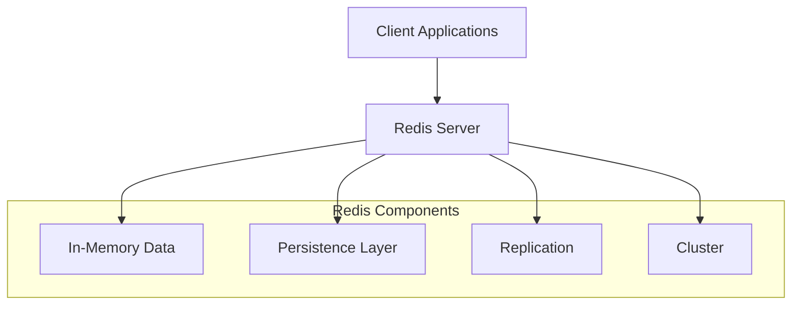
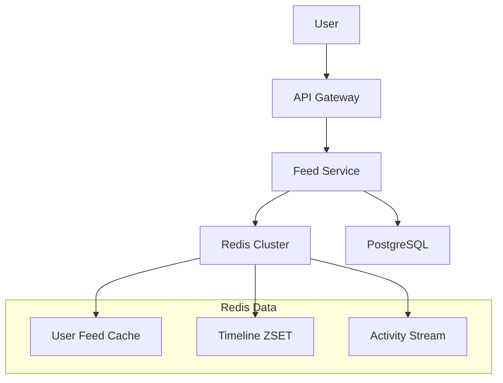

```markdown
---
title: Redis Zero to Hero: Comprehensive Guide for System Design in 2025
date: 2024-12-04T10:00:00Z
draft: false
tags: ["redis", "system-design", "database", "caching", "performance", "architecture"]
---

# Redis Zero to Hero: Comprehensive Guide for System Design in 2025

Redis has evolved from a simple in-memory key-value store to a powerful, versatile data structure server that's indispensable in modern system design. Whether you're building a high-performance web application, a distributed system, or a real-time analytics platform, understanding Redis's capabilities and how to leverage them effectively can be a game-changer.

This comprehensive guide will take you from Redis basics to advanced concepts, covering everything you need to know to design robust, scalable systems using Redis.

## Table of Contents

1. [Understanding Redis: More Than Just a Cache](#understanding-redis)
2. [Redis Data Structures: The Building Blocks](#redis-data-structures)
3. [Advanced Redis Features for System Design](#advanced-redis-features)
4. [Redis in System Design Patterns](#system-design-patterns)
5. [Performance Optimization Techniques](#performance-optimization)
6. [High Availability and Scaling Strategies](#high-availability)
7. [Security Best Practices](#security)
8. [Real-World Use Cases and Architectures](#real-world-cases)
9. [Common Pitfalls and Best Practices](#best-practices)
10. [Conclusion](#conclusion)

## Understanding Redis: More Than Just a Cache {#understanding-redis}

Redis (Remote Dictionary Server) is an open-source, in-memory data structure store that can be used as a database, cache, message broker, and queue. Unlike traditional databases that primarily store data on disk, Redis keeps all data in RAM, making it incredibly fast with sub-millisecond latency.

### Why Redis in System Design?

- **Speed**: With operations typically completing in less than a millisecond, Redis is perfect for performance-critical applications
- **Versatility**: Supports multiple data structures beyond simple key-value pairs
- **Scalability**: Built-in clustering and replication features
- **Persistence**: Optional disk persistence for durability
- **Rich Ecosystem**: Extensive client libraries and strong community support

### Redis Architecture Overview



## Redis Data Structures: The Building Blocks {#redis-data-structures}

Redis provides several powerful data structures that form the foundation of complex operations and system design patterns.

### 1. Strings

The most basic Redis data type, but with powerful capabilities:

```redis
# Basic operations
SET user:1000:name "John Doe"
GET user:1000:name

# Atomic operations
INCR page_views
INCRBY user:1000:score 10

# Expiration
SET session:abc123 "user_data" EX 3600
```

### 2. Lists

Ordered collections of strings, perfect for queues and stacks:

```redis
# Implementing a queue
LPUSH task_queue "process_order"
RPUSH task_queue "send_email"
LPOP task_queue  # Get next task

# Implementing a timeline
LPUSH user:1000:timeline "Post 3"
LPUSH user:1000:timeline "Post 2"
LPUSH user:1000:timeline "Post 1"
LRANGE user:1000:timeline 0 -1
```

### 3. Hashes

Maps between string fields and string values, ideal for objects:

```redis
# Storing user profile
HMSET user:1000 name "John Doe" email "john@example.com" age 30
HGET user:1000 name
HGETALL user:1000

# Atomic field operations
HINCRBY user:1000:stats login_count 1
```

### 4. Sets

Unordered collections of unique strings, perfect for membership testing:

```redis
# User followers
SADD user:1000:followers 1001 1002 1003
SISMEMBER user:1000:followers 1001
SMEMBERS user:1000:followers

# Set operations - finding mutual followers
SINTER user:1000:followers user:2000:followers
```

### 5. Sorted Sets

Sets with a score associated with each member, essential for leaderboards:

```redis
# Leaderboard implementation
ZADD leaderboard 1500 "player1" 1200 "player2" 1800 "player3"
ZREVRANGE leaderboard 0 10 WITHSCORES
ZRANK leaderboard "player2"

# Rate limiting with sliding window
ZADD rate_limit:user:1000 1640995200 "req1" 1640995260 "req2"
ZREMRANGEBYSCORE rate_limit:user:1000 0 1640995200
```

### 6. Streams

Redis's answer to log-based data structures, perfect for event sourcing:

```redis
# Event stream
XADD orders * user_id 1001 product_id 2001 amount 99.99
XADD orders * user_id 1002 product_id 2002 amount 149.99

# Consumer groups
XGROUP CREATE orders consumer_group 0 MKSTREAM
XREADGROUP GROUP consumer_group consumer1 COUNT 1 STREAMS orders >
```

## Advanced Redis Features for System Design {#advanced-redis-features}

### 1. Pub/Sub Messaging

Redis's publish-subscribe system enables real-time messaging:

```redis
# Publisher
PUBLISH notifications "New order received: #12345"

# Subscriber
SUBSCRIBE notifications
# Will receive: message notifications "New order received: #12345"
```

### 2. Transactions and Lua Scripting

Ensure atomicity with MULTI/EXEC or Lua scripts:

```redis
# Transaction
MULTI
DECR account:1001:balance
INCR account:1002:balance
EXEC

# Lua Script for complex operations
EVAL "
local current = redis.call('GET', KEYS[1])
if current and tonumber(current) >= tonumber(ARGV[1]) then
    redis.call('DECRBY', KEYS[1], ARGV[1])
    return 1
else
    return 0
end
" 1 account:1001:balance 50
```

### 3. Geospatial Indexing

Redis supports geospatial queries out of the box:

```redis
# Add locations
GEOADD stores 13.361389 38.115556 "Store1" 15.087269 37.502669 "Store2"

# Find nearby stores
GEOSEARCH stores FROMLONLAT 13.361389 38.115556 BYRADIUS 10 km
```

### 4. HyperLogLog

Probabilistic data structure for cardinality estimation:

```redis
PFADD daily_visitors:2024-12-04 user1 user2 user3
PFCOUNT daily_visitors:2024-12-04
PFMERGE monthly_visitors daily_visitors:2024-12-01 daily_visitors:2024-12-02
```

### 5. Bloom Filters

Memory-efficient probabilistic data structure for membership testing:

```redis
BF.SET unique_emails user@example.com
BF.EXISTS unique_emails user@example.com
```

## Redis in System Design Patterns {#system-design-patterns}

### 1. Caching Strategies

#### Cache-Aside Pattern
```python
def get_user(user_id):
    user = redis.get(f"user:{user_id}")
    if not user:
        user = db.get_user(user_id)
        if user:
            redis.setex(f"user:{user_id}", 3600, json.dumps(user))
    return user
```

#### Write-Through Cache
```python
def update_user(user_id, data):
    db.update_user(user_id, data)
    redis.setex(f"user:{user_id}", 3600, json.dumps(data))
```

#### Write-Behind Cache
```python
def update_user_async(user_id, data):
    redis.set(f"user:{user_id}:pending", json.dumps(data))
    # Background worker processes pending writes
    queue.enqueue("process_user_update", user_id, data)
```

### 2. Rate Limiting Implementation

```python
def is_rate_limited(user_id, limit, window):
    key = f"rate_limit:{user_id}"
    current = redis.zcard(key)
    now = int(time.time())
    
    # Remove old entries outside the window
    redis.zremrangebyscore(key, 0, now - window)
    
    if current >= limit:
        return True
    
    redis.zadd(key, {str(uuid.uuid4()): now})
    redis.expire(key, window)
    return False
```

### 3. Distributed Lock with Redlock

```python
def acquire_lock(resource, ttl=10):
    lock_key = f"lock:{resource}"
    identifier = str(uuid.uuid4())
    
    # Try to acquire lock with expiration
    if redis.set(lock_key, identifier, nx=True, ex=ttl):
        return identifier
    return None

def release_lock(resource, identifier):
    lock_key = f"lock:{resource}"
    
    # Atomic script to prevent releasing others' locks
    script = """
    if redis.call("GET", KEYS[1]) == ARGV[1] then
        return redis.call("DEL", KEYS[1])
    else
        return 0
    end
    """
    return redis.eval(script, 1, lock_key, identifier)
```

### 4. Session Store Design

```redis
# Session creation
HSET session:abc123 user_id 1001 last_activity 1640995200
EXPIRE session:abc123 1800

# Session refresh
HSET session:abc123 last_activity 1640995400
EXPIRE session:abc123 1800
```

## Performance Optimization Techniques {#performance-optimization}

### 1. Memory Optimization

```redis
# Use hashes for small objects instead of strings
# Instead of: SET user:1000:name "John" SET user:1000:age "30"
# Use: HMSET user:1000 name "John" age "30"

# Enable hash-max-ziplist-entries for automatic optimization
CONFIG SET hash-max-ziplist-entries 512
CONFIG SET hash-max-ziplist-value 64
```

### 2. Pipeline Commands

```python
# Instead of multiple round trips:
pipe = redis.pipeline()
for user_id in user_ids:
    pipe.get(f"user:{user_id}")
results = pipe.execute()
```

### 3. Connection Pooling

```python
import redis

pool = redis.ConnectionPool(
    host='localhost',
    port=6379,
    max_connections=20,
    socket_timeout=2
)
r = redis.Redis(connection_pool=pool)
```

### 4. Monitoring and Metrics

```redis
# Get memory usage
INFO memory

# Monitor slow queries
CONFIG SET slowlog-log-slower-than 10000
SLOWLOG GET 10

# Track command statistics
INFO commandstats
```

## High Availability and Scaling Strategies {#high-availability}

### 1. Redis Replication

```redis
# Master configuration
CONFIG SET appendonly yes
CONFIG SET appendfsync everysec

# Slave configuration
REPLICAOF master_ip master_port
CONFIG SET replica-read-only yes
```

### 2. Redis Cluster Setup

```bash
# Create cluster with multiple nodes
redis-cli --cluster create \
  127.0.0.1:7000 127.0.0.1:7001 \
  127.0.0.1:7002 127.0.0.1:7003 \
  127.0.0.1:7004 127.0.0.1:7005 \
  --cluster-replicas 1
```

### 3. Sentinel for Automatic Failover

```conf
# sentinel.conf
port 26379
sentinel monitor mymaster 127.0.0.1 6379 2
sentinel down-after-milliseconds mymaster 5000
sentinel failover-timeout mymaster 10000
sentinel parallel-syncs mymaster 1
```

### 4. Client-Side Sharding Strategy

```python
class ShardClient:
    def __init__(self, nodes):
        self.nodes = nodes
        
    def get_node(self, key):
        hash_val = crc32(key.encode())
        node_index = hash_val % len(self.nodes)
        return self.nodes[node_index]
        
    def set(self, key, value):
        node = self.get_node(key)
        return node.set(key, value)
```

## Security Best Practices {#security}

### 1. Authentication and Authorization

```conf
# redis.conf
requirepass your_strong_password
# Or use ACLs (Redis 6+)
aclfile /etc/redis/users.acl
```

### 2. Network Security

```conf
# Bind to specific interfaces
bind 127.0.0.1 10.0.0.1

# Disable dangerous commands
rename-command FLUSHDB ""
rename-command CONFIG "CONFIG_b835c3f8a5d2e724"

# Enable TLS
tls-port 6380
port 0
tls-cert-file /path/to/redis.crt
tls-key-file /path/to/redis.key
```

### 3. Data Encryption

```python
# Client-side encryption
from cryptography.fernet import Fernet

key = Fernet.generate_key()
cipher_suite = Fernet(key)

def encrypt_and_store(key, value):
    encrypted = cipher_suite.encrypt(value.encode())
    redis.set(key, encrypted)

def retrieve_and_decrypt(key):
    encrypted = redis.get(key)
    return cipher_suite.decrypt(encrypted).decode()
```

## Real-World Use Cases and Architectures {#real-world-cases}

### 1. Social Media Feed System



Implementation:
```redis
# Generate feed using sorted sets
ZADD user:1001:feed 1640995200 post:123 1640995300 post:124
ZREVRANGE user:1001:feed 0 20

# Fan-out on write
def create_post(user_id, post_id):
    followers = redis.smembers(f"user:{user_id}:followers")
    pipe = redis.pipeline()
    for follower in followers:
        pipe.zadd(f"user:{follower}:feed", {post_id: time.time()})
    pipe.execute()
```

### 2. Real-Time Analytics Dashboard

```redis
# Track metrics with time series
INCR metrics:page_views:2024:12:04:10
HINCRBY metrics:user_actions:2024:12:04 login 1

# Aggregate with Lua
local hourly = {}
for i = 0, 23 do
    local key = "metrics:page_views:2024:12:04:" .. i
    hourly[i] = redis.call('GET', key) or 0
end
return hourly
```

### 3. E-commerce Shopping Cart

```redis
# Cart operations
HSET cart:user:1001 item:123 quantity 2
HINCRBY cart:user:1001 item:456 1

# Expire inactive carts
EXPIRE cart:user:1001 86400

# Checkout transaction
MULTI
GET cart:user:1001
DEL cart:user:1001
EXEC
```

### 4. API Rate Limiting Service

```python
class RateLimiter:
    def __init__(self, redis_client):
        self.redis = redis_client
        
    def is_allowed(self, key, limit, window):
        now = int(time.time())
        window_start = now - window
        
        # Use sliding window with sorted set
        self.redis.zremrangebyscore(key, 0, window_start)
        current = self.redis.zcard(key)
        
        if current >= limit:
            return False
            
        self.redis.zadd(key, {str(uuid.uuid4()): now})
        self.redis.expire(key, window)
        return True
```

## Common Pitfalls and Best Practices {#best-practices}

### Common Mistakes to Avoid

1. **Using Redis as Primary Database**
   - Redis is not a replacement for persistent databases
   - Use it for caching, session storage, and real-time features

2. **Ignoring Memory Limits**
   - Monitor memory usage regularly
   - Implement proper eviction policies
   - Use Redis Cluster for scaling

3. **Blocking Operations**
   - Avoid KEYS command in production
   - Use SCAN instead for large datasets
   - Be careful with Lua scripts that block

4. **Inefficient Data Structures**
   - Choose the right data structure for your use case
   - Use hashes for objects instead of multiple string keys
   - Leverage Redis's built-in optimizations

### Best Practices Checklist

```markdown
[ ] Implement proper error handling and retry logic
[ ] Use connection pooling for better performance
[ ] Set appropriate TTL for cache keys
[ ] Monitor slow queries and memory usage
[ ] Implement backup and recovery procedures
[