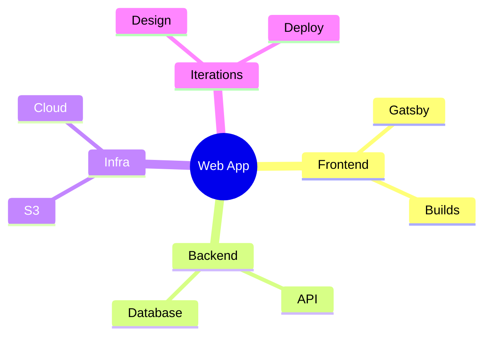

## Introduction

In the fast-paced world of software development, architects and teams often grapple with complexity—balancing user needs, technical components, infrastructure, and timelines. **Mind mapping** emerges as a powerful, visual technique that simplifies this chaos, proving useful in **99% of real-world cases** from small features to enterprise-scale projects.[1][2] By starting with a central idea and branching into related concepts, mind maps foster brainstorming, clarify relationships, and streamline planning without rigid templates.[3][4]

This blog post explores the architecture of mind map software, its core principles, real-world applications in software projects, and tools that make it indispensable. Whether you're a solo developer or leading a team, discover why this approach outperforms traditional diagrams in flexibility and adoption.

## What is Mind Map Software Architecture?

Mind map software architecture revolves around a **hierarchical, radial structure** centered on a core node (e.g., project goal or system objective), with branches representing components, use cases, and iterations.[1][3] Unlike linear documents or flowcharts, it mimics the brain's associative thinking, using nodes, links, and visual cues to reveal connections.[4]

Key architectural elements include:
- **Central Node**: The project's core goal, such as "Implement Plugin System" or "Build Scalable Web App".[1][2]
- **Main Branches**: High-level categories like Architecture, User Experience, Use Cases, and Iterations.[1]
- **Sub-Branches**: Detailed breakdowns, e.g., inputs/outputs for use cases or deployment timelines.[1][5]
- **Visual Enhancements**: Colors, icons, shapes, and auto-layouts for readability.[3][7]

This structure scales effortlessly: simple outlines for prototypes or intricate maps for cloud-native apps with AWS S3, Gatsby, and ML integration.[2][6]

## Core Principles of Effective Mind Maps in Software Architecture

Drawing from established practices, mind maps follow proven steps to capture complexity:

1. **Start with the Central Theme**: Place the main objective in the center, e.g., "Software Architecture Roadmap".[5]
2. **Identify Key Themes**: Branch out to architectural characteristics (scalability, security), logical components (frontend, backend), styles (microservices, monolith), and decisions.[5][6]
3. **Add Subtopics and Relationships**: Use quick linkers or connectors for use cases, inputs/outputs, and dependencies.[1][3]
4. **Prioritize and Iterate**: Rank features by user needs, then map iterations like design > code > test > deploy.[1][4]
5. **Leverage Analog and Digital Tools**: From paper sketches to software for outlining and auto-generation.[2]

These principles ensure mind maps are not just diagrams but **living documents** that evolve with the project.[2]

## Real-World Applications: Why It's Useful in 99% of Cases

Mind mapping shines in diverse scenarios because it handles ambiguity, encourages collaboration, and visualizes the unseen.[2][8]

### Project Planning and Brainstorming
Use mind maps to decompose projects: central node for goals, branches for components (e.g., Gatsby frontend, S3 storage, cloud builds), and sub-branches for environments (preview vs. production).[1][2] Teams report streamlined planning, catching overlooked details like iterations.[1]

### Architecture Roadmapping
Map **architectural characteristics** (performance, reliability), **logical components** (services, databases), **styles** (event-driven, serverless), and **decisions** (e.g., Google Spanner for distribution).[5][6] This roadmap guides from conception to deployment.

### Use Case and UX Mapping
Branch use cases from components, detailing inputs, outputs, and conditions. Link to UX flows for user interactions.[1][4] In design, prioritize features from research insights to prototypes.[4]

### Infrastructure and Scaling
Visualize cloud setups (AWS/Azure/GCP), data pipelines (MapReduce, Flink), and tracing (Dapper).[2][6] Ideal for modern apps blending development, cloud, and data science.

In 99% of cases—from plugins to global systems—mind maps reduce cognitive load, boost memory recall, and aid decision-making via visual associations.[3][4]

## Recommended Tools and Examples

Choose tools based on needs: analog for ideation, digital for sharing.

| Tool | Key Features | Best For | Example Use |
|------|--------------|----------|-------------|
| **Enterprise Architect** | Quick linkers, auto-layout, strategy views | Enterprise modeling[3] | Brainstorm "Benefits of Mind Mapping" with subtopics like Problem Solving > Association. |
| **XMind** | Professional mapping, embeds, exports | Complex info management[9] | Software Architect maps with ML/NN branches. |
| **Mermaid** | Text-based, indentation syntax, shapes | Code-integrated diagrams[7] | ```mermaid<br>mindmap<br>  root((Software Arch))<br>    Architecture<br>      Characteristics<br>      Components<br>    Use Cases<br>      Inputs<br>      Outputs``` |
| **Emberly/Miro** | Collaborative, iterations mapping | Team planning[1] | Plugin system: Architecture > UX > Iterations. |

**Example Mermaid Mind Map for a Web App**:



This renders a hierarchical view instantly in Markdown docs.[7]

## Benefits and Best Practices

**Benefits**:
- **Visual Clarity**: Reveals hidden relationships, outperforming lists.[4]
- **Team Collaboration**: Shareable, editable for entire teams.[2]
- **Flexibility**: Scales from features to monoliths; reverse-engineer from outlines.[2]
- **Efficiency**: Prioritizes via branching, aids prototyping.[4]

**Best Practices**:
- Use colors for categories (e.g., red for risks).
- Limit depth to 3-4 levels to avoid clutter.[3]
- Integrate with tools like GitHub for versioned maps.[6]
- Review iteratively: Align, space, auto-size elements.[3]

## Conclusion

**Mind map software architecture** is a timeless, versatile framework that tackles real-world complexity in nearly every scenario—planning plugins, roadmapping cloud apps, or brainstorming UX.[1][2][5] Its radial, brain-like structure democratizes architecture, making it accessible yet powerful for solos and teams alike.

Adopt it today: sketch on paper, then digitize with XMind or Mermaid. You'll plan faster, communicate better, and deliver projects that scale. In a field of rigid UML and endless docs, mind maps reclaim creativity and efficiency.

## Further Resources
- Explore NASAN's downloadable mind maps for architecture characteristics.[5]
- Watch "Mind Mapping for Architecting Software" on YouTube for live demos.[2]
- GitHub repo for comprehensive software architect mindmaps.[6]