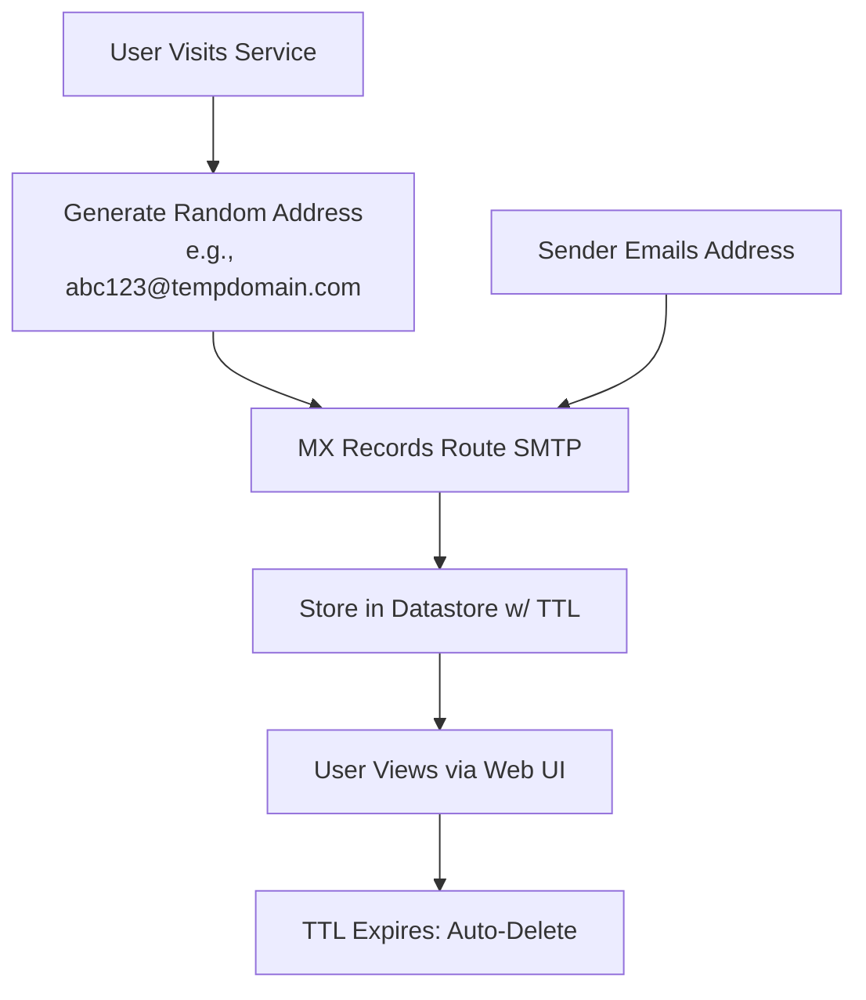

Temporary emails, also known as disposable or throwaway emails, provide a quick way to generate short-lived email addresses for one-off tasks without exposing your primary inbox. These services have surged in popularity for protecting privacy, dodging spam, and testing applications, but they come with notable risks and limitations.[1][2][5]

In this comprehensive guide, we'll explore **how temporary emails function under the hood**, their benefits and drawbacks, real-world use cases, security concerns, and safer alternatives. Whether you're a developer testing email flows or just tired of newsletter signups, understanding these tools empowers better decisions.

## What Are Temporary Emails?

A **temporary email** (or disposable email address, DEA) is a short-lived inbox designed for temporary use, often lasting minutes to days before auto-deletion. Unlike permanent emails, it requires no signup, password, or long-term commitment—you get an address instantly, check incoming messages via a web interface, and discard it when done.[1][2][4][5]

These addresses typically use a **random local-part** (e.g., `x7y3bza9@tempmail.example`) on a shared domain controlled by the service. Some allow custom aliases, but popular ones risk collisions where multiple users share the same address briefly.[1]

> **Key Trait**: Emails are received but not sent from most services, focusing purely on inbound delivery for verifications or downloads.[2]

## How Temporary Emails Work: Technical Breakdown

Temporary email services operate on simple yet clever infrastructure leveraging standard email protocols. Here's the step-by-step process:

1. **Address Generation**: Visit a service like 10 Minute Mail or Temp Mail. It instantly generates a unique (or semi-unique) email address, often random to avoid predictability. The domain (e.g., `10minutemail.com`) is MX-configured to route mail to the provider's servers.[1][2]

2. **MX Records and SMTP Delivery**: The service publishes **MX records** (Mail Exchange) in DNS, directing inbound SMTP traffic to their mail servers. When a sender emails your temp address, SMTP delivers it there.[1]

3. **Storage and Viewing**: 
   - Emails are piped to a **lightweight datastore** (e.g., database or in-memory cache) with a **TTL (Time-To-Live)**—say, 10 minutes or 24 hours.
   - You view via a public or private web page. Public ones display all mail for that address openly; private use random URLs for access.[1][3]
   - No authentication: Anyone guessing the address can read it, and some services recycle addresses.[3]

4. **Expiration and Cleanup**: TTL expires, deleting emails and disabling the address. No recovery—perfect for disposability, disastrous for account resets.[1][2]



**Pro Tip for Devs**: Services like Mailinator use shared inboxes for testing—great for QA but risky for privacy.[4]

## Common Temporary Email Services

Here's a quick comparison of popular providers:

| Service       | Duration       | Key Features                  | Drawbacks                     |
|---------------|----------------|-------------------------------|-------------------------------|
| **10 Minute Mail** | 10 minutes (extendable) | Auto-delete, no signup       | Short life, public inboxes[2][3] |
| **Temp Mail** | Hours to days | Persistent until deleted     | Domains often blocked[1]      |
| **Guerrilla Mail** | Customizable | Custom domains, longer life  | Less anonymous[2]             |
| **Mailinator** | Indefinite (public) | Shared inboxes for testing  | Fully public[4]               |

Many services cycle domains to evade blocks, but this makes them unreliable for serious use.[1]

## Pros and Cons of Temporary Emails

Temporary emails shine for low-stakes scenarios but falter elsewhere. 

### Pros
- **Spam Isolation**: Shields your real inbox from signups, trials, or downloads.[1][2][4]
- **Instant Privacy**: No personal data shared for one-time verifications.[2]
- **Dev/Testing Friendly**: Validate email flows without real accounts.[1][4]
- **Low Friction**: Zero setup—ideal for public WiFi or quick tasks.[3]

### Cons
- **No Recovery**: Lose access? Forgot password? Permanently locked out.[1][2]
- **Public Exposure**: Inboxes often readable by anyone; no passwords.[3]
- **Blocking Common**: Sites detect and reject known temp domains.[2]
- **Security Risks**: Unencrypted, vulnerable to interception or hacks.[3]

| Aspect              | Temporary Email | Permanent Email |
|---------------------|-----------------|-----------------|
| **Privacy**        | High (short-term) | Lower (long-term exposure) |
| **Reliability**    | Low (expires)   | High            |
| **Spam Protection**| Excellent      | Manual filters  |
| **Account Recovery**| None           | Full support    |

## Use Cases: When to Reach for Temp Mail

- **Signups and Trials**: Download ebooks, test newsletters without spam.[2][4]
- **Privacy on Public Networks**: WiFi hotspots or forums without real info.[3]
- **Development/QA**: Automate email testing in CI/CD pipelines.[1][4]
- **Anti-Spam Testing**: Marketers check campaign delivery.[4]

Avoid for banking, social accounts, or anything needing recovery.[1]

## Security Risks and Why They're Not Always Safe

Don't be fooled by the "anonymous" appeal—**temporary emails have vulnerabilities**:

- **Guessable Access**: No auth means public inboxes are snoopable; recycled addresses expose old mail.[3]
- **No Encryption**: Prone to man-in-the-middle on public WiFi—hackers snag verification codes in real-time.[3]
- **Domain Blocks and Abuse**: Trolls bypass bans; services get blacklisted.[4][5]
- **Data Breaches**: Servers store mail briefly, but hacks expose it.[3]

Stats show high-risk domains ballooned from 1M in 2019 to 3.3M in 2023, fueling blocks.[3]

**Mitigation**: Pair with VPNs for traffic encryption, but better—use aliases on secure providers.[3][5]

## Detecting and Blocking Disposable Emails (For Developers)

Sites block temp mails to curb abuse. Simple Python check:

```python
def is_disposable(email, disposable_domains):
    domain = email.split('@')[1].lower()
    return domain in disposable_domains

disposable_domains = {'10minutemail.com', 'tempmail.org'}  # Load from API/blocklist
print(is_disposable('test@10minutemail.com', disposable_domains))  # True[4]
```

Services like MailerCheck maintain blocklists; apps prompt users politely: *"We need a permanent email for security."*[2][4]

## Safer Alternatives to Temporary Emails

Ditch pure disposables for these:

- **Email Aliases**: Use `yourname+tag@gmail.com` or catch-alls (`*@yourdomain.com`). Forward to real inbox, easy to track spam sources.[5]
- **Proton Mail Aliases**: Private, encrypted, with hide-my-email features.[3]
- **Wildcard Forwarding**: `me.*@domain.com` auto-routes via server rules.[5]
- **Proton Pass or Apple Hide My Email**: Generate unique, forwardable aliases tied to your account.

These offer privacy without expiration risks.[3][5]

## Conclusion: Use Wisely, But Know When to Upgrade

Temporary emails excel at quick, disposable privacy—generating addresses via MX-routed, TTL-limited inboxes that auto-vanish. They're lifesavers for spam dodging and testing, but public access, no recovery, and security gaps make them unsuitable for anything permanent.[1][2][3]

For most users, **start with temps for trivia, switch to aliases for sustainability**. Developers: Block them thoughtfully to protect your app without alienating legit users. Prioritize encrypted alternatives like Proton for true security.

Embrace these tools smartly—they're powerful when used right.

## Resources
- [Temporary Email Use Cases & Risks](https://atomicmail.io/blog/temporary-email-use-cases-real-risks-safer-options)[1]
- [Disposable Emails in Apps (Dev.to)](https://dev.to/logto/disposable-emails-what-they-are-why-they-exist-and-how-to-handle-them-in-your-app-3cn8)[2]
- [Why 10-Minute Emails Aren't Safe (Proton)](https://proton.me/blog/10-minute-email)[3]
- [Disposable Email Addresses (MailerCheck)](https://www.mailercheck.com/articles/disposable-email-address)[4]
- [Wikipedia: Disposable Email Address](https://en.wikipedia.org/wiki/Disposable_email_address)[5]

---