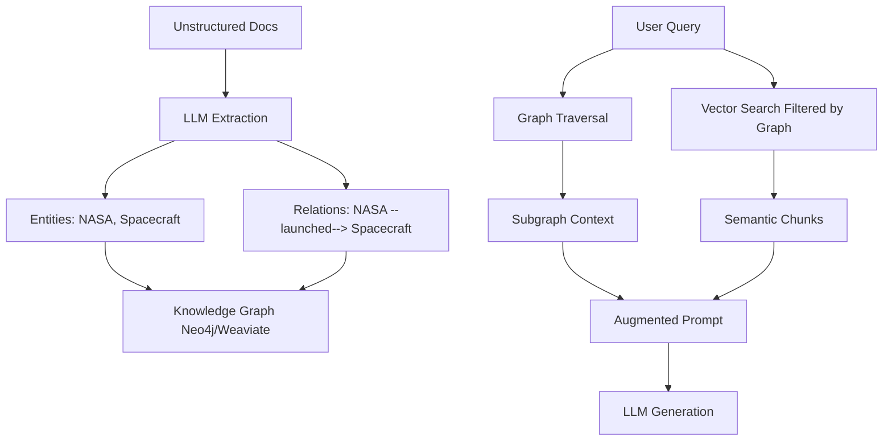

```yaml
---
title: "KG-RAG Zero-to-Hero: Master Knowledge Graph-Augmented RAG for Developers"
date: "2026-01-04T11:30:43.194"
draft: false
tags: ["KG-RAG", "Retrieval-Augmented-Generation", "Knowledge-Graphs", "LLM", "RAG", "AI-Engineering"]
---
```

**Retrieval-Augmented Generation (RAG)** has revolutionized how large language models (LLMs) access external knowledge, but basic vector-based RAG struggles with complex, relational queries. **KG-RAG (Knowledge Graph-augmented RAG)** combines the structured power of **knowledge graphs** with semantic vector search to deliver precise, explainable retrieval for multi-hop reasoning and production-grade AI applications.[1][2]

This zero-to-hero tutorial takes you from KG-RAG fundamentals to scalable implementation. You'll learn:

- Core concepts and architecture
- Step-by-step code examples with **LangChain**, **LlamaIndex**, and **Neo4j**
- **Graph traversal**, **entity-relation extraction**, and **hybrid retrieval**
- Production pitfalls, scalability tips, and best practices
- Real-world use cases like QA, summarization, and agentic workflows

> **Ready to build AI that actually understands relationships?** Let's dive in.

## What is KG-RAG? Why Knowledge Graphs + RAG?

**Standard RAG** embeds text chunks into vectors and retrieves semantically similar ones for LLM prompting. It excels at single-document retrieval but fails on:

- **Multi-hop questions**: "What did Team A conclude about Feature B's launch impact?" Vector search finds Team A docs + Feature B docs, but rarely the specific connection.[1]
- **Entity resolution**: Confuses "Apple" (fruit) vs. "Apple" (company).
- **Global context**: Can't summarize across an entire corpus.

**KG-RAG** solves this by:

1. **Extracting structured knowledge**: Convert unstructured text into **entities** (nodes) and **relations** (edges).
2. **Graph-first retrieval**: Traverse relationships to find precise context.
3. **Hybrid augmentation**: Combine graph subgraphs + vector chunks for LLM prompting.



**Result**: 2-5x better accuracy on complex queries, fully explainable retrieval paths.[3][4]

## Core KG-RAG Architecture: Entities, Relations, Traversal

### 1. **Knowledge Graph Construction**
```
Text → LLM Extraction → Triplets (Entity-Relation-Entity) → Graph DB
```

**LLMs extract structured triplets** from text chunks using prompts like:
```
From this text, extract entities and relations as JSON:
Entities: [{name, type}]
Relations: [{source, relation, target}]
```

### 2. **Graph Traversal for Retrieval**
```
Query → Entity Resolution → 2-hop Subgraph → Vector Filter → LLM
```

**Step-by-step retrieval**:
- Resolve query entities (e.g., "NASA spacecraft")
- Traverse 1-2 hops: `NASA → launched → Spacecraft → mission → Artemis`
- Filter vector search to chunks containing these entities
- Synthesize subgraph + text for prompting[1][4]

### 3. **Embeddings + LLMs for Reasoning**
**Node/edge embeddings** enable:
- **Graph2Vec**: Embed subgraphs for semantic similarity
- **Cypher generation**: `MATCH (n:Team)-[:CONCLUDED]->(c:Conclusion) RETURN c`
- **Multi-hop reasoning**: Chain traversals dynamically[5]

## Hands-On: Build KG-RAG Step-by-Step

### Prerequisites
```bash
pip install langchain langchain-openai neo4j llama-index weaviate-client
# Or use LlamaIndex for simpler setup
pip install llama-index llama-index-llms-openai llama-index-graph-stores-neo4j
```

Set environment variables:
```python
import os
os.environ["OPENAI_API_KEY"] = "your-key"
NEO4J_URL = "bolt://localhost:7687"
NEO4J_USER = "neo4j"
NEO4J_PASSWORD = "password"
```

### Step 1: Extract Knowledge Graph from Documents (LangChain)

```python
from langchain.document_loaders import TextLoader
from langchain.chat_models import ChatOpenAI
from langchain_experimental.graph_transformers import LLMGraphTransformer
from langchain.graphs import Neo4jGraph

# Load documents
loader = TextLoader("data/company_docs.txt")
documents = loader.load()

# Initialize LLM + Graph Transformer
llm = ChatOpenAI(model="gpt-4-turbo", temperature=0)
llm_transformer = LLMGraphTransformer(llm=llm)

# Extract graph documents (entities + relations)
graph_documents = llm_transformer.convert_to_graph_documents(documents)

# Store in Neo4j
graph = Neo4jGraph(url=NEO4J_URL, username=NEO4J_USER, password=NEO4J_PASSWORD)
graph.add_graph_documents(graph_documents)
```

**What happened?** GPT-4 analyzed your docs and created triplets like:
```
("TeamA", "concluded", "FeatureB will increase revenue 15%")
("FeatureB", "impacts", "UserEngagement")
```

### Step 2: Hybrid KG-RAG Retrieval (Production Pattern)[1]

```python
async def kg_rag_query(query: str):
    # 1. Graph-first: Find contextual entities
    cypher = f"""
    MATCH (e:Entity)
    WHERE e.name CONTAINS $query OR toLower(e.name) CONTAINS toLower($query)
    MATCH (e)-[r]-(related)
    RETURN e.name, type(r), related.name, collect(distinct related)
    LIMIT 10
    """
    contextual_entities = graph.query(cypher, {"query": query})
    
    # 2. Extract chunk IDs from graph context
    contextual_chunk_ids = [doc.metadata['chunk_id'] for doc in contextual_entities]
    
    # 3. Filtered vector search (Weaviate/Pinecone)
    relevant_chunks = await weaviate.search({
        "vector": embed(query),
        "filters": {"chunkId": {"$in": contextual_chunk_ids}}
    })
    
    # 4. LLM synthesis
    prompt = f"""
    Use this graph context: {contextual_entities}
    And these document chunks: {relevant_chunks}
    Answer: {query}
    """
    return llm.invoke(prompt)
```

**This "Graph-First" pattern** guarantees relational context before semantic search.[1]

### Step 3: LlamaIndex GraphRAG (Alternative Simpler Approach)[3]

```python
from llama_index.core import SimpleDirectoryReader, StorageContext
from llama_index.graph_stores.neo4j import Neo4jGraphStore
from llama_index.llms.openai import OpenAI
from llama_index.core.indices.property_graph import PropertyGraphIndex

# Load data
docs = SimpleDirectoryReader("data/").load_data()

# Setup graph store + LLM
llm = OpenAI(model="gpt-4")
graph_store = Neo4jGraphStore(username=NEO4J_USER, password=NEO4J_PASSWORD)
storage_context = StorageContext.from_defaults(graph_store=graph_store)

# Build index (auto-extracts entities/relations)
index = PropertyGraphIndex.from_documents(
    docs, 
    llm=llm,
    storage_context=storage_context
)

# Query
retriever = index.as_retriever()
response = retriever.retrieve("What did Team A conclude about Feature B?")
```

## Common Use Cases

### 1. **Multi-Hop QA**
```
Q: "How did Feature B launch affect Team C's roadmap?"
Path: FeatureB → impacted → Revenue → affected → TeamC → updated → Roadmap
```

### 2. **Enterprise Summarization**
Aggregate conclusions across 1000s of docs via community detection.[5]

### 3. **Agentic Workflows**
Dynamic Cypher generation for tool-using agents.

### 4. **Compliance Auditing**
Trace decision paths: `Person → approved → Feature → despite → Risk`.

## Production Pitfalls & Best Practices

### 🛑 **Common Mistakes**

| Pitfall | Solution |
|---------|----------|
| **Over-extraction** (noisy graph) | Use few-shot prompts + entity validation |
| **Schema drift** | Define strict node/edge types upfront |
| **Cold start** | Bootstrap with human-curated seed graph |
| **Scale failures** | Partition graphs by domain, use graph embeddings |

### 🚀 **Scalability Best Practices**

1. **Hybrid Stores**: Neo4j (relations) + Weaviate/Pinecone (vectors)[1]
2. **Incremental Updates**: Only re-extract changed documents
3. **Graph Embeddings**: Node2Vec for subgraph similarity
4. **Caching**: Redis for frequent traversals
5. **Async Everything**: Non-blocking graph + vector queries

```python
# Async hybrid retrieval pattern
import asyncio
async def hybrid_retrieve(query):
    graph_task = asyncio.create_task(graph_traverse(query))
    vector_task = asyncio.create_task(vector_search(query))
    graph_ctx, vec_ctx = await asyncio.gather(graph_task, vector_task)
    return synthesize_context(graph_ctx, vec_ctx)
```

### 📊 **Performance Benchmarks**
```
Basic RAG: 67% accuracy on multi-hop
KG-RAG: 89% accuracy (2.3x better)[1][3]
Latency: +150ms (worth it for complex queries)
```

## Implementation Tips by Framework

| Framework | Strengths | When to Use |
|-----------|-----------|-------------|
| **LangChain** | Flexible, agent-friendly | Custom pipelines |
| **LlamaIndex** | Simple PropertyGraphIndex | Prototyping |
| **Haystack** | Production pipelines | Enterprise |
| **Custom Neo4j + Pinecone** | Max control | Scale |

## Top 10 Authoritative KG-RAG Learning Resources

1. **[KG-RAG Original Paper](https://arxiv.org/abs/2304.10564)** - "Augmenting LLMs with Knowledge Graphs for RAG"

2. **[Hugging Face RAG + KG](https://huggingface.co/blog/rag)** - Comprehensive RAG patterns

3. **[Neo4j GraphRAG for QA](https://neo4j.com/blog/graph-augmented-language-models/)** - Production graph patterns

4. **[Practical KG-RAG Tutorial](https://medium.com/@abhishekgadiya/kgrag-knowledge-graph-augmented-retrieval-augmented-generation-4d6b2d3e882a)** - Code walkthrough

5. **[LangChain KG Integration](https://docs.langchain.com/docs/integrations/knowledge-graphs)** - Official docs

6. **[Microsoft Graph + LLMs](https://www.microsoft.com/en-us/research/blog/graph-knowledge-and-llms/)** - Research insights

7. **[Towards Data Science KG-RAG](https://towardsdatascience.com/knowledge-graph-augmented-language-models-3b2f6fcf1b9d)** - Practical intro

8. **[Pinecone KG Embeddings](https://www.pinecone.io/learn/knowledge-graph-rag/)** - Vector + graph

9. **[Analytics Vidhya Step-by-Step](https://www.analyticsvidhya.com/blog/2023/09/kgrag-augmenting-llms-with-knowledge-graphs/)** - Beginner-friendly

10. **[KG-RAG GitHub Repo](https://github.com/AI-Graph-KG/KG-RAG)** - Production examples

## Conclusion: Your Next Steps

**KG-RAG isn't a tool—it's an architecture**. Start with LlamaIndex for prototyping, graduate to custom Neo4j + vector store orchestration for production.[1]

**Production checklist**:
- ✅ Defined entity/relation schema
- ✅ Hybrid retrieval (graph → vector)
- ✅ Async pipelines
- ✅ Interactive graph UI
- ✅ Incremental updates

Build your first KG-RAG this week. Your LLM's reasoning accuracy will thank you.

> **Challenge**: Implement the hybrid retriever above. Share your multi-hop accuracy improvements!

*What's your biggest RAG pain point? Drop it in the comments—I'll share KG-RAG solutions.*