As an expert LLM infrastructure engineer, I've deployed countless inference systems where **time-to-first-token (TTFT)** and GPU efficiency make or break production performance. Enter **LMCache**—a game-changing KV cache layer that delivers **3-10x delay reductions** by enabling "prefill-once, reuse-everywhere" semantics across serving engines like vLLM.[1][2]

This zero-to-hero tutorial takes you from conceptual understanding to production deployment, covering architecture, integration, pitfalls, and real-world wins. Whether you're building multi-turn chatbots or RAG pipelines, LMCache will transform your LLM serving stack.

## What is LMCache and Why Does It Matter?

**LMCache** is a high-performance **KV cache layer** designed for LLM inference systems. Traditional LLM serving recomputes key-value (KV) caches for every prompt prefix, wasting GPU cycles on repeated text—even when the same content appears non-contiguously or across sessions.[1][3]

> LMCache stores KV caches of **all reusable texts**, enabling reuse of **any reused text (not necessarily prefix)** across **any serving engine instance**. This slashes **prefill delay (TTFT)** and frees GPU memory for higher throughput.[1][2]

### Core Benefits
- **3-10x TTFT Reduction**: Eliminate redundant prefill computations in multi-turn QA, RAG, and chat apps.[1]
- **GPU Cycle Savings**: Offload KV caches to CPU/storage tiers, enabling larger batch sizes.[2]
- **Cross-Instance Sharing**: KV caches persist across vLLM instances, containers, or even machines.[3]
- **Model Agnostic**: Works with open-weight models like Llama, Mistral, Qwen via engines like vLLM.[3]

In production, this means **cheaper inference** (fewer GPU hours) and **faster user experiences**—critical for real-time applications.

## How LMCache Works: Core Architecture

LMCache operates as a **disaggregated KV cache management system** between your LLM engine (vLLM) and storage backends (Redis, Mooncake, etc.). Here's the flow:

1. **Chunking**: Incoming prompts are split into **fixed-size token chunks** (e.g., 128-1024 tokens).[2][4]
2. **Hashing**: Each chunk gets a **content-based hash** for uniqueness detection.[3]
3. **Prefill & Store**: First encounter? Compute KV cache via LLM forward pass, then **serialize and store** with metadata.[1]
4. **Cache Hit**: Future prompts? **Query storage**, fetch KV bytes, **inject directly into model attention**—skipping recomputation.[3]
5. **Multi-Tier Storage**: Hot caches on GPU/CPU, cold on persistent storage with RDMA transfer for scale.[4]

```mermaid
graph TD
    A[Prompt Input] --> B[Chunk & Hash]
    B --> C{Cache Hit?}
    C -->|No| D[LLM Prefill → KV Compute]
    D --> E[Serialize + Store Metadata/KV]
    C -->|Yes| F[Fetch KV from Storage]
    F --> G[Inject into vLLM Attention]
    E --> H[Generate Tokens]
    G --> H
```



**Key Innovation**: Unlike prefix-only caching, LMCache handles **arbitrary text reuse** (e.g., "return policy" phrase anywhere in prompt).[3]

## Core Components

| Component | Purpose | Configuration |
|-----------|---------|---------------|
| **KV Connector** | Bridges vLLM → LMCache (e.g., `LMCacheConnectorV1`)[5] | `kv_transfer_config` in vLLM |
| **Chunk Manager** | Token splitting + hashing | `LMCACHE_CHUNK_SIZE=256`[2] |
| **Storage Backend** | KV persistence (Redis, Mooncake) | `LMCACHE_CONFIG_FILE=example.yaml`[1] |
| **Transfer Layer** | GPU/CPU/RDMA movement | `protocol: "rdma"`, `device_name: "mlx5_0"`[4] |
| **Metadata Server** | Cache indexing | `metadata_server: "http://IP:8080/metadata"`[4] |

## Installation and Integration: Hands-On Guide

### Step 1: Install LMCache
```bash
pip install lmcache  # Core library[1][6]
```

### Step 2: Quickstart vLLM Serving with LMCache
Launch an **OpenAI-compatible server** with zero code changes:

```bash
# Single GPU serving
lmcache_vllm serve lmsys/longchat-7b-16k --gpu-memory-utilization 0.8

# Multi-GPU with config (example.yaml)
LMCACHE_CONFIG_FILE=example.yaml CUDA_VISIBLE_DEVICES=0,1 lmcache_vllm serve your-model --port 8000
```

**Offline Inference**:
```python
import lmcache_vllm.vllm as vllm  # Prefix import[1]
from lmcache_vllm.vllm import LLM

llm = LLM(model="lmsys/longchat-7b-16k")
outputs = llm.generate(["Your prompt here"])
```

### Step 3: Redis Backend for Scale
For production, pair with **Redis** for low-latency cache queries:[3]

```yaml
# lmcache-config.yaml
storage:
  type: redis
  host: localhost
  port: 6379
chunk_size: 256
max_local_cpu_size: "10GB"  # Conservative RAM cap[2]
```

```bash
LMCACHE_CONFIG_FILE=lmcache-config.yaml lmcache_vllm serve your-model
```

### Step 4: Disaggregated Setup (Advanced)
For multi-machine: Configure **prefiller** (Machine A) + **decoder** (Machine B) with Mooncake/RDMA:[4]

```yaml
# mooncake-prefiller-config.yaml
chunk_size: 256
remote_url: "mooncakestore://{IP_A}:50052/"
protocol: "rdma"
```

## Common Pitfalls and Tuning Strategies

### Pitfall 1: Cache Invalidation
**Problem**: Stale KV caches from model updates or prompt drift.
**Fix**:
- Use **versioned hashes** or TTLs in metadata.
- Monitor hit rates: `<70% indicates poor chunking`.[2]

### Pitfall 2: Storage Backend Choice
| Backend | Use Case | Latency | Cost |
|---------|----------|---------|------|
| **Local CPU** | Single-node dev | Lowest | Free |
| **Redis** | Multi-instance prod | ~1ms | Medium[3] |
| **Mooncake** | Disaggregated scale | RDMA-fast | Higher[4] |

**Tune**: `LMCACHE_CHUNK_SIZE=128` for chat (fine-grained), `512` for RAG docs.[2]

### Pitfall 3: Memory Pressure
```bash
# Conservative settings
export LMCACHE_MAX_LOCAL_CPU_SIZE="8GB"  # Leave headroom[2]
export LMCACHE_USE_EXPERIMENTAL=True     # vLLM v1 features[5]
```

**Pro Tip**: Warm caches with common prompts before peak traffic.

## Real-World Use Cases

### 1. Multi-Turn Chat
Repeated user context (e.g., "Remember my return policy question?")—**6x TTFT win** as LMCache reuses conversation chunks across sessions.[1]

### 2. Retrieval-Augmented Generation (RAG)
**Non-prefix document chunks** retrieved mid-conversation—skip re-embedding entire corpus every query.[1][3]

```python
# RAG Example: Load cached doc KV directly
retrieved_chunks = ["doc_chunk_hash1", "doc_chunk_hash2"]
llm.generate(user_query + retrieved_chunks)  # KV injected automatically
```

### 3. Shared Serving Clusters
Docker demo: Share caches across 10+ vLLM pods via Redis—**40% GPU savings**.[1]

## Conclusion: Deploy LMCache Today

LMCache isn't just a cache—it's a **fundamental shift** in LLM infrastructure, turning compute waste into scalable intelligence. Start with the `lmcache_vllm serve` one-liner, tune for your workload, and watch TTFT plummet.

For production, prioritize **Redis for sharing**, **chunk tuning**, and **cache monitoring**. The 3-10x gains are real, repeatable, and ready for your stack.

## Top 10 Authoritative LMCache Learning Resources

1. **[Official LMCache Documentation](https://docs.lmcache.ai/)** - Integration guides and best practices.
2. **[LMCache GitHub Repo](https://github.com/LMCache/LMCache)** - Source code, examples, demos.
3. **[LMCache Official Website](https://lmcache.ai/)** - Features overview and getting started.
4. **[Technical Research Report](https://lmcache.ai/tech_report.pdf)** - Deep dive into efficient KV caching.
5. **[PyPI Project Page](https://pypi.org/project/lmcache/)** - Installation and version info.
6. **[Emergent Mind Overview](https://www.emergentmind.com/topics/lmcache)** - Motivation and caching concepts.
7. **[Redis + LMCache Blog](https://redis.io/blog/get-faster-llm-inference-and-cheaper-responses-with-lmcache-and-redis/)** - Scalable caching with Redis.
8. **[Medium Fundamentals Post](https://medium.com/@bharathyelchuri/lmcache-accelerating-llm-inference-with-smart-kv-caching-part-1-of-2-87ff775bf0e8)** - KV caching explained.
9. **[Aitoolnet Summary](https://www.aitoolnet.com/lmcache)** - Features and use cases overview.
10. **[DeepWiki Architecture](https://deepwiki.com/LMCache/LMCache)** - Components and internals.

Deploy boldly—your GPUs will thank you! 🚀