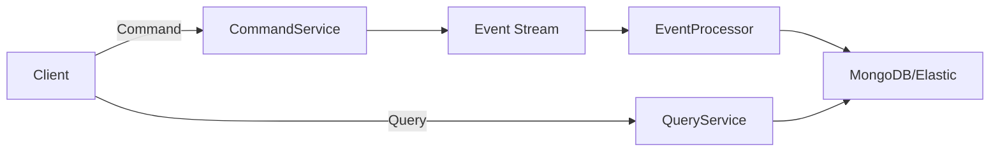

## Table of Contents
1. [Introduction](#introduction)  
2. [Fundamentals of Event‑Driven Architecture (EDA)](#fundamentals-of-event-driven-architecture-eda)  
3. [Why Apache Kafka? A Deep Dive into Core Concepts](#why-apache-kafka-a-deep-dive-into-core-concepts)  
4. [Designing Scalable Event‑Driven Systems](#designing-scalable-event-driven-systems)  
5. [Advanced Microservices Patterns for Event‑Driven Workflows](#advanced-microservices-patterns-for-event-driven-workflows)  
   - 5.1 [Event Sourcing](#event-sourcing)  
   - 5.2 [CQRS (Command Query Responsibility Segregation)](#cqrs-command-query-responsibility-segregation)  
   - 5.3 [Saga & Distributed Transactions](#saga--distributed-transactions)  
   - 5.4 [Outbox Pattern](#outbox-pattern)  
   - 5.5 [Idempotent Consumers](#idempotent-consumers)  
   - 5.6 [Consumer Groups & Partitioning Strategies](#consumer-groups--partitioning-strategies)  
   - 5.7 [Back‑Pressure & Flow Control](#back-pressure--flow-control)  
6. [Practical Implementation: A Sample Kafka‑Powered Microservice](#practical-implementation-a-sample-kafka-powered-microservice)  
   - 6.1 [Project Structure](#project-structure)  
   - 6.2 [Producer Example (Spring Boot)](#producer-example-spring-boot)  
   - 6.3 [Consumer Example with Idempotency & Retry](#consumer-example-with-idempotency--retry)  
   - 6.4 [Testing the Event Flow](#testing-the-event-flow)  
7. [Deployment, Operations, and Scaling](#deployment-operations-and-scaling)  
8. [Observability, Monitoring, and Alerting](#observability-monitoring-and-alerting)  
9. [Security, Governance, and Schema Management](#security-governance-and-schema-management)  
10. [Common Pitfalls & Best‑Practice Checklist](#common-pitfalls--best-practice-checklist)  
11. [Conclusion](#conclusion)  
12. [Resources](#resources)

---

## Introduction

In today’s hyper‑connected world, applications must react to data in real time, handle unpredictable traffic spikes, and evolve independently without causing cascading failures. **Event‑driven architectures (EDA)**, powered by robust messaging platforms, have become the de‑facto strategy for building such resilient, scalable systems.

**Apache Kafka** stands out as the most widely adopted event streaming platform. Its combination of high throughput, durability, and consumer‑group semantics makes it a natural backbone for modern microservices. However, simply “plugging Kafka in” does not guarantee scalability or maintainability. To truly harness its potential, architects must blend Kafka’s primitives with advanced microservice patterns—*event sourcing, CQRS, sagas, outbox, idempotency*, and more.

This article provides a **comprehensive, end‑to‑end guide** on designing, implementing, and operating a scalable event‑driven architecture using Apache Kafka and advanced microservice patterns. We’ll explore the theory, walk through concrete code examples (using Spring Boot/Java), discuss operational concerns, and present a checklist of best practices.

> **Note:** While the examples target Java/Spring, the concepts are language‑agnostic and can be adapted to Go, Node.js, .NET, or Python ecosystems.

---

## Fundamentals of Event‑Driven Architecture (EDA)

Before diving into Kafka specifics, let’s recap the core ideas behind EDA.

| Concept | Description | Typical Use‑Case |
|---------|-------------|------------------|
| **Event** | Immutable fact that something happened (e.g., *OrderCreated*). | Auditing, state reconstruction. |
| **Producer** | Emits events to a broker or event store. | Service that creates an order. |
| **Consumer** | Subscribes to events and reacts (e.g., updates a read model). | Inventory service reacting to *OrderCreated*. |
| **Event Bus** | The transport layer that decouples producers from consumers. | Kafka, RabbitMQ, NATS. |
| **Event Store** | Persisted log of events used for replay, audit, or state reconstruction. | Kafka topics, EventStoreDB. |
| **Eventual Consistency** | Guarantees that all replicas converge eventually, not instantly. | Distributed microservices with asynchronous updates. |

Key benefits of EDA:

- **Loose Coupling**: Services communicate via contracts (events) rather than direct RPC calls.
- **Scalability**: Adding consumers or partitions increases throughput without changing producers.
- **Resilience**: Failures are isolated; a consumer can retry or replay events without impacting others.
- **Auditability**: Every state change is recorded, enabling debugging and compliance.

---

## Why Apache Kafka? A Deep Dive into Core Concepts

Kafka is more than a message queue; it is a **distributed commit log**. Understanding its core abstractions is essential for building a reliable architecture.

### 1. Topics & Partitions
- **Topic**: Logical stream of events (e.g., `orders`).  
- **Partition**: Ordered, immutable sequence within a topic. Provides parallelism and fault tolerance.

> **Design tip:** Choose a partition key that balances load while preserving ordering for related events (e.g., `customerId`).

### 2. Producers
- **Idempotent Producer** (since Kafka 0.11) guarantees exactly‑once semantics per partition when `enable.idempotence=true`.
- **Transactional Producer** can atomically write to multiple topics, enabling *exactly‑once* end‑to‑end pipelines.

### 3. Consumers & Consumer Groups
- **Consumer Group**: Set of consumers sharing the same `group.id`. Kafka guarantees each partition is consumed by only one member of the group, enabling horizontal scaling.
- **Offset Management**: Consumers commit the position they have processed. Offsets can be stored in Kafka (`__consumer_offsets`) or external stores for custom replay semantics.

### 4. Replication and Fault Tolerance
- Each partition has a **leader** and **followers**. The replication factor determines durability; a quorum of ISR (in‑sync replicas) must acknowledge writes.

### 5. Log Compaction
- Enables **event sourcing** by retaining only the latest value for a given key, useful for materialized view reconstruction.

### 6. Schema Registry
- Manages **Avro/Protobuf/JSON Schema** versions, ensuring producers and consumers agree on data contracts.

---

## Designing Scalable Event‑Driven Systems

A well‑architected event‑driven system should address **scalability**, **reliability**, and **operability** at each layer.

### 1. Partitioning Strategy
- **Uniform Distribution**: Use a hash of a high‑cardinality key (e.g., `orderId`).  
- **Co‑Location**: For related events that need ordering, use the same key (e.g., `customerId`).  

### 2. Producer Configuration
```yaml
spring:
  kafka:
    producer:
      bootstrap-servers: ${KAFKA_BOOTSTRAP_SERVERS}
      key-serializer: org.apache.kafka.common.serialization.StringSerializer
      value-serializer: org.apache.kafka.common.serialization.StringSerializer
      properties:
        enable.idempotence: true
        transaction.id: ${spring.application.name}-${random.uuid}
```

- **Idempotence** prevents duplicate writes on retries.
- **Transactions** allow atomic writes across multiple topics (e.g., outbox + event topics).

### 3. Consumer Configuration
```yaml
spring:
  kafka:
    consumer:
      bootstrap-servers: ${KAFKA_BOOTSTRAP_SERVERS}
      group-id: order-service
      enable-auto-commit: false
      key-deserializer: org.apache.kafka.common.serialization.StringDeserializer
      value-deserializer: org.apache.kafka.common.serialization.StringDeserializer
      properties:
        max.poll.records: 500
        isolation.level: read_committed   # Needed for transactional reads
```

- **Manual offset commit** gives you control over when an event is considered processed.
- **Isolation level `read_committed`** hides uncommitted transactional messages.

### 4. Back‑Pressure & Flow Control
- Use `max.poll.records` and `fetch.max.bytes` to throttle consumer fetches.
- Implement **circuit‑breaker** patterns (e.g., Resilience4j) around downstream calls.

### 5. Data Modeling
- Prefer **immutable events** (e.g., `OrderCreated`, `OrderCancelled`).  
- Keep payloads **small**; large blobs should be stored in object storage (S3) and referenced via a URL.

---

## Advanced Microservices Patterns for Event‑Driven Workflows

While Kafka provides the plumbing, microservice patterns give structure to the business logic.

### 5.1 Event Sourcing

> *“Store the state change as a series of immutable events.”* — Martin Fowler

- **Write Model**: Accepts commands, validates, persists events to Kafka.
- **Read Model**: Projects events into materialized views (e.g., a relational DB or Elasticsearch).

**Benefits:** Full audit trail, easy replay for bug fixing, supports temporal queries.

**Challenges:** Event versioning, handling schema evolution, eventual consistency of read models.

### 5.2 CQRS (Command Query Responsibility Segregation)

- **Command Side**: Handles writes, often backed by event sourcing.  
- **Query Side**: Optimized for reads, may denormalize data into separate stores.



### 5.3 Saga & Distributed Transactions

Two primary saga implementations:

1. **Choreography** – Services emit events and react to each other without a central coordinator.
2. **Orchestration** – A saga orchestrator (e.g., Camunda, Temporal) sends commands and listens for completion events.

**Kafka‑based choreography example:**
- `OrderCreated` → `PaymentService` attempts charge → emits `PaymentSucceeded` or `PaymentFailed`.
- `PaymentSucceeded` → `InventoryService` reserves items → emits `InventoryReserved`.
- If any step fails, compensating events (`CancelOrder`) are emitted.

### 5.4 Outbox Pattern

Avoids the classic *dual‑write* problem (writing to DB and publishing to Kafka separately). Steps:

1. Within a local transaction, write domain changes **and** an outbox record to the same relational DB.
2. A separate **poller** reads the outbox table, publishes events to Kafka, and marks rows as sent.

**Benefits:** Guarantees atomicity between DB state and event publication without distributed transactions.

### 5.5 Idempotent Consumers

Consumers must be able to process the same event multiple times without side effects.

- **Idempotency Key**: Usually the event’s unique identifier (`eventId`).  
- Store processed keys in a fast lookup (Redis, DB) with a TTL.

```java
if (processedEventIds.contains(event.getId())) {
    // skip duplicate
    return;
}
process(event);
processedEventIds.add(event.getId());
```

### 5.6 Consumer Groups & Partitioning Strategies

- **Scaling**: Add more consumers to the same group; Kafka rebalances partitions automatically.
- **Sticky Assignor**: Retains partition assignment across rebalance for better cache locality.

### 5.7 Back‑Pressure & Flow Control

- **Reactive Streams** (Project Reactor, Akka Streams) can pull records on demand.
- **Pause/Resume**: `KafkaConsumer.pause()` can stop fetching from overloaded partitions.

---

## Practical Implementation: A Sample Kafka‑Powered Microservice

We’ll build a **simplified Order Service** that:

1. Accepts `CreateOrder` commands (REST endpoint).  
2. Persists the order in a PostgreSQL DB.  
3. Writes an `OrderCreated` event to Kafka using the **transactional outbox** pattern.  
4. A separate `PaymentConsumer` reacts, attempts payment, and emits `PaymentSucceeded` or `PaymentFailed`.  
5. A `SagaOrchestrator` (simple choreographer) compensates when needed.

### 6.1 Project Structure

```
order-service/
├─ src/main/java/com/example/orders/
│  ├─ controller/
│  │   └─ OrderController.java
│  ├─ domain/
│  │   ├─ Order.java
│  │   └─ OrderStatus.java
│  ├─ event/
│  │   ├─ OrderCreated.java
│  │   └─ PaymentSucceeded.java
│  ├─ repository/
│  │   └─ OrderRepository.java
│  ├─ outbox/
│  │   └─ OutboxEntry.java
│  ├─ service/
│  │   ├─ OrderService.java
│  │   └─ OutboxPublisher.java
│  └─ consumer/
│      └─ PaymentResultConsumer.java
└─ src/main/resources/application.yml
```

### 6.2 Producer Example (Spring Boot)

```java
// OrderService.java
@Service
@RequiredArgsConstructor
public class OrderService {

    private final OrderRepository orderRepo;
    private final OutboxPublisher outboxPublisher;
    private final PlatformTransactionManager txManager;

    @Transactional
    public Order createOrder(CreateOrderRequest req) {
        Order order = new Order(UUID.randomUUID(), req.getCustomerId(),
                                req.getItems(), OrderStatus.PENDING);
        orderRepo.save(order);

        // Write to outbox within same DB transaction
        outboxPublisher.enqueue(new OrderCreated(
                order.getId(),
                order.getCustomerId(),
                order.getItems(),
                Instant.now()
        ));

        return order;
    }
}
```

```java
// OutboxPublisher.java
@Component
@RequiredArgsConstructor
public class OutboxPublisher implements ApplicationListener<ContextRefreshedEvent> {

    private final KafkaTemplate<String, Object> kafkaTemplate;
    private final OutboxRepository outboxRepo;
    private final ExecutorService executor = Executors.newSingleThreadExecutor();

    @Override
    public void onApplicationEvent(ContextRefreshedEvent event) {
        // Start background polling after Spring context is up
        executor.submit(this::pollAndPublish);
    }

    private void pollAndPublish() {
        while (true) {
            List<OutboxEntry> pending = outboxRepo.findTop10ByPublishedFalseOrderByIdAsc();
            if (pending.isEmpty()) {
                sleep(500);
                continue;
            }
            pending.forEach(entry -> {
                try {
                    // Transactional send
                    kafkaTemplate.executeInTransaction(t -> {
                        t.send(entry.getTopic(), entry.getKey(), entry.getPayload());
                        return null;
                    });
                    entry.setPublished(true);
                    outboxRepo.save(entry);
                } catch (Exception ex) {
                    // Log and retry later
                }
            });
        }
    }

    private void sleep(long ms) {
        try { Thread.sleep(ms); } catch (InterruptedException ignored) {}
    }
}
```

**Key points:**

- The outbox entry stores `topic`, `key`, and the serialized payload (e.g., Avro).  
- The publisher runs in a separate thread, ensuring **exactly‑once** delivery without distributed transactions.

### 6.3 Consumer Example with Idempotency & Retry

```java
// PaymentResultConsumer.java
@Component
@RequiredArgsConstructor
public class PaymentResultConsumer {

    private final OrderRepository orderRepo;
    private final ProcessedEventRepository processedRepo; // stores eventId + status

    @KafkaListener(topics = "payment-results", groupId = "order-service")
    @Transactional
    public void handle(PaymentResultEvent event) {
        // Idempotency check
        if (processedRepo.existsByEventId(event.getEventId())) {
            return; // already processed
        }

        Order order = orderRepo.findById(event.getOrderId())
                .orElseThrow(() -> new IllegalStateException("Order not found"));

        if (event.isSuccess()) {
            order.setStatus(OrderStatus.COMPLETED);
        } else {
            order.setStatus(OrderStatus.CANCELLED);
            // Emit compensating event (e.g., ReleaseInventory)
            // This could be done via another outbox entry
        }

        orderRepo.save(order);
        processedRepo.save(new ProcessedEvent(event.getEventId()));
    }
}
```

- **Transactional Listener** ensures DB changes and processed‑event record are atomic.  
- If the consumer crashes before commit, the event will be re‑delivered, but the idempotency check prevents double processing.

### 6.4 Testing the Event Flow

```java
@SpringBootTest
@EmbeddedKafka(partitions = 1, topics = {"order-events", "payment-results"})
class OrderFlowIntegrationTest {

    @Autowired
    private OrderService orderService;
    @Autowired
    private KafkaTemplate<String, Object> kafkaTemplate;
    @Autowired
    private OrderRepository orderRepo;

    @Test
    void shouldCreateOrderAndProcessPayment() throws Exception {
        // 1. Create order via service
        Order order = orderService.createOrder(new CreateOrderRequest("cust-1", List.of("itemA")));

        // 2. Simulate downstream payment service publishing result
        kafkaTemplate.send("payment-results",
                order.getId().toString(),
                new PaymentResultEvent(order.getId(), true));

        // 3. Wait for consumer to process
        Awaitility.await().atMost(5, TimeUnit.SECONDS)
                .untilAsserted(() -> {
                    Order refreshed = orderRepo.findById(order.getId()).get();
                    assertEquals(OrderStatus.COMPLETED, refreshed.getStatus());
                });
    }
}
```

- Using **EmbeddedKafka** for integration tests guarantees the whole pipeline (producer → outbox → consumer) works end‑to‑end.

---

## Deployment, Operations, and Scaling

### 1. Kafka Cluster Sizing
| Metric | Recommended Starting Point | Scaling Guidance |
|--------|---------------------------|------------------|
| **Brokers** | 3 (for fault tolerance) | Add more when network I/O or storage saturates. |
| **Partitions per Topic** | 12‑24 (depends on expected QPS) | Scale horizontally by increasing partitions; watch for leader election overhead. |
| **Replication Factor** | 3 (minimum for HA) | Must be ≤ number of brokers. |
| **Disk** | SSD, 1‑2 TB per broker (depending on retention) | Enable tiered storage for long‑term retention. |

### 2. Containerization & Orchestration
- Deploy Kafka via **Confluent Platform Helm charts** or **Strimzi Operator** on Kubernetes.
- Use **StatefulSets** for broker pods to guarantee stable network identities.
- Enable **Pod Disruption Budgets** to avoid simultaneous broker loss.

### 3. Configuration Management
- Store Kafka configs (e.g., `log.retention.hours`, `message.max.bytes`) in **ConfigMaps** with version control.
- Keep **Schema Registry** alongside Kafka; use **KRaft mode** (Kafka Raft) for metadata without Zookeeper (Kafka 3.x+).

### 4. Autoscaling Consumers
- Leverage **Kubernetes Horizontal Pod Autoscaler (HPA)** based on custom metrics like `consumer_lag` (via **kafka-exporter**).  
- Example HPA:

```yaml
apiVersion: autoscaling/v2beta2
kind: HorizontalPodAutoscaler
metadata:
  name: order-consumer-hpa
spec:
  scaleTargetRef:
    apiVersion: apps/v1
    kind: Deployment
    name: order-consumer
  minReplicas: 2
  maxReplicas: 10
  metrics:
  - type: External
    external:
      metric:
        name: kafka_consumer_lag
        selector:
          matchLabels:
            topic: payment-results
            group: order-service
      target:
        type: AverageValue
        averageValue: "500"
```

When lag exceeds 500 messages per partition, the HPA adds more consumer pods.

---

## Observability, Monitoring, and Alerting

| Aspect | Tooling | Typical Metrics |
|--------|---------|-----------------|
| **Broker Health** | Prometheus + Kafka Exporter | `kafka_server_brokertopicmetrics_bytesin_total`, `under_replicated_partitions` |
| **Consumer Lag** | Burrow, Kafka Lag Exporter | `consumer_lag`, `offset_commit_latency_avg` |
| **Schema Evolution** | Confluent Schema Registry UI | Compatibility checks, schema versions |
| **Tracing** | OpenTelemetry + Jaeger | End‑to‑end trace across producer → broker → consumer |
| **Logging** | Elastic Stack (Filebeat → Logstash → Kibana) | Structured JSON logs with `eventId`, `correlationId` |

**Best practice:** Correlate logs and traces using a **global request ID** that travels from the initial HTTP request through the outbox entry and into downstream events.

---

## Security, Governance, and Schema Management

1. **Authentication & Authorization**
   - Enable **SASL/SCRAM** or **OAuthBearer** for client authentication.
   - Use **ACLs** (`AllowProducer`, `AllowConsumer`) per topic and per principal.

2. **Encryption**
   - **TLS** for inter‑broker and client‑broker communication.
   - Enable **encryption at rest** via disk encryption or cloud‑managed KMS.

3. **Data Governance**
   - Adopt **Schema Registry** with **Avro** for strong contracts.
   - Enforce **backward/forward compatibility** policies (`FULL` or `FORWARD`).

4. **Regulatory Compliance**
   - Use **log compaction** wisely; retain only necessary data to meet GDPR/CCPA.
   - Implement **data masking** for PII fields in event payloads.

---

## Common Pitfalls & Best‑Practice Checklist

### Pitfalls
| Symptom | Root Cause | Remedy |
|---------|------------|--------|
| **Duplicate processing** | Missing idempotency or at‑least‑once semantics | Store processed event IDs, enable idempotent producer |
| **Consumer lag spikes** | Slow downstream calls, insufficient partitions | Apply circuit‑breaker, increase partition count, scale consumer pods |
| **Schema incompatibility errors** | Breaking change without version bump | Use Schema Registry compatibility checks; evolve schema incrementally |
| **Data loss after broker failure** | Replication factor = 1 or unclean leader election | Set `min.insync.replicas` ≥ 2, avoid `unclean.leader.election.enable` |
| **Unbounded outbox table** | No cleanup after successful publish | Periodic TTL or archival job for processed outbox rows |

### Checklist for a Production‑Ready Event‑Driven Service
- [ ] **Idempotent Producer** (`enable.idempotence=true`).  
- [ ] **Transactional Outbox** or **Exactly‑Once Semantics** for critical writes.  
- [ ] **Schema Registry** with enforced compatibility.  
- [ ] **Consumer Group** with manual offset commits and `read_committed` isolation.  
- [ ] **Back‑Pressure** handling via `max.poll.records` and reactive streams.  
- [ ] **Health Checks** exposing Kafka connectivity (`/actuator/health/kafka`).  
- [ ] **Metrics Export** (`Prometheus`, `kafka_exporter`).  
- [ ] **Logging** includes `eventId`, `correlationId`, and timestamps.  
- [ ] **Security**: TLS, SASL, ACLs, and secret management (e.g., Vault).  
- [ ] **Disaster Recovery**: Replication across data centers or cloud regions, with **mirror maker** for cross‑cluster replication.  

---

## Conclusion

Building a **scalable, resilient, and maintainable** event‑driven system is no longer an academic exercise—it is a practical necessity for modern digital businesses. Apache Kafka provides the high‑performance backbone, but the true value emerges when you combine it with **advanced microservice patterns** such as event sourcing, CQRS, sagas, and the outbox pattern.

Key takeaways:

1. **Design for immutability**: Treat events as facts, not commands.  
2. **Leverage Kafka’s guarantees** (exactly‑once, log compaction) while supplementing with **transactional outbox** for atomic DB‑event writes.  
3. **Apply microservice patterns** thoughtfully—use sagas for distributed transactions, idempotent consumers for reliability, and CQRS for read‑write separation.  
4. **Invest in observability and security** early; they are essential for operating at scale.  
5. **Iterate**: Start with a minimal partitioning and scaling plan, then evolve based on real traffic patterns and business requirements.

By adhering to the principles and patterns outlined above, you can architect systems that gracefully handle millions of events per second, support rapid feature delivery, and remain resilient in the face of failures—exactly what modern enterprises demand.

---

## Resources

- [Apache Kafka Documentation](https://kafka.apache.org/documentation/) – Official guide covering architecture, APIs, and operations.  
- [Confluent Schema Registry](https://docs.confluent.io/platform/current/schema-registry/index.html) – Managing Avro/Protobuf schemas and compatibility.  
- [Microservices Patterns – Event Sourcing & CQRS](https://microservices.io/patterns/data/event-sourcing.html) – Martin Fowler’s classic patterns applied to microservices.  
- [Saga Pattern – Choreography vs Orchestration](https://www.thoughtworks.com/insights/blog/saga-pattern) – ThoughtWorks article explaining saga implementations.  
- [The Outbox Pattern – Reliable Event Publishing](https://microservices.io/patterns/data/transactional-outbox.html) – Detailed description and trade‑offs.  
- [Kafka Streams – Exactly‑Once Processing](https://kafka.apache.org/documentation/streams/) – Using Kafka Streams for stateful, fault‑tolerant processing.  
- [Strimzi – Kafka on Kubernetes](https://strimzi.io/) – Operator for deploying and managing Kafka clusters on Kubernetes.  

Feel free to explore these links for deeper dives, tooling recommendations, and community best practices. Happy building!