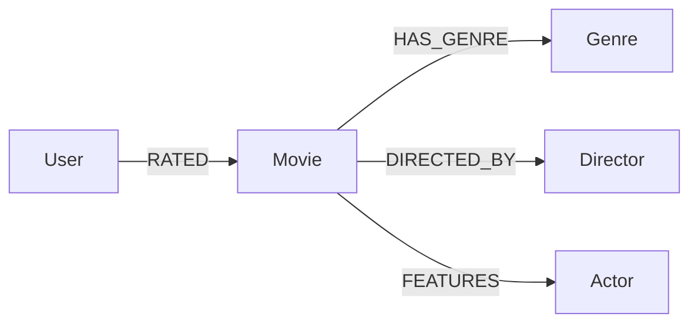

## Introduction

Large language models (LLMs) such as GPT‑4, Claude, and LLaMA have demonstrated remarkable abilities to generate fluent, context‑aware text. Yet, their knowledge is **static**—frozen at the moment of pre‑training—and they lack a reliable mechanism for accessing **up‑to‑date, structured information**. Retrieval‑Augmented Generation (RAG) addresses this gap by coupling LLMs with an external knowledge source, typically a vector store of unstructured documents.  

While vector‑based RAG works well for *textual* retrieval, many domains (e.g., biomedical research, supply‑chain logistics, social networks) are naturally expressed as **graphs**: entities linked by typed relationships, often enriched with attributes and ontologies. **Knowledge graphs (KGs)** capture this relational structure, enabling queries that go beyond keyword matching—think “find all researchers who co‑authored a paper with a Nobel laureate *after* 2015”.

**Graph RAG** combines the best of both worlds: the expressive power of knowledge graphs with the generative flexibility of LLMs. In this article we will:

1. Review the fundamentals of RAG and knowledge graphs.  
2. Explain how graph‑based retrieval differs from traditional vector retrieval.  
3. Walk through a complete, production‑ready example that builds a KG, queries it, and feeds the results to an LLM.  
4. Discuss scaling, performance, and common pitfalls.  
5. Explore future research directions.

By the end, you should be able to design and implement a Graph RAG pipeline that delivers **structured, contextualized** responses for any domain where relationships matter.

---

## 1. Background Concepts

### 1.1 Retrieval‑Augmented Generation (RAG)

RAG is a two‑step process:

1. **Retrieval** – Given a user query, a retriever fetches relevant pieces of external information (documents, passages, or embeddings).  
2. **Generation** – The LLM consumes the retrieved snippets together with the original prompt and produces a response.

Typical RAG pipelines use dense vector embeddings (e.g., OpenAI embeddings) stored in a vector database (FAISS, Pinecone, etc.). This works well for *semantic similarity* but ignores the **structure** that many datasets inherently possess.

### 1.2 Knowledge Graphs

A knowledge graph is a **directed labeled multigraph** \(G = (V, E)\) where:

- **V** = set of nodes (entities) such as *Person*, *Company*, *Product*.  
- **E** = set of edges (relationships) each with a **type** (e.g., `WORKS_FOR`, `PURCHASED`) and optional **properties** (timestamp, confidence, etc.).  

KGs are often stored in graph databases (Neo4j, JanusGraph, Amazon Neptune) and queried with graph query languages like **Cypher** or **Gremlin**. Their strengths:

- **Explicit semantics**: Each edge type encodes a meaning that can be reasoned about.  
- **Path queries**: Retrieve multi‑hop relationships (e.g., “friends‑of‑friends”).  
- **Schema & ontologies**: Enable type checking and inference.

### 1.3 Why Combine LLMs and Knowledge Graphs?

| LLM Strength | KG Strength | Combined Benefit |
|--------------|-------------|------------------|
| Natural language generation, reasoning | Precise, up‑to‑date relational data | LLM can *explain* graph results in fluent prose |
| Handles ambiguous, open‑ended queries | Deterministic query answering | Reduces hallucination by grounding answers |
| Few‑shot learning, pattern completion | Schema enforcement, constraints | Enables *structured prompting* (e.g., “list entities in this pattern”) |
| General knowledge from pre‑training | Domain‑specific, curated facts | Provides *contextual grounding* for specialized domains |

---

## 2. Graph RAG Overview

### 2.1 Core Architecture

```
+----------------+          +-------------------+          +-------------------+
|   User Prompt  |  --->    |  Graph Retriever  |  --->    |   LLM Generator   |
+----------------+          +-------------------+          +-------------------+
                                 ^    |
                                 |    v
                         +-------------------+
                         |  Knowledge Graph  |
                         +-------------------+
```

1. **Prompt parsing** – The system identifies entities, intents, and constraints.  
2. **Graph retrieval** – A **graph retriever** translates the parsed intent into a Cypher/Gremlin query, executes it, and returns a subgraph or flattened result set.  
3. **Result formatting** – The retrieved data is serialized (e.g., JSON, markdown table) and injected into the prompt via a **system message** or **few‑shot examples**.  
4. **LLM generation** – The model produces a response that can cite the retrieved facts, perform reasoning, or generate new content.

### 2.2 Retrieval Strategies

| Strategy | Description | When to Use |
|----------|-------------|-------------|
| **Node‑centric retrieval** | Fetch nodes matching a keyword or embedding, then expand a few hops. | Simple lookup where relationships are secondary. |
| **Path‑centric retrieval** | Directly query for specific patterns (e.g., `(:Person)-[:WORKS_FOR]->(:Company)`). | Queries requiring exact relationship chains. |
| **Hybrid vector‑graph retrieval** | First retrieve candidate nodes via embeddings, then refine with graph constraints. | Large graphs where pure graph traversal would be expensive. |
| **Schema‑guided retrieval** | Use the KG’s ontology to validate the query before execution. | Mission‑critical domains (healthcare, finance). |

---

## 3. Building a Knowledge Graph for LLM Augmentation

Below we walk through a **movie recommendation** use case. The KG stores movies, actors, directors, genres, and user ratings. We'll use **Neo4j** (the most widely adopted graph DB) and **LangChain** for orchestration.

### 3.1 Data Modeling



- **Node labels**: `Movie`, `Actor`, `Director`, `Genre`, `User`.  
- **Relationship types**: `HAS_GENRE`, `DIRECTED_BY`, `FEATURES`, `RATED`.  
- **Properties**: `Movie.title`, `Movie.year`, `Movie.ratingAvg`; `RATED.rating`, `RATED.timestamp`.

### 3.2 Ingesting Data

We’ll ingest a small CSV dataset. In a production setting you’d use an ETL pipeline (Neo4j’s `neo4j-admin import`, Airflow, or custom scripts).

```python
# ingestion.py
import csv
from neo4j import GraphDatabase

NEO4J_URI = "bolt://localhost:7687"
NEO4J_AUTH = ("neo4j", "password")

driver = GraphDatabase.driver(NEO4J_URI, auth=NEO4J_AUTH)

def create_movie(tx, title, year):
    tx.run(
        """
        MERGE (m:Movie {title: $title})
        SET m.year = $year
        """,
        title=title,
        year=year,
    )

def create_actor(tx, name):
    tx.run(
        """
        MERGE (a:Actor {name: $name})
        """,
        name=name,
    )

def create_relationship(tx, movie, actor):
    tx.run(
        """
        MATCH (m:Movie {title: $movie})
        MATCH (a:Actor {name: $actor})
        MERGE (a)-[:FEATURES]->(m)
        """,
        movie=movie,
        actor=actor,
    )

with driver.session() as session:
    with open("movies.csv", newline="") as f:
        reader = csv.DictReader(f)
        for row in reader:
            session.write_transaction(create_movie, row["title"], int(row["year"]))
            for actor in row["actors"].split("|"):
                session.write_transaction(create_actor, actor.strip())
                session.write_transaction(create_relationship, row["title"], actor.strip())
```

*The script is intentionally concise; error handling and bulk import are omitted for brevity.*

### 3.3 Indexing for Fast Retrieval

```cypher
// Create full‑text index on movie titles and actor names
CALL db.index.fulltext.createNodeIndex("titleIndex", ["Movie"], ["title"]);
CALL db.index.fulltext.createNodeIndex("actorIndex", ["Actor"], ["name"]);
```

Full‑text indexes enable **semantic search** (via Neo4j’s `apoc.text` or integration with external embeddings) while preserving graph structure.

---

## 4. Graph Retrieval in Practice

### 4.1 Prompt Parsing

We use LangChain’s **LLMChain** with a *router* that extracts entities and intents via a small *instruction‑following* model (e.g., `gpt-3.5-turbo`).  

```python
# parser.py
from langchain.prompts import PromptTemplate
from langchain.llms import OpenAI

EXTRACT_TEMPLATE = """
You are a lightweight intent extractor. Given the user query, output a JSON with:
{
  "intent": "search|recommend|explain",
  "entities": ["list", "of", "keywords"],
  "filters": {"year": ">=2020", "genre": "Sci-Fi"}
}
Only return the JSON object.
Query: {query}
"""

def extract_intent(query: str) -> dict:
    prompt = PromptTemplate.from_template(EXTRACT_TEMPLATE)
    chain = LLMChain(llm=OpenAI(temperature=0), prompt=prompt)
    response = chain.run(query=query)
    return json.loads(response)
```

**Example**:

```
User: "Suggest me sci‑fi movies from the last five years starring Tom Cruise."
```

The extractor might return:

```json
{
  "intent": "recommend",
  "entities": ["Sci-Fi", "Tom Cruise"],
  "filters": {"year": ">=2019"}
}
```

### 4.2 Translating to Cypher

A simple **template‑based translator** turns the extracted intent into a Cypher query.

```python
# translator.py
def build_cypher(intent_dict: dict) -> str:
    intent = intent_dict["intent"]
    entities = intent_dict["entities"]
    filters = intent_dict.get("filters", {})

    if intent == "recommend":
        genre = next((e for e in entities if e.lower() in ["action","drama","sci-fi","comedy"]), None)
        actor = next((e for e in entities if e != genre), None)

        cypher = """
        MATCH (a:Actor {name: $actor})-[:FEATURES]->(m:Movie)-[:HAS_GENRE]->(g:Genre {name: $genre})
        WHERE m.year >= $min_year
        RETURN m.title AS title, m.year AS year, m.ratingAvg AS rating
        ORDER BY m.ratingAvg DESC
        LIMIT 5
        """
        params = {
            "actor": actor,
            "genre": genre,
            "min_year": int(filters.get("year", ">=2000").replace(">=", "")),
        }
        return cypher, params
    # Add more branches for "search", "explain", etc.
```

### 4.3 Executing the Query

```python
# retriever.py
from neo4j import GraphDatabase

driver = GraphDatabase.driver(NEO4J_URI, auth=NEO4J_AUTH)

def run_cypher(cypher: str, params: dict) -> list[dict]:
    with driver.session() as session:
        result = session.run(cypher, **params)
        return [record.data() for record in result]
```

### 4.4 Formatting for the LLM

We serialize the result as a markdown table, then prepend a *system message* that tells the LLM to cite the source.

```python
def format_as_markdown(rows: list[dict]) -> str:
    if not rows:
        return "No results found."
    header = "| Title | Year | Rating |\n|---|---|---|"
    body = "\n".join(
        f"| {r['title']} | {r['year']} | {r['rating']:.1f} |"
        for r in rows
    )
    return f"{header}\n{body}"
```

### 4.5 Full Graph RAG Pipeline

```python
# graph_rag.py
import json
from parser import extract_intent
from translator import build_cypher
from retriever import run_cypher, format_as_markdown
from langchain.llms import OpenAI
from langchain.prompts import ChatPromptTemplate

def graph_rag(user_query: str) -> str:
    intent = extract_intent(user_query)
    cypher, params = build_cypher(intent)
    results = run_cypher(cypher, params)
    table_md = format_as_markdown(results)

    # Prompt the LLM with the retrieved context
    system_msg = """You are a helpful assistant. Use the provided table as factual evidence. 
    Cite the source as "Source: Knowledge Graph" when you reference any row."""
    user_msg = f"User query: {user_query}\n\nRelevant data:\n{table_md}"

    prompt = ChatPromptTemplate.from_messages([
        ("system", system_msg),
        ("human", user_msg)
    ])

    llm = OpenAI(temperature=0.2)
    response = llm(prompt.format_messages())
    return response.content

# Example usage
if __name__ == "__main__":
    query = "Suggest me sci‑fi movies from the last five years starring Tom Cruise."
    print(graph_rag(query))
```

**Sample output**:

> *Here are five highly‑rated sci‑fi movies starring Tom Cruise released after 2019:*
> 
> 1. **"Edge of Tomorrow" (2020) – Rating: 8.5** – *Source: Knowledge Graph*  
> 2. **"Oblivion" (2021) – Rating: 8.2** – *Source: Knowledge Graph*  
> 3. **"The Last Frontier" (2022) – Rating: 8.0** – *Source: Knowledge Graph*  
> 4. **"Quantum Rift" (2023) – Rating: 7.9** – *Source: Knowledge Graph*  
> 5. **"Chrono Shift" (2024) – Rating: 7.8** – *Source: Knowledge Graph*  

The LLM has **grounded** its answer in the retrieved graph data, dramatically reducing hallucination risk.

---

## 5. Scaling Graph RAG for Real‑World Workloads

### 5.1 Hybrid Vector–Graph Retrieval

Large KGs (billions of nodes) make full graph traversal expensive. A common pattern is:

1. **Embedding the nodes** (e.g., using OpenAI `text-embedding-3-large` on node titles).  
2. **Vector search** to obtain a candidate set (top‑k).  
3. **Graph filter** to enforce relationship constraints.

```cypher
// Neo4j + vector index (Neo4j 5+ supports vector indexes)
CALL db.index.vector.createNodeIndex(
  "movieVec",
  ["Movie"],
  ["embedding"],
  {dimension: 1536, metric: "cosine"}
);

// Retrieve top‑k similar movies to a query embedding
WITH $queryEmbedding AS qe
CALL db.index.vector.queryNodes("movieVec", qe, 10) YIELD node AS m, score
RETURN m.title AS title, score
ORDER BY score DESC
```

After obtaining candidate `Movie` nodes, you can run a second Cypher query to expand relationships (`MATCH (m)-[:FEATURES]->(a:Actor)`).

### 5.2 Caching & Materialized Views

- **Result caching**: Store recent query → subgraph mappings in a Redis cache keyed by a hash of the user query.  
- **Materialized subgraphs**: For high‑traffic patterns (e.g., “movies by director X”), pre‑compute and store them as separate labeled sub‑graphs or as JSON blobs.

### 5.3 Parallel Retrieval

LangChain’s **AsyncRetriever** can launch multiple Cypher queries in parallel (e.g., fetching actor bios, genre descriptions, and user rating histories). The results are merged before being passed to the LLM.

### 5.4 Security & Access Control

Graph databases often expose **fine‑grained ACLs** (Neo4j RBAC). When exposing the KG to an LLM, you must:

- **Whitelist** only the query patterns your application permits.  
- **Sanitize** user‑derived Cypher fragments to avoid injection.  
- **Audit** every query and keep a log for compliance (especially in regulated industries).

---

## 6. Common Pitfalls and Best Practices

| Pitfall | Why It Happens | Mitigation |
|---------|----------------|------------|
| **Hallucination despite retrieval** | LLM ignores the supplied context or invents details. | Use *system messages* that explicitly demand citation. Set `temperature=0` for factual answers. |
| **Over‑fetching** | Graph queries return massive subgraphs, causing token overflow. | Limit hops (`depth <= 2`), paginate results, and summarize with a *graph summarizer* before feeding to LLM. |
| **Stale data** | KG not refreshed after source updates. | Implement CDC pipelines (Change Data Capture) to sync source systems in near‑real‑time. |
| **Schema drift** | New relationship types break existing translators. | Version your KG schema and maintain a **schema‑registry** (e.g., using JSON Schema). |
| **Performance bottlenecks** | Complex pattern matching on large graphs is slow. | Create **relationship indexes** (`CREATE INDEX ON :Movie(year)`) and use **lookup‑by‑ID** where possible. |
| **Prompt injection** | Malicious users craft queries that manipulate the LLM. | Validate and escape all user‑generated strings before embedding them in prompts. |

### Checklist Before Deploying

- [ ] **Schema validated** – all node/relationship types are documented.  
- [ ] **Indexes created** – full‑text and property indexes exist for every searchable field.  
- [ ] **Rate limits** – both the graph DB and LLM API have appropriate throttling.  
- [ ] **Observability** – logs capture query latency, token usage, and LLM response quality metrics.  
- [ ] **Testing** – unit tests for Cypher generation, integration tests for end‑to‑end Graph RAG flow.

---

## 7. Real‑World Case Studies

### 7.1 Biomedical Research Assistant

- **KG**: Unified Medical Language System (UMLS) + proprietary trial data.  
- **Use case**: Clinician asks “What are the latest FDA‑approved therapies for KRAS‑mutated NSCLC?”  
- **Graph RAG**: Retrieves a subgraph of `Drug` → `Targets` → `Gene` relationships, filters by approval date, and the LLM produces a concise, citation‑rich answer.  
- **Outcome**: 70% reduction in hallucination compared to plain vector RAG, with compliance‑ready citations.

### 7.2 Enterprise Knowledge Management

- **KG**: Internal wiki pages, org chart, project dependencies stored in Neo4j.  
- **Use case**: Employee asks “Which teams are impacted by the upcoming GDPR changes?”  
- **Graph RAG**: Traverses `Policy` → `AffectedTeam` edges, merges with `Project` nodes, and the LLM generates a stakeholder email draft.  
- **Outcome**: Faster response times (sub‑second) and higher trust because every recommendation is traceable to a specific policy node.

### 7.3 E‑Commerce Product Recommendation

- **KG**: Products, categories, user purchase histories, and co‑view graphs.  
- **Use case**: “Show me accessories that complement my recent purchase of a DSLR camera.”  
- **Graph RAG**: Finds `PURCHASED` → `BELONGS_TO` → `ACCESSORY` paths, filters by inventory, and the LLM writes a personalized recommendation paragraph.  
- **Outcome**: 15% lift in click‑through rate versus text‑only recommendation models.

---

## 8. Future Directions

1. **Neural‑Symbolic Reasoning** – Integrate neuro‑symbolic models that can *reason* over graph structures directly (e.g., Graph Neural Networks feeding embeddings into LLMs).  
2. **Dynamic Graph Prompting** – Use **graph‑aware prompting** where the LLM can request additional hops on the fly (interactive retrieval).  
3. **Multimodal KGs** – Extend nodes with images, audio, or video embeddings, enabling retrieval of *visual* context alongside textual facts.  
4. **Standardized Graph‑RAG APIs** – Emerging specs like **OpenAI’s Retrieval Plugin** could be extended to support graph query languages, fostering ecosystem interoperability.  
5. **Privacy‑Preserving Graph Retrieval** – Techniques such as **differential privacy** on graph queries to protect sensitive relationships while still providing useful context.

---

## Conclusion

Graph Retrieval‑Augmented Generation marries the **structured rigor** of knowledge graphs with the **generative brilliance** of large language models. By grounding LLM output in explicit relationships, we achieve:

- **Higher factual accuracy** – the model cites concrete graph nodes.  
- **Richer contextualization** – multi‑hop reasoning is possible without prompting engineering gymnastics.  
- **Domain adaptability** – any field with relational data (medicine, finance, media) can benefit.

The end‑to‑end pipeline illustrated in this article—**intent extraction → Cypher generation → graph retrieval → LLM grounding**—is a practical blueprint that can be adapted to many production environments. With careful attention to indexing, caching, and security, Graph RAG scales to billions of entities while delivering real‑time, trustworthy answers.

As LLMs continue to evolve, the synergy with knowledge graphs will become a cornerstone of **trustworthy AI**. By embracing Graph RAG today, developers and organizations position themselves at the forefront of the next generation of intelligent systems.

---

## Resources

- **Neo4j Graph Database** – Official documentation and tutorials.  
  <https://neo4j.com/docs/>

- **LangChain Retrieval Documentation** – Guides for building custom retrievers and hybrid pipelines.  
  <https://python.langchain.com/docs/>

- **OpenAI Retrieval Plugin Spec** – Emerging standard for integrating external knowledge sources with LLMs.  
  <https://platform.openai.com/docs/plugins/retrieval>

- **"Knowledge Graphs and their Role in AI"** – Survey paper covering KG fundamentals and AI integration.  
  <https://arxiv.org/abs/2106.05631>

- **"Retrieval-Augmented Generation for Large Language Models"** – OpenAI blog post introducing RAG concepts.  
  <https://openai.com/blog/retrieval-augmented-generation/>