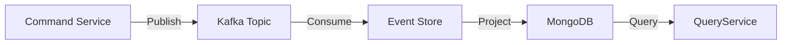

## Table of Contents
1. [Introduction](#introduction)  
2. [Fundamentals of Event‑Driven Architecture (EDA)](#fundamentals-of-event-driven-architecture-eda)  
   1. [Key Terminology](#key-terminology)  
   2. [Why Asynchrony?](#why-asynchrony)  
3. [Choosing the Right Message Broker](#choosing-the-right-message-broker)  
   1. [Apache Kafka](#apache-kafka)  
   2. [RabbitMQ](#rabbitmq)  
   3. [NATS & NATS JetStream](#nats--nats-jetstream)  
   4. [Apache Pulsar](#apache-pulsar)  
   5. [Cloud‑Native Options (AWS SQS/SNS, Google Pub/Sub)](#cloud-native-options-aws-sqssns-google-pubsub)  
4. [Core Design Patterns for Scalable EDA](#core-design-patterns-for-scalable-eda)  
   1. [Publish/Subscribe (Pub/Sub)](#publishsubscribe-pubsub)  
   2. [Event Sourcing](#event-sourcing)  
   3. [CQRS (Command Query Responsibility Segregation)](#cqrs-command-query-responsibility-segregation)  
   4. [Saga & Compensation](#saga--compensation)  
5. [Building a Resilient System](#building-a-resilient-system)  
   1. [Idempotency & Exactly‑Once Semantics](#idempotency--exactlyonce-semantics)  
   2. [Message Ordering & Partitioning](#message-ordering--partitioning)  
   3. [Back‑Pressure & Flow Control](#back-pressure--flow-control)  
   4. [Dead‑Letter Queues & Retries](#dead-letter-queues--retries)  
6. [Data Modeling for Events](#data-modeling-for-events)  
   1. [Schema Evolution & Compatibility](#schema-evolution--compatibility)  
   2. [Choosing a Serialization Format (Avro, Protobuf, JSON)](#choosing-a-serialization-format-avro-protobuf-json)  
7. [Operational Concerns](#operational-concerns)  
   1. [Deployment Strategies (Kubernetes, Helm, Operators)](#deployment-strategies-kubernetes-helm-operators)  
   2. [Monitoring, Tracing & Alerting](#monitoring-tracing--alerting)  
   3. [Security (TLS, SASL, RBAC)](#security-tls-sasl-rbac)  
8. [Real‑World Case Study: Order Processing Pipeline](#real-world-case-study-order-processing-pipeline)  
9. [Best‑Practice Checklist](#best-practice-checklist)  
10. [Conclusion](#conclusion)  
11. [Resources](#resources)  

---

## Introduction

In a world where user expectations for latency, reliability, and scale are higher than ever, traditional request‑response architectures often become bottlenecks. **Event‑Driven Architecture (EDA)** offers a paradigm shift: instead of tightly coupling services through synchronous calls, you let **events** flow through a decoupled, asynchronous fabric. Modern message brokers—Kafka, RabbitMQ, NATS, Pulsar, and cloud‑native services—have matured to the point where they can serve as the backbone of mission‑critical, high‑throughput systems.

This “Zero to Hero” guide walks you through the theory, design patterns, and practical implementation steps needed to build a **scalable, fault‑tolerant, and observable** asynchronous system. Whether you’re a seasoned architect looking to modernize an existing monolith or a developer stepping into the world of distributed systems for the first time, you’ll find concrete examples, code snippets, and real‑world context to accelerate your journey.

---

## Fundamentals of Event‑Driven Architecture (EDA)

### Key Terminology

| Term | Definition |
|------|------------|
| **Event** | An immutable fact that something happened (e.g., *OrderCreated*). |
| **Producer** | The component that publishes events to a broker. |
| **Consumer** | The component that subscribes to events and performs side‑effects. |
| **Broker** | The infrastructure that stores, routes, and delivers events (e.g., Kafka, RabbitMQ). |
| **Topic / Stream** | A logical channel for a class of events (e.g., `orders.created`). |
| **Partition** | A subdivision of a topic used for parallelism and ordering guarantees. |
| **Consumer Group** | A set of consumers that share the work of processing a topic’s partitions. |
| **Offset** | The position of a consumer within a partition; enables replay and fault recovery. |

Understanding these concepts is essential before you start selecting a broker or drafting a diagram.

### Why Asynchrony?

1. **Decoupling** – Producers and consumers evolve independently; you can add new services without breaking existing ones.  
2. **Scalability** – Horizontal scaling is achieved by adding more consumer instances; the broker handles load distribution.  
3. **Resilience** – Failures are isolated; a consumer can go down while the broker buffers events for later processing.  
4. **Performance** – Events can be processed in parallel, often leading to higher throughput and lower latency for end‑users.

> **Note:** Asynchrony does not eliminate the need for synchronous APIs entirely; it complements them where latency‑tolerant workflows exist (e.g., order fulfillment, analytics pipelines).

---

## Choosing the Right Message Broker

No broker fits every use‑case. Your selection should be driven by **throughput, latency, ordering guarantees, durability, operational complexity, and ecosystem**.

### Apache Kafka

* **Strengths** – High throughput (millions of msgs/sec), strong durability, built‑in log compaction, excellent partitioning model, ecosystem (Kafka Streams, ksqlDB).  
* **Weaknesses** – Higher operational overhead, larger memory footprint, not ideal for low‑volume, low‑latency point‑to‑point messaging.  

```python
# Simple Kafka producer using confluent_kafka
from confluent_kafka import Producer
import json

conf = {'bootstrap.servers': 'kafka-broker:9092'}
producer = Producer(conf)

def delivery_report(err, msg):
    if err is not None:
        print(f'Delivery failed: {err}')
    else:
        print(f'Message delivered to {msg.topic()} [{msg.partition()}]')

event = {"type": "OrderCreated", "order_id": 12345, "amount": 99.95}
producer.produce(
    topic='orders.created',
    key=str(event["order_id"]),
    value=json.dumps(event),
    callback=delivery_report
)
producer.flush()
```

### RabbitMQ

* **Strengths** – Rich routing (exchanges, bindings), flexible delivery guarantees (at‑most‑once, at‑least‑once), easy to start, strong community.  
* **Weaknesses** – Lower throughput than Kafka for large streams, messages are not persisted by default (need durable queues).  

```python
# RabbitMQ producer using pika
import pika, json

connection = pika.BlockingConnection(pika.ConnectionParameters('rabbitmq-host'))
channel = connection.channel()
channel.exchange_declare(exchange='orders', exchange_type='topic', durable=True)

event = {"type": "OrderCreated", "order_id": 12345, "amount": 99.95}
channel.basic_publish(
    exchange='orders',
    routing_key='order.created',
    body=json.dumps(event),
    properties=pika.BasicProperties(delivery_mode=2)  # make message persistent
)
print("Sent OrderCreated")
connection.close()
```

### NATS & NATS JetStream

* **Strengths** – Ultra‑low latency (< 1 ms), simple client libraries, built‑in clustering, JetStream adds persistence & streams.  
* **Weaknesses** – Smaller ecosystem, limited built‑in tooling for schema management.

### Apache Pulsar

* **Strengths** – Multi‑tenant, geo‑replication, tiered storage, both streaming and queue semantics.  
* **Weaknesses** – Newer than Kafka, fewer third‑party integrations (though growing fast).

### Cloud‑Native Options (AWS SQS/SNS, Google Pub/Sub)

* **Strengths** – Fully managed, pay‑as‑you‑go, integrates with other cloud services (Lambda, Cloud Functions).  
* **Weaknesses** – Vendor lock‑in, limited control over partitioning and ordering (except with FIFO queues in SQS).

> **Pro Tip:** For a hybrid architecture, you can combine brokers—e.g., Kafka for high‑throughput event streams and SQS for fan‑out to serverless functions.

---

## Core Design Patterns for Scalable EDA

### Publish/Subscribe (Pub/Sub)

The classic pattern where producers publish to a **topic** and any number of consumers subscribe. It enables **many‑to‑many** communication.

*Implementation tip*: Use **consumer groups** to achieve **load‑balanced parallelism** while preserving order per partition.

### Event Sourcing

Instead of persisting the current state, you **store every state‑changing event**. The system can reconstruct any point in time by replaying events.

*Benefits*: Auditable history, easy debugging, natural fit for CQRS.

*Challenges*: Schema evolution, snapshot management, storage growth.

### CQRS (Command Query Responsibility Segregation)

Separate **write** (commands) from **read** (queries). Commands are expressed as events, while read models are materialized views built from those events.



### Saga & Compensation

Long‑running business transactions spanning multiple services can be modeled as a **Saga**—a series of local transactions with compensating actions on failure.

*Implementation*: Each step publishes an event; listeners perform the next step or emit a compensation event if something goes wrong.

---

## Building a Resilient System

### Idempotency & Exactly‑Once Semantics

Even with at‑least‑once delivery, you must guarantee that processing an event multiple times does not corrupt state.

*Strategies*:
- **Idempotent handlers** (e.g., `INSERT ... ON CONFLICT DO NOTHING`).
- **Deduplication tables** keyed by a unique event ID.
- Use broker features like **Kafka’s transactional producer** for exactly‑once semantics.

```sql
-- PostgreSQL idempotent insert
INSERT INTO orders (order_id, amount, status)
VALUES (12345, 99.95, 'created')
ON CONFLICT (order_id) DO UPDATE SET
    amount = EXCLUDED.amount,
    status = EXCLUDED.status;
```

### Message Ordering & Partitioning

Kafka guarantees order **within a partition**. Choose a **partition key** that aligns with your ordering needs (e.g., `order_id`). For global ordering, you must accept additional latency or use a single partition (not scalable).

### Back‑Pressure & Flow Control

If a consumer cannot keep up, you risk memory pressure on the broker. Techniques:

- **Consumer lag monitoring** (Kafka consumer group offsets).
- **Dynamic scaling** via Kubernetes Horizontal Pod Autoscaler (HPA) based on lag metrics.
- **Batch processing** (consume a batch of messages, commit offsets after successful batch).

### Dead‑Letter Queues & Retries

Never let a malformed message block the stream. Typical strategy:

1. **Retry** a configurable number of times with exponential back‑off.
2. After exceeding retries, **publish** to a **dead‑letter topic** for manual inspection.

```python
# Simple retry wrapper
def process_with_retry(event, max_retries=3):
    for attempt in range(max_retries):
        try:
            handle_event(event)
            return
        except Exception as e:
            if attempt < max_retries - 1:
                time.sleep(2 ** attempt)  # exponential back‑off
            else:
                send_to_dead_letter(event, str(e))
```

---

## Data Modeling for Events

### Schema Evolution & Compatibility

When you add fields or change types, you must ensure **backward and forward compatibility**.

- **Apache Avro** with a **Schema Registry** (Confluent) provides versioned schemas and compatibility checks.
- **Protobuf** offers optional fields and explicit versioning.
- **JSON** is flexible but lacks built‑in version enforcement; you need custom validation.

### Choosing a Serialization Format

| Format | Pros | Cons |
|--------|------|------|
| **Avro** | Compact binary, schema evolution, built‑in registry | Requires schema registry, less human‑readable |
| **Protobuf** | Strong typing, cross‑language support, small payloads | Slightly steeper learning curve |
| **JSON** | Human readable, easy debugging | Larger payloads, no schema enforcement |

*Recommendation*: Use **Avro** for high‑throughput pipelines and **JSON** for debugging or low‑volume internal services.

---

## Operational Concerns

### Deployment Strategies (Kubernetes, Helm, Operators)

Most modern brokers have **Kubernetes operators**:

- **Strimzi** for Kafka
- **RabbitMQ Cluster Operator**
- **NATS Operator**
- **Pulsar Operator**

These operators handle:

- StatefulSet creation
- Automatic scaling
- Rolling upgrades with zero downtime
- Persistent volume management

Example Helm values for a Strimzi Kafka cluster:

```yaml
apiVersion: kafka.strimzi.io/v1beta2
kind: Kafka
metadata:
  name: my-cluster
spec:
  kafka:
    replicas: 3
    listeners:
      - name: external
        port: 9094
        type: loadbalancer
        tls: true
    storage:
      type: persistent-claim
      size: 100Gi
  zookeeper:
    replicas: 3
    storage:
      type: persistent-claim
      size: 20Gi
```

### Monitoring, Tracing & Alerting

- **Prometheus** + **Grafana** for broker metrics (bytes in/out, lag, request latency).
- **OpenTelemetry** for tracing across producers, brokers, and consumers.
- **Alertmanager** rules: e.g., trigger if consumer lag > 5 minutes for critical topics.

```yaml
# Prometheus rule example
groups:
  - name: kafka.rules
    rules:
      - alert: HighConsumerLag
        expr: kafka_consumer_group_lag{group="order-service"} > 300000
        for: 5m
        labels:
          severity: critical
        annotations:
          summary: "Consumer lag too high for order-service"
          description: "Lag is {{ $value }} ms"
```

### Security (TLS, SASL, RBAC)

- **TLS encryption** for data in transit.
- **SASL/SCRAM** or **OAuth2** for authentication.
- **RBAC** policies to restrict which services can publish/consume specific topics.

```bash
# Example: Create a Kafka ACL for a service principal
kafka-acls.sh --authorizer-properties zookeeper.connect=zk:2181 \
  --add --allow-principal User:order-service \
  --operation Read --topic orders.created
```

---

## Real‑World Case Study: Order Processing Pipeline

**Scenario**: An e‑commerce platform must handle spikes of up to **50 k orders per second** during flash sales, guarantee that each order is persisted, paid, and shipped, and provide real‑time analytics.

### Architecture Overview

1. **Front‑end API** → **Kafka Producer** (`orders.incoming` topic).  
2. **Order Service** consumes `orders.incoming`, validates, writes to **PostgreSQL**, and publishes `OrderCreated`.  
3. **Payment Service** subscribes to `OrderCreated`, attempts payment, emits `PaymentSucceeded` or `PaymentFailed`.  
4. **Inventory Service** consumes `PaymentSucceeded`, reserves stock, emits `InventoryReserved`.  
5. **Shipping Service** listens to `InventoryReserved`, creates shipment, emits `ShipmentCreated`.  
6. **Analytics Service** consumes all events for dashboards (via a **Kafka Streams** job).  
7. **Dead‑Letter Topic** (`orders.dlq`) captures any failed events.

### Key Implementation Details

| Concern | Solution |
|---------|----------|
| **Throughput** | Kafka topic with 30 partitions; each microservice runs 10 consumer instances (horizontal scaling). |
| **Ordering** | Partition key = `order_id`; guarantees all events for a single order stay in order. |
| **Idempotency** | Each service stores processed event IDs in a dedicated table; duplicate events are ignored. |
| **Observability** | OpenTelemetry spans propagate `trace_id` across services; Grafana dashboards show per‑service lag. |
| **Resilience** | Each service uses a **circuit breaker** (Resilience4j) to avoid cascading failures. |
| **Schema Management** | Confluent Schema Registry with Avro; all services register compatible schemas. |

**Sample Kafka Streams aggregation (Python via Faust)** to compute real‑time order revenue:

```python
import faust

app = faust.App('order-revenue', broker='kafka://kafka-broker:9092')

class OrderCreated(faust.Record):
    order_id: int
    amount: float

orders = app.topic('orders.created', value_type=OrderCreated)

revenue = app.Table('total_revenue', default=float)

@app.agent(orders)
async def compute_revenue(stream):
    async for event in stream:
        revenue['global'] += event.amount
        # Emit to a downstream topic for dashboards
        await app.send('revenue.totals', key='global', value={'total': revenue['global']})
```

---

## Best‑Practice Checklist

- **Domain‑Driven Design**: Model events around business concepts, not technical actions.  
- **Schema Registry**: Enforce compatibility early; version your schemas.  
- **Idempotent Consumers**: Design handlers that can safely reprocess events.  
- **Consumer Lag Monitoring**: Set alerts; auto‑scale based on lag.  
- **Back‑Pressure Handling**: Use batch commits and flow‑control APIs.  
- **Security First**: Enable TLS, enforce principle‑of‑least‑privilege ACLs.  
- **Testing**: Include integration tests with an in‑memory broker (e.g., Testcontainers).  
- **Documentation**: Keep an event catalogue (type, schema, producer, consumers).  
- **Graceful Shutdown**: Ensure consumers commit offsets before terminating.  
- **Disaster Recovery**: Replicate topics across data‑centers; enable tiered storage for long‑term retention.

---

## Conclusion

Event‑Driven Architecture is no longer a niche experiment; it is a proven foundation for **scalable, resilient, and observable** systems that can handle modern traffic spikes and complex business workflows. By mastering the core concepts—events, brokers, and patterns—paired with the right tooling (Kafka, RabbitMQ, NATS, Pulsar, or managed cloud services), you can transition from a monolithic “Zero” baseline to a production‑grade “Hero” system.

Remember that **technology choices** should always be guided by **business requirements**: throughput, latency, ordering, operational maturity, and cost. A well‑engineered EDA solution not only solves immediate scaling challenges but also future‑proofs your architecture for new features, analytics, and integration opportunities.

Start small: pick a single domain (e.g., order ingestion), implement a robust event pipeline with proper schema management, and iterate. Over time, the **event fabric** you build will become the nervous system of your organization—delivering data, driving decisions, and powering innovation at scale.

---

## Resources

- [Apache Kafka Documentation](https://kafka.apache.org/documentation/) – Official guide covering concepts, APIs, and operational best practices.  
- [Confluent Schema Registry & Avro Compatibility](https://docs.confluent.io/platform/current/schema-registry/index.html) – Detailed reference for managing schema evolution.  
- [RabbitMQ Official Tutorials](https://www.rabbitmq.com/getstarted.html) – Hands‑on tutorials for producers, consumers, and advanced routing.  
- [NATS JetStream Overview](https://docs.nats.io/jetstream/) – Explanation of persistence, streams, and consumer patterns in NATS.  
- [Strimzi – Kafka Operator for Kubernetes](https://strimzi.io/) – Open‑source operator to run Kafka on Kubernetes clusters.  
- [OpenTelemetry for Distributed Tracing](https://opentelemetry.io/) – Vendor‑agnostic framework to instrument services and brokers.  
- [Resilience4j – Fault Tolerance Library](https://resilience4j.readme.io/) – Circuit breakers, retries, and bulkheads for Java microservices.  
- [AWS SQS & SNS Documentation](https://aws.amazon.com/sqs/) – Managed queue and pub/sub services for serverless architectures.  

Happy building! 🚀