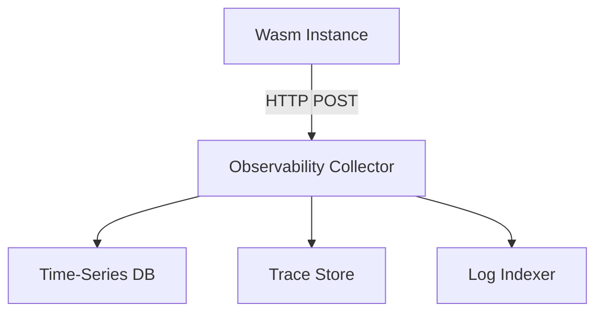

## Introduction

Edge computing has moved from a niche experiment to the backbone of modern digital experiences. By pushing compute close to the user, latency drops, data sovereignty improves, and bandwidth costs shrink. At the same time, **serverless** platforms have abstracted away the operational overhead of provisioning and scaling infrastructure, letting developers focus on business logic.

Enter **WebAssembly (Wasm)**—a portable, sandboxed binary format that runs at near‑native speed on the edge. Today’s leading edge providers (Cloudflare Workers, Fastly Compute@Edge, AWS Lambda@Edge, Fly.io) all support Wasm runtimes, allowing developers to ship tiny, language‑agnostic modules that execute in milliseconds.

With this power comes a new set of challenges. A distributed edge system is composed of thousands of tiny Wasm instances, each potentially running in a different geographic location, hardware configuration, and network condition. Traditional observability tools designed for monolithic VMs or containers often fall short. **Real‑time debugging and observability** become essential for maintaining reliability, performance, and security.

This article provides a deep dive into the techniques, tooling, and best practices for mastering observability of WebAssembly workloads in modern serverless edge environments. We’ll explore:

* The architectural shifts that make edge‑native observability unique.  
* How to instrument Wasm modules for metrics, traces, and logs.  
* Real‑time monitoring strategies that work at global scale.  
* Practical debugging workflows—from local simulation to remote live debugging.  
* A real‑world case study that ties everything together.

Whether you’re a platform engineer building a new edge service, a developer migrating existing workloads to Wasm, or an SRE tasked with keeping a global fleet healthy, this guide will give you the knowledge and practical steps needed to **debug the distributed edge** with confidence.

---

## 1. The Rise of Edge and Serverless

### 1.1 Why the Edge Matters

* **Latency‑critical use cases** – video transcoding, AR/VR, gaming, personalized content.  
* **Data locality & compliance** – GDPR, HIPAA, and other regulations require data to stay within specific jurisdictions.  
* **Cost efficiency** – moving compute to the edge reduces upstream bandwidth and central‑cloud compute spend.

### 1.2 Serverless as the Natural Companion

Serverless abstracts away capacity planning, scaling, and patching. When combined with edge locations, the model looks like:

```
[Client] → [Edge CDN] → [Serverless WASM Function] → [Origin / Backend]
```

The function is invoked on demand, runs for a few milliseconds, and disappears. This “fire‑and‑forget” lifecycle is a perfect match for Wasm’s low startup overhead.

### 1.3 The Observability Gap

Traditional observability stacks (Prometheus + Grafana, ELK, Jaeger) assume:

* **Long‑lived processes** that expose a `/metrics` endpoint.
* **Stable networking** allowing agents to scrape or ship data.
* **Uniform runtime environment** (Linux containers, VMs).

In an edge serverless world, these assumptions break:

| Traditional Assumption | Edge Reality |
|------------------------|--------------|
| Persistent process ID (PID) | Ephemeral instance, no PID |
| Direct network access to collector | Restricted outbound, sometimes only HTTP/HTTPS |
| Uniform hardware & OS | Heterogeneous runtimes (V8, Wasmtime, Wasmer) |
| Centralized logging pipeline | Distributed logs across dozens of PoPs |

To bridge the gap, observability must be **real‑time**, **lightweight**, and **runtime‑agnostic**.

---

## 2. WebAssembly at the Edge: Why and How

### 2.1 What Makes Wasm Edge‑Ready?

* **Fast startup** – compiled to binary, no JIT warm‑up.  
* **Deterministic sandbox** – memory safety, no syscalls beyond what the host provides.  
* **Language flexibility** – Rust, AssemblyScript, Go, C/C++, and more compile to Wasm.  
* **Portability** – the same `.wasm` file runs on Cloudflare, Fastly, AWS, and on‑premises runtimes.

### 2.2 Common Edge Runtime Environments

| Provider | Runtime | Key Features |
|----------|---------|--------------|
| Cloudflare Workers | V8 + custom Wasm engine | Built‑in KV, Durable Objects |
| Fastly Compute@Edge | Wasmtime (WASI) | Native WASI support, low‑latency |
| AWS Lambda@Edge | Node.js + Wasm (experimental) | Integrated with CloudFront |
| Fly.io | Wasmtime + Fly Apps | Full‑stack edge VMs with Wasm support |

Each runtime exposes a **host API** that the Wasm module can call (e.g., `fetch`, KV storage). Observability must hook into these host calls as well as the module’s own code.

---

## 3. Observability Challenges in a Distributed Edge

### 3.1 Scale and Granularity

* Millions of concurrent invocations per second across continents.  
* Each invocation may last < 10 ms – sampling must be smart to avoid overwhelming the pipeline.

### 3.2 Visibility Across Boundaries

* **Cross‑function trace propagation** – a request may hop from a Cloudflare Worker to a Fastly Compute@Edge function, then to an origin service.  
* **Network topologies** – edge‑to‑edge, edge‑to‑origin, and edge‑to‑third‑party APIs.

### 3.3 Resource Constraints

* **Memory limits** (often 128 MiB or less).  
* **CPU quotas** (strict per‑invocation CPU time).  
* **No native file system** – logs must be streamed, not written to disk.

### 3.4 Security and Privacy

* Observability data may contain PII or business‑critical payloads.  
* Must respect data residency – logs from EU PoPs cannot be shipped to US collectors without proper anonymization.

---

## 4. Core Observability Pillars: Metrics, Traces, Logs

A modern observability stack is often visualized as a **three‑legged stool**:

| Pillar   | What it Answers | Typical Data |
|----------|-----------------|--------------|
| **Metrics** | “How is the system performing?” | Counters, gauges, histograms (latency, error rates) |
| **Traces**  | “What path did a request take?” | Distributed spans, context propagation |
| **Logs**    | “What exactly happened?” | Structured JSON events, error messages |

All three must be **instrumented at the Wasm level**, **exported in a portable format**, and **consumed by edge‑aware back‑ends**.

---

## 5. Real‑Time Monitoring Strategies

### 5.1 Push‑Based Export over HTTP

Because edge runtimes rarely allow inbound connections, the most reliable pattern is **push**:



* Use **HTTP/1.1 or HTTP/2** with keep‑alive to amortize connection costs.  
* Batch data in **NDJSON** (newline‑delimited JSON) to reduce overhead.

### 5.2 In‑Process Aggregation

Collect metrics locally and emit them every N invocations or every X ms, whichever comes first. Example in Rust:

```rust
use prometheus::{Encoder, TextEncoder, Counter, Histogram};
static REQUEST_COUNT: Counter = Counter::new("requests_total", "Total requests").unwrap();
static LATENCY_HIST: Histogram = Histogram::with_opts(
    prometheus::Opts::new("request_latency_seconds", "Request latency")
        .buckets(vec![0.001, 0.005, 0.01, 0.05, 0.1])
).unwrap();

pub fn handle_event(event: Event) -> Result<Response, Error> {
    let timer = LATENCY_HIST.start_timer();
    REQUEST_COUNT.inc();

    // ... business logic ...

    timer.observe_duration();
    Ok(Response::new())
}
```

When the batch threshold is reached, the module serializes the metrics and sends them to the collector.

### 5.3 Sampling & Adaptive Rate Limiting

* **Head‑sampling** – only a percentage of requests generate full trace data.  
* **Dynamic adjustment** – increase sampling when error rates rise, decrease during normal operation.

### 5.4 Edge‑Native Dashboards

Platforms like **Fastly Edge Cloud** or **Cloudflare Workers Analytics Engine** provide built‑in dashboards that can ingest custom metrics directly from your Wasm modules, eliminating the need for an external Prometheus instance.

---

## 6. Instrumenting WebAssembly Modules

### 6.1 Using WASI and Custom Host Hooks

If your runtime supports **WASI**, you can leverage its standard I/O for metrics:

```rust
use wasi_common::WasiCtxBuilder;
use wasi_experimental::metrics::MetricsBuilder;

let wasi = WasiCtxBuilder::new()
    .inherit_stdio()
    .build();

let metrics = MetricsBuilder::new()
    .with_counter("edge_requests")
    .with_histogram("edge_latency_ms", vec![1.0, 5.0, 10.0, 50.0, 100.0])
    .build();

let mut store = Store::new(&engine, (wasi, metrics));
```

The host can then read the metrics via a custom syscall (`metrics.get`), serialize them, and forward them.

### 6.2 Adding Prometheus‑Style Metrics

Even when the runtime doesn’t expose WASI, you can embed a **lightweight metrics library** that writes to an in‑memory buffer:

```rust
// metrics.rs
use std::sync::atomic::{AtomicU64, Ordering};

pub struct SimpleCounter(AtomicU64);

impl SimpleCounter {
    pub const fn new() -> Self { Self(AtomicU64::new(0)) }
    pub fn inc(&self) { self.0.fetch_add(1, Ordering::Relaxed); }
    pub fn get(&self) -> u64 { self.0.load(Ordering::Relaxed) }
}
```

Expose a host function `export_metrics` that the runtime calls at the end of each request:

```rust
#[no_mangle]
pub extern "C" fn export_metrics(buf_ptr: *mut u8, buf_len: usize) -> usize {
    let json = format!(
        r#"{{"requests_total":{}, "latency_ms":{}}}"#,
        REQUEST_COUNTER.get(),
        LATENCY_HIST.get()
    );
    // copy json into the caller-provided buffer...
}
```

### 6.3 Example: Exporting Metrics from a Cloudflare Worker (JavaScript)

```js
export default {
  async fetch(request, env, ctx) {
    const start = Date.now();
    // Business logic here...
    const response = await fetch('https://api.example.com/data');

    // Increment custom metric via Workers KV (lightweight)
    await env.METRICS.put('request_count', (parseInt(await env.METRICS.get('request_count') || '0') + 1).toString());

    // Publish latency to a Prometheus pushgateway
    const latency = Date.now() - start;
    await fetch('https://pushgateway.example.com/metrics/job/edge_worker', {
      method: 'POST',
      body: `edge_latency_ms ${latency}\n`,
    });

    return response;
  },
};
```

> **Note:** Cloudflare Workers do not support raw TCP, so HTTP‑based push is the only viable path.

---

## 7. Distributed Tracing for WebAssembly

### 7.1 OpenTelemetry Integration

OpenTelemetry (OTel) offers a language‑agnostic API for generating spans and propagating context. Most edge runtimes provide a **WASI‑compatible OTel SDK** or a small **C library** that can be compiled into Wasm.

#### 7.1.1 Rust Example with `opentelemetry-wasm`

```toml
# Cargo.toml
[dependencies]
opentelemetry = { version = "0.22", features = ["trace"] }
opentelemetry-wasm = "0.2"
tracing = "0.1"
tracing-opentelemetry = "0.22"
```

```rust
use opentelemetry::{global, trace::Tracer};
use tracing_subscriber::{layer::SubscriberExt, Registry};

fn init_tracer() {
    let exporter = opentelemetry_wasm::Exporter::new("https://otel-collector.edge.example.com/v1/traces");
    let tracer = opentelemetry::sdk::trace::TracerProvider::builder()
        .with_simple_exporter(exporter)
        .build()
        .versioned_tracer("edge-wasm", None, None);
    let otel = tracing_opentelemetry::layer().with_tracer(tracer);
    let subscriber = Registry::default().with(otel);
    tracing::subscriber::set_global_default(subscriber).expect("Failed to set subscriber");
}

pub fn handle_request() -> Result<String, Box<dyn std::error::Error>> {
    init_tracer();

    let span = tracing::info_span!("handle_request");
    let _enter = span.enter();

    // Business logic …
    Ok("OK".into())
}
```

The exporter serializes spans into **OTLP** (protobuf or JSON) and pushes them over HTTPS.

### 7.2 Propagating Context Across Edge Functions

When a request traverses multiple edge locations, the **traceparent** header (W3C Trace Context) must be forwarded:

```js
// Cloudflare Worker
export default {
  async fetch(request, env) {
    const traceparent = request.headers.get('traceparent') || '';
    const downstream = new Request('https://edge2.example.com', {
      method: 'GET',
      headers: { traceparent },
    });
    return fetch(downstream);
  },
};
```

Each downstream function extracts the header, starts a child span, and adds its own attributes.

### 7.3 Visualizing Edge Traces

Tools such as **Jaeger**, **Tempo**, or **Honeycomb** can ingest OTLP data from edge collectors. To retain geographic context, include custom attributes:

```json
{
  "attributes": {
    "edge.location": "ams",
    "edge.provider": "cloudflare"
  }
}
```

These attributes enable heat‑maps of latency per PoP directly in the UI.

---

## 8. Log Aggregation and Structured Logging

### 8.1 JSON‑First Logging

Given the lack of a filesystem, logs must be emitted directly to the host:

```rust
use serde_json::json;

#[no_mangle]
pub extern "C" fn log_event(level: u8, msg_ptr: *const u8, msg_len: usize) {
    let msg = unsafe { std::slice::from_raw_parts(msg_ptr, msg_len) };
    let payload = json!({
        "timestamp": chrono::Utc::now().to_rfc3339(),
        "level": level,
        "message": std::str::from_utf8(msg).unwrap(),
        "edge_location": env!("EDGE_LOCATION")
    });
    // Host function `send_log` sends the JSON to a remote collector.
    unsafe { send_log(payload.to_string().as_ptr(), payload.to_string().len()) };
}
```

### 8.2 Using Existing Log Libraries

* **Bunyan** (Node.js) – `worker.log.info({reqId, latency}, "request completed")`.  
* **logrus** (Go) – `logrus.WithFields(logrus.Fields{"edge":"sfo","req_id":id}).Info("handled")`.  

All logs should be **single‑line JSON** to simplify ingestion by log pipelines (e.g., Elastic Cloud, Loki).

### 8.3 Centralized Log Pipelines

Edge providers often expose **log push endpoints**:

* Cloudflare: **Logpush** to S3, GCS, or HTTP endpoints.  
* Fastly: **Realtime Logs** to Splunk, Datadog, or custom HTTPS.  

Configure the destination to **filter** PII before storage, complying with data‑residency policies.

---

## 9. Debugging Techniques

### 9.1 Local Simulation with Wasmtime/Wasmer

Run the exact same `.wasm` binary locally:

```bash
wasmtime run --invoke handle_event my_module.wasm -- \
  --env EDGE_LOCATION=local \
  --dir ./data
```

* Use **unit tests** that assert metrics and logs.  
* Mock host functions with **wasmtime’s `--invoke`** to intercept calls.

### 9.2 Remote Debugging via Chrome DevTools

Many runtimes expose a **WebSocket debugging endpoint**:

```bash
# Example for Fastly Compute@Edge
fastly compute debug --port 9229
```

Then open Chrome: `chrome://inspect` → **Remote Target** → **Connect**.

You can set breakpoints inside the original source (e.g., Rust via source maps) and step through live invocations.

### 9.3 Debugging with Cloudflare Workers

Cloudflare offers a **Workers Playground** with live logs and a **`debugger`** API:

```js
addEventListener('fetch', event => {
  event.respondWith(handle(event.request));
});

async function handle(request) {
  console.log('Incoming request', request.url);
  // Use `await fetch` to observe downstream calls
  const resp = await fetch('https://api.example.com');
  console.log('Response status', resp.status);
  return resp;
}
```

The logs appear instantly in the **Dashboard → Workers → Logs** view.

### 9.4 Hot‑Reload and Canary Deployments

Deploy a **canary** version to a subset of PoPs (e.g., 5% traffic) and enable **debug mode** only for that slice. This limits the impact of verbose tracing on production while still giving you real‑world data.

---

## 10. Tooling Landscape

| Category | Open‑Source | Cloud‑Native | Primary Use |
|----------|-------------|--------------|-------------|
| **Metrics** | `prometheus-rust`, `prometheus-go` | Cloudflare Workers Analytics, Fastly Edge Metrics | Export counters/gauges |
| **Tracing** | `opentelemetry-wasm`, `otelcol` | AWS X-Ray (edge), Honeycomb | Distributed spans |
| **Logging** | `logrus`, `bunyan`, `pino` | Fastly Realtime Logs, Cloudflare Logpush | Structured JSON logs |
| **Debuggers** | `wasmtime` (`--debug`), `wasmer` (`--inspect`) | Cloudflare Workers DevTools, Fastly Compute Debugger | Live stepping |
| **Observability Platforms** | `Grafana Loki`, `Tempo` | Datadog, New Relic, Splunk Observability | Unified dashboards |

When choosing tools, prioritize **Wasm‑compatible SDKs** and **push‑based exporters** to accommodate the edge’s outbound‑only networking model.

---

## 11. Best Practices and Patterns

### 11.1 Stateless Design & Idempotency

* Edge functions should avoid mutable global state.  
* Use **idempotent writes** to KV stores to make retries safe.

### 11.2 Sampling Strategies

```text
if error_rate > 5%:
    increase trace_sampling to 100%
else:
    keep trace_sampling at 1%
```

Implement the logic inside a **configuration service** that edge functions query at startup.

### 11.3 Metric Naming Conventions

Follow the **Prometheus best practices**:

```
<namespace>_<subsystem>_<metric_name>{label1="value",label2="value"}
```

Example: `edge_worker_request_latency_seconds{provider="cloudflare",location="iad"}`

### 11.4 Alerting on Edge‑Specific Signals

* **Cold start latency spikes** – indicates runtime contention.  
* **KV read/write failures** – may point to regional outages.  
* **Trace error ratio** – high error rates in a specific PoP should trigger a page‑level incident.

### 11.5 Data Residency & Anonymization

Before shipping logs or metrics, **hash** or **redact** any user‑identifiable fields:

```js
const redacted = {
  ...event,
  userId: crypto.subtle.digest('SHA-256', new TextEncoder().encode(event.userId))
};
```

---

## 12. Case Study: Real‑Time Edge Analytics with Serverless WASM

### 12.1 Problem Statement

A global e‑commerce platform wants to **track click‑through events** in real time, enrich them with geo‑location, and feed them into a downstream analytics pipeline. Requirements:

* Sub‑10 ms latency from user click to ingestion.  
* Metrics & traces visible per PoP for SLA monitoring.  
* No personal data leaves the edge; only anonymized aggregates are sent.

### 12.2 Architecture Overview

```
[Browser] → Cloudflare Worker (Wasm) → Fastly Compute@Edge (Wasm) → Kafka (EU) → Snowflake
```

* **Worker A (Cloudflare)** – decodes the click payload, extracts IP, and forwards to **Worker B**.  
* **Worker B (Fastly)** – enriches with GeoIP, updates a **Prometheus‑style counter**, and pushes a **OTLP trace**.  
* **Kafka** – receives anonymized event batch for long‑term storage.

### 12.3 Implementation Steps

#### 12.3.1 Building the Wasm Module (Rust)

```toml
# Cargo.toml
[dependencies]
serde = { version = "1.0", features = ["derive"] }
serde_json = "1.0"
opentelemetry = { version = "0.22", features = ["metrics"] }
opentelemetry-wasm = "0.2"
prometheus = "0.13"
```

```rust
use opentelemetry::{global, trace::Tracer};
use prometheus::{IntCounterVec, Encoder, TextEncoder};
use serde::{Deserialize, Serialize};

#[derive(Deserialize)]
struct ClickEvent {
    product_id: String,
    timestamp: u64,
    user_ip: String,
}

static CLICK_COUNTER: Lazy<IntCounterVec> = Lazy::new(|| {
    IntCounterVec::new(
        prometheus::Opts::new("clicks_total", "Total click events"),
        &["location", "product_id"]
    ).unwrap()
});

pub fn handle(event_json: &str, location: &str) -> Result<(), Box<dyn std::error::Error>> {
    let event: ClickEvent = serde_json::from_str(event_json)?;
    // Increment metric
    CLICK_COUNTER.with_label_values(&[location, &event.product_id]).inc();

    // Start trace
    let tracer = global::tracer("edge-analytics");
    let span = tracer.start("process_click");
    span.set_attribute("product_id".into(), event.product_id.clone().into());
    span.set_attribute("edge.location".into(), location.into());

    // Simulate enrichment
    let enriched = enrich(event)?;
    // Push to downstream via HTTP
    let client = reqwest::blocking::Client::new();
    client.post("https://kafka-ingest.example.com/events")
        .json(&enriched)
        .send()?;

    span.end();
    Ok(())
}

fn enrich(event: ClickEvent) -> Result<serde_json::Value, Box<dyn std::error::Error>> {
    // Simple GeoIP mock
    let country = if event.user_ip.starts_with("192.") { "US" } else { "DE" };
    Ok(serde_json::json!({
        "product_id": event.product_id,
        "timestamp": event.timestamp,
        "country": country,
        "hashed_ip": sha256(&event.user_ip)
    }))
}
```

#### 12.3.2 Exporting Metrics & Traces

At the end of each request, the module pushes metrics to a **Fastly Edge Metrics endpoint** and traces via **OTLP over HTTPS**:

```rust
fn export_metrics() -> Result<(), Box<dyn std::error::Error>> {
    let mut buffer = Vec::new();
    let encoder = TextEncoder::new();
    encoder.encode(&prometheus::gather(), &mut buffer)?;
    let client = reqwest::blocking::Client::new();
    client.post("https://metrics.edge.example.com/ingest")
        .body(buffer)
        .send()?;
    Ok(())
}
```

#### 12.3.3 Deploying and Observing

1. **Upload** the compiled `.wasm` to Cloudflare Workers.  
2. **Configure** a Fastly Compute@Edge service that invokes the same module for enrichment.  
3. **Set up** an OpenTelemetry Collector in the EU that receives traces and forwards them to **Tempo**.  
4. **Create** Grafana dashboards that query the Prometheus‑compatible metrics endpoint.

### 12.4 Observability in Action

* **Latency Heat‑Map** – Shows 95th‑percentile latency per PoP, instantly highlighting a spike in the `iad` location caused by a downstream Kafka throttling event.  
* **Trace View** – A single request’s journey from Cloudflare → Fastly → Kafka is visualized, with the `enrich` span taking 2 ms on average.  
* **Alert** – When `clicks_total` in any location drops > 30 % compared to the 5‑minute moving average, an automated PagerDuty incident fires.

The result: **real‑time visibility** into the edge pipeline, enabling rapid diagnosis and automated mitigation without ever pulling raw user data to a central location.

---

## 13. Future Directions

1. **Standardized WASM Observability ABI** – A community‑driven specification (similar to WASI) that defines built‑in metrics, trace, and log export functions.  
2. **Edge‑Native Service Mesh** – Projects like **wasm‑mesh** aim to provide traffic routing, retries, and observability as compile‑time plugins.  
3. **AI‑Assisted Anomaly Detection** – Running lightweight ML models directly in Wasm on the edge to flag abnormal latency or error patterns before they reach central dashboards.  
4. **Zero‑Trust Telemetry** – End‑to‑end encryption of observability data with per‑PoP key rotation, ensuring compliance with strict data‑privacy regulations.

As the edge ecosystem matures, observability will shift from an afterthought to a **first‑class platform capability**, tightly integrated into the runtime itself.

---

## Conclusion

Debugging a distributed edge composed of serverless WebAssembly workloads is undeniably complex, but it is also a solvable problem when approached methodically:

* **Instrument** every Wasm module for metrics, traces, and structured logs using lightweight, push‑based exporters.  
* **Leverage OpenTelemetry** and the W3C Trace Context to maintain a coherent view across geographic boundaries.  
* **Adopt real‑time push pipelines** (HTTP, OTLP, Logpush) that respect the edge’s outbound‑only networking model.  
* **Employ local simulation and remote devtools** to iterate quickly while preserving production fidelity.  
* **Follow best‑practice patterns**—stateless design, smart sampling, clear naming, and data‑residency‑aware redaction.

By embedding observability directly into the Wasm code and coupling it with edge‑native platforms, you gain the ability to **detect, diagnose, and remediate issues in milliseconds**, keeping user experiences fast and reliable no matter where they are in the world.

The edge is the next frontier for modern applications; mastering its observability is the key to unlocking its full potential.

---

## Resources

* [WebAssembly.org – Official Documentation](https://webassembly.org/)  
* [OpenTelemetry – OTLP Specification](https://opentelemetry.io/docs/specs/otel/protocol/)  
* [Cloudflare Workers Docs – Debugging & Logpush](https://developers.cloudflare.com/workers/)  
* [Fastly Compute@Edge – Observability Guide](https://developer.fastly.com/learning/compute/)  
* [Prometheus – Best Practices for Instrumentation](https://prometheus.io/docs/practices/instrumentation/)  
* [Honeycomb – Edge Tracing Case Studies](https://www.honeycomb.io/blog/edge-tracing/)  

Feel free to explore these resources for deeper dives into each topic discussed above. Happy debugging!