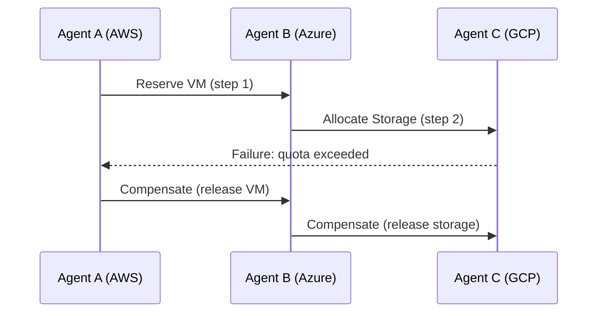

## Introduction

The rise of autonomous agents—software entities that can make decisions, act on behalf of users, and collaborate with other agents—has transformed how modern cloud platforms deliver complex services. When these agents need to coordinate across multiple data‑centers, edge nodes, or even different cloud providers, the underlying workflow must be **resilient** (capable of handling failures), **agentic** (driven by autonomous decision‑making), and **orchestrated** (managed as a coherent whole).  

In this article we explore a systematic approach to **architecting resilient agentic workflows** for autonomous system orchestration in **distributed cloud environments**. We will:

1. Clarify the core concepts of “agentic workflow” and “resilient orchestration.”
2. Present architectural patterns that enable fault‑tolerant, self‑healing coordination across heterogeneous clouds.
3. Demonstrate a practical implementation using open‑source tools (Kubernetes, Temporal, and gRPC).
4. Discuss observability, security, and operational best practices.
5. Highlight emerging trends and research directions.

The goal is to give engineers, architects, and researchers a concrete, end‑to‑end reference they can adapt to real‑world projects ranging from large‑scale IoT fleets to AI‑driven data pipelines.

---

## Table of Contents
1. [Understanding Agentic Workflows](#understanding-agentic-workflows)  
2. [Why Resilience Matters in Distributed Clouds](#why-resilience-matters-in-distributed-clouds)  
3. [Core Architectural Principles](#core-architectural-principles)  
4. [Designing for Distributed Cloud Environments](#designing-for-distributed-cloud-environments)  
5. [Orchestration Patterns for Autonomous Agents](#orchestration-patterns-for-autonomous-agents)  
6. [Fault Tolerance & Self‑Healing Mechanisms](#fault-tolerance--self-healing-mechanisms)  
7. [Security, Trust, and Policy Enforcement](#security-trust-and-policy-enforcement)  
8. [Implementation Walkthrough (Code Samples)](#implementation-walkthrough-code-samples)  
9. [Monitoring, Tracing, and Observability](#monitoring-tracing-and-observability)  
10. [Best Practices Checklist](#best-practices-checklist)  
11. [Future Directions](#future-directions)  
12 [Conclusion](#conclusion)  
13 [Resources](#resources)  

---

## Understanding Agentic Workflows

### What Is an Agentic Workflow?

An **agentic workflow** is a sequence of tasks or activities that are **initiated, controlled, or altered by autonomous software agents**. Unlike traditional pipelines where a static scheduler decides the order of execution, an agentic workflow:

- **Encapsulates decision logic** within each agent (e.g., “If latency > 150 ms, route to a backup service”).
- **Allows dynamic reconfiguration** at runtime based on contextual data (environment health, cost, policy changes).
- **Supports peer‑to‑peer negotiation** among agents (e.g., bidding for compute resources).

### Key Characteristics

| Characteristic | Description | Example |
|----------------|-------------|---------|
| **Autonomy** | Agents act without human intervention. | A fraud‑detection agent triggers a secondary verification flow when risk score > 0.8. |
| **Proactivity** | Agents can start new sub‑workflows based on observed events. | A sensor‑data aggregator spawns a model‑retraining job when drift is detected. |
| **Collaboration** | Agents exchange intents, negotiate resources, and share state. | Multiple edge‑analytics agents coordinate to balance load across a city‑wide network. |
| **Observability** | Agents expose health, metrics, and intent logs for external orchestration. | Each agent publishes a heartbeat to a central monitoring service. |

---

## Why Resilience Matters in Distributed Clouds

### Failure Modes in Multi‑Region Deployments

1. **Network Partitions** – Latency spikes or outright loss of connectivity between regions.  
2. **Resource Exhaustion** – Sudden spikes in traffic deplete CPU, memory, or quota.  
3. **Software Bugs** – Unhandled exceptions that crash an agent process.  
4. **Provider Outages** – One cloud provider may experience a service disruption while another remains healthy.  

When agents orchestrate critical business logic (e.g., payment processing, safety‑critical control), **any single point of failure can cascade** across the system. Therefore, a resilient design must anticipate these failure modes and provide graceful degradation.

### Resilience as a System Property

Resilience is not just “add retries.” It is a **holistic property** encompassing:

- **Redundancy** – Duplicate agents or services across zones.  
- **Isolation** – Fault domains that prevent a failure from propagating.  
- **Self‑Healing** – Automatic detection and remediation (restart, migration, scaling).  
- **Graceful Degradation** – Delivering a reduced‑functionality response instead of a total outage.

---

## Core Architectural Principles

Below are the foundational pillars that guide any resilient agentic workflow architecture.

### 1. Stateless Core with Persistent Intent Store

- **Stateless agents** simplify scaling and recovery; they read/write intent from a durable store (e.g., DynamoDB, PostgreSQL, or a distributed ledger).  
- The **intent store** becomes the single source of truth for workflow state, enabling *event sourcing* and *replay* after failures.

### 2. Decoupled Communication via Message‑Driven Middleware

- Use **asynchronous messaging** (Kafka, NATS, or Pulsar) to decouple producers and consumers.  
- Guarantees at‑least‑once delivery and enables *back‑pressure* handling.

### 3. Declarative Desired State

- Adopt a **desired‑state model** similar to Kubernetes: agents declare the state they need, and a controller reconciles it with the actual state.  
- This model supports *idempotent* operations, which are crucial for retry safety.

### 4. Hierarchical Orchestration Layers

| Layer | Responsibility |
|------|-----------------|
| **Edge Layer** | Low‑latency agents close to data sources, performing real‑time decisions. |
| **Regional Layer** | Aggregates edge intents, performs policy enforcement, and coordinates cross‑edge resources. |
| **Global Layer** | Maintains global view, performs cost‑optimization, and triggers cross‑region migrations. |

### 5. Policy‑First Design

- Encode **business and compliance policies** as first‑class artifacts (OPA policies, Rego rules).  
- Orchestrators evaluate policies before executing any agentic decision.

---

## Designing for Distributed Cloud Environments

### Multi‑Cloud Topology

A typical topology may involve:

- **AWS us‑east‑1** (primary compute region)  
- **Azure West Europe** (secondary, latency‑sensitive services)  
- **Google Cloud Edge locations** (IoT edge processing)  

Each cloud provider offers its own **service mesh**, **identity provider**, and **storage primitives**. To achieve a unified workflow:

1. **Abstract the Cloud‑Specific APIs** behind a *cloud‑adapter* interface.  
2. **Leverage a Service Mesh** (e.g., Istio or Linkerd) that can span multiple clusters via *gateway* proxies.  
3. **Synchronize Secrets** using a vault that supports multi‑cloud back‑ends (HashiCorp Vault, AWS Secrets Manager with replication).

### Data Consistency Strategies

- **Eventual Consistency** for non‑critical telemetry (e.g., log aggregation).  
- **Strong Consistency** (via distributed transactions or two‑phase commit) for financial or safety‑critical intents.  
- **Hybrid Approach**: Use **CRDTs** (conflict‑free replicated data types) for collaborative state that can converge without coordination.

### Example: Cross‑Region Model Deployment

```yaml
# Kubernetes custom resource definition (CRD) for a model deployment intent
apiVersion: ml.example.com/v1
kind: ModelDeploymentIntent
metadata:
  name: fraud-detection-v2
spec:
  modelVersion: "v2.1.3"
  targetRegions:
    - us-east-1
    - west-europe
  rolloutStrategy: Canary
  maxFailureRate: 0.02
```

A **global controller** watches this CRD, validates policies, and creates regional `Job` objects that trigger the actual model loading in each cloud’s AI service (SageMaker, Vertex AI, Azure ML).

---

## Orchestration Patterns for Autonomous Agents

### 1. **Saga Pattern with Compensation**

- Break a long‑running transaction into a series of **local actions**.  
- Each action has a **compensating action** to undo its effect if a later step fails.  
- Ideal for distributed payments, resource provisioning, or multi‑cloud data migration.



### 2. **Event‑Driven Reactive Loop**

- Agents subscribe to a **topic** (e.g., `sensor.alerts`).  
- Upon receiving an event, they **evaluate a rule engine** (OPA) and emit new events or trigger actions.  
- This loop provides natural **back‑pressure** and **elastic scaling**.

### 3. **Leader‑Follower Consensus**

- For critical global decisions (e.g., global scaling), a **leader election** (via etcd or Consul) decides the plan, while followers **replicate** the decision.  
- Guarantees *single source of truth* while allowing high availability.

### 4. **Intent‑Based Orchestration**

- Agents publish **intents** (`Intent { type: "ScaleUp", target: "service-x", count: 3 }`).  
- A **reconciler** translates intents into concrete actions (create pods, adjust load balancers).  
- This decouples *what* from *how* and enables multi‑cloud reconciliation.

---

## Fault Tolerance & Self‑Healing Mechanisms

### Automatic Retry with Exponential Backoff

```python
import backoff
import requests

@backoff.on_exception(backoff.expo,
                      (requests.exceptions.RequestException,),
                      max_tries=5,
                      jitter=backoff.full_jitter)
def call_remote_service(url, payload):
    response = requests.post(url, json=payload, timeout=2)
    response.raise_for_status()
    return response.json()
```

- **Idempotency** is a prerequisite: the remote endpoint must safely handle duplicate requests.

### Circuit Breaker

- Prevents cascading failures by **short‑circuiting** calls to unhealthy services.  
- Libraries such as **pybreaker** or **Resilience4j** can be integrated into the agent runtime.

```python
from pybreaker import CircuitBreaker

breaker = CircuitBreaker(fail_max=3, reset_timeout=30)

@breaker
def fetch_model(version):
    # Remote call to model registry
    ...
```

### Stateful Checkpointing

- Agents periodically **checkpoint** their internal state to a durable store (e.g., Redis Streams, Cloud Spanner).  
- On restart, the agent **rehydrates** from the latest checkpoint and resumes processing without data loss.

### Self‑Healing via Kubernetes Operators

- Define a **Custom Resource** that represents an agent group.  
- An **Operator** watches for failures (pod crash, node loss) and automatically **recreates** or **re‑schedules** agents on healthy nodes.

```yaml
apiVersion: apps.example.com/v1
kind: AgentGroup
metadata:
  name: analytics-agents
spec:
  replicas: 5
  nodeSelector:
    zone: us-east-1a
```

The operator implements the **Reconcile** loop:

```go
func (r *AgentGroupReconciler) Reconcile(ctx context.Context, req ctrl.Request) (ctrl.Result, error) {
    // 1. Fetch AgentGroup instance
    // 2. List Pods with label app=analytics
    // 3. If replicas < spec.replicas, create missing Pods
    // 4. Return Result{RequeueAfter: time.Minute}
}
```

---

## Security, Trust, and Policy Enforcement

### Zero‑Trust Communication

- Enforce **mutual TLS** (mTLS) between agents, regardless of network location.  
- Use **SPIFFE IDs** to provide strong identity semantics.

### Policy as Code

- Write policies in **Open Policy Agent (OPA)** Rego language.  
- Example policy that restricts cross‑region data transfer to approved regions:

```rego
package compliance.region

allowed = {"us-east-1", "west-europe"}

deny[msg] {
    input.destination_region not in allowed
    msg = sprintf("Transfer to region %s is not permitted", [input.destination_region])
}
```

The orchestrator evaluates the policy before executing any `DataTransferIntent`.

### Auditable Intent Logs

- Store every intent in an **append‑only log** (e.g., CloudTrail, Elasticsearch).  
- Include **digital signatures** to guarantee authenticity, enabling forensic analysis.

### Least‑Privilege Access

- Use **IAM roles** scoped to the smallest set of actions required for each agent.  
- In Kubernetes, leverage **RBAC** and **PodSecurityPolicies** to limit what an agent can do on the node.

---

## Implementation Walkthrough (Code Samples)

Below is a minimal but functional example that ties together the concepts discussed. We will build a **distributed job orchestrator** using:

- **Temporal** – a durable workflow engine that provides stateful, fault‑tolerant orchestration.  
- **Kubernetes** – for container orchestration across clouds.  
- **gRPC** – for low‑latency, typed communication between agents.  

### 1. Define the Temporal Workflow

```go
// file: workflow/agentic_workflow.go
package workflow

import (
    "go.temporal.io/sdk/workflow"
    "go.temporal.io/sdk/activity"
)

type Intent struct {
    Type   string
    Params map[string]string
}

// AgenticWorkflow is the top‑level workflow that receives intents.
func AgenticWorkflow(ctx workflow.Context, intent Intent) error {
    // 1. Validate intent with OPA policy (activity)
    ao := workflow.ActivityOptions{
        StartToCloseTimeout: time.Minute,
    }
    ctx = workflow.WithActivityOptions(ctx, ao)

    var policyResult string
    err := workflow.ExecuteActivity(ctx, ValidatePolicy, intent).Get(ctx, &policyResult)
    if err != nil {
        return err
    }

    // 2. Dispatch to region‑specific activity based on intent.Type
    switch intent.Type {
    case "ScaleUp":
        err = workflow.ExecuteActivity(ctx, ScaleUpRegion, intent.Params).Get(ctx, nil)
    case "DeployModel":
        err = workflow.ExecuteActivity(ctx, DeployModelRegion, intent.Params).Get(ctx, nil)
    default:
        err = fmt.Errorf("unknown intent type: %s", intent.Type)
    }
    return err
}
```

### 2. Implement Activities

```go
// file: activity/policy.go
package activity

import (
    "context"
    "github.com/open-policy-agent/opa/rego"
)

func ValidatePolicy(ctx context.Context, intent Intent) (string, error) {
    // Simple OPA evaluation inline
    query, err := rego.New(
        rego.Query("data.compliance.region.allow"),
        rego.Load([]string{"./policy/region.rego"}, nil),
    ).PrepareForEval(ctx)
    if err != nil {
        return "", err
    }

    results, err := query.Eval(ctx, rego.EvalInput(map[string]interface{}{
        "destination_region": intent.Params["region"],
    }))
    if err != nil {
        return "", err
    }
    if len(results) == 0 || !results[0].Expressions[0].Value.(bool) {
        return "", fmt.Errorf("policy violation for region %s", intent.Params["region"])
    }
    return "allowed", nil
}
```

### 3. Deploy the Worker in Kubernetes (multi‑cloud)

```yaml
# file: k8s/temporal-worker.yaml
apiVersion: apps/v1
kind: Deployment
metadata:
  name: agentic-temporal-worker
spec:
  replicas: 3
  selector:
    matchLabels:
      app: temporal-worker
  template:
    metadata:
      labels:
        app: temporal-worker
    spec:
      containers:
        - name: worker
          image: ghcr.io/example/agentic-temporal-worker:latest
          env:
            - name: TEMPORAL_NAMESPACE
              value: "default"
            - name: TEMPORAL_TASK_QUEUE
              value: "agentic-queue"
          resources:
            limits:
              cpu: "500m"
              memory: "256Mi"
          ports:
            - containerPort: 7233
          securityContext:
            runAsUser: 1000
            runAsGroup: 3000
            readOnlyRootFilesystem: true
```

Deploy this manifest to **AWS EKS**, **Azure AKS**, and **Google GKE** clusters. The Temporal server (or a highly‑available cluster) can be run in a dedicated region and accessed via **TLS‑secured endpoints**.

### 4. Agent gRPC Service

```proto
// file: proto/agent.proto
syntax = "proto3";

package agent;

service Agent {
  rpc SubmitIntent (Intent) returns (IntentResponse);
}

message Intent {
  string type = 1;
  map<string, string> params = 2;
}

message IntentResponse {
  string workflow_id = 1;
  string status = 2;
}
```

Generate server stubs in Go, Python, or Java, and have each edge agent call `SubmitIntent`. The server forwards the request to Temporal, which guarantees **exact‑once execution** even if the gRPC connection drops.

### 5. End‑to‑End Flow

1. **Edge Agent** detects a surge in traffic → creates `Intent{type:"ScaleUp", params:{region:"us-east-1", count:"2"}}`.  
2. Sends gRPC request to **Agent Service** → Service starts a Temporal workflow.  
3. Workflow validates policy via OPA → If allowed, calls `ScaleUpRegion` activity.  
4. Activity uses **Kubernetes API** (via client-go) to create additional pods in the target region.  
5. All state changes are persisted in Temporal’s **event store**, enabling automatic replay if the worker crashes.

---

## Monitoring, Tracing, and Observability

### Structured Metrics

- **Prometheus** scrapes per‑agent metrics (`agent_intents_total`, `agent_errors_total`).  
- Export **Temporal workflow metrics** (e.g., `temporal_workflow_started_total`).

```yaml
# Prometheus scrape config snippet
scrape_configs:
  - job_name: 'agentic-workers'
    kubernetes_sd_configs:
      - role: pod
    relabel_configs:
      - source_labels: [__meta_kubernetes_pod_label_app]
        action: keep
        regex: temporal-worker
```

### Distributed Tracing

- Use **OpenTelemetry** to instrument gRPC calls, Temporal activities, and Kubernetes API interactions.  
- Export traces to **Jaeger** or **AWS X-Ray** for cross‑region visibility.

```go
// Example OpenTelemetry instrumentation in Go
tracer := otel.Tracer("agentic-orchestrator")
ctx, span := tracer.Start(context.Background(), "ScaleUpRegion")
defer span.End()
// ... perform scaling logic
```

### Log Aggregation

- Ship logs to a **centralized log store** (Elastic Stack, Loki).  
- Include **trace IDs** and **intent IDs** to correlate logs across services.

### Alerting

- Define alerts on **SLO breach** (e.g., 99.9% of intents complete within 30 seconds).  
- Use **Prometheus Alertmanager** to route alerts to Slack, PagerDuty, or Opsgenie.

---

## Best Practices Checklist

| ✅ Area | Recommended Action |
|--------|---------------------|
| **Architecture** | Use a **desired‑state** model with immutable intents stored in a durable DB. |
| **Fault Tolerance** | Implement **exponential backoff**, **circuit breakers**, and **idempotent APIs**. |
| **Self‑Healing** | Deploy **Kubernetes Operators** or **Temporal workers** that automatically reconcile state. |
| **Security** | Enforce **mTLS**, **least‑privilege IAM**, and **OPA policy checks** before any action. |
| **Observability** | Export **metrics**, **traces**, and **structured logs** to a unified observability stack. |
| **Testing** | Run **chaos engineering** experiments (e.g., network partitions with LitmusChaos) on a staging environment. |
| **Governance** | Keep an **append‑only intent audit log** signed with a key rotation strategy. |
| **Scalability** | Design agents to be **stateless** and horizontally scalable; use **event‑driven back‑pressure**. |
| **Multi‑Cloud** | Abstract cloud‑specific APIs behind adapters; use **service mesh gateways** for cross‑cluster traffic. |
| **Versioning** | Version intents and policies; allow **blue‑green** or **canary** rollouts of new agent logic. |

---

## Future Directions

1. **Generative AI‑Driven Orchestration** – Leveraging LLMs to propose optimal workflow topologies based on real‑time telemetry.  
2. **Federated Learning for Policy Evolution** – Agents collaboratively train policy models without sharing raw data, enabling adaptive compliance.  
3. **Edge‑Native Service Meshes** – Projects like **Kuma** and **Consul** are extending mesh capabilities to ultra‑low‑latency edge nodes, reducing orchestration latency.  
4. **Blockchain‑Backed Intent Ledger** – Immutable intent logs on a permissioned ledger can provide cryptographic auditability for regulated industries.  
5. **Serverless Agent Execution** – Platforms such as **AWS Lambda** or **Cloudflare Workers** could host lightweight agents that auto‑scale per‑event, further reducing operational overhead.

---

## Conclusion

Architecting resilient agentic workflows for autonomous system orchestration in distributed cloud environments is a multidisciplinary challenge. By combining **stateless intent‑driven design**, **robust fault‑tolerance patterns**, **policy‑first security**, and **observability‑centric operations**, teams can build systems that not only survive failures but also **self‑optimize** across clouds and edge locations.

The reference implementation using **Temporal**, **Kubernetes**, and **gRPC** demonstrates how these concepts materialize in real code. When coupled with a strong governance model—OPA policies, immutable audit logs, and zero‑trust networking—organizations gain the confidence to deploy truly autonomous agents at scale.

As the cloud landscape continues to evolve, the principles outlined here will remain relevant, while emerging technologies like generative AI and federated learning will push the envelope of what autonomous orchestration can achieve.

---

## Resources

- **Temporal Documentation** – Comprehensive guide to durable workflows and activities.  
  [Temporal.io Docs](https://docs.temporal.io)

- **Open Policy Agent (OPA)** – Policy engine for cloud‑native environments.  
  [Open Policy Agent](https://www.openpolicyagent.org)

- **Kubernetes Operators** – Pattern for extending Kubernetes with custom controllers.  
  [Operator SDK](https://sdk.operatorframework.io)

- **Istio Service Mesh** – Secure, observable, and resilient service-to-service communication across clusters.  
  [Istio.io](https://istio.io)

- **Chaos Engineering with LitmusChaos** – Tools for injecting failures into Kubernetes workloads.  
  [LitmusChaos](https://litmuschaos.io)

- **OpenTelemetry** – Open-source observability framework for tracing, metrics, and logs.  
  [OpenTelemetry](https://opentelemetry.io)