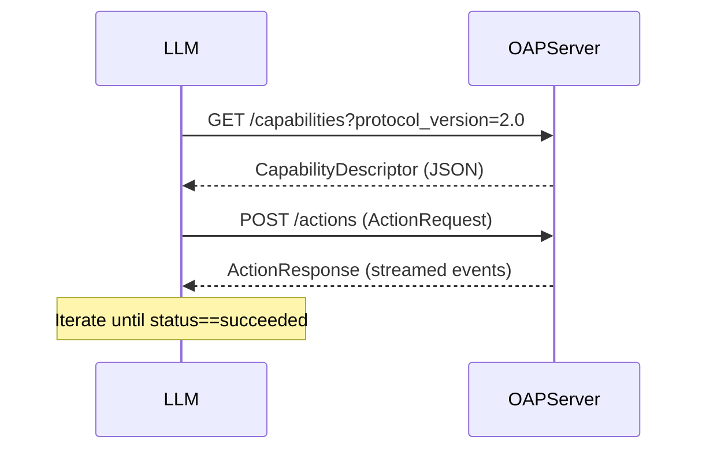

## Introduction

The last few years have seen a dramatic shift in how developers think about large language models (LLMs). Early deployments treated LLMs as *stateless* chat‑bots that simply responded to a user’s prompt. While this model works well for conversational UI, it underutilizes the true potential of LLMs as **agents**—autonomous entities capable of planning, executing, and iterating on complex tasks.

Enter the **Open-Action Protocol 2.0 (OAP‑2.0)**, the community‑driven standard that moves LLM interactions from “single‑turn Q&A” to **agentic workflows**. OAP‑2.0 provides a formal contract for describing *actions*, *capabilities*, *intent*, and *context* in a machine‑readable way, enabling LLMs to orchestrate multi‑step processes, call external APIs, and even delegate work to other agents.

In this article we will:

1. Explain the conceptual leap from chatbots to agentic workflows.  
2. Walk through the core components of Open‑Action Protocol 2.0.  
3. Show a step‑by‑step implementation using Python, LangChain, and a mock OAP‑2.0 server.  
4. Discuss real‑world use‑cases where agentic workflows shine.  
5. Offer best‑practice guidelines and future outlook.

Whether you’re a senior engineer designing enterprise automation, a researcher exploring autonomous AI, or a product manager evaluating new AI‑first features, this guide will give you the practical knowledge you need to start building with OAP‑2.0 today.

---

## 1. From Chatbot to Agentic Workflow

### 1.1 What is an Agentic Workflow?

An **agentic workflow** is a *closed loop* in which an LLM:

1. **Perceives** the current state (user input, external data, internal memory).  
2. **Plans** a series of actions needed to achieve a goal.  
3. **Executes** those actions by invoking APIs, running code, or delegating to other agents.  
4. **Observes** the outcomes, updates its internal state, and iterates until the goal is satisfied.

Contrast this with a traditional chatbot that:

- Receives a prompt →  
- Generates a single response →  
- Ends the interaction.

The agentic loop enables **autonomy**, **error recovery**, and **complex reasoning** that go far beyond a single turn.

### 1.2 Why the Need for a Standard?

Without a shared contract, each LLM provider or framework invents its own way of describing actions (e.g., LangChain tools, OpenAI function calling, custom JSON schemas). This fragmentation leads to:

- **Duplication of effort** – developers re‑implement similar wrappers for each platform.  
- **Interoperability issues** – an agent built on one system cannot easily collaborate with another.  
- **Ambiguous intent** – LLMs may misinterpret the shape of an action, causing runtime errors.

The Open‑Action Protocol solves these pain points by defining a **canonical JSON schema** for actions, a **deterministic execution model**, and **versioned negotiation** between LLMs and external services.

---

## 2. Overview of Open‑Action Protocol 2.0

OAP‑2.0 builds on the original specification (released in 2023) but introduces three major improvements:

| Feature | OAP‑1.0 | OAP‑2.0 |
|---------|---------|--------|
| **Version Negotiation** | Fixed version in request header | Dynamic `protocol_version` field, backward compatibility |
| **Action Description** | Simple name + parameters | Rich `metadata` (capability, cost, latency, safety level) |
| **Streaming Results** | Single JSON response | Incremental `event` stream (start, progress, complete, error) |
| **Security Model** | API‑key only | OAuth2 scopes + signed JWT for per‑action authorization |
| **Extensibility** | Limited custom fields | Namespaced `extensions` object for domain‑specific data |

### 2.1 Core Message Types

1. **`ActionRequest`** – Sent by the LLM to the OAP server, includes:
   - `action_id` (UUID)
   - `name` (string)
   - `arguments` (object)
   - `intent` (string, optional)
   - `context` (object, optional)
   - `metadata` (object, optional)

2. **`ActionResponse`** – Returned by the server (can be streamed):
   - `action_id`
   - `status` (`queued` | `running` | `succeeded` | `failed`)
   - `result` (object, present on success)
   - `error` (object, present on failure)
   - `events` (array of incremental logs)

3. **`CapabilityDescriptor`** – Published by services to advertise what actions they support, allowing LLMs to **discover** capabilities at runtime.

### 2.2 Negotiation Flow



The LLM first queries the server for supported capabilities. The server returns a list of actions with their metadata. The LLM then selects the appropriate action, sends an `ActionRequest`, and processes the streamed `ActionResponse`. If the response indicates failure, the LLM can *re‑plan* and try an alternative action.

---

## 3. Core Concepts in OAP‑2.0

### 3.1 Actions

An **action** is a pure function from inputs to outputs, but it can also have side‑effects (e.g., sending an email, writing to a database). OAP‑2.0 requires each action to be **idempotent** or to provide a **compensation** step, enabling safe retries.

```json
{
  "name": "send_email",
  "arguments": {
    "to": "user@example.com",
    "subject": "Your Report",
    "body": "Please find the attached report."
  },
  "metadata": {
    "capability": "communication.email",
    "cost_usd": 0.0005,
    "latency_ms": 120,
    "safety_level": "high"
  }
}
```

### 3.2 Capabilities

A **capability** groups actions by domain and expresses the *skill* of a service. For example, a **knowledge‑graph** service may expose `query_node`, `add_edge`, and `delete_node`. Capabilities are versioned, allowing backward‑compatible upgrades.

### 3.3 Intent

The optional `intent` field tells the server *why* the action is being invoked. This can be leveraged for:

- **Policy enforcement** (e.g., disallow `delete_user` when intent is “audit”).
- **Cost‑aware routing** (choose cheaper provider if intent is “budget‑friendly”).

### 3.4 Context

`context` carries transient data that may be needed across multiple actions, such as a session ID, user role, or temporary cache. Since OAP‑2.0 is stateless, the LLM is responsible for persisting and passing this context.

---

## 4. Architecture & Integration

Below is a typical stack for an agentic system powered by OAP‑2.0:

```
┌─────────────────────┐
│   User Interface    │   (Web, CLI, Voice)
└─────────▲───────────┘
          │
   ┌──────┴───────┐
   │   LLM Core   │  (GPT‑4‑Turbo, Claude‑3, etc.)
   └──────▲───────┘
          │
   ┌──────┴───────┐
   │  OAP Client  │  (LangChain, LlamaIndex, custom SDK)
   └──────▲───────┘
          │
   ┌──────┴───────┐
   │ OAP Server   │  (FastAPI, Node.js, Go)
   └──────▲───────┘
          │
   ┌──────┴───────┐
   │  Services    │  (Email, DB, Search, Cloud Functions)
   └──────────────┘
```

### 4.1 Choosing an LLM Core

- **OpenAI GPT‑4‑Turbo** – supports function calling out‑of‑the‑box; integration with OAP‑2.0 is straightforward via a thin wrapper.
- **Anthropic Claude** – offers “tools” that map cleanly to OAP actions.
- **Mistral or Llama 3** – require explicit prompting to generate JSON; LangChain’s `structured_output` utilities help.

### 4.2 OAP Client Libraries

Several community SDKs already implement OAP‑2.0:

| Language | Library | Highlights |
|----------|---------|------------|
| Python   | `openaction-py` | Async support, streaming, built‑in retry logic |
| JavaScript | `openaction-js` | Browser & Node compatibility, OAuth2 helper |
| Go       | `openaction-go` | Minimal dependencies, strong typing |

If you prefer not to use a library, a simple `requests` call will suffice (see the code example later).

### 4.3 Security Considerations

- **OAuth2 Scopes** – Each action declares required scopes (e.g., `email.send`). The client obtains a JWT with those scopes and includes it in the `Authorization` header.
- **Input Validation** – The server must enforce JSON schema validation; malformed arguments should result in a `400` error with a detailed message.
- **Audit Trail** – OAP‑2.0 recommends logging each `ActionRequest` and `ActionResponse`. This is critical for compliance (GDPR, HIPAA).

---

## 5. Practical Implementation Steps

Below is a step‑by‑step guide to building a **report‑generation agent** that:

1. Retrieves data from a database.
2. Generates a summary using an LLM.
3. Sends the summary via email.

### 5.1 Step 1 – Deploy an OAP‑2.0 Server

We’ll use FastAPI (Python) for brevity. The server registers three actions:

```python
# server.py
from fastapi import FastAPI, HTTPException, Request
from pydantic import BaseModel, Field
from uuid import uuid4
import asyncio

app = FastAPI(title="Open-Action Server v2.0")

class ActionRequest(BaseModel):
    action_id: str = Field(default_factory=lambda: str(uuid4()))
    name: str
    arguments: dict
    intent: str | None = None
    context: dict | None = None
    metadata: dict | None = None

class ActionResponse(BaseModel):
    action_id: str
    status: str
    result: dict | None = None
    error: dict | None = None
    events: list[dict] = []

# In‑memory registry of capabilities
CAPABILITIES = [
    {
        "name": "query_database",
        "capability": "data.query",
        "description": "Execute a SELECT query and return rows",
        "parameters_schema": {
            "type": "object",
            "properties": {
                "sql": {"type": "string"}
            },
            "required": ["sql"]
        },
        "metadata": {"cost_usd": 0.0001, "latency_ms": 50}
    },
    {
        "name": "generate_summary",
        "capability": "nlp.summarize",
        "description": "Summarize a block of text using LLM",
        "parameters_schema": {
            "type": "object",
            "properties": {"text": {"type": "string"}},
            "required": ["text"]
        },
        "metadata": {"cost_usd": 0.001, "latency_ms": 300}
    },
    {
        "name": "send_email",
        "capability": "communication.email",
        "description": "Send an email via SMTP",
        "parameters_schema": {
            "type": "object",
            "properties": {
                "to": {"type": "string", "format": "email"},
                "subject": {"type": "string"},
                "body": {"type": "string"}
            },
            "required": ["to", "subject", "body"]
        },
        "metadata": {"cost_usd": 0.0005, "latency_ms": 120}
    }
]

@app.get("/capabilities")
async def get_capabilities(protocol_version: str = "2.0"):
    if protocol_version != "2.0":
        raise HTTPException(status_code=400, detail="Unsupported protocol version")
    return {"protocol_version": "2.0", "capabilities": CAPABILITIES}

@app.post("/actions")
async def invoke_action(req: ActionRequest):
    # Basic dispatch based on name
    if req.name == "query_database":
        result = await fake_db_query(req.arguments["sql"])
    elif req.name == "generate_summary":
        result = await fake_llm_summary(req.arguments["text"])
    elif req.name == "send_email":
        result = await fake_send_email(req.arguments)
    else:
        raise HTTPException(status_code=404, detail="Action not found")

    response = ActionResponse(
        action_id=req.action_id,
        status="succeeded",
        result=result,
        events=[{"type": "log", "message": f"Executed {req.name}"}],
    )
    return response

# --- Mock implementations for illustration ---
async def fake_db_query(sql: str):
    await asyncio.sleep(0.05)  # simulate latency
    # Return dummy rows
    return {"rows": [{"date": "2024-01-01", "sales": 1234}, {"date": "2024-01-02", "sales": 1500}]}

async def fake_llm_summary(text: str):
    await asyncio.sleep(0.3)
    # Very naive “summary”
    return {"summary": f"Report contains {len(text.split())} words."}

async def fake_send_email(payload: dict):
    await asyncio.sleep(0.12)
    return {"sent": True, "message_id": str(uuid4())}
```

Run the server:

```bash
uvicorn server:app --reload --port 8000
```

### 5.2 Step 2 – Build the LLM Agent

We’ll use LangChain with the Open‑Action client wrapper.

```python
# agent.py
import os
import json
import httpx
from langchain.chat_models import ChatOpenAI
from langchain.prompts import ChatPromptTemplate, HumanMessagePromptTemplate
from uuid import uuid4

OAP_BASE = "http://localhost:8000"

# Helper to fetch capabilities
def fetch_capabilities():
    resp = httpx.get(f"{OAP_BASE}/capabilities", params={"protocol_version": "2.0"})
    resp.raise_for_status()
    return resp.json()["capabilities"]

CAPS = fetch_capabilities()
CAP_MAP = {c["name"]: c for c in CAPS}

# Simple LLM wrapper that can request actions
class OpenActionAgent:
    def __init__(self):
        self.llm = ChatOpenAI(model="gpt-4-turbo")
        self.session_context = {}

    async def run(self, user_query: str):
        # 1️⃣ Prompt LLM to plan a workflow
        plan = self._plan_workflow(user_query)
        # 2️⃣ Execute each step
        for step in plan:
            action_name = step["action"]
            args = step["arguments"]
            result = await self._invoke_action(action_name, args)
            # Store result in context for later steps
            self.session_context[step["output_key"]] = result

        # 3️⃣ Return final output
        return self.session_context.get("final_output")

    def _plan_workflow(self, query: str):
        """
        Very simple planner: we ask the LLM to output JSON with a list of steps.
        In production you’d use a more robust planning model.
        """
        prompt = ChatPromptTemplate.from_messages([
            HumanMessagePromptTemplate.from_template(
                "You are an autonomous assistant. "
                "Given the user request below, create a JSON plan that calls OAP actions. "
                "The plan must be an array of objects with fields: "
                "`action` (name from capabilities), `arguments` (dict), `output_key` (string). "
                "User request: {request}"
            )
        ])
        rendered = prompt.format_messages(request=query)
        response = self.llm.invoke(rendered)
        # Assume LLM returns a JSON string directly
        try:
            plan = json.loads(response.content)
        except Exception as e:
            raise ValueError(f"Failed to parse plan JSON: {e}")
        return plan

    async def _invoke_action(self, name: str, args: dict):
        if name not in CAP_MAP:
            raise ValueError(f"Unknown action {name}")

        payload = {
            "name": name,
            "arguments": args,
            "context": self.session_context,
            "metadata": {"intent": "automated_report"},
        }
        async with httpx.AsyncClient() as client:
            resp = await client.post(f"{OAP_BASE}/actions", json=payload, timeout=30.0)
            resp.raise_for_status()
            data = resp.json()
            if data["status"] != "succeeded":
                raise RuntimeError(f"Action {name} failed: {data.get('error')}")
            return data["result"]

# Example usage
if __name__ == "__main__":
    import asyncio
    agent = OpenActionAgent()
    user_prompt = "Generate a sales report for the last two days and email it to alice@example.com."
    result = asyncio.run(agent.run(user_prompt))
    print("Final output:", result)
```

**Explanation of the plan format**:

```json
[
  {
    "action": "query_database",
    "arguments": {"sql": "SELECT date, sales FROM sales WHERE date >= CURDATE() - INTERVAL 2 DAY"},
    "output_key": "raw_data"
  },
  {
    "action": "generate_summary",
    "arguments": {"text": "{{raw_data}}"},
    "output_key": "summary_text"
  },
  {
    "action": "send_email",
    "arguments": {
      "to": "alice@example.com",
      "subject": "Two‑Day Sales Report",
      "body": "{{summary_text}}"
    },
    "output_key": "final_output"
  }
]
```

The LLM fills the placeholders (`{{raw_data}}`) with values from the context. In a real deployment you’d use a templating engine (Jinja2) or LangChain’s `PromptTemplate` to render these dynamically.

### 5.3 Step 3 – Orchestrating Iteration & Error Recovery

Because OAP‑2.0 streams events, the agent can **monitor progress**:

```python
async def _invoke_action(self, name, args):
    # Same payload as before...
    async with httpx.AsyncClient() as client:
        async with client.stream("POST", f"{OAP_BASE}/actions", json=payload) as response:
            async for line in response.aiter_lines():
                event = json.loads(line)
                print(f"[{name}] {event['type']}: {event.get('message')}")
                if event["type"] == "error":
                    # Simple retry logic
                    await asyncio.sleep(1)
                    return await self._invoke_action(name, args)
            # When stream ends we have the final JSON
            final = json.loads(event["final"])
            if final["status"] != "succeeded":
                raise RuntimeError(...)
            return final["result"]
```

The agent can now **re‑plan** if an action fails (e.g., fallback to a different email service). This loop embodies the classic **perception‑planning‑action** cycle.

---

## 6. Real‑World Use Cases

### 6.1 Customer Support Automation

- **Problem**: Support tickets often require looking up a user’s order, checking inventory, and sending a resolution email.  
- **Agentic Solution**: An LLM orchestrates `lookup_order`, `check_inventory`, `generate_resolution`, `send_email`.  
- **Benefit**: Zero‑hand‑off for routine queries, freeing human agents for complex cases.

### 6.2 Data‑Pipeline Orchestration

- **Problem**: ETL jobs involve extracting from APIs, transforming with custom code, and loading into warehouses.  
- **Agentic Solution**: Actions like `fetch_api`, `run_python`, `load_to_bigquery`. The LLM decides which transformations are needed based on schema drift detection.  
- **Benefit**: Adaptive pipelines that self‑repair when source schemas change.

### 6.3 Autonomous Research Assistants

- **Problem**: Researchers need to query literature databases, summarize findings, and draft sections of a paper.  
- **Agentic Solution**: `search_pubmed`, `summarize_abstract`, `compose_section`. The agent can iterate, request more citations, or ask clarification from the user.  
- **Benefit**: Rapid literature review cycles, reduced manual effort.

### 6.4 Compliance & Auditing

- **Problem**: Regulations require that any data deletion be logged and approved.  
- **Agentic Solution**: An LLM receives a deletion request, checks policy via `evaluate_policy`, obtains approval via `request_approval`, then calls `delete_record`. All steps are recorded in OAP events for audit trails.  
- **Benefit**: Transparent, programmable compliance that can be inspected post‑mortem.

---

## 7. Best Practices & Common Pitfalls

### 7.1 Keep Actions Small & Idempotent

- **Why**: Smaller actions reduce the surface for errors and make retries safe.  
- **How**: Split a “generate_report” action into “fetch_data”, “render_chart”, “assemble_pdf”.

### 7.2 Version Your Capabilities

- Use semantic versioning (`v1.2.0`). When you add a new parameter, bump the minor version; breaking changes demand a major bump.  
- Clients can request a specific version via the `protocol_version` query param.

### 7.3 Secure the Intent Field

- Treat `intent` as a **policy hook**. For high‑risk actions (e.g., `delete_user`), enforce that the intent matches an approved workflow identifier.

### 7.4 Implement Compensation Steps

- For non‑idempotent side‑effects (e.g., sending money), provide a “compensate” action (`refund_transaction`) that the LLM can call if downstream steps fail.

### 7.5 Monitor Latency & Cost

- OAP‑2.0 includes `metadata.cost_usd` and `metadata.latency_ms`. Use these fields to build **budget‑aware planners** that prefer cheaper actions when possible.

### 7.6 Avoid “Prompt‑Injection” in Arguments

- Validate all user‑supplied strings before passing them to actions. Use schemas (`jsonschema`) and whitelist allowed characters for SQL queries, shell commands, etc.

### 7.7 Log Everything

- Store every `ActionRequest` and streamed `ActionResponse` in an immutable log store (e.g., AWS CloudWatch Logs, Elasticsearch). This aids debugging and satisfies regulatory requirements.

---

## 8. Future Directions

The Open‑Action community is already exploring several extensions:

1. **Streaming LLM‑Generated Plans** – Instead of a static JSON plan, the LLM can emit a *plan stream* that the executor consumes in real time, enabling truly dynamic adaptation.
2. **Multi‑Agent Negotiation** – Multiple autonomous agents can negotiate a shared plan via OAP’s `intent` and `context` fields, opening the door to collaborative AI teams.
3. **Standardized Compensation Language** – A formal DSL for describing rollback and compensation steps, making safe retries a first‑class citizen.
4. **Edge‑Optimized OAP** – Lightweight binary protocol (Protobuf) for IoT devices that need to invoke actions with minimal bandwidth.

As these features mature, the line between “software” and “AI‑driven orchestration” will continue to blur, making OAP‑2.0 a cornerstone of next‑generation autonomous systems.

---

## Conclusion

Open‑Action Protocol 2.0 transforms the way we think about LLMs—from passive responders to **active agents** capable of planning, executing, and iterating on complex workflows. By standardizing how actions are described, negotiated, and streamed, OAP‑2.0 unlocks:

- **Interoperability** across LLM vendors and service providers.  
- **Safety** through explicit metadata (cost, latency, safety level).  
- **Observability** via event streams and audit logs.  
- **Scalability** thanks to idempotent, granular actions.

The practical example above demonstrates that building an agentic system is no longer a research‑only activity; with a few lines of code and a compliant OAP server, you can automate real‑world processes such as report generation, customer support, and data pipelines.  

Adopt OAP‑2.0 today, and position your applications to benefit from the next wave of AI‑first automation.

---

## Resources

- **Open‑Action Protocol Specification (v2.0)** – Official GitHub repository with schema definitions and reference implementations.  
  [Open‑Action Spec v2.0](https://github.com/open-action/protocol/tree/v2.0)

- **LangChain Documentation – Tools & Agents** – Guides on integrating LLMs with external APIs, which map cleanly to OAP actions.  
  [LangChain Docs](https://python.langchain.com/docs/get_started/introduction)

- **FastAPI – Building High‑Performance APIs** – Tutorial for creating the OAP server shown in this article.  
  [FastAPI Tutorial](https://fastapi.tiangolo.com/tutorial/)

- **OpenAI Function Calling** – Background on how OpenAI’s function calling aligns with OAP concepts.  
  [OpenAI Function Calling](https://platform.openai.com/docs/guides/function-calling)

- **OAuth 2.0 Security Best Practices** – Guidance for implementing the secure authentication model recommended by OAP‑2.0.  
  [OAuth 2.0 RFC 6749](https://datatracker.ietf.org/doc/html/rfc6749)