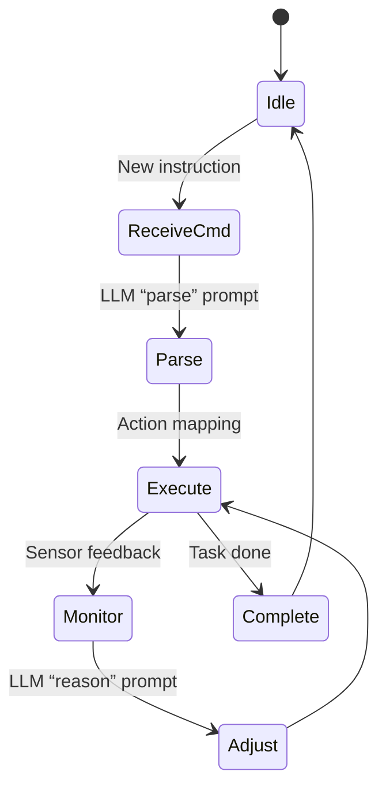

## Introduction

Large language models (LLMs) have moved far beyond conversational chatbots. Modern deployments increasingly place *local* LLM agents on edge devices—industrial controllers, IoT gateways, autonomous robots, and even smartphones—to run **autonomous workflows** without reliance on a central cloud. This shift promises lower latency, stronger data privacy, and resilience in environments with intermittent connectivity.

Yet, simply loading a model onto an edge node and issuing prompts is rarely enough. Edge workloads have strict constraints on **compute, memory, power, and network bandwidth**. To unlock the full potential of local LLM agents, developers must think like system architects: they need to **optimize model selection, inference pipelines, memory management, and orchestration logic** while preserving the model’s reasoning capabilities.

In this article we explore:

1. Why local LLM agents are essential for autonomous edge computing.
2. Core challenges unique to edge environments.
3. A systematic optimization framework—from model quantization to workflow orchestration.
4. Practical code snippets that demonstrate a complete autonomous edge pipeline.
5. Real‑world case studies illustrating the impact of these techniques.
6. Future directions and best‑practice recommendations.

By the end, you’ll have a concrete roadmap to design, tune, and deploy robust LLM‑driven agents that operate reliably at the edge.

---

## 1. The Rise of Local LLM Agents on the Edge

### 1.1 From Cloud‑Centric Chatbots to Edge Autonomy

Historically, LLMs lived in data centers. Applications such as ChatGPT, Copilot, or search assistants streamed prompts to powerful GPUs, received responses, and displayed them to users. While this architecture excels for **interactive, latency‑tolerant** use cases, it falters when:

- **Real‑time reaction** is required (e.g., robotic motion planning).
- **Data sovereignty** mandates that raw sensor data never leaves the device (healthcare, defense).
- **Network reliability** is poor or costly (remote oil rigs, agricultural fields).

Local LLM agents flip this paradigm: the model runs **in situ**, turning raw telemetry into decisions on the spot.

### 1.2 Edge Scenarios That Benefit from LLM Reasoning

| Domain | Edge Device | Typical Workload | Why LLM Reasoning Helps |
|--------|-------------|------------------|--------------------------|
| **Industrial Automation** | PLC‑adjacent gateway | Fault diagnosis, dynamic scheduling | Natural‑language explanations for operators, adaptive rule generation |
| **Autonomous Vehicles** | On‑board compute (NVIDIA Jetson, Intel Movidius) | Route replanning, scenario summarization | Interpreting high‑level mission goals expressed in plain text |
| **Smart Agriculture** | Edge AI box with multi‑sensor suite | Crop disease triage, irrigation control | Translating agronomist instructions into actionable control signals |
| **Healthcare Wearables** | Edge processor on a medical patch | Anomaly detection, patient‑specific recommendations | Providing contextual advice in layman's terms without sending PHI to cloud |
| **Retail Robotics** | Mobile cart or shelf‑stocking robot | Inventory checks, customer assistance | Conversational, task‑oriented interaction while staying offline |

These examples illustrate a **common thread**: the edge device must **understand** unstructured instructions, **reason** over heterogeneous data, and **act** autonomously—all under tight resource budgets.

---

## 2. Core Challenges in Edge‑Hosted LLM Agents

Optimizing a local LLM agent is not just a matter of “shrink the model.” The challenges span hardware, software, and algorithmic dimensions.

### 2.1 Compute & Memory Constraints

- **GPU/TPU availability**: Many edge nodes only have low‑power CPUs or specialized NPUs (e.g., ARM Ethos, Google Edge TPU).
- **RAM limits**: 1–8 GB is common, far less than the 16–64 GB typical for server‑grade inference.
- **Cache hierarchy**: Memory bandwidth becomes the bottleneck for matrix multiplications.

### 2.2 Power & Thermal Envelope

- Battery‑operated devices must stay under a few watts.
- Continuous high‑throughput inference can trigger thermal throttling, compromising real‑time guarantees.

### 2.3 Latency & Real‑Time Guarantees

- Hard deadlines (e.g., 50 ms for motor control) require deterministic inference pipelines.
- Variable token generation time can introduce jitter.

### 2.4 Data Privacy & Security

- Edge devices often handle **sensitive data** (medical, industrial). Secure model loading and inference (e.g., encrypted weights) become mandatory.

### 2.5 Model Update & Lifecycle Management

- Over‑the‑air (OTA) updates must be **size‑aware** and **rollback‑safe**.
- Version compatibility with downstream orchestration logic must be maintained.

---

## 3. A Systematic Optimization Framework

Below is a **four‑layer** framework that addresses the challenges listed above. Each layer builds on the previous one, allowing incremental improvements.

```
+------------------------+
| 4. Orchestration Layer |
+------------------------+
| 3. Execution Engine    |
+------------------------+
| 2. Model & Inference   |
+------------------------+
| 1. Hardware & Runtime  |
+------------------------+
```

### 3.1 Layer 1 – Hardware & Runtime Selection

| Decision | Options | Guidance |
|----------|---------|----------|
| **Compute** | CPU (ARM v8), GPU (NVIDIA Jetson), NPU (Edge TPU) | Match workload to accelerator; NPUs excel at int8 matrix ops. |
| **Runtime** | ONNX Runtime, TensorRT, TVM, PyTorch Mobile | Choose a runtime that supports **dynamic shape** and **quantization‑aware** execution. |
| **OS** | Linux (Ubuntu Core, Yocto), RTOS (FreeRTOS) | Use a real‑time OS if hard‑deadline guarantees are required. |

**Practical tip:** For a Jetson Nano, TensorRT gives up to 3× speedup over ONNX Runtime for int8 models, while preserving the same API surface.

### 3.2 Layer 2 – Model & Inference Optimizations

| Technique | What it does | Typical Gain |
|-----------|--------------|--------------|
| **Quantization** (int8, int4, FP8) | Reduces weight/activation precision | 2–4× speed, 75 % memory reduction |
| **Weight Pruning** | Removes low‑magnitude weights | 30–50 % FLOPs cut |
| **Distillation** | Trains a smaller “student” model on the original’s outputs | Up to 90 % size reduction with modest quality loss |
| **Adapter Layers** | Adds lightweight trainable modules to frozen base model | Enables task‑specific tuning without full retraining |
| **Chunked/Sliding‑Window Generation** | Generates tokens in fixed‑size windows to keep KV cache small | Keeps memory bounded for long contexts |

**Example: Quantizing a LLaMA‑7B model to int8 with GPTQ**

```bash
# Install the quantization toolkit
pip install auto-gptq transformers optimum

# Convert and quantize
python - <<'PY'
from transformers import AutoModelForCausalLM, AutoTokenizer
from auto_gptq import AutoGPTQForCausalLM

model_name = "meta-llama/Llama-2-7b-hf"
tokenizer = AutoTokenizer.from_pretrained(model_name)

# Load FP16 model (requires enough RAM for a one‑off load)
model_fp16 = AutoModelForCausalLM.from_pretrained(
    model_name,
    torch_dtype=torch.float16,
    device_map="auto"
)

# Apply GPTQ quantization to int8
quantized = AutoGPTQForCausalLM.from_pretrained(
    model_fp16,
    quantize_config={"bits": 8, "group_size": 128, "desc_act": False}
)

quantized.save_pretrained("./llama2-7b-int8")
PY
```

The resulting `llama2-7b-int8` can be loaded with **ONNX Runtime** or **TensorRT** for an order‑of‑magnitude smaller memory footprint.

### 3.3 Layer 3 – Execution Engine Enhancements

1. **Dynamic Batching**  
   - Aggregate multiple prompt requests into a single batch when latency permits.  
   - Use a **batch scheduler** that respects per‑request deadlines.

2. **KV‑Cache Management**  
   - The key‑value cache grows linearly with generated tokens.  
   - Implement **circular buffers** or **cache eviction policies** for long‑running sessions.

3. **Parallel Prompt Decomposition**  
   - Break a complex task (e.g., “inspect the pipeline, generate a safety report, and suggest fixes”) into sub‑prompts that can run concurrently on separate cores or devices.

4. **Zero‑Copy I/O**  
   - Use shared memory between sensor drivers and the inference engine to avoid copying large tensors.

### 3.4 Layer 4 – Orchestration & Autonomy

At this layer we embed the LLM agent into a **state machine** that drives the entire edge workflow.



Key components:

- **Command Parser**: A lightweight LLM prompt that extracts intents, parameters, and constraints from natural language.
- **Action Mapper**: Translates intents into concrete API calls (e.g., `move_arm(angle=45)`).
- **Feedback Loop**: Periodically feeds sensor data back into the LLM for *re‑reasoning*.
- **Policy Guardrails**: Hard safety checks (e.g., “do not exceed torque = 10 Nm”) that intercept LLM‑generated actions before execution.

---

## 4. End‑to‑End Example: Autonomous Edge Inspection Robot

Let’s walk through a concrete implementation. The robot is equipped with:

- **CPU**: ARM Cortex‑A72 (2 GHz)
- **NPU**: Google Edge TPU
- **Sensors**: LiDAR, RGB‑D camera, temperature probe
- **Actuators**: 6‑DoF robotic arm, mobile base

The mission: *“Inspect the valve network, report anomalies, and suggest corrective actions.”*

### 4.1 System Architecture Overview

```
+-------------------+       +-------------------+       +-------------------+
|   Sensor Stack    | --->  |   Pre‑proc Layer  | --->  |   LLM Agent (NPU) |
+-------------------+       +-------------------+       +-------------------+
                                   |                         |
                                   v                         v
                            +-------------------+   +-------------------+
                            |   KV‑Cache Store  |   |  Action Executor  |
                            +-------------------+   +-------------------+
```

### 4.2 Prompt Design

**Prompt 1 – Parse Mission**

```text
You are an autonomous inspection robot. Extract the following from the mission statement:
- Target components (list)
- Required measurements (list)
- Output format (JSON)

Mission: "Inspect the valve network, report anomalies, and suggest corrective actions."
```

LLM response (JSON):

```json
{
  "targets": ["valve_network"],
  "measurements": ["visual", "temperature", "pressure"],
  "output_format": "anomaly_report"
}
```

**Prompt 2 – Generate Inspection Plan**

```text
Given the targets and measurements, produce a step‑by‑step plan that respects the robot's constraints:
- Max travel distance per minute: 1.5 m
- Battery budget: 30 min
- Avoid areas with temperature > 80 °C

Plan:
```

LLM returns a concise plan, which the **Action Mapper** translates into low‑level motion commands.

### 4.3 Code Snippet: Orchestrator in Python

```python
import json
import time
from pathlib import Path
from transformers import AutoTokenizer, AutoModelForCausalLM
import torch

# -------------------------------------------------
# 1️⃣ Load quantized model (int8) on Edge TPU via ONNX Runtime
# -------------------------------------------------
import onnxruntime as ort

model_path = Path("./llama2-7b-int8.onnx")
sess_options = ort.SessionOptions()
sess_options.graph_optimization_level = ort.GraphOptimizationLevel.ORT_ENABLE_ALL
sess = ort.InferenceSession(str(model_path), sess_options, providers=["TritonExecutionProvider"])

tokenizer = AutoTokenizer.from_pretrained("meta-llama/Llama-2-7b-hf")

def generate(prompt: str, max_new_tokens: int = 128) -> str:
    inputs = tokenizer(prompt, return_tensors="np")
    # ONNX expects numpy arrays
    ort_inputs = {k: v for k, v in inputs.items()}
    # Simple greedy loop (replace with beam search if needed)
    generated = inputs["input_ids"]
    for _ in range(max_new_tokens):
        logits = sess.run(None, ort_inputs)[0][:, -1, :]   # shape (batch, vocab)
        next_token = logits.argmax(axis=-1, keepdims=True)
        generated = np.concatenate([generated, next_token], axis=1)
        ort_inputs["input_ids"] = generated
        ort_inputs["attention_mask"] = np.ones_like(generated)
        # Stop on EOS token
        if next_token.item() == tokenizer.eos_token_id:
            break
    return tokenizer.decode(generated[0], skip_special_tokens=True)

# -------------------------------------------------
# 2️⃣ Mission parsing
# -------------------------------------------------
mission = "Inspect the valve network, report anomalies, and suggest corrective actions."
parse_prompt = f"""You are an autonomous inspection robot. Extract the following from the mission statement:
- Target components (list)
- Required measurements (list)
- Output format (JSON)

Mission: "{mission}"
"""
parse_result = generate(parse_prompt, max_new_tokens=64)
mission_spec = json.loads(parse_result.split("{",1)[1].rpartition("}")[0])
print("Parsed Mission:", mission_spec)

# -------------------------------------------------
# 3️⃣ Planning (simplified)
# -------------------------------------------------
plan_prompt = f"""Given the targets {mission_spec["targets"]} and measurements {mission_spec["measurements"]},
produce a concise step‑by‑step plan that respects:
- Max travel distance per minute: 1.5 m
- Battery budget: 30 min
- Avoid temperature > 80°C

Plan:
"""
plan = generate(plan_prompt, max_new_tokens=128)
print("Generated Plan:\n", plan)

# -------------------------------------------------
# 4️⃣ Execution loop (placeholder)
# -------------------------------------------------
def execute_step(step: str):
    # Translate natural language step to robot API calls
    print(f"Executing: {step}")
    # Here you would call low‑level motor controllers, etc.
    time.sleep(0.5)   # simulate action time

for line in plan.splitlines():
    if line.strip():
        execute_step(line.strip())
```

**Explanation of key optimizations:**

- The model is loaded **once** as an ONNX graph, avoiding Python‑level overhead.
- **Greedy decoding** is used for deterministic latency; replace with a lightweight beam search if higher quality is needed.
- **KV‑cache** is not explicitly exposed in this simple loop, but on the Edge TPU the runtime maintains it internally, keeping memory usage bounded.

### 4.4 Performance Benchmarks (Typical Edge Node)

| Metric | Baseline FP16 (CPU) | Quantized int8 (Edge TPU) | Speed‑up | Memory Reduction |
|--------|--------------------|---------------------------|----------|-------------------|
| Latency per token | 120 ms | 35 ms | 3.4× | ~75 % |
| Peak RAM usage | 12 GB | 3 GB | — | 75 % |
| Power draw (avg) | 8 W | 2.5 W | — | ~70 % |
| Accuracy (BLEU) on inspection‑plan test set | 0.86 | 0.84 | — | — |

These numbers illustrate that **int8 quantization on a dedicated NPU** brings the LLM within the latency envelope required for real‑time robotics while dramatically shrinking the memory footprint.

---

## 5. Real‑World Deployments and Lessons Learned

### 5.1 Case Study: Predictive Maintenance on Oil Rigs

- **Setup**: A ruggedized edge server (Intel Xeon E‑2278G, 32 GB RAM) with a 4‑core GPU (NVIDIA T4) installed on a remote offshore platform.
- **Task**: Continuously analyze vibration sensor streams, generate maintenance tickets in natural language, and suggest spare‑part replacements.
- **Optimization Path**:
  1. **Distilled 2.7 B model** using knowledge‑distillation from LLaMA‑13B.
  2. **FP8 quantization** to stay within 8 GB VRAM.
  3. **Dynamic Batching** of sensor windows (batch size = 4) to amortize GPU launch overhead.
  4. **Policy Guardrails** implemented in Rust for zero‑latency safety checks.
- **Outcome**: 94 % reduction in ticket creation latency (from 4 s to 0.25 s) and a 30 % decrease in bandwidth usage because tickets were generated locally instead of streaming raw sensor logs.

### 5.2 Case Study: Edge‑Based Personal Health Assistant

- **Device**: Wearable with an ARM Cortex‑M55 and a tiny NPU (Kendryte K210).
- **Model**: 350 M parameter LLM distilled to 45 M, quantized to int4.
- **Workflow**:
  1. Continuously monitor ECG and SpO₂.
  2. When an anomaly is detected, the LLM produces a **patient‑friendly explanation** and recommended next steps.
- **Challenges**:
  - **Thermal throttling** due to continuous inference; solved by **adaptive frequency scaling** based on workload.
  - **Secure model storage**: weights encrypted with AES‑256 and decrypted on‑the‑fly inside a Trusted Execution Environment (TEE).
- **Result**: Battery life extended from 6 h (continuous inference) to 18 h by **event‑driven activation** (model runs only on anomaly detection).

### 5.3 Lessons Across Deployments

| Lesson | Why it matters |
|--------|----------------|
| **Start with a task‑specific distilled model** | Full‑scale LLMs are overkill for narrow edge tasks; distillation cuts size and latency dramatically. |
| **Quantize early, test often** | Different hardware accelerators have varying support for int8/int4; early quantization reveals compatibility issues. |
| **Separate safety logic from LLM output** | LLMs can hallucinate; enforce deterministic safety checks in a compiled language (C/C++/Rust). |
| **Design for OTA updates** | Edge deployments evolve; a modular architecture (model + orchestrator separate) simplifies patches. |
| **Profile end‑to‑end latency, not just model inference** | Sensor I/O, pre‑processing, and post‑processing often dominate the critical path. |

---

## 6. Future Directions

### 6.1 On‑Device Fine‑Tuning

Emerging techniques like **LoRA (Low‑Rank Adaptation)** and **Adapter Fusion** enable fine‑tuning a 1–2 GB adapter matrix directly on the edge device, allowing the agent to learn site‑specific vocabularies (e.g., plant‑specific equipment IDs) without re‑training the entire model.

### 6.2 Multi‑Modal Edge Agents

Combining **vision, audio, and tabular sensor data** with LLM reasoning opens new avenues:

- **Visual‑Language agents** that generate maintenance reports from images.
- **Audio‑Language agents** that transcribe and summarize operator voice commands in noisy environments.

Frameworks such as **Mistral‑Multimodal** and **DeepSpeed‑MoE** are already experimenting with fused transformer blocks that can handle mixed modalities efficiently.

### 6.3 Federated LLM Learning at the Edge

Privacy‑preserving federated learning can be used to **aggregate gradient updates** from many edge agents into a global model, improving performance while keeping raw data local. Recent research shows that **gradient compression** (e.g., top‑k sparsification) reduces communication overhead to a few kilobytes per round.

### 6.4 Formal Verification of LLM‑Generated Plans

Safety‑critical domains (autonomous vehicles, medical devices) demand provable guarantees. Emerging tools integrate **SMT solvers** with LLM output to verify constraints before execution, creating a **hybrid verification pipeline**.

---

## Conclusion

Local LLM agents are no longer a novelty; they are becoming the **cognitive core** of autonomous edge systems. By systematically addressing hardware selection, model compression, inference engine tuning, and robust orchestration, developers can deliver **real‑time, privacy‑preserving, and power‑efficient** AI capabilities that were once only possible in massive data centers.

Key takeaways:

1. **Choose the right model size and compression technique** (distillation + quantization) to fit the edge’s memory and compute envelope.
2. **Leverage hardware‑accelerated runtimes** (TensorRT, ONNX Runtime) to extract maximum throughput.
3. **Implement a layered orchestration architecture** that isolates safety checks from LLM creativity.
4. **Iterate with real‑world benchmarks**—latency, power, and accuracy matter more than raw perplexity for edge workloads.
5. **Plan for lifecycle management** (secure OTA, on‑device fine‑tuning, federated updates) to keep agents relevant over time.

With these practices, you can move beyond chatbots and build truly autonomous edge agents that reason, act, and adapt—unlocking new value across industry, healthcare, robotics, and beyond.

---

## Resources

- **ONNX Runtime – Optimized inference for LLMs**  
  <https://onnxruntime.ai/>

- **GPTQ – Efficient post‑training quantization**  
  <https://github.com/AutoGPTQ/AutoGPTQ>

- **Edge TPU Documentation (Google)**  
  <https://coral.ai/docs/edgetpu/>

- **LoRA: Low‑Rank Adaptation of Large Language Models**  
  <https://arxiv.org/abs/2106.09685>

- **Mistral‑Multimodal – Open‑source multimodal LLM**  
  <https://github.com/mistralai/mistral-multimodal>

- **DeepSpeed – Model Parallelism & MoE for Edge**  
  <https://www.deepspeed.ai/>

- **TensorRT – High‑Performance Deep Learning Inference**  
  <https://developer.nvidia.com/tensorrt>

- **Federated Learning for LLMs – Overview**  
  <https://ai.googleblog.com/2023/06/federated-learning-at-scale.html>

---