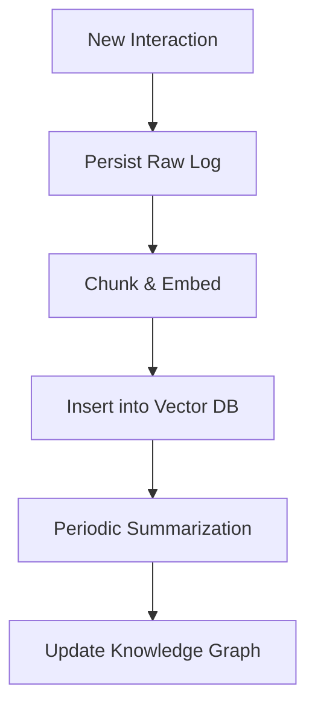

## Introduction

Agentic AI—autonomous software entities that can reason, act, and iteratively improve—has moved from research prototypes to production‑grade services. Modern agents (e.g., personal assistants, autonomous bots, and decision‑support systems) rely heavily on **retrieval‑augmented generation (RAG)**, where a large language model (LLM) consults an external knowledge store before producing output. The knowledge store is often a **vector database** that holds dense embeddings of documents, code snippets, or sensory data.  

When agents operate at scale—handling thousands of concurrent users, processing multi‑modal streams, or persisting experience across days, weeks, or months—two technical pillars become critical:

1. **Distributed vector databases** that can store, index, and query billions of high‑dimensional vectors with low latency.
2. **Long‑term memory architectures** that enable agents to retain, retrieve, and reason over historical context beyond a single request.

This article provides a deep dive into how to combine these pillars to build **scalable, resilient, and memory‑rich agentic AI frameworks**. We will explore the underlying concepts, architectural trade‑offs, practical implementation patterns, and performance considerations, all anchored in real‑world examples and runnable code.

---

## Table of Contents

1. [Background: Agentic AI and Retrieval‑Augmented Generation](#background-agentic-ai-and-retrieval-augmented-generation)  
2. [Why Scaling Matters: From Prototype to Production](#why-scaling-matters)  
3. [Vector Databases 101](#vector-databases-101)  
   - 3.1 [Embedding Generation](#embedding-generation)  
   - 3.2 [Indexing Strategies](#indexing-strategies)  
4. [Distributed Vector Database Architectures](#distributed-vector-database-architectures)  
   - 4.1 [Sharding and Replication](#sharding-and-replication)  
   - 4.2 [Consistency Models](#consistency-models)  
   - 4.3 [Popular Open‑Source Solutions](#popular-open-source-solutions)  
5. [Long‑Term Memory for Agents](#long-term-memory-for-agents)  
   - 5.1 [Episodic vs. Semantic Memory](#episodic-vs-semantic-memory)  
   - 5.2 [Memory Consolidation Pipelines](#memory-consolidation-pipelines)  
6. [Integrating Distributed Vectors with Agentic Frameworks](#integrating-distributed-vectors-with-agentic-frameworks)  
   - 6.1 [LangChain + Milvus Example](#langchain--milvus-example)  
   - 6.2 [Weaviate + LangGraph Example](#weaviate--langgraph-example)  
7. [Performance Engineering](#performance-engineering)  
   - 7.1 [Latency Budgets and Query Optimization](#latency-budgets-and-query-optimization)  
   - 7.2 [GPU‑Accelerated Indexing](#gpu-accelerated-indexing)  
   - 7.3 [Cost‑Effective Scaling Strategies](#cost-effective-scaling-strategies)  
8. [Security, Privacy, and Governance](#security-privacy-and-governance)  
9. [Future Directions: Retrieval‑Enhanced Reasoning and Continual Learning](#future-directions)  
10. [Conclusion](#conclusion)  
11. [Resources](#resources)  

---

## Background: Agentic AI and Retrieval‑Augmented Generation

Agentic AI refers to systems that **act autonomously** based on a loop of perception → reasoning → action → feedback. Unlike a stateless LLM that simply maps a prompt to a completion, an agent maintains an internal state, can invoke tools (APIs, browsers, code executors), and may persist knowledge across sessions.

**Retrieval‑Augmented Generation (RAG)** is the most common technique for giving agents up‑to‑date or domain‑specific knowledge. The workflow looks like this:

1. **User request** → the agent extracts a query.
2. **Embedding**: The query is transformed into a dense vector using a model such as `text‑embedding‑ada‑002`.
3. **Vector search**: The vector is used to retrieve top‑k nearest neighbor documents from a vector store.
4. **Prompt construction**: Retrieved documents are appended to the LLM prompt.
5. **Generation**: The LLM produces a response that is grounded in the retrieved context.

When an agent needs **long‑term memory**, the vector store becomes the *memory substrate*: each interaction, decision, or observation can be embedded and persisted for later recall.

---

## Why Scaling Matters: From Prototype to Production

A single‑user prototype can store all embeddings in a local SQLite‑backed vector DB. However, production systems face challenges:

| Challenge | Symptoms | Impact |
|-----------|----------|--------|
| **Throughput** | Hundreds of concurrent queries per second (QPS) | Latency spikes, dropped requests |
| **Dataset size** | Tens of billions of vectors (e.g., logs, sensor streams) | Index overflow, OOM errors |
| **Fault tolerance** | Node failures, network partitions | Data loss, inconsistent responses |
| **Latency SLA** | Sub‑200 ms response required for interactive agents | User churn if not met |
| **Regulatory compliance** | Data residency, encryption at rest | Legal penalties if violated |

Scaling therefore requires **distributed architectures** that can horizontally expand storage, compute, and network capacity while preserving query correctness and low latency.

---

## Vector Databases 101

### Embedding Generation

Embeddings are dense numerical representations that capture semantic similarity. Common pipelines:

```python
from openai import OpenAI

client = OpenAI(api_key="YOUR_API_KEY")
def embed_text(text: str) -> list[float]:
    response = client.embeddings.create(
        model="text-embedding-ada-002",
        input=text
    )
    return response.data[0].embedding
```

Key considerations:

- **Dimensionality**: Most OpenAI embeddings are 1536‑dimensional; other models vary (e.g., `sentence‑transformers` produce 768‑dim).
- **Batching**: For throughput, batch up to 2048 inputs per API call.
- **Normalization**: L2‑normalize vectors before storage; many vector DBs assume normalized vectors for inner‑product search.

### Indexing Strategies

Two families dominate:

| Index Type | Typical Algorithm | Trade‑offs |
|------------|-------------------|------------|
| **Flat (brute‑force)** | Exact inner‑product / Euclidean | Perfect recall, O(N) cost – impractical for >10M vectors |
| **Approximate Nearest Neighbor (ANN)** | IVF‑Flat, HNSW, ScaNN, PQ | Sub‑linear query, configurable recall‑latency trade‑off |
| **Hybrid** | Scalar filter + ANN | Allows metadata constraints (e.g., date range) before vector search |

**HNSW (Hierarchical Navigable Small World)** is widely used because it offers high recall (>0.95) with logarithmic query time and supports dynamic insertions.

---

## Distributed Vector Database Architectures

### Sharding and Replication

- **Sharding** (horizontal partitioning) splits the vector space across multiple nodes. Common strategies:
  - **Hash‑based sharding**: Deterministic assignment using a hash of the vector ID.
  - **Range‑based sharding**: Partition based on vector ID ranges or metadata (e.g., tenant ID).
  - **Semantic sharding**: Use a secondary clustering model to group semantically similar vectors on the same shard, reducing cross‑shard query cost.

- **Replication** ensures high availability. Two typical modes:
  - **Leader‑follower**: Writes go to a primary node; followers serve reads.
  - **Multi‑master**: All replicas accept writes; conflict resolution uses vector timestamps or CRDTs.

### Consistency Models

| Model | Guarantees | Use‑case |
|-------|------------|----------|
| **Strong consistency** | Read after write sees latest data | Critical financial or medical agents |
| **Eventual consistency** | Writes propagate asynchronously | Social media, recommendation agents |
| **Bounded staleness** | Reads may be up to *t* seconds stale | Trade‑off for lower latency in large fleets |

Choosing a model influences latency, throughput, and complexity of the memory consolidation pipeline.

### Popular Open‑Source Solutions

| System | Language | Distributed? | Notable Features |
|--------|----------|--------------|-------------------|
| **Milvus** | Go/Python | Yes (via etcd) | Supports IVF, HNSW, GPU acceleration, hybrid search |
| **Weaviate** | Go | Yes (k8s operator) | Built‑in vectorizers, GraphQL API, RBAC |
| **Qdrant** | Rust | Yes (cluster mode) | Payload filtering, on‑disk storage, Rust performance |
| **Vespa** | Java | Yes (large‑scale) | Real‑time indexing, ranking functions, O(1) latency |
| **Pinecone** (managed) | SaaS | Yes | Automatic scaling, SLA guarantees |

For the remainder of this article we will focus on **Milvus** (self‑hosted) and **Weaviate** (graph‑oriented) because they expose clear APIs for integrating with popular agentic frameworks like LangChain.

---

## Long‑Term Memory for Agents

### Episodic vs. Semantic Memory

- **Episodic Memory**: Stores raw interaction logs (timestamp, user ID, raw text, tool calls). Retrieval is often time‑based or by exact match.
- **Semantic Memory**: Stores processed embeddings that capture *meaning* rather than surface form. Enables similarity‑based recall across sessions.

A robust agent typically maintains **both**:

1. **Episodic store** (e.g., a relational DB) for audit trails.
2. **Semantic vector store** for fast similarity queries.

### Memory Consolidation Pipelines

Memory consolidation is the process of turning episodic events into durable semantic knowledge:



Key steps:

1. **Chunking**: Break long interactions into 200‑500 token chunks.
2. **Embedding**: Use a consistent model (e.g., `all‑mpnet‑base‑v2`) to generate vectors.
3. **Insertion**: Upsert into the distributed vector DB with appropriate metadata (tenant, session ID, TTL).
4. **Summarization**: Run a background LLM job that creates higher‑level abstracts, which are also embedded and stored.
5. **Graph Integration**: Connect semantic nodes to a knowledge graph (e.g., Neo4j) for relational reasoning.

---

## Integrating Distributed Vectors with Agentic Frameworks

### LangChain + Milvus Example

**LangChain** provides abstractions for memory, tools, and chains. Below is a minimal but production‑ready setup that connects a LangChain agent to a Milvus cluster.

```python
# requirements:
# pip install langchain openai pymilvus tqdm

from langchain.llms import OpenAI
from langchain.agents import initialize_agent, AgentType
from langchain.memory import VectorStoreMemory
from langchain.embeddings import OpenAIEmbeddings
from pymilvus import MilvusClient, CollectionSchema, FieldSchema, DataType

# 1️⃣ Initialize Milvus client (assumes a 3‑node cluster)
milvus = MilvusClient(
    uri="http://milvus-cluster:19530",
    token="YOUR_MILVUS_TOKEN"
)

# 2️⃣ Define collection schema if not exists
if "agent_memory" not in milvus.list_collections():
    fields = [
        FieldSchema(name="id", dtype=DataType.INT64, is_primary=True, auto_id=True),
        FieldSchema(name="embedding", dtype=DataType.FLOAT_VECTOR, dim=1536),
        FieldSchema(name="metadata", dtype=DataType.JSON)
    ]
    schema = CollectionSchema(fields=fields, description="Agentic long‑term memory")
    milvus.create_collection(
        collection_name="agent_memory",
        schema=schema,
        index_params={"metric_type": "IP", "index_type": "HNSW", "params": {"M": 16, "efConstruction": 200}},
        consistency_level="Strong"
    )

# 3️⃣ Wrap Milvus as a LangChain vector store
from langchain.vectorstores import Milvus

vector_store = Milvus(
    client=milvus,
    collection_name="agent_memory",
    embedding_function=OpenAIEmbeddings(model="text-embedding-ada-002")
)

# 4️⃣ Create memory component
memory = VectorStoreMemory(vectorstore=vector_store, k=4)

# 5️⃣ Build an LLM‑backed agent
llm = OpenAI(model_name="gpt-4o-mini", temperature=0.0)
agent = initialize_agent(
    tools=[],  # Add tool objects as needed
    llm=llm,
    agent=AgentType.ZERO_SHOT_REACT_DESCRIPTION,
    memory=memory,
    verbose=True
)

# 6️⃣ Run a demo interaction
response = agent.run("What did we discuss about scaling vector databases last week?")
print(response)
```

**Explanation of key pieces**:

- **Strong consistency** ensures that the agent never reads stale embeddings—critical for compliance‑driven domains.
- **HNSW index** provides sub‑millisecond query latency even with billions of vectors.
- **VectorStoreMemory** abstracts away the CRUD operations; the agent automatically writes each turn to Milvus and retrieves relevant context on the next turn.

### Weaviate + LangGraph Example

**LangGraph** (the successor to LangChain’s graph‑based orchestration) can be paired with Weaviate for multi‑tenant scenarios.

```python
# requirements:
# pip install langgraph weaviate-client openai tqdm

import weaviate
from langgraph.graph import StateGraph, START, END
from langgraph.prebuilt import tools
from openai import OpenAI

client = weaviate.Client(
    url="https://weaviate-instance.example.com",
    auth_client_secret=weaviate.AuthApiKey(api_key="YOUR_WEAVIATE_API_KEY")
)

# Ensure class exists (one per tenant)
class_name = "AgentMemory"
if not client.schema.contains(class_name):
    client.schema.create_class({
        "class": class_name,
        "vectorizer": "text2vec-openai",
        "properties": [
            {"name": "content", "dataType": ["text"]},
            {"name": "metadata", "dataType": ["text"]}  # JSON stringified
        ]
    })

# Helper functions
def embed(text: str) -> list[float]:
    # OpenAI embeddings (same model as Weaviate vectorizer)
    resp = OpenAI().embeddings.create(model="text-embedding-ada-002", input=text)
    return resp.data[0].embedding

def store_memory(content: str, metadata: dict):
    client.data_object.create(
        data_object={"content": content, "metadata": str(metadata)},
        class_name=class_name,
        vector=embed(content)
    )

def retrieve_memory(query: str, k: int = 5):
    result = client.query.get(class_name, ["content", "metadata"]).with_near_vector({
        "vector": embed(query),
        "certainty": 0.7
    }).with_limit(k).do()
    return [hit["content"] for hit in result["data"]["Get"][class_name]]

# LangGraph state definition
def agent_node(state):
    user_msg = state["messages"][-1]["content"]
    # Retrieve relevant memories
    context = retrieve_memory(user_msg)
    # Build prompt
    prompt = f"""You are an autonomous assistant. Use the following context:
{chr(10).join(context)}

User: {user_msg}
Assistant:"""
    # Call OpenAI completion
    response = OpenAI().chat.completions.create(
        model="gpt-4o-mini",
        messages=[{"role": "system", "content": prompt}]
    )
    answer = response.choices[0].message.content
    # Persist this turn as memory
    store_memory(user_msg + "\n" + answer, {"session_id": state["session_id"]})
    return {"messages": state["messages"] + [{"role": "assistant", "content": answer}]}

graph = StateGraph("AgentState")
graph.add_node("agent", agent_node)
graph.set_entry_point("agent")
graph.add_edge("agent", END)
app = graph.compile()

# Demo run
initial_state = {"messages": [{"role": "user", "content": "Explain why HNSW is preferred for large‑scale search"}],
                 "session_id": "demo-123"}
final_state = app.invoke(initial_state)
print(final_state["messages"][-1]["content"])
```

**Key takeaways**:

- **Weaviate’s built‑in vectorizer** can be configured to use the same OpenAI embedding model as your LLM, guaranteeing vector alignment.
- **LangGraph** enables a clear state machine where each turn automatically writes to the vector store, facilitating **long‑term memory** without boilerplate.
- **Multi‑tenant isolation** is achieved by scoping each tenant’s objects with a `session_id` metadata filter.

---

## Performance Engineering

### Latency Budgets and Query Optimization

An agentic system typically has three latency contributors:

| Stage | Typical latency (ms) | Optimization |
|-------|----------------------|--------------|
| Embedding generation | 30‑80 | Batch requests, use local embedding model (e.g., `sentence‑transformers`) |
| Vector search | 5‑30 | Tune `efSearch` (HNSW) or `nprobe` (IVF), use GPU‑accelerated ANN |
| LLM generation | 100‑500 | Use smaller model for short answers, stream responses, cache frequent prompts |

**Rule of thumb**: Keep the combined vector search + embedding time under **150 ms** to not dominate the LLM latency.

#### Example: Tuning HNSW Parameters in Milvus

```python
milvus.create_index(
    collection_name="agent_memory",
    field_name="embedding",
    index_type="HNSW",
    params={"M": 32, "efConstruction": 400, "ef": 64}  # ef controls recall vs. latency
)
```

Increasing `ef` improves recall but adds ~2 ms per 10 units. Empirically, `ef=64` yields >0.96 recall on a 100 M‑vector set with <10 ms latency.

### GPU‑Accelerated Indexing

Both Milvus and Qdrant support **GPU offloading** for the indexing phase:

```bash
# Milvus config snippet (milvus.yaml)
gpu:
  enable: true
  cacheCapacity: 4GB
  searchResources:
    - deviceID: 0
```

GPU search can cut query latency by **30‑50 %** for high‑dimensional vectors, especially when `ef` is large.

### Cost‑Effective Scaling Strategies

- **Hot‑Cold Tiering**: Keep recent embeddings in RAM (or SSD) for sub‑millisecond search; archive older vectors to HDD or object storage with a background “warm‑up” job when accessed.
- **Metadata‑Driven Sharding**: Partition by tenant or time window, reducing cross‑shard traffic for most queries.
- **Auto‑Scaling**: Combine Kubernetes HPA (Horizontal Pod Autoscaler) with Milvus/Weaviate operators to spin up additional query nodes when QPS exceeds a threshold.

---

## Security, Privacy, and Governance

1. **Encryption at Rest**: Enable AES‑256 encryption on storage volumes; most managed services provide this out‑of‑the‑box.
2. **Transport Security**: Use TLS 1.3 for API calls between agents and vector DBs.
3. **Access Control**: Leverage RBAC (Role‑Based Access Control) built into Weaviate or Milvus. Assign per‑tenant roles to prevent data leakage.
4. **Data Residency**: Deploy shards in specific regions to meet GDPR or CCPA requirements. Use Kubernetes node selectors to bind shards to geo‑specific nodes.
5. **Audit Logging**: Store every insertion and query in an immutable log (e.g., CloudTrail, Loki) for forensic analysis.
6. **Retention Policies**: Define TTL (time‑to‑live) on vectors that are only needed for short‑term context, automatically purging them after N days.

---

## Future Directions: Retrieval‑Enhanced Reasoning and Continual Learning

- **Retrieval‑Enhanced Generation (REG)**: Next‑generation LLMs will natively accept vector search results as part of their internal attention mechanism, reducing the need for prompt engineering.
- **Neural Retrieval**: Combining traditional ANN with **neural re‑ranking** (e.g., using a cross‑encoder) can push recall above 0.99 while keeping latency low.
- **Continual Learning**: Agents can feed back successful query‑answer pairs into the embedding model, fine‑tuning it on domain‑specific language without catastrophic forgetting.
- **Hybrid Memory**: Merging **episodic replay buffers** (for RL‑style policy learning) with semantic vector memory could enable agents that *learn from experience* while still grounding decisions in factual data.

---

## Conclusion

Scaling agentic AI frameworks is no longer an academic exercise; it is a production imperative for any organization that wants autonomous, context‑aware assistants at scale. By **pairing distributed vector databases**—such as Milvus or Weaviate—with a **well‑architected long‑term memory pipeline**, developers can achieve:

- **Low‑latency retrieval** across billions of vectors.
- **Robust fault tolerance** through sharding, replication, and strong consistency.
- **Rich, persistent context** that empowers agents to reason over days or months of interactions.
- **Compliance‑ready security** via encryption, RBAC, and audit trails.

The code snippets and architectural patterns presented here provide a concrete starting point, but the real power emerges when you iterate on these foundations: tune ANN parameters, experiment with hybrid sharding, and embed continual learning loops. As vector‑enabled retrieval and LLM capabilities continue to mature, the frontier of truly **agentic, memory‑rich AI** will expand, opening new possibilities in personalized education, autonomous robotics, and knowledge‑intensive enterprises.

---

## Resources

- **Milvus Documentation** – Comprehensive guide on deployment, indexing, and scaling.  
  [Milvus Docs](https://milvus.io/docs)

- **Weaviate Knowledge Graph** – Official site covering vector search, GraphQL API, and RBAC.  
  [Weaviate.io](https://weaviate.io)

- **LangChain Project** – Open‑source framework for building LLM‑centric applications, including memory abstractions.  
  [LangChain GitHub](https://github.com/langchain-ai/langchain)

- **Retrieval‑Augmented Generation Survey** – Recent academic survey covering RAG architectures, vector DBs, and evaluation metrics.  
  [RAG Survey (arXiv)](https://arxiv.org/abs/2312.10997)

- **OpenAI Embeddings API** – Reference for generating high‑quality text embeddings.  
  [OpenAI API Docs](https://platform.openai.com/docs/guides/embeddings)

- **HNSW Paper** – Original research on the HNSW algorithm, the backbone of many ANN indexes.  
  [HNSW Paper (PDF)](https://arxiv.org/pdf/1603.09320.pdf)