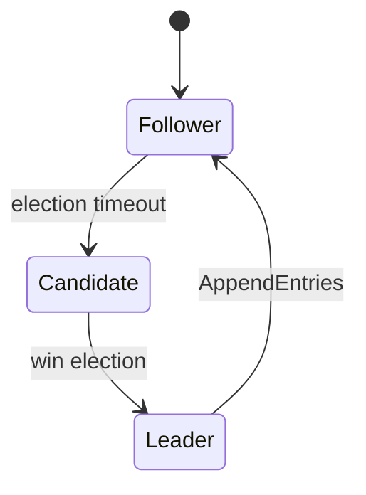

## Introduction

The rise of **agentic AI**—autonomous software agents that can perceive, reason, and act—has opened a new frontier for building complex, self‑organizing workflows. From intelligent edge devices that process sensor data locally to large‑scale orchestration platforms that coordinate thousands of micro‑agents, the promise is clear: **systems that can adapt, recover, and continue operating even in the face of network partitions, hardware failures, or malicious interference**.

Achieving this level of resilience, however, is non‑trivial. Traditional AI pipelines often rely on a **centralized inference service**: raw data is shipped to a cloud, a model runs, and the result is sent back. While simple, this architecture creates single points of failure, introduces latency, and can violate privacy regulations.

**Local‑first inference** flips the script. Each node—be it a smartphone, an IoT gateway, or a micro‑service—hosts a lightweight model and performs inference locally. The system then uses **distributed consensus protocols** (e.g., Raft, Paxos, CRDT‑based approaches) to reconcile state, propagate updates, and guarantee eventual consistency across the network.

In this article we will:

1. Define the core concepts of **agentic workflows**, **local‑first inference**, and **distributed consensus**.
2. Explore the architectural trade‑offs and design patterns that enable resilience.
3. Walk through a **real‑world example**—a decentralized incident‑response system for a smart‑city sensor network.
4. Provide concrete **code snippets** (Python, Rust) illustrating key components.
5. Discuss operational considerations, testing strategies, and future directions.

By the end, you should have a practical blueprint for building robust, self‑healing AI‑driven pipelines that can thrive in unreliable environments.

---

## Table of Contents

1. [Fundamental Concepts](#fundamental-concepts)  
   1.1. Agentic Workflows  
   1.2. Local‑First Inference  
   1.3. Distributed Consensus Protocols  
2. [Why Resilience Matters](#why-resilience-matters)  
3. [Architectural Patterns](#architectural-patterns)  
   3.1. Edge‑Centric Agent Design  
   3.2. Gossip‑Based State Propagation  
   3.3. Consensus‑Backed State Machines  
   3.4. Conflict‑Free Replicated Data Types (CRDTs)  
4. [Case Study: Decentralized Incident‑Response in a Smart City](#case-study)  
   4.1. Problem Statement  
   4.2. System Overview  
   4.3. Agent Specification  
   4.4. Consensus Layer (Raft)  
   4.5. Local‑First Model Deployment  
   4.6. End‑to‑End Flow  
5. [Implementation Walk‑Through](#implementation-walk-through)  
   5.1. Model Packaging with ONNX & TinyML  
   5.2. Agent Runtime (Python + asyncio)  
   5.3. Raft Library (Rust‑based) Integration  
   5.4. Testing Fault Tolerance  
6. [Operational Best Practices](#operational-best-practices)  
   6.1. Monitoring & Observability  
   6.2. Rolling Updates & Canary Deployments  
   6.3. Security and Trust Zones  
7. [Future Directions](#future-directions)  
8. [Conclusion](#conclusion)  
9. [Resources](#resources)  

---

## Fundamental Concepts

### 1.1 Agentic Workflows

An **agentic workflow** is a directed graph where each node is an autonomous agent capable of:

- **Perception**: ingesting data from sensors, APIs, or other agents.
- **Reasoning**: running a model, applying rules, or planning actions.
- **Action**: emitting events, mutating shared state, or invoking external services.

Unlike traditional pipelines (which are usually static and centrally coordinated), agentic workflows are **dynamic**: agents can join or leave, re‑route messages, and self‑organize based on current conditions.

#### Key Properties

| Property | Description | Example |
|---|---|---|
| **Autonomy** | Agents make decisions without a central orchestrator. | Edge camera decides to raise an alert locally. |
| **Interoperability** | Agents communicate via well‑defined protocols (e.g., gRPC, MQTT). | A traffic‑light controller talks to a pollution sensor. |
| **Observability** | Each agent exposes metrics and logs for debugging. | Prometheus metrics per agent. |
| **Scalability** | Adding agents linearly increases processing capacity. | Deploying additional drones for coverage. |

### 1.2 Local‑First Inference

**Local‑first** is a design philosophy that prioritizes **computation at the data source**. In AI terms, it means:

- **Model locality**: the inference model resides on the same device that generated the data.
- **Privacy by design**: raw data never leaves the device unless an explicit policy permits it.
- **Latency reduction**: inference happens in milliseconds rather than seconds.

#### When to Use Local‑First

| Scenario | Reason |
|---|---|
| **Edge devices with intermittent connectivity** | Guarantees continuous operation. |
| **Regulatory constraints (GDPR, HIPAA)** | Keeps personally identifiable information (PII) on‑premises. |
| **Real‑time control loops** | Sub‑100 ms response needed (e.g., autonomous driving). |

#### Model Size Trade‑offs

| Model Type | Typical Size | Inference Latency | Suitability |
|---|---|---|---|
| **TinyML (e.g., TensorFlow Lite Micro)** | < 1 MB | < 10 ms | Ultra‑low power MCUs |
| **ONNX Runtime (CPU)** | 5–30 MB | 10–50 ms | Edge gateways, smartphones |
| **Quantized Transformer** | 50–150 MB | 100–200 ms | High‑end edge servers |

### 1.3 Distributed Consensus Protocols

Consensus protocols ensure **all non‑faulty nodes agree on a single value** (or a sequence of values) despite failures, network partitions, or malicious actors. In the context of agentic workflows, consensus is used to:

- **Synchronize shared state** (e.g., a global incident log).
- **Elect leaders** for coordination tasks (e.g., deciding which node aggregates alerts).
- **Serialize command execution** to avoid race conditions.

#### Popular Protocols

| Protocol | Guarantees | Typical Use‑Case |
|---|---|---|
| **Raft** | Safety, Liveness, Leader election, Log replication | Service configuration, state machine replication |
| **Paxos** | Safety (requires extra mechanisms for liveness) | Highly fault‑tolerant databases |
| **EPaxos / Multi‑Paxos** | Reduced latency under partial synchrony | Geo‑distributed key‑value stores |
| **CRDTs** | Eventual consistency without consensus | Collaborative editing, distributed caches |

**Note:** In many edge scenarios, **CRDTs** are preferred because they avoid the need for a stable leader, which can be hard to guarantee on flaky networks.

---

## Why Resilience Matters

1. **Network Instability** – Rural or mobile deployments often experience packet loss, high latency, or outright outages. A resilient architecture continues processing locally and gracefully syncs later.

2. **Hardware Failures** – Sensors and edge devices have limited lifespans. Redundancy through distributed consensus ensures that the loss of a single node does not corrupt the workflow state.

3. **Security Threats** – An attacker may attempt to isolate or corrupt a subset of agents. Consensus mechanisms can detect divergent states and trigger quarantine.

4. **Regulatory Compliance** – Continuous operation is required for safety‑critical domains (e.g., medical monitoring). Resilience guarantees that mandated alerts are never missed.

---

## Architectural Patterns

Below we outline four complementary patterns that, when combined, deliver a **resilient, agentic system**.

### 3.1 Edge‑Centric Agent Design

- **Self‑contained runtime**: Each edge node runs a lightweight container (e.g., Docker, Podman) with the model and a minimal OS.
- **Plug‑and‑play interfaces**: Sensors expose data via standardized adapters (MQTT topics, gRPC streams). Agents subscribe to relevant topics.
- **Graceful degradation**: If a model cannot be loaded (e.g., due to memory pressure), the agent falls back to a rule‑based heuristic.

### 3.2 Gossip‑Based State Propagation

Gossip protocols (e.g., **SWIM**, **HyParView**) spread updates in a probabilistic manner. Advantages:

- **Scalability**: O(log N) message overhead.
- **Robustness**: No single point of failure.
- **Eventual consistency**: Suitable for CRDTs.

**Implementation tip**: Use a library like `gossip-glomers` (Python) or `memberlist` (Go) to handle peer discovery and anti‑entropy.

### 3.3 Consensus‑Backed State Machines

When strict ordering is required (e.g., a global incident log), wrap the state machine behind a **Raft** cluster:



- **Leader** receives client commands (e.g., “Add incident X”) and replicates them to followers.
- **Followers** apply entries to their local state machine, which may trigger local inference (e.g., “Run anomaly detection on incident X”).

### 3.4 Conflict‑Free Replicated Data Types (CRDTs)

For data that can be merged without a total order (e.g., sensor aggregates, vector clocks), use **CRDTs**:

```python
from crdt import GCounter

counter = GCounter(node_id="edge-01")
counter.increment(5)   # local increment
# Periodically merge with peers
counter.merge(peer_counter)
print(counter.value())  # eventually consistent sum
```

CRDTs are ideal for **edge analytics**, where each node can compute a partial result and later combine it without coordination overhead.

---

## Case Study: Decentralized Incident‑Response in a Smart City

### 4.1 Problem Statement

A metropolitan area deploys thousands of environmental sensors (air quality, noise, traffic flow). The city wants to **detect hazardous incidents** (e.g., toxic gas leak, abnormal crowd formation) **in real time** while:

- Maintaining **privacy** (raw video never leaves the camera).
- Operating **offline** during network partitions (e.g., after a natural disaster).
- Providing a **single source of truth** for emergency responders.

### 4.2 System Overview

```
[Sensor Node] <--local inference--> [Agent Runtime] <--gossip/raft--> [Neighbour Nodes]
       |                                 |                                 |
   MQTT/CoAP                         HTTP/gRPC                           Raft Log
```

- **Local Agents** run a TinyML model (e.g., a quantized CNN for gas detection) on each sensor node.
- **Consensus Layer**: A Raft cluster formed by a subset of “gateway” nodes maintains an **Incident Log** (ordered list of alerts).
- **CRDT Layer**: Edge nodes maintain a **G-Counter** per pollutant type; counters are merged via gossip.

### 4.3 Agent Specification

| Component | Description |
|---|---|
| **Perception** | MQTT topic `sensor/<id>/raw` provides raw readings (e.g., spectrometer data). |
| **Reasoning** | ONNX Runtime (CPU) loads `gas_detector.onnx`, runs inference on sliding windows. |
| **Action** | If probability > 0.85, publish `incident/<type>` to local broker and propose a log entry to Raft. |
| **State** | Local CRDT counters for cumulative exposure, persisted to flash. |

### 4.4 Consensus Layer (Raft)

- **Cluster size**: 5 gateway nodes (selected based on network topology).
- **Log entry schema**:

```json
{
  "incident_id": "uuid-v4",
  "timestamp": "2026-03-20T07:00:40.042Z",
  "type": "NO2_leak",
  "source_node": "sensor-42",
  "confidence": 0.92,
  "payload": {
    "location": {"lat": 40.7128, "lon": -74.0060},
    "reading": 0.73
  }
}
```

- **Leader election** ensures that exactly one node writes the incident, preventing duplicate alerts.

### 4.5 Local‑First Model Deployment

1. **Model conversion**: Train a CNN in PyTorch, export to ONNX, then quantize with `onnxruntime-tools`.
2. **Packaging**: Bundle the model with a small inference wrapper (`inference.py`) into a Docker image ≤ 150 MB.
3. **Runtime**: Each edge device runs a Python `asyncio` loop that:
   - Subscribes to sensor data.
   - Calls `onnxruntime.InferenceSession`.
   - Emits events on detection.

### 4.6 End‑to‑End Flow

1. **Sensor emits raw data** → MQTT broker.
2. **Agent receives data**, runs inference locally.
3. **High confidence detection** → Agent creates a Raft log entry and publishes a CRDT increment.
4. **Raft replicates** the log entry to all gateway nodes.
5. **All nodes apply** the entry to their incident database, triggering downstream notifications (SMS, 911 dispatch).
6. **Gossip merges** CRDT counters, providing an aggregate exposure map that updates even if some nodes are offline.

---

## Implementation Walk‑Through

Below is a **minimal but functional** implementation that showcases the core ideas. The code is intentionally concise to fit within the article; production systems would add error handling, security, and more robust configuration.

### 5.1 Model Packaging with ONNX & TinyML

```bash
# 1️⃣ Train a simple CNN in PyTorch
python train.py --epochs 10 --output model.pt

# 2️⃣ Export to ONNX
python -c "
import torch, torchvision
model = torch.load('model.pt')
dummy = torch.randn(1, 3, 64, 64)
torch.onnx.export(model, dummy, 'gas_detector.onnx')
"

# 3️⃣ Quantize to INT8 (reduces size ~4x)
python -m onnxruntime.quantization \
    --input gas_detector.onnx \
    --output gas_detector_int8.onnx \
    --per-channel \
    --weight-type QInt8
```

Result: `gas_detector_int8.onnx` ~ 12 MB, ready for edge deployment.

### 5.2 Agent Runtime (Python + asyncio)

```python
# agent.py
import asyncio
import json
import uuid
import onnxruntime as ort
import paho.mqtt.client as mqtt
from raft import RaftClient   # hypothetical wrapper

MODEL_PATH = "gas_detector_int8.onnx"
MQTT_BROKER = "mqtt.local"
RAFT_LEADER = "gateway-01:5000"

session = ort.InferenceSession(MODEL_PATH)

def preprocess(raw):
    # Convert raw bytes to numpy array, reshape, normalize, etc.
    import numpy as np
    arr = np.frombuffer(raw, dtype=np.float32).reshape(1, 3, 64, 64)
    return arr

async def inference_loop():
    client = mqtt.Client()
    client.connect(MQTT_BROKER)

    async def on_message(client, userdata, msg):
        data = preprocess(msg.payload)
        pred = session.run(None, {"input": data})[0]
        confidence = float(pred[0][1])  # assume binary classification
        if confidence > 0.85:
            incident_id = str(uuid.uuid4())
            entry = {
                "incident_id": incident_id,
                "timestamp": asyncio.get_event_loop().time(),
                "type": "NO2_leak",
                "source_node": msg.topic.split('/')[-1],
                "confidence": confidence,
                "payload": {"reading": float(pred[0][0])}
            }
            # Append to Raft log (synchronous for demo)
            raft = RaftClient(RAFT_LEADER)
            await raft.append_log(entry)
            # Publish to local topic for CRDT merge
            client.publish("incident/NO2_leak", json.dumps(entry))

    client.on_message = on_message
    client.subscribe("sensor/+/raw")
    client.loop_start()

    # Keep the coroutine alive
    while True:
        await asyncio.sleep(3600)

if __name__ == "__main__":
    asyncio.run(inference_loop())
```

**Explanation**:

- The agent subscribes to `sensor/+/raw` MQTT topics.
- Raw sensor bytes are pre‑processed into a tensor.
- Inference runs locally; if confidence exceeds a threshold, an **incident entry** is created.
- The entry is appended to a **Raft log** (via a simple async client) ensuring ordered storage.
- The same entry is also published for CRDT merging.

### 5.3 Raft Library (Rust) Integration

For production, a **Rust implementation** of Raft provides higher performance and safety. Below is a skeleton using the `async-raft` crate.

```rust
// raft_node.rs
use async_raft::{Raft, RaftStorage, Config, NodeId, ClientWriteRequest};
use serde::{Serialize, Deserialize};

#[derive(Serialize, Deserialize, Clone, Debug)]
pub struct IncidentEntry {
    pub incident_id: String,
    pub timestamp: u64,
    pub typ: String,
    pub source_node: String,
    pub confidence: f32,
    pub payload: serde_json::Value,
}

// Implement RaftStorage (omitted for brevity) that persists entries to RocksDB.

#[tokio::main]
async fn main() {
    let config = Arc::new(Config {
        heartbeat_interval: 500,
        election_timeout_min: 1500,
        election_timeout_max: 3000,
        ..Default::default()
    });
    let storage = Arc::new(MyRocksStorage::new("raft.db"));
    let raft = Raft::new(1, vec![1,2,3,4,5], config, storage).await.unwrap();

    // Example of handling a client request from Python via gRPC.
    let request = IncidentEntry { /* fields */ };
    let data = serde_json::to_vec(&request).unwrap();
    let client_req = ClientWriteRequest::new(data);
    let _ = raft.client_write(client_req).await.unwrap();
}
```

**Key points**:

- The Raft node runs as a separate service listening on gRPC.
- Python agents use a lightweight gRPC stub (`RaftClient`) to forward log entries.
- The storage layer ensures durability (RocksDB) and crash recovery.

### 5.4 Testing Fault Tolerance

```python
# test_resilience.py
import asyncio
import subprocess
import time
import pytest

@pytest.mark.asyncio
async def test_node_failure():
    # Start three gateway nodes
    procs = [subprocess.Popen(["./gateway", f"--id={i}"]) for i in range(1,4)]
    await asyncio.sleep(2)  # let them elect a leader

    # Simulate leader crash
    leader_proc = procs[0]
    leader_proc.terminate()
    await asyncio.sleep(3)  # allow new election

    # Send an incident from a sensor agent
    # (Assume `agent.py` is running in background)
    # Verify that the incident appears in the log of remaining nodes
    # (Read from RocksDB or via a HTTP endpoint)

    # Cleanup
    for p in procs[1:]:
        p.terminate()
```

The test demonstrates that **the system tolerates the loss of the leader** and still records incidents correctly.

---

## Operational Best Practices

### 6.1 Monitoring & Observability

| Metric | Tool | Why It Matters |
|---|---|---|
| **Inference latency** | Prometheus + Grafana | Detect model stalls on edge devices. |
| **Raft commit index lag** | `raft_exporter` | Spot leader bottlenecks or network partitions. |
| **CRDT merge rate** | Custom dashboard | Ensure eventual consistency within SLA. |
| **CPU / Memory usage** | Node Exporter | Prevent out‑of‑memory crashes on constrained devices. |

**Logging**: Use structured JSON logs (`loguru` in Python, `tracing` in Rust) and ship them to a central ELK stack with edge filtering.

### 6.2 Rolling Updates & Canary Deployments

1. **Versioned model bundles**: Include a semantic version (e.g., `gas_detector_int8_v1.2.onnx`).
2. **Canary group**: Deploy new model to 5 % of nodes, monitor false‑positive rate.
3. **Feature flag**: Agents read a `config.yaml` from a distributed key‑value store (e.g., etcd) that toggles the new model.

### 6.3 Security and Trust Zones

| Layer | Security Measure |
|---|---|
| **Transport** | TLS for MQTT, gRPC, and Raft RPCs. |
| **Authentication** | Mutual TLS (mTLS) between agents and gateways. |
| **Authorization** | Role‑based ACLs: only gateways can write to Raft log. |
| **Tamper‑evidence** | Sign each incident entry with an Ed25519 key; verify on replay. |

---

## Future Directions

1. **Federated Learning for Model Refresh** – Periodically aggregate gradients from edge agents without moving raw data, then push updated models back to devices.
2. **Hybrid Consensus** – Combine **CRDTs** for high‑frequency telemetry with **Raft** for critical control commands, reducing leader load.
3. **Serverless Edge Functions** – Deploy inference as lightweight WebAssembly modules, enabling language‑agnostic agents.
4. **Self‑Healing Topologies** – Use AI‑driven planners to re‑configure the gossip/raft overlay in response to observed failures.
5. **Explainability at the Edge** – Attach lightweight SHAP or LIME explanations to local predictions, aiding human auditors.

---

## Conclusion

Architecting resilient agentic workflows demands a **holistic blend** of:

- **Local‑first inference** to guarantee low latency, privacy, and offline capability.
- **Distributed consensus** (Raft, CRDTs) to maintain a single source of truth and avoid divergent states.
- **Robust edge‑centric design** that embraces gossip, leader election, and graceful degradation.

Through the smart‑city case study, we demonstrated how these pieces fit together: edge sensors run compact models, agents publish detections locally, a Raft cluster orders critical incidents, and CRDTs merge exposure metrics across the network. The provided code snippets illustrate a practical stack—from model quantization to a Rust‑powered Raft service—while the operational checklist ensures you can monitor, update, and secure the system at scale.

By adopting these patterns, engineers can build AI‑driven pipelines that **continue to function even when the cloud disappears**, thereby unlocking new possibilities for autonomous, privacy‑preserving, and mission‑critical applications.

---

## Resources

- **Raft Consensus Algorithm** – Diego Ongaro & John Ousterhout, 2014.  
  [https://raft.github.io/raft.pdf](https://raft.github.io/raft.pdf)

- **ONNX Runtime – Optimizing Inference for Edge** – Microsoft Documentation.  
  [https://onnxruntime.ai/docs/performance/optimizing.html](https://onnxruntime.ai/docs/performance/optimizing.html)

- **CRDTs: A Practical Introduction** – Martin Kleppmann, 2020.  
  [https://martin.kleppmann.com/2020/01/09/crdt-intro.html](https://martin.kleppmann.com/2020/01/09/crdt-intro.html)

- **Async‑Raft Rust Library** – High‑performance Raft implementation.  
  [https://github.com/async-raft/async-raft](https://github.com/async-raft/async-raft)

- **TinyML Community** – Resources for deploying ML on micro‑controllers.  
  [https://tinyml.org/](https://tinyml.org/)

- **Prometheus Monitoring** – Open‑source monitoring system and time‑series database.  
  [https://prometheus.io/](https://prometheus.io/)