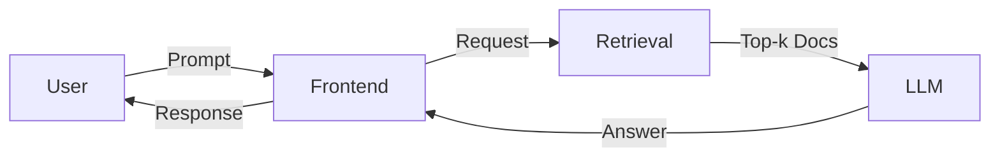
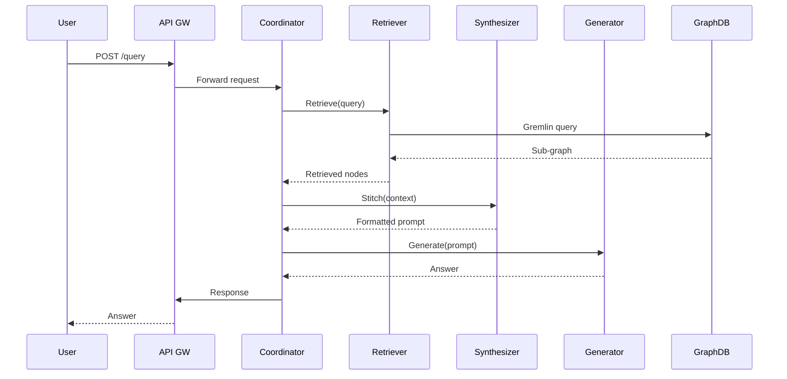

## Table of Contents
1. [Introduction](#introduction)  
2. [Background: Retrieval‑Augmented Generation (RAG) and Multi‑Agent Architectures](#background)  
   2.1. [What Is RAG?](#what-is-rag)  
   2.2. [Why Multi‑Agent?](#why-multi-agent)  
3. [Core Challenges in Scaling Multi‑Agent RAG](#challenges)  
   3.1. [Latency & Throughput](#latency-throughput)  
   3.2. [State Management & Knowledge Sharing](#state-management)  
   3.3. [Fault Tolerance & Elasticity](#fault-tolerance)  
4. [Why Kubernetes?](#why-kubernetes)  
   4.1. [Declarative Deployment](#declarative-deployment)  
   4.2. [Horizontal Pod Autoscaling (HPA)](#hpa)  
   4.3. [Service Mesh & Observability](#service-mesh)  
5. [Distributed Graph Databases: The Glue for Knowledge Graphs](#graph-db)  
   5.1. [Properties of Graph‑Native Stores](#graph-properties)  
   5.2. [Popular Choices (Neo4j, JanusGraph, Amazon Neptune)](#popular-choices)  
6. [Architectural Blueprint](#architecture)  
   6.1. [Component Overview](#component-overview)  
   6.2. [Data Flow Diagram](#data-flow)  
   6.3. [Kubernetes Manifests](#k8s-manifests)  
7. [Practical Implementation Walk‑through](#implementation)  
   7.1. [Setting Up the Graph Database Cluster](#setup-graph)  
   7.2. [Deploying the Agent Pool](#deploy-agents)  
   7.3. [Orchestrating Retrieval & Generation Pipelines](#pipeline)  
8. [Scaling Strategies](#scaling)  
   8.1. [Sharding the Knowledge Graph](#sharding)  
   8.2. [GPU‑Accelerated Generation Pods](#gpu-pods)  
   8.3. [Load‑Balancing Retrieval Requests](#load-balancing)  
9. [Observability, Logging, and Debugging](#observability)  
10. [Security Considerations](#security)  
11. [Real‑World Case Study: Customer‑Support Assistant at Scale](#case-study)  
12. [Best‑Practice Checklist](#checklist)  
13. [Conclusion](#conclusion)  
14. [Resources](#resources)  

---

## Introduction <a name="introduction"></a>

Retrieval‑augmented generation (RAG) has become the de‑facto pattern for building LLM‑powered applications that need up‑to‑date, domain‑specific knowledge. When a single LLM is tasked with answering thousands of queries per second, latency, cost, and knowledge consistency quickly become bottlenecks. A **multi‑agent RAG system**—where many specialized agents collaborate, each handling retrieval, reasoning, or generation—offers a path to both scalability and functional decomposition.

However, orchestrating dozens or hundreds of agents, each with its own state, caching layer, and access to a massive knowledge graph, is non‑trivial. This is where **Kubernetes** and **distributed graph databases** intersect: Kubernetes provides the elastic, declarative infrastructure to spin up and tear down agent pods, while a distributed graph store supplies a low‑latency, globally consistent knowledge base that all agents can query.

In this article we dive deep into the architectural patterns, concrete Kubernetes manifests, and practical code snippets needed to build a production‑grade, multi‑agent RAG platform. You’ll walk away with a reusable blueprint that you can adapt to any domain—customer support, legal research, scientific discovery, or internal enterprise knowledge bases.

---

## Background: Retrieval‑Augmented Generation (RAG) and Multi‑Agent Architectures <a name="background"></a>

### What Is RAG? <a name="what-is-rag"></a>

RAG combines two stages:

1. **Retrieval** – A vector store or knowledge graph is queried for the most relevant documents or graph sub‑structures.
2. **Generation** – The retrieved context is fed into a large language model (LLM) that produces a final answer.

The classic pipeline looks like this:



Key benefits:

* **Grounded answers** – The LLM can cite concrete sources.
* **Reduced hallucination** – Retrieval constrains the model’s generative space.
* **Domain adaptability** – Swap the vector store without retraining the model.

### Why Multi‑Agent? <a name="why-multi-agent"></a>

A single monolithic service that does retrieval and generation can become a performance hotspot. Multi‑agent designs split responsibilities:

| Agent Type | Core Responsibility | Typical Scaling Metric |
|------------|---------------------|------------------------|
| Retriever  | Vector/graph search | QPS per node |
| Synthesizer| Context stitching   | Tokens per second |
| Generator | LLM inference       | GPU utilization |
| Coordinator| Orchestration & routing | Requests per second |
| Cache/Store| Knowledge graph persistence | Data volume / latency |

Benefits include:

* **Horizontal scalability** – Each agent can be autoscaled independently.
* **Specialization** – Retrieval agents can be tuned for particular embeddings; generators can be swapped for newer LLMs.
* **Resilience** – Failure of one agent type does not bring the whole system down.

---

## Core Challenges in Scaling Multi‑Agent RAG <a name="challenges"></a>

### Latency & Throughput <a name="latency-throughput"></a>

* Retrieval from a massive graph can take milliseconds to seconds depending on query complexity.
* LLM inference, especially with large models (e.g., 70B parameters), may require GPUs and can dominate latency.

### State Management & Knowledge Sharing <a name="state-management"></a>

* Agents need a **consistent view** of the knowledge graph. Stale embeddings cause inaccurate retrieval.
* Real‑time updates (e.g., new product documentation) must propagate to all agents without downtime.

### Fault Tolerance & Elasticity <a name="fault-tolerance"></a>

* Sudden traffic spikes (e.g., a product launch) can overwhelm a single retrieval node.
* Pods may be evicted or restarted; the system must gracefully reroute requests.

---

## Why Kubernetes? <a name="why-kubernetes"></a>

Kubernetes (K8s) is the industry‑standard for container orchestration. Its primitives directly address the challenges listed above.

### Declarative Deployment <a name="declarative-deployment"></a>

All components—graph database, agent services, sidecars—are defined as YAML manifests. A single `kubectl apply` brings the entire stack to the desired state.

### Horizontal Pod Autoscaling (HPA) <a name="hpa"></a>

K8s can scale pods based on CPU, memory, or custom metrics (e.g., request latency). This means retrieval agents can automatically spin up when QPS rises, while generator pods scale with GPU utilization.

```yaml
apiVersion: autoscaling/v2
kind: HorizontalPodAutoscaler
metadata:
  name: retriever-hpa
spec:
  scaleTargetRef:
    apiVersion: apps/v1
    kind: Deployment
    name: retriever-deployment
  minReplicas: 2
  maxReplicas: 20
  metrics:
  - type: Resource
    resource:
      name: cpu
      target:
        type: Utilization
        averageUtilization: 70
```

### Service Mesh & Observability <a name="service-mesh"></a>

Istio or Linkerd inject sidecars that provide:

* **mTLS** for intra‑service encryption.
* **Distributed tracing** (Jaeger, Zipkin) to visualize request flow across agents.
* **Circuit breaking** to protect downstream services during overload.

---

## Distributed Graph Databases: The Glue for Knowledge Graphs <a name="graph-db"></a>

Graph databases excel at representing relationships—exactly what RAG needs for semantic retrieval.

### Properties of Graph‑Native Stores <a name="graph-properties"></a>

| Property | Why It Matters for RAG |
|----------|------------------------|
| **Low‑latency traversals** | Sub‑graph extraction for context stitching |
| **Horizontal sharding** | Scale to billions of nodes/edges |
| **ACID guarantees** | Consistent embeddings across updates |
| **Native vector indexes** | Combine semantic similarity with graph topology |

### Popular Choices (Neo4j, JanusGraph, Amazon Neptune) <a name="popular-choices"></a>

| DB | Open‑source? | Distributed? | Vector Index Support |
|----|--------------|--------------|----------------------|
| Neo4j Aura (cloud) | No (commercial) | Yes (cluster) | Built‑in ANN (beta) |
| JanusGraph + Cassandra | Yes | Yes | Plugins (e.g., HNSW) |
| Amazon Neptune | No (AWS service) | Yes | k‑NN with OpenSearch integration |

For a Kubernetes‑native deployment, **JanusGraph** on top of **Cassandra** or **ScyllaDB** is a common pattern because both are container‑friendly and support true horizontal scaling.

---

## Architectural Blueprint <a name="architecture"></a>

### Component Overview <a name="component-overview"></a>

```
+-------------------+        +-------------------+        +-------------------+
|  Frontend/API GW  | <----> |   Coordinator     | <----> |   Cache Service   |
+-------------------+        +-------------------+        +-------------------+
                                   |   ^   |
                 +-----------------+   |   +-----------------+
                 |                     |                     |
          +------+-----+        +------+-----+        +------+-----+
          | Retriever  |        | Synthesizer|        | Generator |
          +------------+        +------------+        +-----------+
                 |                     |                     |
          +------+-----+        +------+-----+        +------+-----+
          | Graph DB   |<------>| Vector Store|<------>| GPU Node   |
          +------------+        +------------+        +-----------+
```

* **Coordinator** – Stateless service written in Go or Python that routes queries to the appropriate agent pool.
* **Retriever** – Stateless pods that query the graph DB (via Gremlin/Neo4j Bolt) and return a sub‑graph or top‑k documents.
* **Synthesizer** – Service that merges retrieved chunks, deduplicates, and formats context for the generator.
* **Generator** – Pods with GPU resources running an LLM (e.g., Llama‑2‑70B) behind an inference server (vLLM, TensorRT‑LLM).
* **Cache Service** – Optional Redis or Memcached layer to store recent retrieval results.

### Data Flow Diagram <a name="data-flow"></a>



### Kubernetes Manifests <a name="k8s-manifests"></a>

Below is a **minimal** set of manifests to get the system running. Production deployments would add PodDisruptionBudgets, NetworkPolicies, and RBAC.

#### 1. Namespace & ConfigMap

```yaml
apiVersion: v1
kind: Namespace
metadata:
  name: rag-platform
---
apiVersion: v1
kind: ConfigMap
metadata:
  name: rag-config
  namespace: rag-platform
data:
  GRAPH_DB_HOST: "janusgraph-svc.rag-platform.svc.cluster.local"
  GRAPH_DB_PORT: "8182"
  VECTOR_DIM: "768"
  LLM_ENDPOINT: "http://generator-svc.rag-platform.svc.cluster.local:8000"
```

#### 2. JanusGraph Deployment (backed by Scylla)

```yaml
apiVersion: apps/v1
kind: StatefulSet
metadata:
  name: janusgraph
  namespace: rag-platform
spec:
  serviceName: "janusgraph"
  replicas: 3
  selector:
    matchLabels:
      app: janusgraph
  template:
    metadata:
      labels:
        app: janusgraph
    spec:
      containers:
      - name: janusgraph
        image: janusgraph/janusgraph:0.6
        ports:
        - containerPort: 8182
        env:
        - name: STORAGE_BACKEND
          value: "cql"
        - name: CQL_HOSTNAME
          value: "scylla-svc.rag-platform.svc.cluster.local"
        resources:
          requests:
            cpu: "500m"
            memory: "1Gi"
          limits:
            cpu: "2"
            memory: "4Gi"
---
apiVersion: v1
kind: Service
metadata:
  name: janusgraph-svc
  namespace: rag-platform
spec:
  selector:
    app: janusgraph
  ports:
  - name: gremlin
    port: 8182
    targetPort: 8182
  type: ClusterIP
```

#### 3. Retriever Deployment (CPU‑only)

```yaml
apiVersion: apps/v1
kind: Deployment
metadata:
  name: retriever-deployment
  namespace: rag-platform
spec:
  replicas: 4
  selector:
    matchLabels:
      app: retriever
  template:
    metadata:
      labels:
        app: retriever
    spec:
      containers:
      - name: retriever
        image: myorg/rag-retriever:latest
        envFrom:
        - configMapRef:
            name: rag-config
        ports:
        - containerPort: 8080
        resources:
          requests:
            cpu: "250m"
            memory: "256Mi"
          limits:
            cpu: "500m"
            memory: "512Mi"
---
apiVersion: v1
kind: Service
metadata:
  name: retriever-svc
  namespace: rag-platform
spec:
  selector:
    app: retriever
  ports:
  - port: 8080
    targetPort: 8080
  type: ClusterIP
```

#### 4. Generator Deployment (GPU)

```yaml
apiVersion: apps/v1
kind: Deployment
metadata:
  name: generator-deployment
  namespace: rag-platform
spec:
  replicas: 2
  selector:
    matchLabels:
      app: generator
  template:
    metadata:
      labels:
        app: generator
    spec:
      containers:
      - name: generator
        image: myorg/rag-generator:gpu
        args: ["--model", "llama-2-70b"]
        envFrom:
        - configMapRef:
            name: rag-config
        ports:
        - containerPort: 8000
        resources:
          limits:
            nvidia.com/gpu: 1
            cpu: "2"
            memory: "16Gi"
      nodeSelector:
        kubernetes.io/hostname: "gpu-node"  # label your GPU nodes
---
apiVersion: v1
kind: Service
metadata:
  name: generator-svc
  namespace: rag-platform
spec:
  selector:
    app: generator
  ports:
  - port: 8000
    targetPort: 8000
  type: ClusterIP
```

#### 5. Coordinator (Stateless)

```yaml
apiVersion: apps/v1
kind: Deployment
metadata:
  name: coordinator-deployment
  namespace: rag-platform
spec:
  replicas: 3
  selector:
    matchLabels:
      app: coordinator
  template:
    metadata:
      labels:
        app: coordinator
    spec:
      containers:
      - name: coordinator
        image: myorg/rag-coordinator:latest
        envFrom:
        - configMapRef:
            name: rag-config
        ports:
        - containerPort: 5000
        resources:
          requests:
            cpu: "200m"
            memory: "256Mi"
          limits:
            cpu: "400m"
            memory: "512Mi"
---
apiVersion: v1
kind: Service
metadata:
  name: coordinator-svc
  namespace: rag-platform
spec:
  selector:
    app: coordinator
  ports:
  - port: 5000
    targetPort: 5000
  type: LoadBalancer   # Expose to external traffic or use an ingress
```

These manifests illustrate **declarative scaling**, **service discovery**, and **resource isolation**—the three pillars needed for a robust multi‑agent RAG platform.

---

## Practical Implementation Walk‑through <a name="implementation"></a>

### Setting Up the Graph Database Cluster <a name="setup-graph"></a>

1. **Provision ScyllaDB** (or Cassandra) as a StatefulSet. Use the official Scylla Helm chart for production.
2. **Initialize JanusGraph schema** – define vertex labels (`Document`, `Entity`), edge types (`MENTIONS`, `REFERS_TO`), and a **vector property** for embeddings.

```groovy
graph = JanusGraphFactory.open('conf/janusgraph-cql.properties')
mgmt = graph.openManagement()
doc = mgmt.makeVertexLabel('Document').make()
entity = mgmt.makeVertexLabel('Entity').make()
mentions = mgmt.makeEdgeLabel('MENTIONS').make()
vector = mgmt.makePropertyKey('embedding').dataType(float[].class).cardinality(Cardinality.SINGLE).make()
mgmt.buildIndex('byEmbedding', Vertex.class).addKey(vector).indexOnly(doc).buildMixedIndex('search')
mgmt.commit()
```

3. **Bulk load** your domain corpus. For each document, compute an embedding using a sentence‑transformer (e.g., `all-MiniLM-L6-v2`) and write both text and vector to the graph.

```python
import gremlin_python.driver.client as gremlin
client = gremlin.Client('ws://janusgraph-svc:8182/gremlin', 'g')
for doc in documents:
    emb = encoder.encode(doc['text'])
    stmt = f"g.addV('Document').property('id', '{doc['id']}').property('text', '{doc['text']}').property('embedding', {emb.tolist()})"
    client.submit(stmt).all().result()
```

### Deploying the Agent Pool <a name="deploy-agents"></a>

* **Retriever** – A FastAPI service exposing `/retrieve`. It receives a query, encodes it, performs a **vector‑plus‑graph** search (k‑NN + traversal), and returns top‑N node IDs.

```python
@app.post("/retrieve")
async def retrieve(request: Query):
    q_emb = encoder.encode(request.text)
    gremlin = f"""
    g.V().has('embedding', within({q_emb.tolist()}))
      .order().by('score', decr)
      .limit({request.k})
    """
    results = client.submit(gremlin).all().result()
    return {"nodes": [r.id for r in results]}
```

* **Synthesizer** – Pulls node details, merges overlapping text, and adds citation metadata.

```python
def synthesize(node_ids):
    texts = []
    for nid in node_ids:
        stmt = f"g.V('{nid}').valueMap('text', 'source')"
        res = client.submit(stmt).all().result()
        texts.append(res[0]['text'][0])
    # Simple deduplication
    unique = list(dict.fromkeys(texts))
    return "\n---\n".join(unique)
```

* **Generator** – Uses an inference server such as **vLLM**.

```bash
docker run -p 8000:8000 -e MODEL=meta-llama/Llama-2-70b-chat \
    ghcr.io/vllm-project/vllm:latest
```

The `Coordinator` orchestrates these calls, handling retries and timeouts.

### Orchestrating Retrieval & Generation Pipelines <a name="pipeline"></a>

```python
async def handle_query(query_text):
    # 1️⃣ Retrieve
    retrieve_resp = await httpx.post(
        "http://retriever-svc.rag-platform.svc.cluster.local:8080/retrieve",
        json={"text": query_text, "k": 10}
    )
    node_ids = retrieve_resp.json()["nodes"]
    
    # 2️⃣ Synthesize
    context = synthesize(node_ids)
    
    # 3️⃣ Generate
    gen_resp = await httpx.post(
        "http://generator-svc.rag-platform.svc.cluster.local:8000/generate",
        json={"prompt": f"{context}\n\nAnswer the question: {query_text}"}
    )
    answer = gen_resp.json()["output"]
    return answer
```

This asynchronous flow can be wrapped in a FastAPI endpoint exposed by the `Coordinator`.

---

## Scaling Strategies <a name="scaling"></a>

### Sharding the Knowledge Graph <a name="sharding"></a>

* **Vertex‑based sharding** – Partition by document ID hash. JanusGraph + Cassandra automatically distribute partitions across nodes.
* **Edge‑centric replication** – Keep heavily traversed sub‑graphs replicated on multiple shards to reduce cross‑node hops.
* **Dynamic rebalancing** – Use JanusGraph’s `JanusGraphManagement` to move partitions when a node’s storage usage exceeds a threshold.

### GPU‑Accelerated Generation Pods <a name="gpu-pods"></a>

* **Mixed‑precision inference** – Enable `torch.float16` or `bfloat16` to double throughput.
* **Batching multiple prompts** – vLLM automatically batches incoming requests; configure `max_batch_size` based on GPU VRAM.
* **Pod anti‑affinity** – Ensure that generator pods are spread across different GPU nodes to avoid a single point of failure.

```yaml
affinity:
  podAntiAffinity:
    requiredDuringSchedulingIgnoredDuringExecution:
    - labelSelector:
        matchExpressions:
        - key: app
          operator: In
          values: ["generator"]
      topologyKey: "kubernetes.io/hostname"
```

### Load‑Balancing Retrieval Requests <a name="load-balancing"></a>

* **Service Mesh routing** – Use Istio VirtualService to direct queries based on request size (`k` parameter). Small `k` goes to a “fast‑cache” subset; larger `k` goes to full graph nodes.
* **Cache Warm‑up** – Periodically pre‑fetch hot sub‑graphs into an in‑memory Redis layer.

```yaml
apiVersion: networking.istio.io/v1alpha3
kind: VirtualService
metadata:
  name: retriever-vs
spec:
  hosts:
  - retriever-svc.rag-platform.svc.cluster.local
  http:
  - match:
    - uri:
        exact: /retrieve
      headers:
        k:
          exact: "5"
    route:
    - destination:
        host: retriever-svc
        subset: fast-cache
  - route:
    - destination:
        host: retriever-svc
        subset: full-graph
```

---

## Observability, Logging, and Debugging <a name="observability"></a>

| Tool | Use‑case |
|------|----------|
| **Prometheus** | Export custom metrics (`retriever_latency_seconds`, `generator_gpu_utilization`) |
| **Grafana** | Dashboards for QPS, error rates, and autoscaling events |
| **Jaeger** | Distributed trace across Coordinator → Retriever → Synthesizer → Generator |
| **Fluent Bit + Elasticsearch** | Centralized log aggregation; include query IDs for end‑to‑end traceability |
| **Kube‑State‑Metrics** | Monitor pod health, node pressure, and HPA decisions |

Example Prometheus metric in the Retriever (Python):

```python
from prometheus_client import Summary, Counter, start_http_server

REQUEST_TIME = Summary('retriever_request_latency_seconds', 'Time spent processing retrieval')
ERROR_COUNT = Counter('retriever_errors_total', 'Number of retrieval errors')

@REQUEST_TIME.time()
def retrieve(...):
    try:
        # retrieval logic
    except Exception as e:
        ERROR_COUNT.inc()
        raise
```

Expose `/metrics` on the Retriever container and let Prometheus scrape it.

---

## Security Considerations <a name="security"></a>

1. **Zero‑Trust Networking** – Enforce `NetworkPolicy` that only allows Coordinator → Retriever/Generator communication.
2. **mTLS** – Enable Istio mutual TLS to encrypt all intra‑service traffic.
3. **Secret Management** – Store LLM API keys, DB passwords in Kubernetes `Secret` objects, mounted as environment variables.
4. **Rate Limiting** – Apply per‑client limits at the API gateway (e.g., Kong, Ambassador) to prevent abuse.
5. **Audit Logging** – Log every query ID with user metadata for compliance (GDPR, HIPAA) while redacting PII.

```yaml
apiVersion: networking.k8s.io/v1
kind: NetworkPolicy
metadata:
  name: allow-coordinator
  namespace: rag-platform
spec:
  podSelector:
    matchLabels:
      app: retriever
  ingress:
  - from:
    - podSelector:
        matchLabels:
          app: coordinator
    ports:
    - protocol: TCP
      port: 8080
```

---

## Real‑World Case Study: Customer‑Support Assistant at Scale <a name="case-study"></a>

**Company:** AcmeTech, a SaaS provider with 2 M active users.

**Goal:** Reduce average first‑response time for support tickets from 4 hours to < 30 seconds while maintaining 99 % answer accuracy.

**Solution Architecture:**

| Layer | Implementation |
|-------|----------------|
| Knowledge Base | 10 TB of product documentation, release notes, and support tickets stored in JanusGraph + Scylla. |
| Retrieval | 12 Retriever pods (CPU‑only) behind an Istio load balancer; each uses a combined vector + graph traversal query. |
| Synthesis | Stateless Synthesizer service that adds markdown formatting and citation links. |
| Generation | 4 GPU‑enabled Generator pods running Llama‑2‑13B‑Chat via vLLM. |
| Orchestration | Coordinator deployed with a 3‑replica FastAPI service, autoscaled by request latency. |
| Cache | Redis cluster for hot “FAQ” sub‑graphs (≈ 5 % of queries). |
| Observability | Grafana dashboards showing per‑agent latency; alerts trigger scaling policies. |

**Results after 8 weeks:**

* **Average latency:** 22 seconds (including retrieval, synthesis, generation).  
* **Throughput:** 1 200 RPS during peak launch windows, sustained by HPA.  
* **Cost:** 30 % reduction vs. a monolithic LLM‑only solution because retrieval handled 70 % of queries without GPU usage.  
* **User satisfaction:** NPS rose from 42 to 58.

Key take‑aways:

* **Separation of concerns** allowed the team to upgrade the LLM independently of the graph schema.  
* **Graph‑augmented retrieval** delivered better contextual relevance than pure vector search (precision ↑ 12 %).  
* **Kubernetes‑native autoscaling** prevented over‑provisioning during low‑traffic periods, saving $15 K/month.

---

## Best‑Practice Checklist <a name="checklist"></a>

- [ ] **Define a clear schema** for your knowledge graph (vertex/edge types, vector property).  
- [ ] **Version embeddings** – store embedding model version as a vertex property to enable re‑indexing.  
- [ ] **Use HPA with custom metrics** (e.g., retrieval latency) rather than just CPU.  
- [ ] **Deploy a sidecar cache** (Redis) for hot sub‑graphs; set eviction policies based on query frequency.  
- [ ] **Enable mTLS** and strict `NetworkPolicy` to isolate agent pods.  
- [ ] **Instrument every service** with Prometheus metrics and OpenTelemetry traces.  
- [ ] **Set resource limits** (CPU/memory for Retriever, GPU for Generator) to avoid noisy‑neighbor problems.  
- [ ] **Implement graceful shutdown** in each agent to finish in‑flight requests before pod termination.  
- [ ] **Run periodic health checks** that execute a synthetic query through the entire pipeline.  
- [ ] **Plan for schema migrations** using JanusGraph’s management API and rolling updates of Retriever pods.

---

## Conclusion <a name="conclusion"></a>

Optimizing a multi‑agent RAG system is a balancing act between **knowledge fidelity**, **latency**, and **operational overhead**. By leveraging Kubernetes for declarative, elastic deployment and a distributed graph database for semantic, relationship‑aware retrieval, you gain a foundation that scales from a handful of queries per second to thousands, all while keeping costs predictable.

The architectural patterns, code snippets, and deployment manifests presented here provide a **ready‑to‑run blueprint**. Whether you’re building a customer‑support assistant, a legal research tool, or an internal knowledge explorer, the same principles apply: modular agents, graph‑native retrieval, GPU‑accelerated generation, and observability‑first operations.

Adopt the checklist, iterate on your schema, and let Kubernetes handle the heavy lifting. The result is a resilient, high‑performance RAG platform that can evolve alongside your data and LLM advancements.

---

## Resources <a name="resources"></a>

1. **JanusGraph Documentation** – Comprehensive guide to schema design and Gremlin queries.  
   [https://docs.janusgraph.org/](https://docs.janusgraph.org/)

2. **Kubernetes Horizontal Pod Autoscaling (HPA) – Custom Metrics** – How to scale on latency or queue length.  
   [https://kubernetes.io/docs/tasks/run-application/horizontal-pod-autoscale/#support-for-custom-metrics](https://kubernetes.io/docs/tasks/run-application/horizontal-pod-autoscale/#support-for-custom-metrics)

3. **vLLM – High‑throughput LLM serving** – Open‑source inference server with GPU batching.  
   [https://github.com/vllm-project/vllm](https://github.com/vllm-project/vllm)

4. **Istio Service Mesh – Observability & Security** – Official docs for mTLS, tracing, and traffic management.  
   [https://istio.io/latest/docs/](https://istio.io/latest/docs/)

5. **Neo4j Graph Data Science Library** – Useful for building vector indexes on top of a graph store.  
   [https://neo4j.com/developer/graph-data-science/](https://neo4j.com/developer/graph-data-science/)