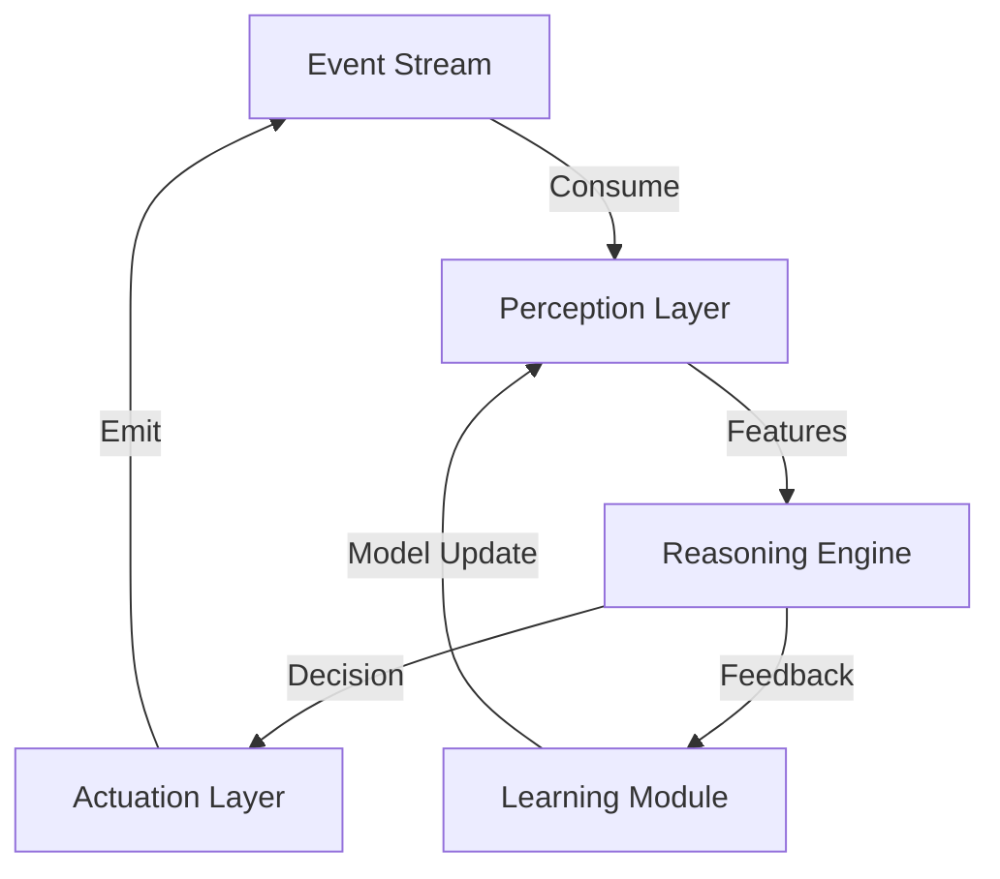

## Introduction

In the last decade, two technological paradigms have risen from research labs to production‑grade deployments:

1. **Event‑Driven Architecture (EDA)** – a design style that treats state changes as immutable events, enabling systems to react instantly, scale elastically, and stay loosely coupled.  
2. **Autonomous AI Agents** – software entities that perceive their environment, reason, and act without direct human intervention, often powered by large language models (LLMs), reinforcement learning, or hybrid symbolic‑neural techniques.

Individually, each paradigm solves a specific set of problems. When combined, they unlock **real‑time intelligence**: the ability to ingest, process, and act upon streams of data the instant they occur, while continuously improving decision quality through autonomous learning.

This article provides a deep dive into the convergence of EDA and autonomous AI agents. We will explore foundational concepts, architectural blueprints, practical code snippets, real‑world case studies, challenges, and emerging trends. By the end, you should have a clear roadmap for building systems that can sense, think, and act in real time.

---

## 1. Foundations of Event‑Driven Architecture

### 1.1 Core Concepts

| Concept | Description |
|---------|-------------|
| **Event** | A record of something that **has happened** (e.g., `order_placed`, `sensor_reading`). Immutable and time‑stamped. |
| **Producer** | Any component that publishes events to a broker or channel. |
| **Consumer** | A component that subscribes to events and reacts (e.g., triggers a workflow). |
| **Broker** | Middleware (Kafka, Pulsar, RabbitMQ, etc.) that stores, routes, and persists events. |
| **Topic / Stream** | Logical channel grouping similar events. |
| **Event Schema** | Contract defining the shape of an event (often expressed in Avro, JSON Schema, or CloudEvents). |

The **event** is the unit of truth. By persisting events, you can replay histories, audit actions, and decouple producers from consumers.

### 1.2 Messaging Patterns

| Pattern | When to Use | Typical Implementation |
|---------|-------------|------------------------|
| **Publish/Subscribe** | Broadcast to many independent services. | Kafka topics, Google Pub/Sub. |
| **Event Sourcing** | Store every state change as an event; reconstruct state on demand. | Axon Framework, EventStoreDB. |
| **CQRS (Command Query Responsibility Segregation)** | Separate write (commands) from read (queries) for scalability. | Kafka for commands, materialized view in Elasticsearch. |
| **Competing Consumers** | Load‑balance processing of high‑throughput streams. | Multiple consumer groups in Kafka. |
| **Dead‑Letter Queue (DLQ)** | Capture events that cannot be processed. | RabbitMQ DLQ, Kafka retry topics. |

Understanding these patterns is essential when you embed autonomous AI agents into an event‑centric ecosystem.

---

## 2. Autonomous AI Agents: Capabilities and Lifecycle

### 2.1 What Is an Autonomous AI Agent?

An autonomous AI agent is a **closed‑loop system** that:

1. **Perceives** – consumes data (events, APIs, sensors).  
2. **Reasons** – runs inference, planning, or reinforcement learning to decide on an action.  
3. **Acts** – emits new events, calls services, or manipulates resources.  
4. **Learns** – updates its internal model based on feedback (reinforcement signal, human annotation, or self‑supervision).

Think of a self‑driving car: the camera frames are events, the perception model decides “obstacle ahead,” and the controller emits a braking command.

### 2.2 Decision Loop (Perception → Reasoning → Action)



*The loop runs continuously, often within milliseconds for real‑time use cases.*

### 2.3 Typical Building Blocks

| Block | Example Technologies |
|-------|----------------------|
| **Perception** | Sensor adapters, OpenCV, LangChain for LLM prompts. |
| **Reasoning** | LLMs (GPT‑4, Claude), Graph Neural Networks, rule engines. |
| **Actuation** | HTTP/REST calls, Kafka producers, robotic SDKs. |
| **Learning** | Reinforcement Learning libraries (Ray RLlib), online fine‑tuning pipelines. |

---

## 3. Convergence: Why Event‑Driven + Autonomous AI?

### 3.1 Real‑Time Data Processing

- **Low Latency**: Events are delivered instantly; agents can react within sub‑second windows.
- **Back‑Pressure Management**: Brokers provide flow control, preventing agents from being overwhelmed.
- **Replayability**: Agents can re‑process historic events for offline training or debugging.

### 3.2 Decoupling & Scalability

- **Independent Evolution**: You can upgrade the AI model without touching event producers.
- **Horizontal Scaling**: Deploy multiple agent instances as competing consumers; each processes a shard of the stream.
- **Fault Isolation**: Failure in one agent’s reasoning logic does not block the entire pipeline.

### 3.3 Observability & Auditing

- Every decision becomes an event (`agent_decision_made`) with a payload that includes input context, model version, and confidence score.
- This immutable audit trail is invaluable for compliance (e.g., GDPR, financial regulations).

---

## 4. Practical Architecture Blueprint

Below is a reference architecture that marries EDA with autonomous AI agents. The diagram uses common open‑source components but can be swapped for cloud equivalents.

```mermaid
graph LR
    subgraph Producer Layer
        A[Webhooks / Sensors] --> B[Kafka Topic: raw_events]
    end

    subgraph Event Bus
        B --> C[Kafka]
        C --> D[Topic: processed_events]
        C --> E[Topic: agent_commands]
    end

    subgraph Agent Layer
        F[AI Agent (Python)] -->|Consume| D
        F -->|Produce| E
        G[Learning Service] -->|Consume| E
        G -->|Update Model| F
    end

    subgraph Consumer Layer
        H[Analytics Service] -->|Consume| D
        I[Actuation Service] -->|Consume| E
    end
```

### 4.1 Component Overview

| Component | Role |
|-----------|------|
| **Producers** | Emit raw events (e.g., IoT telemetry, user clicks). |
| **Kafka** | Central event broker; provides durability, ordering, and consumer groups. |
| **AI Agent** | Consumes `processed_events`, runs inference, emits `agent_commands`. |
| **Learning Service** | Listens to feedback events (e.g., success/failure) and triggers model retraining. |
| **Actuation Service** | Executes commands (e.g., update device config, send notification). |
| **Analytics Service** | Builds dashboards; may also compute aggregate metrics for model evaluation. |

### 4.2 Sample Implementation

Below is a minimal Python example using **confluent‑kafka** to illustrate an autonomous agent that:

1. Consumes temperature sensor events.  
2. Detects anomalies with a simple rule‑based model (replaceable with an LLM).  
3. Emits a `cooling_action` event if temperature exceeds a threshold.

```python
# agent.py
import json
import os
from confluent_kafka import Consumer, Producer

KAFKA_BOOTSTRAP = os.getenv("KAFKA_BOOTSTRAP", "localhost:9092")
TEMP_TOPIC = "sensor.temperature"
ACTION_TOPIC = "actuation.cooling"

# -------------------------------------------------
# Helper: simple anomaly detector (placeholder)
# -------------------------------------------------
def is_overheated(temp_celsius: float) -> bool:
    # In production replace with an LLM or ML model
    return temp_celsius > 75.0

# -------------------------------------------------
# Kafka Consumer configuration
# -------------------------------------------------
consumer_conf = {
    "bootstrap.servers": KAFKA_BOOTSTRAP,
    "group.id": "ai-agent-group",
    "auto.offset.reset": "earliest",
}
consumer = Consumer(consumer_conf)
consumer.subscribe([TEMP_TOPIC])

# -------------------------------------------------
# Kafka Producer configuration
# -------------------------------------------------
producer = Producer({"bootstrap.servers": KAFKA_BOOTSTRAP})

def emit_cooling_action(sensor_id: str, temperature: float):
    payload = {
        "sensor_id": sensor_id,
        "temperature": temperature,
        "action": "activate_cooling",
        "timestamp": int(time.time() * 1000),
        "model_version": "v1.0.0"
    }
    producer.produce(
        topic=ACTION_TOPIC,
        key=sensor_id,
        value=json.dumps(payload).encode("utf-8")
    )
    producer.flush()

# -------------------------------------------------
# Main event loop
# -------------------------------------------------
import time
print("AI Agent started – waiting for temperature events...")
while True:
    msg = consumer.poll(1.0)  # timeout in seconds
    if msg is None:
        continue
    if msg.error():
        print(f"Consumer error: {msg.error()}")
        continue

    # Parse event
    event = json.loads(msg.value())
    sensor_id = event["sensor_id"]
    temperature = event["temperature"]

    # Reasoning step
    if is_overheated(temperature):
        print(f"[ALERT] {sensor_id} overheated at {temperature}°C")
        emit_cooling_action(sensor_id, temperature)

    # Simulate back‑pressure handling (optional)
    time.sleep(0.01)  # tiny sleep to avoid busy loop
```

**Key takeaways from the code:**

- The agent **subscribes** to a topic (`sensor.temperature`) and **produces** to another (`actuation.cooling`), preserving the event‑driven contract.
- The decision logic is isolated; swapping `is_overheated` for a more sophisticated LLM call is trivial.
- All emitted actions include a **model version** and **timestamp**, enabling traceability.

---

## 5. Real‑World Use Cases

### 5.1 Smart Manufacturing

- **Problem**: Unplanned equipment downtime costs billions annually.  
- **Solution**: Sensors on CNC machines publish vibration and temperature events. Autonomous agents analyze patterns in real time, predict bearing failure, and issue a `maintenance_schedule` event before the fault manifests.  
- **Result**: 30 % reduction in unexpected downtime; continuous learning as the agent ingests post‑maintenance outcomes.

### 5.2 Financial Fraud Detection

- **Problem**: Fraudulent transactions must be blocked within milliseconds.  
- **Solution**: Transaction streams flow through Kafka. An AI agent consumes each transaction, queries a LLM‑augmented risk model, and emits a `fraud_alert` event that downstream services immediately reject.  
- **Result**: Faster detection than batch‑oriented ML pipelines; ability to adapt models on‑the‑fly with reinforcement signals (e.g., chargeback feedback).

### 5.3 Personalized Customer Experiences

- **Problem**: E‑commerce sites need to tailor recommendations instantly as users browse.  
- **Solution**: Front‑end emits `page_view` and `click` events. An autonomous agent enriches each event with a contextual embedding generated by an LLM, then pushes a `recommendation_update` event to the UI service.  
- **Result**: Real‑time, context‑aware product suggestions; higher conversion rates measured via A/B testing.

---

## 6. Challenges and Mitigation Strategies

| Challenge | Why It Matters | Mitigation |
|-----------|----------------|------------|
| **Latency Spikes** | Real‑time guarantees break if event processing stalls. | Use **low‑latency brokers** (Kafka with tiered storage), enable **producer batching** wisely, and deploy agents close to the broker (edge computing). |
| **Data Consistency** | Agents may act on out‑of‑order events, causing contradictory actions. | Leverage **event timestamps** and **windowing**; implement **idempotent actions** (e.g., use upserts). |
| **Model Drift** | Over time, the AI model may become stale, leading to poor decisions. | Deploy a **continuous learning pipeline** that retrains on recent feedback events; version models and route traffic via feature flags. |
| **Security & Governance** | Autonomous actions could be malicious if compromised. | Enforce **RBAC** on event topics, sign events with **JWT** or **mTLS**, and audit all `agent_decision` events. |
| **Observability** | Black‑box agents hinder debugging. | Emit **explainability payloads** (e.g., LLM “reasoning trace”) as part of the decision event; use distributed tracing (OpenTelemetry) across producer → agent → consumer. |

---

## 7. Best Practices and Design Patterns

### 7.1 Event Sourcing for Agent State

Instead of persisting mutable state in a database, store every state‑changing decision as an event (`agent_state_updated`). Replaying the sequence reconstructs the agent’s knowledge base, enabling:

- **Time‑travel debugging**.  
- **Snapshotting** for faster startup.  

### 7.2 CQRS with Separate Command and Query Models

- **Command side**: Events trigger agents; agents emit commands (`actuation` events).  
- **Query side**: Materialized views (e.g., in Elasticsearch) serve dashboards and downstream services without impacting the real‑time processing path.

### 7.3 Supervision Trees (Inspired by Erlang/OTP)

When deploying many autonomous agents, organize them into a **supervision hierarchy**:

- **Supervisor** monitors health, restarts failed agents, and rolls back to previous model versions if necessary.  
- This pattern improves resilience for large fleets of agents.

### 7.4 Schema Evolution with CloudEvents

Adopt the **CloudEvents** specification for a vendor‑agnostic event envelope. Use **semantic versioning** in the `datacontenttype` field to evolve payload schemas without breaking consumers.

```json
{
  "specversion": "1.0",
  "type": "com.example.agent.decision",
  "source": "/agents/temperature-monitor",
  "id": "a1b2c3d4",
  "time": "2026-03-21T12:34:56Z",
  "datacontenttype": "application/json; version=2.1",
  "data": {
    "sensor_id": "sensor-42",
    "temperature": 78.5,
    "action": "activate_cooling",
    "confidence": 0.93
  }
}
```

---

## 8. Future Trends

1. **Foundation‑Model‑as‑a‑Service (FaaS) for Agents** – Platforms will expose LLMs via low‑latency RPCs, allowing agents to invoke “reasoning as a service” without managing model infra.  
2. **Event‑Driven Edge AI** – Tiny brokers (e.g., MQTT) on edge devices will host lightweight agents that act locally, reducing round‑trip latency to the cloud.  
3. **Self‑Healing Architectures** – Agents will not only act on business events but also monitor system health, automatically scaling brokers or re‑routing traffic when performance degrades.  
4. **Explainable Real‑Time Decisions** – Standards will emerge for embedding model interpretability metadata directly into decision events, satisfying regulatory demands.  

---

## Conclusion

Event‑Driven Architecture and autonomous AI agents are each powerful, but their synergy creates a **new class of real‑time intelligent systems**. By treating every perception, reasoning step, and action as an immutable event, you gain:

- **Instantaneous responsiveness** – decisions happen the moment data arrives.  
- **Scalable decoupling** – agents can be added, removed, or upgraded without disrupting producers or downstream services.  
- **Full auditability** – every action is traceable, versioned, and replayable.  

The blueprint outlined in this article—leveraging Kafka, lightweight Python agents, and robust patterns like event sourcing and supervision trees—offers a practical starting point for building production‑grade solutions across manufacturing, finance, e‑commerce, and beyond.

As the ecosystem matures, expect tighter integrations with foundation models, richer observability standards, and edge‑first deployments. Organizations that adopt this convergence early will gain a decisive advantage in delivering **real‑time, data‑driven value** to customers and stakeholders.

---

## Resources

- **Event-Driven Architecture Overview** – Martin Fowler’s classic article: https://martinfowler.com/articles/201701-event-driven.html  
- **Apache Kafka Documentation** – The go‑to guide for building resilient event streams: https://kafka.apache.org/documentation/  
- **CloudEvents Specification** – Standardized event envelope format: https://cloudevents.io/  
- **OpenTelemetry for Distributed Tracing** – Observability across agents and services: https://opentelemetry.io/  
- **LangChain – Building LLM‑Powered Agents** – Practical library for chaining LLM calls: https://github.com/langchain-ai/langchain  
- **Ray RLlib – Scalable Reinforcement Learning** – Framework for continuous model improvement: https://docs.ray.io/en/latest/rllib.html  

Feel free to explore these resources to deepen your understanding and start building your own real‑time intelligent systems today.