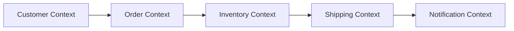

## Introduction

Microservices have reshaped how modern software is built, deployed, and operated. By breaking monolithic applications into loosely‑coupled, independently deployable services, organizations gain agility, fault isolation, and the ability to scale components selectively.  

A **polyglot microservice** architecture takes this a step further: each service can be written in the language, framework, or runtime that best fits its problem domain. Rather than forcing a single technology stack across the entire system, teams select the optimal tool for each bounded context—whether that’s Go for high‑performance networking, Python for rapid data‑science prototyping, or Rust for memory‑safe, low‑latency workloads.

This article provides a deep dive into polyglot microservices, covering the motivations, design principles, real‑world examples, operational concerns, and best‑practice recommendations. By the end, you’ll have a clear roadmap for adopting a heterogeneous service landscape without sacrificing maintainability or reliability.

---

## Why Go Polyglot?

### Business Drivers

| Driver | Impact |
|--------|--------|
| **Time‑to‑Market** | Teams can use familiar languages and libraries, reducing onboarding and development cycles. |
| **Talent Acquisition** | Hiring specialists for specific languages (e.g., data scientists in Python) becomes easier. |
| **Competitive Differentiation** | Leveraging niche technologies (e.g., Rust for IoT edge services) can create performance advantages. |
| **Legacy Integration** | Existing systems written in legacy languages can be wrapped as services rather than rewritten. |

> **Note:** Polyglot does not mean “use every language you know”. It means *choose the right tool for the job* while maintaining a coherent overall system.

### Technical Benefits

1. **Performance Optimization** – Compute‑intensive services (e.g., image processing) can be written in C++ or Rust, while CRUD‑heavy services may stay in JavaScript/Node.js for developer productivity.
2. **Domain‑Specific Libraries** – Machine‑learning pipelines benefit from Python’s ecosystem (NumPy, Pandas, TensorFlow) whereas streaming pipelines can capitalize on Java’s mature Kafka clients.
3. **Isolation of Technical Debt** – If a language’s ecosystem ages or a framework becomes unsupported, only the affected services need migration, not the entire codebase.

---

## Designing a Polyglot Microservice Landscape

### Service Boundaries and Domain Modeling

A solid domain model is the foundation. Use **Domain‑Driven Design (DDD)** to define bounded contexts. Each context maps naturally to a microservice, independent of the language you’ll later pick.



The diagram illustrates clear ownership lines; each node can be implemented with the most suitable stack.

### Choosing the Right Language per Service

#### Criteria Checklist

| Criterion | Questions to Ask |
|-----------|------------------|
| **Latency Sensitivity** | Does the service need sub‑millisecond response times? Consider Go, Rust, or C++. |
| **Developer Velocity** | Is rapid iteration critical? Favor dynamic languages like Python, JavaScript, or Ruby. |
| **Ecosystem Maturity** | Does the problem domain have a dominant library (e.g., TensorFlow for ML)? Choose the language that hosts it. |
| **Operational Constraints** | Are you limited to a platform that only supports certain runtimes (e.g., AWS Lambda’s supported languages)? |
| **Team Expertise** | Which languages do the current team members master? Align services with existing skill sets. |

### Data Store Selection per Service

Polyglot services often embrace **polyglot persistence**: each service owns its database technology, optimized for its data access patterns.

- **Relational (PostgreSQL, MySQL)** – Strong ACID guarantees, ideal for financial transactions.
- **Document (MongoDB, Couchbase)** – Flexible schemas, great for user profiles or content management.
- **Time‑Series (InfluxDB, TimescaleDB)** – Metrics, IoT telemetry.
- **Graph (Neo4j, Amazon Neptune)** – Relationship‑heavy data like social networks.

Each service should **own** its datastore, avoiding shared schemas that couple services together.

### Communication Patterns

#### Synchronous

- **HTTP/REST** – Universally understood; good for simple CRUD APIs.
- **gRPC** – Binary protocol with protobuf contracts; excellent for low‑latency, contract‑first services.
- **GraphQL** – Enables flexible queries from clients; useful when a service aggregates data from multiple sources.

#### Asynchronous

- **Message Queues (RabbitMQ, Amazon SQS)** – Decouple producers and consumers; support retries and dead‑letter handling.
- **Event Streams (Apache Kafka, Pulsar)** – Enable event‑driven architectures, replayability, and scaling out consumers.

> **Important:** Mix and match patterns based on consistency requirements. Use **saga patterns** for distributed transactions across heterogeneous services.

---

## Practical Implementation Examples

### Example 1: E‑Commerce Platform

#### Service Overview

| Service | Language | Responsibility | Datastore |
|--------|----------|----------------|-----------|
| **API Gateway** | Node.js (Express) | Entry point, request routing, auth | — |
| **Product Catalog** | Go | High‑throughput product lookup | PostgreSQL |
| **Pricing Engine** | Python | Complex pricing rules, ML‑based discounts | MongoDB |
| **Order Service** | Java (Spring Boot) | Transactional order processing | MySQL |
| **Notification** | Ruby (Rails) | Email/SMS notifications | Redis (for queue) |

#### Code Snippets

**Go – Product Catalog (simplified)**

```go
package main

import (
    "database/sql"
    "encoding/json"
    "log"
    "net/http"

    _ "github.com/lib/pq"
)

type Product struct {
    ID    string `json:"id"`
    Name  string `json:"name"`
    Price int    `json:"price"`
}

var db *sql.DB

func init() {
    var err error
    db, err = sql.Open("postgres", "postgres://user:pass@db:5432/catalog?sslmode=disable")
    if err != nil {
        log.Fatal(err)
    }
}

func getProduct(w http.ResponseWriter, r *http.Request) {
    id := r.URL.Query().Get("id")
    row := db.QueryRow("SELECT id, name, price FROM products WHERE id=$1", id)

    var p Product
    if err := row.Scan(&p.ID, &p.Name, &p.Price); err != nil {
        http.Error(w, "product not found", http.StatusNotFound)
        return
    }
    json.NewEncoder(w).Encode(p)
}

func main() {
    http.HandleFunc("/product", getProduct)
    log.Println("Product service listening on :8080")
    log.Fatal(http.ListenAndServe(":8080", nil))
}
```

**Python – Pricing Engine (simplified)**

```python
# pricing.py
import json
from flask import Flask, request, jsonify
import pymongo

app = Flask(__name__)
client = pymongo.MongoClient("mongodb://mongo:27017/")
db = client.pricing

def calculate_discount(product_id, user_id):
    # Placeholder for a machine‑learning model
    rules = db.rules.find_one({"product_id": product_id})
    if rules and user_id in rules["eligible_users"]:
        return 0.10  # 10% discount
    return 0.0

@app.route("/price", methods=["GET"])
def price():
    product_id = request.args["product_id"]
    user_id = request.args["user_id"]
    base_price = float(request.args["base_price"])

    discount = calculate_discount(product_id, user_id)
    final_price = base_price * (1 - discount)
    return jsonify({"final_price": final_price, "discount": discount})

if __name__ == "__main__":
    app.run(host="0.0.0.0", port=5000)
```

**Java – Order Service (simplified, Spring Boot)**

```java
@RestController
@RequestMapping("/orders")
public class OrderController {

    @Autowired
    private OrderRepository orderRepo;

    @PostMapping
    public ResponseEntity<Order> create(@RequestBody OrderDto dto) {
        Order order = new Order(dto.getCustomerId(), dto.getItems());
        orderRepo.save(order);
        // Publish event to Kafka for downstream services
        kafkaTemplate.send("order.created", order.getId());
        return ResponseEntity.status(HttpStatus.CREATED).body(order);
    }
}
```

These snippets illustrate how each service can live in a separate repository, use its own runtime, and still cooperate through well‑defined APIs and messaging.

### Example 2: Real‑Time Analytics Pipeline

#### Service Overview

| Service | Language | Responsibility | Datastore |
|--------|----------|----------------|-----------|
| **Ingestion** | Rust | High‑throughput, low‑latency data ingestion from IoT devices | Kafka |
| **Stream Processor** | Scala (Akka Streams) | Enriches events, performs windowed aggregations | Cassandra |
| **Dashboard API** | Node.js (NestJS) | Serves aggregated metrics to UI | PostgreSQL |
| **ML Scoring** | Python (FastAPI) | Applies trained models to streaming data | Redis (model cache) |

#### Code Snippets

**Rust – Ingestion Service (simplified using `rdkafka`)**

```rust
use rdkafka::config::ClientConfig;
use rdkafka::producer::{FutureProducer, FutureRecord};
use std::time::Duration;

#[tokio::main]
async fn main() {
    let producer: FutureProducer = ClientConfig::new()
        .set("bootstrap.servers", "kafka:9092")
        .create()
        .expect("Producer creation error");

    // Simulate incoming IoT payloads
    loop {
        let payload = r#"{"device_id":"sensor-12","temp":23.5,"ts":1627847280}"#;
        let record = FutureRecord::to("iot.raw")
            .payload(payload)
            .key("sensor-12");

        producer.send(record, Duration::from_secs(0)).await.unwrap();
        tokio::time::sleep(tokio::time::Duration::from_millis(10)).await;
    }
}
```

**Scala – Stream Processor (Akka Streams)**

```scala
import akka.actor.ActorSystem
import akka.kafka.scaladsl.Consumer
import akka.kafka.{ConsumerSettings, Subscriptions}
import akka.stream.scaladsl.{Flow, Sink}
import org.apache.kafka.common.serialization.StringDeserializer
import spray.json._

case class Event(deviceId: String, temp: Double, ts: Long)

object JsonProtocol extends DefaultJsonProtocol {
  implicit val eventFormat = jsonFormat3(Event.apply)
}

object StreamApp extends App {
  implicit val system = ActorSystem("analytics")
  import system.dispatcher
  import JsonProtocol._

  val consumerSettings = ConsumerSettings(system, new StringDeserializer, new StringDeserializer)
    .withBootstrapServers("kafka:9092")
    .withGroupId("analytics-group")
    .withProperty("auto.offset.reset", "earliest")

  val source = Consumer.plainSource(consumerSettings, Subscriptions.topics("iot.raw"))

  val processingFlow = Flow[ConsumerRecord[String, String]]
    .map(_.value().parseJson.convertTo[Event])
    .filter(_.temp > 25) // simple filter
    .groupedWithin(1000, scala.concurrent.duration.FiniteDuration(5, "seconds"))
    .map(events => {
      // compute average temperature per batch
      val avg = events.map(_.temp).sum / events.size
      (events.head.deviceId, avg)
    })

  source.via(processingFlow).to(Sink.foreach {
    case (deviceId, avgTemp) =>
      println(s"Device $deviceId avg temp: $avgTemp")
      // persist to Cassandra here
  }).run()
}
```

These examples demonstrate how a polyglot pipeline can combine low‑level performance (Rust), expressive stream processing (Scala), and rapid prototyping (Python) while staying cohesive through shared contracts (e.g., JSON schema, protobuf).

---

## Operational Considerations

### Deployment Strategies

| Strategy | Description | When to Use |
|----------|-------------|-------------|
| **Container per Service** | Each service packaged as a Docker image. | Default for most teams. |
| **Side‑car Pattern** | Attach language‑specific agents (e.g., Envoy, OpenTelemetry) as side‑cars. | Needed for advanced networking or observability. |
| **Serverless Functions** | Deploy individual functions (AWS Lambda, Azure Functions) for lightweight services. | Event‑driven, infrequent workloads. |
| **Hybrid** | Mix containers, VMs, and serverless depending on latency and cost. | Large enterprises with varied workloads. |

Kubernetes remains the de‑facto orchestrator for polyglot deployments. Use **labels** and **taints** to group services by runtime if needed (e.g., node pools with Go‑optimized images).

### CI/CD Pipelines for Multi‑Language Repos

1. **Monorepo vs. Polyrepo**  
   - *Monorepo* simplifies dependency management but can cause long build times.  
   - *Polyrepo* isolates language‑specific tooling, reduces cross‑contamination.  

2. **Pipeline Stages**  
   - **Lint / Static Analysis** – Run language‑specific linters (ESLint, golangci‑lint, flake8).  
   - **Unit Tests** – Execute test suites in parallel containers.  
   - **Integration Tests** – Spin up Docker Compose stacks that include all required services.  
   - **Container Build** – Use multi‑stage Dockerfiles to keep images minimal.  
   - **Security Scanning** – Trivy or Snyk scans per image.  

3. **GitHub Actions Example (simplified)**

```yaml
name: CI

on:
  push:
    branches: [ main ]

jobs:
  build-go:
    runs-on: ubuntu-latest
    steps:
      - uses: actions/checkout@v3
      - name: Set up Go
        uses: actions/setup-go@v4
        with:
          go-version: '1.22'
      - name: Lint
        run: golangci-lint run ./...
      - name: Test
        run: go test ./...

  build-python:
    runs-on: ubuntu-latest
    steps:
      - uses: actions/checkout@v3
      - name: Set up Python
        uses: actions/setup-python@v4
        with:
          python-version: '3.11'
      - name: Install deps
        run: pip install -r requirements.txt
      - name: Lint
        run: flake8 .
      - name: Test
        run: pytest
```

Each language gets its own job, allowing parallel execution and clear failure attribution.

### Observability

| Aspect | Tooling | Polyglot Tips |
|--------|---------|----------------|
| **Logging** | Loki, Elastic Stack, Fluent Bit | Use structured JSON logs; configure language‑specific loggers to output the same schema. |
| **Tracing** | OpenTelemetry, Jaeger, Zipkin | Instrument all services with the same OpenTelemetry SDK version; export to a common collector. |
| **Metrics** | Prometheus, Grafana | Export metrics in the Prometheus exposition format; include language‑agnostic labels (service, version). |
| **Health Checks** | Kubernetes probes | Implement `/healthz` endpoint in each language (e.g., Express, Flask, Spring Actuator). |

> **Important:** Standardize on **semantic versioning** for service APIs and expose the version in health endpoints. This aids automated rollouts and rollback decisions.

### Security and Governance

- **API Gateways** (Kong, Traefik, AWS API Gateway) enforce authentication (OAuth2, JWT) centrally.
- **Service Mesh** (Istio, Linkerd) provides mutual TLS, traffic policies, and observability without code changes.
- **Dependency Scanning** – Run language‑specific scanners (npm audit, Cargo audit, Maven Dependency Check) in CI.
- **RBAC** – Apply Kubernetes Role‑Based Access Control per namespace or per service account, limiting what each service can access.

---

## Common Pitfalls and How to Avoid Them

### Language Proliferation

> *Risk:* Teams become overwhelmed by maintaining many runtimes, leading to increased cognitive load.

**Mitigation:**
- Limit the number of languages to those that truly add value.
- Adopt a **language charter**: define criteria for adding a new language (e.g., performance requirement, library exclusivity).
- Provide shared tooling wrappers (e.g., a common Docker base image with multiple runtimes installed).

### Data Consistency

In a polyglot system, each service may own its own datastore, making **eventual consistency** the default.

**Strategies:**
- Use **sagas** (choreography or orchestration) for multi‑service transactions.
- Implement **idempotent consumers** to handle duplicate events.
- Leverage **schema registries** (Confluent Schema Registry) for contract‑driven event formats.

### Team Coordination

Multiple languages can fragment communication if teams speak “different technical dialects”.

**Solutions:**
- Enforce **API contracts** via OpenAPI/Swagger or protobuf; treat contracts as the single source of truth.
- Hold **cross‑team design reviews** for shared domain concepts.
- Adopt a **shared observability dashboard** that surfaces metrics from all services in a unified view.

---

## Best Practices Checklist

- ✅ **Define bounded contexts before picking languages.**  
- ✅ **Standardize on contract formats** (OpenAPI, protobuf, Avro).  
- ✅ **Isolate data per service**; avoid shared databases.  
- ✅ **Containerize every service** with minimal base images.  
- ✅ **Implement centralized logging, tracing, and metrics** using language‑agnostic agents.  
- ✅ **Automate security scanning** for each language’s dependency ecosystem.  
- ✅ **Document runtime requirements** (CPU, memory) to aid Kubernetes scheduling.  
- ✅ **Limit language count** to those that provide a clear advantage.  
- ✅ **Invest in onboarding material** (coding guidelines, Dockerfile templates) for each stack.  
- ✅ **Monitor service health** with consistent `/healthz` endpoints and readiness probes.

---

## Conclusion

Polyglot microservices empower organizations to harness the best tools for each problem domain, delivering performance, developer productivity, and flexibility that monolithic or single‑language stacks often cannot match. However, the freedom to mix languages comes with responsibilities: rigorous domain modeling, disciplined contract management, robust CI/CD pipelines, and unified observability.

By following the design principles, operational guidelines, and best‑practice checklist outlined in this article, you can confidently embark on a polyglot journey—building systems that are not only technically superior but also maintainable and resilient at scale.

---

## Resources

- [Microservices.io – Patterns for Microservice Architecture](https://microservices.io)  
- [Kubernetes Documentation – Deploying Applications](https://kubernetes.io/docs/concepts/workloads/controllers/deployment/)  
- [OpenTelemetry – Observability for Polyglot Systems](https://opentelemetry.io)  
- [Docker – Multi‑Stage Builds](https://docs.docker.com/develop/develop-images/multistage-build/)  
- [AWS Architecture Center – Polyglot Persistence](https://aws.amazon.com/architecture/diagrams/)  

Feel free to explore these resources for deeper dives into specific topics, tooling, and case studies. Happy building!