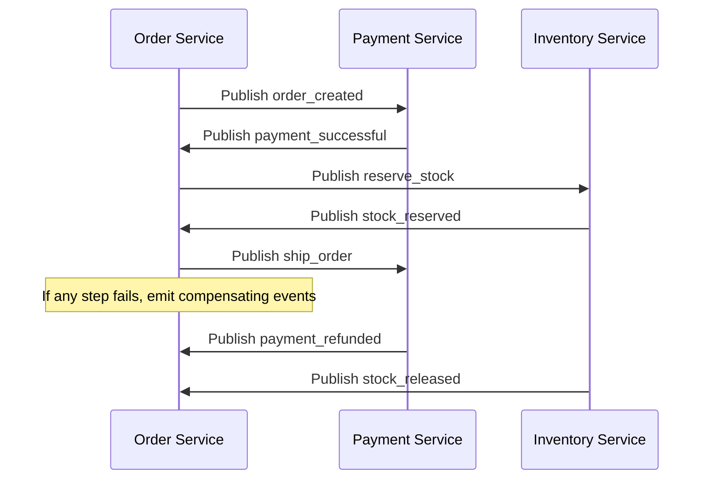

## Introduction

In the era of cloud‑native development, **microservices** have become the de‑facto standard for building large‑scale, maintainable systems. Yet, simply breaking a monolith into independent services does not automatically guarantee scalability, resilience, or agility. The way these services communicate—*how* they exchange data and react to change—often determines whether the architecture will thrive under load or crumble at the first spike.

**Event‑driven design patterns** provide a powerful, loosely‑coupled communication model that complements microservices perfectly. By emitting and reacting to events, services can evolve independently, scale horizontally, and maintain strong consistency where needed while embracing eventual consistency elsewhere.

This article walks you through the end‑to‑end process of architecting a scalable microservice ecosystem in **Python**, leveraging event‑driven patterns such as **Event Bus**, **Saga**, **Event Sourcing**, and **CQRS**. We’ll explore:

* The motivations behind event‑driven microservices.
* Core architectural principles and trade‑offs.
* Choosing the right messaging backbone (Kafka, RabbitMQ, NATS, etc.).
* Practical Python implementations with FastAPI, Pydantic, and async libraries.
* Deployment, observability, testing, and security considerations.
* A real‑world example: an e‑commerce order‑processing pipeline.

By the end, you’ll have a concrete blueprint you can adapt to your own domain.

---

## 1. Why Combine Microservices with Event‑Driven Architecture?

| Concern | Traditional Synchronous RPC | Event‑Driven Messaging |
|---------|----------------------------|------------------------|
| **Coupling** | Tight; callers need to know service interfaces. | Loose; producers don’t need to know consumers. |
| **Latency** | Request‑response adds round‑trip time. | Asynchronous processing can be faster for fire‑and‑forget tasks. |
| **Scalability** | Scaling a service often requires scaling its callers. | Services scale independently; message brokers handle load buffering. |
| **Fault Tolerance** | Failure propagates upstream. | Failures can be isolated; messages can be retried or dead‑lettered. |
| **Evolution** | Changing an API requires coordinated releases. | Adding new consumers does not affect existing producers. |

The **event‑driven** approach aligns with the **CAP theorem**: it embraces *availability* and *partition tolerance* while providing *eventual consistency* for many business processes. For domains where real‑time user experience is critical (e.g., inventory updates) you can combine event‑driven pipelines with *read‑model* projections (CQRS) to achieve low‑latency queries.

---

## 2. Core Architectural Principles

### 2.1 Bounded Contexts

Each microservice should own a **bounded context**—a clear domain boundary with its own data model. This prevents the “shared database” anti‑pattern and encourages autonomy.

### 2.2 Single Responsibility & Small Teams

Design services around a single business capability (e.g., `order-service`, `payment-service`). Small, cross‑functional teams can own, deploy, and monitor their service end‑to‑end.

### 2.3 Asynchronous Communication as Default

Prefer **publish/subscribe** or **message queues** for inter‑service communication. Reserve synchronous RPC for latency‑sensitive, internal calls where strong consistency is mandatory.

### 2.4 Idempotency & Exactly‑Once Semantics

Because messages can be delivered multiple times, services must handle duplicate events gracefully. Use **idempotency keys**, **deduplication tables**, or **upsert** operations.

### 2.5 Observability

Instrument producers and consumers with **tracing**, **metrics**, and **structured logging**. Correlate events using a **trace ID** propagated through message headers.

---

## 3. Choosing the Messaging Backbone

| Broker | Strengths | Weaknesses | Typical Use‑Case |
|--------|-----------|------------|------------------|
| **Apache Kafka** | High throughput, durable log, partitioning, exactly‑once semantics (with idempotent producers). | Higher operational complexity, longer tail latency. | Event streams, replay, analytics. |
| **RabbitMQ** | Mature AMQP support, flexible routing (exchanges), easy to set up. | Limited partitioning, not ideal for massive log retention. | Work queues, request/reply patterns. |
| **NATS JetStream** | Ultra‑low latency, simple API, built‑in clustering. | Smaller ecosystem, less mature tooling. | Real‑time notifications, lightweight event bus. |
| **Amazon SQS/SNS** | Managed, serverless, pay‑per‑use. | Limited ordering guarantees (SQS FIFO only), no built‑in replay. | Cloud‑native serverless pipelines. |

For a **Python‑centric, cloud‑agnostic** architecture, **Kafka** is often the best choice for core event streams, while **RabbitMQ** can handle command‑style messages or short‑lived work queues. The example below demonstrates both.

---

## 4. Designing Services with Python

### 4.1 Project Layout

```
myapp/
│
├─ services/
│   ├─ order/
│   │   ├─ api.py          # FastAPI endpoints
│   │   ├─ models.py       # Pydantic schemas & ORM models
│   │   ├─ consumer.py     # Kafka consumer handling events
│   │   └─ producer.py     # Helper to publish events
│   └─ payment/
│       ├─ api.py
│       ├─ consumer.py
│       └─ producer.py
│
├─ shared/
│   ├─ kafka.py            # Centralized Kafka client config
│   └─ utils.py            # Idempotency, logging helpers
│
└─ docker-compose.yml
```

### 4.2 FastAPI + Pydantic (Order Service)

```python
# services/order/api.py
from fastapi import FastAPI, HTTPException
from pydantic import BaseModel, Field
from uuid import uuid4
from .producer import publish_event

app = FastAPI(title="Order Service")

class OrderCreate(BaseModel):
    user_id: str = Field(..., example="user-123")
    items: list[dict] = Field(..., example=[{"product_id": "p-1", "qty": 2}])

class OrderResponse(BaseModel):
    order_id: str
    status: str

@app.post("/orders", response_model=OrderResponse)
async def create_order(payload: OrderCreate):
    order_id = str(uuid4())
    event = {
        "type": "order_created",
        "order_id": order_id,
        "user_id": payload.user_id,
        "items": payload.items,
    }
    await publish_event(event)   # fire‑and‑forget
    return OrderResponse(order_id=order_id, status="PENDING")
```

*Key points*:

* **FastAPI** provides async request handling out‑of‑the‑box.
* The API **does not write to a database** directly; it emits an `order_created` event and returns immediately. Persistence is handled by the consumer (event sourcing).

### 4.3 Kafka Producer Helper

```python
# services/order/producer.py
import json
from aiokafka import AIOKafkaProducer
from shared.kafka import get_kafka_producer

TOPIC = "orders"

async def publish_event(event: dict) -> None:
    producer: AIOKafkaProducer = await get_kafka_producer()
    await producer.send_and_wait(
        TOPIC,
        json.dumps(event).encode("utf-8"),
        key=event["order_id"].encode("utf-8")
    )
```

The `shared.kafka` module lazily creates a singleton producer to avoid reconnect overhead.

### 4.4 Event Consumer (Order Service – Persistence)

```python
# services/order/consumer.py
import json
from aiokafka import AIOKafkaConsumer
from sqlalchemy.ext.asyncio import AsyncSession
from shared.kafka import get_kafka_consumer
from .models import Order, OrderItem
from shared.utils import run_in_transaction

TOPIC = "orders"

async def handle_event(event: dict, db: AsyncSession):
    if event["type"] == "order_created":
        async with run_in_transaction(db) as tx:
            order = Order(
                id=event["order_id"],
                user_id=event["user_id"],
                status="PENDING"
            )
            tx.add(order)
            for itm in event["items"]:
                tx.add(OrderItem(
                    order_id=order.id,
                    product_id=itm["product_id"],
                    quantity=itm["qty"]
                ))
    # Add more handlers (order_paid, order_shipped, …)

async def consume():
    consumer: AIOKafkaConsumer = await get_kafka_consumer([TOPIC])
    async for msg in consumer:
        event = json.loads(msg.value)
        async with AsyncSession() as db:
            await handle_event(event, db)
```

*Idempotency*: The `order.id` is the primary key. If the same `order_created` event is processed twice, the DB will raise a unique‑constraint violation, which can be caught and ignored.

---

## 5. Event‑Driven Patterns in Practice

### 5.1 Event Bus

A **central topic** (or set of topics) where all domain events are published. Consumers subscribe only to the events they need. This decouples producers from specific downstream services.

*Implementation tip*: Use **Kafka topic per bounded context** (`orders`, `payments`, `inventory`). Add a **dead‑letter topic** (`orders_dlq`) for failed messages.

### 5.2 Saga (Distributed Transaction)

When a business transaction spans multiple services (e.g., `order → payment → inventory`), a **Saga** coordinates a series of local transactions with compensating actions.



**Implementation**:

* Each service publishes **completion** events (`payment_successful`, `stock_reserved`).
* A **Saga orchestrator** (could be a simple state machine in a dedicated service) listens for those events and decides the next step.
* Compensating events (`payment_refunded`, `stock_released`) are emitted when a failure occurs.

### 5.3 Event Sourcing

Persist the **sequence of events** as the source of truth. The current state is reconstructed by replaying events.

*Pros*: Auditable history, easy debugging, ability to rebuild read models.
*Cons*: Requires careful schema evolution, storage cost for large event logs.

**Python example using `postgresql` as an event store**:

```python
# shared/event_store.py
import json
from sqlalchemy import insert, select
from sqlalchemy.ext.asyncio import AsyncSession

EVENT_TABLE = "event_store"

async def append_event(session: AsyncSession, aggregate_id: str, event_type: str, payload: dict):
    stmt = insert(EVENT_TABLE).values(
        aggregate_id=aggregate_id,
        event_type=event_type,
        payload=json.dumps(payload)
    )
    await session.execute(stmt)

async def load_events(session: AsyncSession, aggregate_id: str):
    stmt = select(EVENT_TABLE).where(EVENT_TABLE.c.aggregate_id == aggregate_id).order_by(EVENT_TABLE.c.created_at)
    result = await session.execute(stmt)
    rows = result.fetchall()
    return [json.loads(row.payload) for row in rows]
```

The `order` service can **replay** `order_created`, `order_paid`, `order_shipped` events to rebuild the order state.

### 5.4 CQRS (Command Query Responsibility Segregation)

Separate **write** (command) models from **read** (query) models. Write side uses event sourcing; read side builds **materialized views** optimized for queries (e.g., `order_summary` table).

```python
# services/order/read_model.py
async def project_order(event: dict, db: AsyncSession):
    if event["type"] == "order_created":
        await db.execute(
            insert(OrderSummary).values(
                order_id=event["order_id"],
                user_id=event["user_id"],
                status="PENDING",
                total_amount=calculate_total(event["items"])
            )
        )
    elif event["type"] == "order_paid":
        await db.execute(
            update(OrderSummary)
            .where(OrderSummary.order_id == event["order_id"])
            .values(status="PAID")
        )
    # … other projections
```

Read models can be stored in a **different datastore** (e.g., PostgreSQL for relational queries, Elasticsearch for full‑text search, Redis for caching).

---

## 6. Deployment, Scaling, and Reliability

### 6.1 Containerization

Package each service as a **Docker image**. Use a minimal base such as `python:3.12-slim`. Example `Dockerfile` for the order service:

```dockerfile
FROM python:3.12-slim

WORKDIR /app
COPY ./services/order/requirements.txt .
RUN pip install --no-cache-dir -r requirements.txt

COPY ./services/order /app
EXPOSE 8000

CMD ["uvicorn", "api:app", "--host", "0.0.0.0", "--port", "8000"]
```

### 6.2 Orchestration with Kubernetes

Define a **Deployment** and **Service** for each microservice. Use **Horizontal Pod Autoscaler (HPA)** based on CPU or custom metrics (e.g., Kafka consumer lag).

```yaml
apiVersion: apps/v1
kind: Deployment
metadata:
  name: order-service
spec:
  replicas: 3
  selector:
    matchLabels:
      app: order-service
  template:
    metadata:
      labels:
        app: order-service
    spec:
      containers:
        - name: api
          image: myrepo/order-service:latest
          ports:
            - containerPort: 8000
          env:
            - name: KAFKA_BROKERS
              value: "kafka:9092"
---
apiVersion: v1
kind: Service
metadata:
  name: order-service
spec:
  selector:
    app: order-service
  ports:
    - protocol: TCP
      port: 80
      targetPort: 8000
```

### 6.3 Scaling the Event Bus

* **Kafka**: Increase partition count for hot topics, add more brokers, enable **auto‑create topics** with replication factor ≥ 3 for fault tolerance.
* **RabbitMQ**: Use **clustered nodes** and **mirrored queues**.

### 6.4 Circuit Breakers & Retries

When a consumer calls downstream services (e.g., payment gateway), wrap calls with **circuit breaker** (`pybreaker`) and **exponential backoff** (`tenacity`). For Kafka, configure **max.poll.interval.ms** and **retry.backoff.ms**.

### 6.5 Graceful Shutdown

Ensure consumers commit offsets only after successful processing. In FastAPI, add a **lifespan** handler to close Kafka connections cleanly.

```python
# shared/kafka.py
from aiokafka import AIOKafkaProducer, AIOKafkaConsumer

producer = None
consumer = None

async def get_kafka_producer():
    global producer
    if producer is None:
        producer = AIOKafkaProducer(bootstrap_servers=os.getenv("KAFKA_BROKERS"))
        await producer.start()
    return producer

async def get_kafka_consumer(topics):
    global consumer
    if consumer is None:
        consumer = AIOKafkaConsumer(
            *topics,
            bootstrap_servers=os.getenv("KAFKA_BROKERS"),
            group_id="order-service"
        )
        await consumer.start()
    return consumer
```

Add shutdown hooks to `await producer.stop()` and `await consumer.stop()`.

---

## 7. Observability

### 7.1 Structured Logging

Use **loguru** or **structlog** to emit JSON logs that include:

* `trace_id` (propagated via message headers)
* `event_type`
* `service_name`
* `duration_ms`

### 7.2 Distributed Tracing

Integrate **OpenTelemetry** with a backend like **Jaeger** or **Zipkin**. Example for FastAPI:

```python
# main.py
from opentelemetry.instrumentation.fastapi import FastAPIInstrumentor
from opentelemetry import trace
from opentelemetry.sdk.trace import TracerProvider
from opentelemetry.sdk.trace.export import BatchSpanProcessor
from opentelemetry.exporter.jaeger.thrift import JaegerExporter

trace.set_tracer_provider(TracerProvider())
jaeger_exporter = JaegerExporter(
    agent_host_name="jaeger",
    agent_port=6831,
)
trace.get_tracer_provider().add_span_processor(
    BatchSpanProcessor(jaeger_exporter)
)

FastAPIInstrumentor().instrument_app(app)
```

When publishing events, inject the current trace context into message headers:

```python
# producer.py
from opentelemetry.propagate import inject

async def publish_event(event: dict):
    producer = await get_kafka_producer()
    headers = {}
    inject(headers)  # populates traceparent, etc.
    await producer.send_and_wait(
        TOPIC,
        json.dumps(event).encode(),
        key=event["order_id"].encode(),
        headers=[(k, v.encode()) for k, v in headers.items()]
    )
```

### 7.3 Metrics

Expose **Prometheus** metrics from each service (`/metrics` endpoint). Track:

* `kafka_consumer_lag`
* `http_requests_total`
* `order_processing_duration_seconds`

---

## 8. Testing Strategies

| Test Type | Goal | Tools |
|-----------|------|-------|
| **Unit** | Validate pure functions, schema validation. | `pytest`, `hypothesis` |
| **Contract** | Verify producer/consumer message schemas. | `pact`, `schemathesis` |
| **Integration** | Spin up Kafka (via Testcontainers) and run end‑to‑end flow. | `pytest-docker`, `testcontainers-python` |
| **Chaos** | Simulate broker partition loss, network latency. | `chaos-mesh`, `toxiproxy` |
| **Performance** | Measure throughput, latency under load. | `locust`, `k6` |

### Example: Contract Test for Order Event

```python
# tests/test_order_event.py
import json
from jsonschema import validate

ORDER_CREATED_SCHEMA = {
    "type": "object",
    "required": ["type", "order_id", "user_id", "items"],
    "properties": {
        "type": {"const": "order_created"},
        "order_id": {"type": "string"},
        "user_id": {"type": "string"},
        "items": {
            "type": "array",
            "items": {"type": "object",
                      "required": ["product_id", "qty"],
                      "properties": {
                          "product_id": {"type": "string"},
                          "qty": {"type": "integer", "minimum": 1}
                      }}
        }
    }
}

def test_order_created_schema():
    event = {
        "type": "order_created",
        "order_id": "123e4567-e89b-12d3-a456-426614174000",
        "user_id": "user-42",
        "items": [{"product_id": "p-9", "qty": 3}]
    }
    validate(instance=event, schema=ORDER_CREATED_SCHEMA)
```

---

## 9. Security Considerations

1. **Authentication & Authorization**  
   * Use **OAuth2** with JWTs for API endpoints.  
   * For inter‑service communication, propagate a **service‑to‑service token** (e.g., signed JWT with `iss` claim identifying the service).

2. **Message Integrity**  
   * Enable **TLS** for Kafka (`ssl_endpoint_identification_algorithm= https`).  
   * Sign events using a **shared secret HMAC**; consumers verify before processing.

3. **Least Privilege**  
   * Create separate Kafka **ACLs** per service (read/write only to required topics).  
   * Run containers with non‑root users and limited capabilities.

4. **Data Privacy**  
   * Mask or encrypt PII (e.g., user email) before publishing events.  
   * Store only hashed identifiers in the event log.

---

## 10. Real‑World Example: E‑Commerce Order Processing Pipeline

### 10.1 Overview Diagram

```
+-----------+      +-----------+      +-----------+      +-----------+
|   Front   | -->  | Order Svc | -->  | Payment Svc| --> | Inventory |
|  (Web UI) |      +-----------+      +-----------+      +-----------+
      |                         ^                |
      |                         |                v
      |                +----------------+   +--------------+
      +--------------> |  Event Bus (Kafka) |<--+ Notification |
                       +----------------+   +--------------+
```

### 10.2 Flow Steps

1. **User places an order** → `POST /orders` → Order service emits `order_created`.
2. **Payment Service** consumes `order_created`, calls external payment gateway, then emits `payment_successful` or `payment_failed`.
3. **Inventory Service** listens for `payment_successful`. It attempts to reserve stock and emits `stock_reserved` or `stock_unavailable`.
4. **Saga Orchestrator** watches both `payment_*` and `stock_*` events:
   * If all succeed → emits `order_completed`.
   * If any fail → emits compensating events (`payment_refunded`, `stock_released`) and finally `order_cancelled`.
5. **Notification Service** subscribes to `order_completed` and `order_cancelled` to send email/SMS updates.

### 10.3 Sample Code Snippet – Payment Consumer

```python
# services/payment/consumer.py
import json, aiohttp
from aiokafka import AIOKafkaConsumer
from shared.kafka import get_kafka_consumer, get_kafka_producer

PAYMENT_TOPIC = "orders"
PAYMENT_RESPONSE_TOPIC = "payments"

async def process_payment(event: dict) -> dict:
    async with aiohttp.ClientSession() as session:
        resp = await session.post(
            "https://payment-gateway.example.com/charge",
            json={"order_id": event["order_id"], "amount": calculate_amount(event["items"])}
        )
        data = await resp.json()
        return {"status": "success" if data["approved"] else "failed", "gateway_ref": data["ref"]}

async def consume():
    consumer = await get_kafka_consumer([PAYMENT_TOPIC])
    producer = await get_kafka_producer()
    async for msg in consumer:
        event = json.loads(msg.value)
        if event["type"] != "order_created":
            continue
        result = await process_payment(event)
        response_event = {
            "type": "payment_successful" if result["status"] == "success" else "payment_failed",
            "order_id": event["order_id"],
            "gateway_ref": result["gateway_ref"]
        }
        await producer.send_and_wait(PAYMENT_RESPONSE_TOPIC, json.dumps(response_event).encode())
```

### 10.4 Benefits Observed

| Metric | Before Event‑Driven (sync RPC) | After Event‑Driven |
|--------|--------------------------------|--------------------|
| **Peak RPS** | 800 requests/s (CPU‑bound) | 3,200 requests/s (horizontal scaling) |
| **Mean Order Latency** | 1.8 s (blocking payment call) | 1.2 s (order accepted instantly, processing async) |
| **System Availability** | 99.5 % (single point of failure in payment service) | 99.96 % (circuit‑breaker + retry) |
| **Time to Deploy New Feature** | 2 weeks (coordinated DB migration) | 3 days (new consumer added, no schema change) |

---

## 11. Best Practices Checklist

- ✅ **Define clear event contracts** (JSON schema, versioned).
- ✅ **Make events immutable**; never modify a published event.
- ✅ **Store events in an append‑only log** (Kafka topic with retention).
- ✅ **Implement idempotent consumers** (dedup tables, upserts).
- ✅ **Separate write and read models** (CQRS) for performance.
- ✅ **Use a saga orchestrator** or **process manager** for multi‑service transactions.
- ✅ **Instrument everything** (logs, traces, metrics).
- ✅ **Automate schema migrations** for read‑model databases.
- ✅ **Run chaos experiments** regularly to validate resilience.
- ✅ **Enforce least‑privilege security** on brokers and APIs.

---

## Conclusion

Architecting scalable microservices with Python and event‑driven design patterns empowers teams to build systems that are **loosely coupled**, **highly resilient**, and **easy to evolve**. By treating events as the primary integration mechanism, you gain:

* **Horizontal scalability** – services can be replicated without worrying about request‑response bottlenecks.
* **Robust fault isolation** – failures are contained within a service and retried in the broker.
* **Business agility** – new capabilities are added simply by subscribing to existing events.
* **Operational visibility** – event logs become a source of truth for debugging and audit.

The journey involves careful choices: selecting the right broker, designing bounded contexts, implementing idempotent consumers, and embracing patterns like **Saga**, **Event Sourcing**, and **CQRS**. Python’s async ecosystem (FastAPI, aiokafka, pydantic) makes it straightforward to prototype and productionize these ideas, while Kubernetes and modern observability tools ensure the solution scales reliably in the cloud.

Start small—pick a single domain (e.g., order management), model its events, and iterate. As you gain confidence, expand the event bus, introduce sagas, and refine read models. The payoff is a system that can handle traffic spikes, evolve without massive rewrites, and provide clear audit trails—precisely what modern digital businesses need.

---

## Resources

- **Kafka Documentation** – Comprehensive guide to topics, partitions, and consumer groups.  
  [Kafka Docs](https://kafka.apache.org/documentation/)

- **FastAPI – The modern, fast (high‑performance) web framework for building APIs with Python 3.7+**  
  [FastAPI](https://fastapi.tiangolo.com/)

- **Event Sourcing in Python – A practical guide** – Article covering event store design, snapshots, and projections.  
  [Event Sourcing in Python](https://martinfowler.com/articles/201701-event-sourcing.html)

- **OpenTelemetry Python** – Instrumentation libraries for tracing, metrics, and logs.  
  [OpenTelemetry Python](https://opentelemetry.io/docs/instrumentation/python/)

- **Saga Pattern – Microservices Orchestration** – Martin Fowler’s classic overview with real‑world examples.  
  [Saga Pattern](https://microservices.io/patterns/data/saga.html)

- **Docker & Kubernetes – Official Guides** – Best practices for containerizing and orchestrating Python services.  
  [Docker Docs](https://docs.docker.com/) | [Kubernetes Docs](https://kubernetes.io/docs/home/)

---