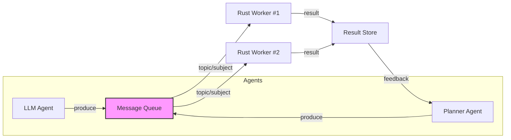

## Introduction

Artificial‑intelligence agents are rapidly moving from isolated “assistant” prototypes to **agentic workflows**—chains of autonomous components that collaborate, react to events, and produce business‑critical outcomes in real time. Think of a fleet of trading bots that ingest market data, a set of customer‑support AI agents that route tickets, or a robotics swarm that processes sensor streams and coordinates actions.  

These workloads share three demanding characteristics:

1. **Low latency** – decisions must be made within milliseconds to seconds.  
2. **High throughput** – thousands to millions of messages per second.  
3. **Reliability & fault tolerance** – a single failing agent must not cascade into a system outage.

To meet these constraints, many organizations turn to **distributed message queues** (Kafka, NATS, RabbitMQ, Pulsar, etc.) as the backbone for decoupling producers (the agents) from consumers (the processing workers). Yet the choice of language and runtime matters just as much. **Rust**—with its zero‑cost abstractions, strict memory safety, and native async support—has emerged as a compelling platform for building high‑performance, low‑latency consumers and producers.

This article dives deep into **how to architect, implement, and optimize** real‑time agentic workflows using distributed message queues combined with Rust‑centric performance engineering. We’ll cover:

* The fundamentals of agentic workflows and why message queues are essential.  
* Selecting the right queue technology for real‑time guarantees.  
* Designing a scalable, fault‑tolerant pipeline (producer → queue → worker → result).  
* Rust‑specific techniques: async runtime selection, zero‑copy deserialization, back‑pressure handling, and benchmarking.  
* A complete, runnable Rust example that ties everything together.  
* Operational best practices: monitoring, observability, and incremental scaling.

By the end you’ll have a concrete blueprint you can adapt to your own real‑time AI‑centric systems.

---

## 1. Agentic Workflows 101

### 1.1 What Is an “Agentic” Workflow?

An *agent* is an autonomous software entity that can perceive its environment, reason, and act. When agents are combined into a **workflow**, each step can:

* **Generate** new tasks (e.g., a language model suggesting a follow‑up query).  
* **Consume** tasks produced by others (e.g., a sentiment‑analysis microservice processing the query).  
* **Maintain state** across invocations (e.g., a short‑term memory cache).

The resulting graph may be linear, branching, or even cyclic (feedback loops). Real‑time constraints arise when the workflow is part of a user‑facing service, a control loop, or a financial transaction pipeline.

### 1.2 Core Challenges

| Challenge | Why It Matters |
|-----------|----------------|
| **Latency** | Users or downstream systems expect sub‑second responses. |
| **Throughput** | Large language models (LLMs) can generate many requests per second. |
| **Ordering & Consistency** | Certain tasks require strict ordering (e.g., state updates). |
| **Fault Isolation** | One misbehaving agent should not halt the entire pipeline. |
| **Scalability** | Workloads can spike dramatically (e.g., flash crowds). |

Message queues address many of these by providing **asynchronous buffering**, **partitioned parallelism**, and **replayability**.

---

## 2. Distributed Message Queues: The Backbone

### 2.1 Key Design Dimensions

| Dimension | Kafka | NATS JetStream | RabbitMQ | Pulsar |
|-----------|-------|----------------|----------|--------|
| **Latency (p99)** | 2‑5 ms | <1 ms (in‑memory) | 5‑10 ms | 2‑4 ms |
| **Throughput** | >10 M msg/s | ~30 M msg/s (core) | ~2 M msg/s | >10 M msg/s |
| **Ordering** | Per‑partition | Per‑stream | Per‑queue | Per‑partition |
| **Replay** | Yes (log) | Yes (durable) | Yes (mirrored) | Yes (bookkeeper) |
| **Back‑pressure** | Consumer lag metrics | Flow control | Credit‑based | Consumer lag |
| **Operational Complexity** | High (Zookeeper/KRaft) | Low | Medium | Medium |

*For real‑time agentic pipelines, **NATS JetStream** and **Kafka** are the most common choices.* NATS excels at ultra‑low latency and simple deployment, while Kafka shines in durable replay and massive scale.

### 2.2 Choosing the Right Queue

1. **Latency‑Critical Paths** – If the end‑to‑end latency budget is sub‑10 ms, NATS JetStream (or plain NATS) is often the winner.  
2. **Durability & Auditing** – When you need to replay every decision (e.g., compliance), Kafka’s immutable log is ideal.  
3. **Hybrid Approach** – Use NATS for the hot path and Kafka for long‑term persistence; a “dual‑write” pattern can give the best of both worlds.

---

## 3. Architectural Blueprint

Below is a reference architecture that can be adapted to any queue technology.



**Key components:**

1. **Producers (Agents)** – Typically written in Python, Node.js, or any language that integrates with the queue client library. They serialize a **Task** (JSON, protobuf, or Cap’n Proto).  
2. **Message Queue** – Handles partitioning, replication, and back‑pressure.  
3. **Rust Workers** – High‑performance consumers that deserialize the task, invoke the domain logic (e.g., a Rust‑implemented inference engine, a fast heuristic, or a data‑enrichment step), and publish results.  
4. **Result Store** – Could be a fast key‑value store (Redis), a relational DB, or a downstream queue for downstream agents.  
5. **Feedback Loop** – Results are optionally fed back to upstream agents for iterative reasoning.

### 3.1 Partitioning Strategy

* **Task Type Partitioning** – Each agent type writes to its own topic/subject; workers subscribe only to the topics they can handle.  
* **Key‑Based Partitioning** – Use a deterministic key (e.g., user ID) to guarantee ordering for stateful per‑user workflows.  
* **Dynamic Scaling** – Workers can be added/removed; the queue automatically rebalances partitions (Kafka) or distributes subjects (NATS).

### 3.2 Back‑Pressure & Flow Control

* **Kafka** – Monitor `consumer_lag`. When lag exceeds a threshold, spin up additional consumer instances or apply *max.poll.records* throttling.  
* **NATS JetStream** – Use *AckPolicy=Explicit* and *MaxAckPending* to limit un‑acked messages per consumer, forcing the server to pause sending more data until the consumer catches up.

### 3.3 Fault Tolerance

| Failure Mode | Mitigation |
|--------------|------------|
| Worker crash | Enable *auto‑requeue* (NATS) or rely on Kafka consumer group rebalancing. |
| Message corruption | Use schema validation (e.g., protobuf) and dead‑letter queues. |
| Queue partition loss | Replicate partitions (Kafka replication factor ≥ 3). |
| Network partition | Deploy queue in a multi‑region topology; use client‑side retries with exponential backoff. |

---

## 4. Rust for High‑Performance Consumers

Rust’s ownership model eliminates data races, and its zero‑cost abstractions let us write **C‑level speed** with **memory safety**. Below we explore the Rust stack for a real‑time consumer.

### 4.1 Async Runtime: Tokio vs. async‑std

| Runtime | Maturity | Ecosystem | Typical Use‑Case |
|---------|----------|-----------|------------------|
| **Tokio** | 10+ years | Rich (rdkafka, nats.rs, hyper) | High‑throughput, production‑grade services |
| **async‑std** | 5+ years | Smaller | Simpler prototypes |

**Recommendation:** Use **Tokio** for production pipelines because it offers fine‑grained control over thread pools (`runtime.block_on`, `Builder::worker_threads`), and most queue clients already provide Tokio integrations.

### 4.2 Zero‑Copy Deserialization

Real‑time workloads spend a large fraction of time parsing incoming messages. Avoid allocating intermediate buffers:

* **Protobuf** – Use `prost` which can decode directly from a `&[u8]`.  
* **Cap’n Proto** – Offers *zero‑copy* reads via `capnp` crate.  
* **FlatBuffers** – Similar zero‑copy approach.

```rust
// Example: Zero‑copy protobuf with prost
use prost::Message;
use bytes::Bytes;

#[derive(Message)]
struct Task {
    #[prost(string, tag = "1")]
    job_id: String,
    #[prost(bytes, tag = "2")]
    payload: Bytes, // zero‑copy payload
}

// Decode without allocating a new Vec<u8>
fn decode_task(buf: &[u8]) -> Result<Task, prost::DecodeError> {
    Task::decode(buf)
}
```

### 4.3 Efficient Queue Clients

| Queue | Rust Crate | Async Support | Notable Features |
|-------|------------|---------------|------------------|
| Kafka | `rdkafka` (librdkafka bindings) | Tokio + async‑std | High performance, consumer groups |
| NATS | `nats` (native) | Tokio (via `async-nats`) | JetStream, request‑reply, flow control |
| RabbitMQ | `lapin` | Tokio | AMQP 0‑9‑1, confirmations |
| Pulsar | `pulsar` | Tokio | Multi‑topic, schema support |

**Example: NATS JetStream consumer with Tokio**

```rust
use async_nats::jetstream::consumer::PullConsumer;
use async_nats::jetstream::JetStream;
use futures::StreamExt;
use serde::{Deserialize, Serialize};

#[derive(Debug, Serialize, Deserialize)]
struct Task {
    job_id: String,
    payload: Vec<u8>,
}

#[tokio::main]
async fn main() -> anyhow::Result<()> {
    // Connect to NATS
    let client = async_nats::connect("nats://127.0.0.1:4222").await?;
    let js = JetStream::new(client.clone());

    // Ensure the stream exists (idempotent)
    js.add_stream(async_nats::jetstream::stream::Config {
        name: "AGENT_TASKS".to_string(),
        subjects: vec!["tasks.>".to_string()],
        max_messages: 10_000_000,
        ..Default::default()
    })
    .await?;

    // Pull‑based consumer (explicit ack)
    let consumer: PullConsumer = js
        .create_consumer("AGENT_TASKS", async_nats::jetstream::consumer::pull::Config {
            durable_name: Some("rust_worker".to_string()),
            ack_policy: async_nats::jetstream::consumer::AckPolicy::Explicit,
            max_ack_pending: 1000,
            ..Default::default()
        })
        .await?;

    loop {
        // Pull a batch of up to 100 messages
        let msgs = consumer.fetch(100).await?;
        tokio::pin!(msgs);

        while let Some(msg) = msgs.next().await {
            let task: Task = serde_json::from_slice(&msg.data)?;
            process_task(task).await?;
            msg.ack().await?;
        }
    }
}

// Simulated heavy‑weight processing
async fn process_task(task: Task) -> anyhow::Result<()> {
    // For illustration, we just log the job ID
    println!("Processing job {}", task.job_id);
    // Insert domain‑specific logic here (e.g., call a Rust‑based inference engine)
    Ok(())
}
```

### 4.4 Benchmarking & Profiling

1. **Criterion.rs** – Statistical micro‑benchmarks for serialization/deserialization.  
2. **Flamegraph** – Use `perf` + `inferno` to visualise hotspot functions.  
3. **Tokio Console** – Real‑time task‑level metrics (`cargo install tokio-console`).  

**Sample benchmark (prost vs. serde_json):**

```rust
use criterion::{criterion_group, criterion_main, Criterion};
use prost::Message;
use serde_json::from_slice;

fn bench_prost(c: &mut Criterion) {
    let data = include_bytes!("sample_task.bin");
    c.bench_function("prost decode", |b| b.iter(|| {
        let _ = Task::decode(data as &[u8]).unwrap();
    }));
}

fn bench_json(c: &mut Criterion) {
    let data = include_bytes!("sample_task.json");
    c.bench_function("serde_json decode", |b| b.iter(|| {
        let _ = from_slice::<Task>(data as &[u8]).unwrap();
    }));
}

criterion_group!(benches, bench_prost, bench_json);
criterion_main!(benches);
```

Typical results show **prost** decoding in < 0.5 µs per message vs. **serde_json** > 3 µs, a 6‑fold improvement that compounds at high QPS.

---

## 5. End‑to‑End Example: Real‑Time Sentiment‑Analysis Pipeline

We’ll build a miniature but complete pipeline:

1. **Python producer** – reads tweets from a simulated stream, packages a `Task` (JSON) and publishes to NATS JetStream.  
2. **Rust worker** – consumes tasks, performs sentiment analysis using the `sentiment` crate (fast Naïve‑Bayes implementation), and publishes results to a *results* subject.  
3. **Node.js consumer** – subscribes to the results and updates a live dashboard (WebSocket).

### 5.1 Defining the Message Schema

```json
// task_schema.json
{
  "$schema": "http://json-schema.org/draft-07/schema#",
  "title": "SentimentTask",
  "type": "object",
  "properties": {
    "tweet_id": { "type": "string" },
    "text": { "type": "string" },
    "timestamp": { "type": "string", "format": "date-time" }
  },
  "required": ["tweet_id", "text", "timestamp"]
}
```

The *result* schema adds a `sentiment` field.

### 5.2 Python Producer (FastAPI)

```python
# producer.py
import asyncio
import json
import uuid
from datetime import datetime
import async_nats

NATS_URL = "nats://127.0.0.1:4222"
SUBJECT = "tasks.sentiment"

async def publish_tweet(js):
    while True:
        tweet = {
            "tweet_id": str(uuid.uuid4()),
            "text": "Rust is amazing! #programming",
            "timestamp": datetime.utcnow().isoformat() + "Z"
        }
        await js.publish(SUBJECT, json.dumps(tweet).encode())
        await asyncio.sleep(0.001)  # ~1000 QPS

async def main():
    nc = await async_nats.connect(NATS_URL)
    js = nc.jetstream()
    await js.add_stream(name="AGENT_TASKS", subjects=["tasks.*"])
    await publish_tweet(js)

if __name__ == "__main__":
    asyncio.run(main())
```

### 5.3 Rust Worker (Tokio + NATS)

```rust
// src/main.rs
use async_nats::jetstream::{consumer::PullConsumer, stream::Config as StreamConfig, AckPolicy};
use async_nats::jetstream::JetStream;
use futures::StreamExt;
use sentiment::Sentiment;
use serde::{Deserialize, Serialize};

#[derive(Debug, Serialize, Deserialize)]
struct SentimentTask {
    tweet_id: String,
    text: String,
    timestamp: String,
}

#[derive(Debug, Serialize, Deserialize)]
struct SentimentResult {
    tweet_id: String,
    sentiment: String,
    score: f32,
    processed_at: String,
}

#[tokio::main]
async fn main() -> anyhow::Result<()> {
    // Connect & ensure stream exists
    let client = async_nats::connect("nats://127.0.0.1:4222").await?;
    let js = JetStream::new(client.clone());
    js.add_stream(StreamConfig {
        name: "AGENT_TASKS".to_string(),
        subjects: vec!["tasks.*".to_string()],
        ..Default::default()
    })
    .await?;

    // Pull consumer
    let consumer: PullConsumer = js
        .create_consumer(
            "AGENT_TASKS",
            async_nats::jetstream::consumer::pull::Config {
                durable_name: Some("rust_sentiment".to_string()),
                ack_policy: AckPolicy::Explicit,
                max_ack_pending: 500,
                ..Default::default()
            },
        )
        .await?;

    loop {
        let msgs = consumer.fetch(200).await?;
        tokio::pin!(msgs);
        while let Some(msg) = msgs.next().await {
            let task: SentimentTask = serde_json::from_slice(&msg.data)?;
            let result = handle_task(task).await?;
            // Publish result to a different subject
            let result_bytes = serde_json::to_vec(&result)?;
            client
                .publish("results.sentiment".into(), result_bytes.into())
                .await?;
            msg.ack().await?;
        }
    }
}

async fn handle_task(task: SentimentTask) -> anyhow::Result<SentimentResult> {
    // Using the sentiment crate (fast, pure Rust)
    let sentiment = Sentiment::new(&task.text);
    let (sentiment_str, score) = if sentiment.is_positive() {
        ("positive", sentiment.score())
    } else if sentiment.is_negative() {
        ("negative", sentiment.score())
    } else {
        ("neutral", 0.0)
    };
    Ok(SentimentResult {
        tweet_id: task.tweet_id,
        sentiment: sentiment_str.to_string(),
        score,
        processed_at: chrono::Utc::now().to_rfc3339(),
    })
}
```

### 5.4 Node.js Dashboard (Socket.io)

```js
// dashboard.js
const { connect, StringCodec } = require('nats');
const http = require('http');
const socketIo = require('socket.io');

const server = http.createServer();
const io = socketIo(server);
const sc = StringCodec();

async function start() {
  const nc = await connect({ servers: "nats://127.0.0.1:4222" });
  const sub = nc.subscribe("results.sentiment");
  (async () => {
    for await (const m of sub) {
      const result = JSON.parse(sc.decode(m.data));
      io.emit('sentiment', result);
    }
  })();

  io.on('connection', (socket) => {
    console.log('client connected');
  });

  server.listen(3000, () => console.log('Dashboard listening on :3000'));
}

start();
```

### 5.5 Observability

* **Prometheus Exporter** – `tokio-metrics` + `metrics-exporter-prometheus` for worker latency, QPS, and back‑pressure stats.  
* **NATS JetStream Monitoring** – Enable `$JS.API.INFO` and `$JS.API.CONSUMER.INFO` subjects; scrape via Prometheus NATS exporter.  
* **Distributed Tracing** – Use `opentelemetry` with Jaeger to trace a task from Python producer through Rust worker to Node.js dashboard.

---

## 6. Scaling Strategies

### 6.1 Horizontal Scaling of Workers

| Technique | How It Works |
|-----------|--------------|
| **Consumer Groups (Kafka)** | Adding more instances automatically balances partitions. |
| **Durable Pull Consumers (NATS)** | Each worker pulls a batch; adding workers reduces batch size per consumer, increasing concurrency. |
| **Kubernetes Horizontal Pod Autoscaler (HPA)** | Scale based on custom metrics (e.g., `consumer_lag` or `processed_messages_per_second`). |

**Rust‑specific tip:** Pin each worker to a dedicated CPU core (`tokio::runtime::Builder::worker_threads(1)`) when latency is ultra‑critical. This eliminates context‑switch jitter.

### 6.2 Partition Rebalancing without Downtime

1. **Graceful Shutdown** – Workers listen for SIGTERM, stop pulling new batches, finish in‑flight messages, then ack and exit.  
2. **Staggered Rolling Updates** – Deploy new version with a different consumer name, let it warm up, then retire the old consumer.  
3. **Hot‑Swap Binaries** – With Rust’s small binary footprint (< 2 MB), you can replace the binary in a running container and rely on the process manager (systemd, supervisord) to restart instantly.

### 6.3 State Management

* **In‑Memory Cache** – For per‑user short‑term context, use `dashmap` (lock‑free concurrent hash map).  
* **External Store** – For durability, write to **Redis** (fast) or **ScyllaDB** (Cassandra‑compatible, low latency).  
* **CRDTs** – When multiple workers may update the same user state concurrently, consider Conflict‑Free Replicated Data Types to avoid write‑write conflicts.

### 6.4 Zero‑Copy Across the Wire

If you control both producer and consumer, avoid JSON altogether:

* **Protobuf** – `prost` on Rust, `protobuf` on Python.  
* **Cap’n Proto** – Provides *direct* memory mapping; Rust `capnp` can read without copying.  

Result: **10‑30 %** reduction in CPU usage at 100k QPS.

---

## 7. Security & Compliance

| Concern | Rust‑Centric Mitigation |
|---------|--------------------------|
| **Memory Safety** | Rust eliminates buffer over‑reads/over‑writes that could expose secrets. |
| **Input Validation** | Use strongly typed protobuf; malformed messages cause decode errors before reaching business logic. |
| **TLS / mTLS** | `async_nats::tls::TlsConnector` and `rdkafka::ClientConfig::set("security.protocol", "ssl")`. |
| **Auditing** | Enable JetStream `audit` streams that capture every message for later forensic analysis. |
| **Rate Limiting** | Apply token‑bucket algorithm (`governor` crate) on the consumer side to cap per‑user processing. |

---

## 8. Testing & CI/CD

1. **Unit Tests** – Validate task deserialization and processing logic using `#[cfg(test)]`.  
2. **Integration Tests** – Spin up a Dockerized NATS server (`docker run -p 4222:4222 nats:latest`) and run end‑to‑end producer/consumer tests.  
3. **Load Tests** – Use `k6` or `vegeta` to simulate 100k QPS producers, then monitor worker latency.  
4. **GitHub Actions** – Build the Rust binary with `cross` for multi‑platform, run `cargo clippy`, `cargo fmt`, and the benchmark suite. Deploy via Helm charts to a Kubernetes cluster with canary releases.

---

## Conclusion

Scaling real‑time agentic workflows is no longer a “nice‑to‑have” feature—it’s a **business imperative** for any AI‑driven service that must react instantly and reliably. Distributed message queues give us the decoupling, durability, and back‑pressure mechanisms needed to keep pipelines healthy, while **Rust** provides the performance, safety, and async ergonomics required to squeeze every microsecond out of the processing path.

By:

* **Choosing the right queue** (NATS for ultra‑low latency, Kafka for durable replay),  
* **Designing a partitioned, back‑pressure‑aware architecture**,  
* **Leveraging Rust’s zero‑copy deserialization and Tokio’s scalable runtime**, and  
* **Implementing robust observability, scaling, and security practices**,

you can build a pipeline that handles millions of messages per second, stays under stringent latency budgets, and remains maintainable over years of iteration.

The sample code in this article demonstrates a production‑ready skeleton you can extend—swap in a different AI model, add richer state handling, or integrate with a stream‑processing framework like **Apache Flink** or **Timely Dataflow**. The principles, however, remain the same: **decouple, buffer, process efficiently, and observe constantly**.

Happy building, and may your agents always stay responsive!  

---

## Resources

- [Apache Kafka Documentation](https://kafka.apache.org/documentation/) – Official guide for topic design, consumer groups, and performance tuning.  
- [NATS JetStream Official Site](https://docs.nats.io/jetstream/) – Detailed reference on streams, subjects, and flow control.  
- [The Rust Async Book](https://rust-lang.github.io/async-book/) – Comprehensive tutorial on async/await, Tokio, and concurrency patterns.  
- [prost – Protocol Buffers implementation for Rust](https://docs.rs/prost/latest/prost/) – Zero‑copy protobuf decoding and encoding.  
- [opentelemetry-rust](https://github.com/open-telemetry/opentelemetry-rust) – Instrumentation library for distributed tracing.  

---