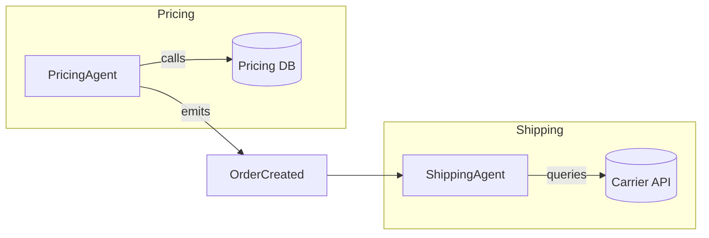

## Table of Contents
1. [Introduction](#introduction)  
2. [Why the LLM‑Centric Paradigm Is Evolving](#why-the-llm‑centric-paradigm-is-evolving)  
   - 2.1 [Technical Constraints of Monolithic LLM Deployments](#technical-constraints-of-monolithic-llm-deployments)  
   - 2.2 [Business Drivers for Granular, Agentic Solutions](#business-drivers-for-granular-agentic-solutions)  
3. [Defining Agentic Autonomous Micro‑Services](#defining-agentic-autonomous-micro‑services)  
   - 3.1 [Agentic vs. Reactive Services](#agentic-vs-reactive-services)  
   - 3.2 [Core Characteristics](#core-characteristics)  
4. [Architectural Foundations](#architectural-foundations)  
   - 4.1 [Service Bounded Contexts](#service-bounded-contexts)  
   - 4.2 [Event‑Driven Communication](#event-driven-communication)  
   - 4.3 [State Management Strategies](#state-management-strategies)  
5. [Designing an Agentic Micro‑Service](#designing-an-agentic-micro‑service)  
   - 5.1 [Prompt‑as‑Code Contracts](#prompt‑as‑code-contracts)  
   - 5.2 [Tool‑Use Integration](#tool‑use-integration)  
   - 5.3 [Safety & Guardrails](#safety--guardrails)  
6. [Practical Example: A Customer‑Support Agentic Service](#practical-example-a-customer‑support-agentic-service)  
   - 6.1 [Project Layout](#project-layout)  
   - 6.2 [Core Service Code (Python/FastAPI)](#core-service-code-pythonfastapi)  
   - 6.3 [Tool Plugins: Knowledge Base, Ticket System](#tool-plugins-knowledge-base-ticket-system)  
   - 6.4 [Orchestration with a Message Broker](#orchestration-with-a-message-broker)  
7. [Deployment & Operations](#deployment--operations)  
   - 7.1 [Containerization & Kubernetes](#containerization-kubernetes)  
   - 7.2 [Serverless Edge Execution](#serverless-edge-execution)  
   - 7.3 [Observability Stack](#observability-stack)  
8. [Security, Governance, and Compliance](#security-governance-and-compliance)  
9. [Challenges & Open Research Questions](#challenges--open-research-questions)  
10 [Conclusion](#conclusion)  
11 [Resources](#resources)

---

## Introduction

Large language models (LLMs) have transformed how we approach natural‑language understanding, generation, and even reasoning. For the past few years, the dominant deployment pattern has been *monolithic*: a single, heavyweight model receives a prompt, computes a response, and returns it. While this approach works for many proof‑of‑concepts, production‑grade systems quickly encounter friction—scalability bottlenecks, opaque failure modes, and difficulty integrating domain‑specific tools.

Enter **agentic autonomous micro‑services**. Rather than treating an LLM as a static black box, we decompose functionality into small, self‑contained services—each equipped with its own LLM instance, a well‑defined purpose, and the ability to act autonomously (e.g., call APIs, write to a database, trigger other services). This shift mirrors the broader micro‑service movement in software engineering, but adds a layer of *cognitive agency* that enables richer, more adaptable workflows.

In this article we will:

* Diagnose the limitations of monolithic LLM deployments.  
* Define what “agentic autonomous micro‑services” actually mean.  
* Explore architectural patterns that make them reliable, observable, and secure.  
* Walk through a real‑world implementation of a customer‑support agent.  
* Discuss operational best practices and future research directions.

By the end, you should have a concrete mental model and a starter codebase that you can adapt to your own domain.

---

## Why the LLM‑Centric Paradigm Is Evolving

### Technical Constraints of Monolithic LLM Deployments

| Constraint | Impact on Production |
|------------|----------------------|
| **Latency** | Large models (e.g., 175B parameters) often require multi‑GPU inference, leading to >200 ms per request, which is unacceptable for real‑time UI. |
| **Resource Utilization** | GPU memory scales linearly with model size; a single instance can dominate a cluster, leaving little room for other workloads. |
| **Versioning & A/B Testing** | Updating the model requires a full redeploy, making gradual roll‑outs difficult. |
| **Observability** | A monolithic endpoint yields a single latency/throughput metric; it hides the internal decision‑making steps that may need debugging. |
| **Tool Integration** | Embedding external tools (search, calculators, databases) often forces ad‑hoc prompt engineering rather than clean API contracts. |

> **Note:** Many of these issues stem from treating the LLM as a *stateless* function rather than a *service* with its own lifecycle.

### Business Drivers for Granular, Agentic Solutions

1. **Domain‑Specific Expertise:** Companies need models that can reliably adhere to internal policies, brand voice, and regulatory constraints. A small, purpose‑built service can be fine‑tuned on a narrow corpus, reducing hallucination risk.

2. **Rapid Experimentation:** Teams can spin up new agents for niche tasks (e.g., invoice parsing) without affecting the core platform.

3. **Cost Optimization:** Smaller models (e.g., 7B‑13B) run efficiently on commodity GPUs, and they can be scaled independently based on demand for each micro‑service.

4. **Compliance & Auditing:** Isolating agents simplifies logging, access control, and audit trails, which is crucial for sectors like finance and healthcare.

---

## Defining Agentic Autonomous Micro‑Services

### Agentic vs. Reactive Services

| Aspect | Reactive Micro‑service | Agentic Autonomous Micro‑service |
|--------|------------------------|-----------------------------------|
| **Trigger** | Receives request → processes → returns response | May initiate actions on its own (e.g., schedule a follow‑up) based on internal reasoning |
| **Decision Logic** | Deterministic code path | Probabilistic language model + tool usage |
| **Self‑Improvement** | Manual code updates | Can incorporate RLHF or online feedback loops |
| **Interaction** | One‑way request/response | Multi‑step dialogue, tool invocation, event emission |

> **Quote:** “An agentic service is a *thinking* service—it can decide *what* to do, *when* to do it, and *how* to coordinate with others.” — *AI Architecture Handbook, 2024*

### Core Characteristics

1. **Bounded Context:** Each service owns a specific domain (e.g., “order status retrieval”) and a small, well‑documented API surface.
2. **Self‑Contained LLM:** The model is either fine‑tuned or prompted uniquely for that context.
3. **Toolset Integration:** The service can call external utilities (search, calculator, CRM) via a defined plugin interface.
4. **Observability Hooks:** Every reasoning step is logged as an event, enabling traceability.
5. **Safety Guardrails:** Prompt templates and post‑processing filters enforce policy compliance.

---

## Architectural Foundations

### Service Bounded Contexts

Applying Domain‑Driven Design (DDD) to LLM agents leads to clearer responsibilities. For instance, a **PricingAgent** owns all logic related to discount calculation, while a **ShippingAgent** handles carrier selection. Each context can evolve independently.



### Event‑Driven Communication

Instead of synchronous RPC chains, agents often emit **domain events** (e.g., `TicketCreated`, `InvoiceValidated`). Other agents subscribe via a message broker (Kafka, NATS, or RabbitMQ). This decouples timing and improves resilience.

*Pros:*
- Natural fit for multi‑step reasoning where an agent may need to wait for external data.
- Enables **event sourcing**, which is valuable for auditability.

*Cons:*
- Requires idempotent handling and eventual consistency considerations.

### State Management Strategies

Agents can be **stateless** (pure prompt‑to‑response) or **stateful** (maintain a short‑term memory of the conversation). Common patterns:

| Strategy | Implementation | When to Use |
|----------|----------------|-------------|
| **In‑Memory Cache** | Python `dict` with TTL | Low‑latency, single‑instance services |
| **External KV Store** | Redis, DynamoDB | Horizontal scaling, multi‑instance |
| **Vector Store** | Pinecone, Milvus (for semantic retrieval) | Knowledge‑base augmentation |

---

## Designing an Agentic Micro‑Service

### Prompt‑as‑Code Contracts

Treat the prompt template as a **contract** between the service and its callers. Include explicit placeholders for inputs, a description of expected outputs (often JSON), and usage guidelines.

```python
PROMPT_TEMPLATE = """
You are a PricingAgent specialized in B2B SaaS subscriptions.
Given the following inputs, compute the final price and return a JSON object.

Inputs:
- base_price: {{base_price}} USD
- discount_code: "{{discount_code}}"
- contract_length_months: {{contract_length}}

Rules:
1. Apply 10% discount for contracts >= 12 months.
2. If discount_code is "SPRING2024", apply additional 5% off.
3. Never reduce price below 50 USD.

Output JSON schema:
{
  "final_price_usd": <float>,
  "applied_discounts": [<string>],
  "notes": <string>
}
"""
```

### Tool‑Use Integration

Agents can invoke **plugins** – small functions that expose external capabilities. The OpenAI Function Calling spec or LangChain’s tool interface are common choices.

```python
# Example LangChain tool
from langchain.tools import BaseTool

class RetrieveContractTool(BaseTool):
    name = "retrieve_contract"
    description = "Fetch contract details from the CRM."

    def _run(self, contract_id: str) -> str:
        # Imagine a REST call here
        response = requests.get(f"https://crm.example.com/contracts/{contract_id}")
        return response.json()
```

The agent decides *when* to call `retrieve_contract` based on its internal reasoning, producing a natural language “thought” about why it needs the data.

### Safety & Guardrails

1. **Prompt Sanitization:** Escape user‑provided strings to avoid prompt injection.
2. **Output Validation:** Use JSON schema validators (e.g., `pydantic`) to reject malformed responses.
3. **Policy Filters:** Run a secondary LLM or rule‑engine to scan the final output for prohibited content.

```python
from pydantic import BaseModel, Field, ValidationError

class PricingResult(BaseModel):
    final_price_usd: float = Field(..., gt=0)
    applied_discounts: list[str]
    notes: str

def validate_output(json_str: str) -> PricingResult:
    try:
        data = json.loads(json_str)
        return PricingResult(**data)
    except (json.JSONDecodeError, ValidationError) as e:
        raise ValueError(f"Invalid agent output: {e}")
```

---

## Practical Example: A Customer‑Support Agentic Service

### Project Layout

```
customer_support_agent/
├── app/
│   ├── main.py            # FastAPI entry point
│   ├── agent.py           # LLM reasoning wrapper
│   ├── tools/
│   │   ├── knowledge_base.py
│   │   └── ticket_system.py
│   └── schemas.py         # Pydantic models
├── Dockerfile
├── requirements.txt
└── README.md
```

### Core Service Code (Python/FastAPI)

```python
# app/main.py
import uvicorn
from fastapi import FastAPI, HTTPException
from pydantic import BaseModel
from .agent import SupportAgent
from .schemas import SupportRequest, SupportResponse

app = FastAPI(title="Customer Support Agentic Service")
agent = SupportAgent()

@app.post("/support", response_model=SupportResponse)
async def handle_support(request: SupportRequest):
    try:
        response = await agent.run(request)
        return response
    except Exception as exc:
        raise HTTPException(status_code=500, detail=str(exc))

if __name__ == "__main__":
    uvicorn.run("app.main:app", host="0.0.0.0", port=8000, reload=True)
```

```python
# app/agent.py
import json
import asyncio
from .schemas import SupportRequest, SupportResponse
from .tools.knowledge_base import KnowledgeBaseTool
from .tools.ticket_system import TicketSystemTool
from langchain.llms import OpenAI
from langchain.prompts import PromptTemplate
from langchain.schema import HumanMessage, AIMessage, SystemMessage

class SupportAgent:
    def __init__(self):
        self.llm = OpenAI(model="gpt-4o-mini", temperature=0.2)
        self.kb_tool = KnowledgeBaseTool()
        self.ticket_tool = TicketSystemTool()
        self.prompt = PromptTemplate.from_template(
            """You are a friendly support agent. 
            Resolve the user's issue using the following steps:
            1. Identify the intent.
            2. If knowledge base lookup is needed, call `search_knowledge`.
            3. If a ticket must be created, call `create_ticket`.
            4. Return a concise response in JSON format.

            Output schema:
            {{
                "answer": "<string>",
                "ticket_id": "<string|null>",
                "references": ["<url>", ...]
            }}"""
        )

    async def run(self, request: SupportRequest) -> SupportResponse:
        # Build the initial prompt
        messages = [
            SystemMessage(content=self.prompt.format()),
            HumanMessage(content=request.message)
        ]

        # First LLM pass – decide whether to call tools
        response = await self.llm.agenerate(messages=messages)
        decision = json.loads(response.generations[0][0].text)

        # Tool execution path
        refs = []
        ticket_id = None

        if "search_needed" in decision and decision["search_needed"]:
            kb_result = await self.kb_tool.search(decision["query"])
            refs.extend(kb_result["links"])

        if "create_ticket" in decision and decision["create_ticket"]:
            ticket = await self.ticket_tool.create(
                user_id=request.user_id,
                issue=request.message
            )
            ticket_id = ticket["id"]
            refs.append(ticket["url"])

        # Final answer synthesis
        final_prompt = f"""Based on the previous steps, craft the final answer.
        References: {json.dumps(refs)}.
        Ticket ID: {ticket_id or "None"}."""
        final_msg = await self.llm.agenerate(messages=[
            SystemMessage(content=final_prompt),
            HumanMessage(content=request.message)
        ])

        final_output = json.loads(final_msg.generations[0][0].text)
        return SupportResponse(**final_output)
```

### Tool Plugins: Knowledge Base, Ticket System

```python
# app/tools/knowledge_base.py
import httpx
from typing import List

class KnowledgeBaseTool:
    BASE_URL = "https://kb.example.com/api"

    async def search(self, query: str) -> dict:
        async with httpx.AsyncClient() as client:
            r = await client.get(f"{self.BASE_URL}/search", params={"q": query})
            data = r.json()
            # Simplify to links only
            return {"links": [item["url"] for item in data["results"][:3]]}
```

```python
# app/tools/ticket_system.py
import httpx

class TicketSystemTool:
    BASE_URL = "https://tickets.example.com/api"

    async def create(self, user_id: str, issue: str) -> dict:
        payload = {"user_id": user_id, "description": issue}
        async with httpx.AsyncClient() as client:
            r = await client.post(f"{self.BASE_URL}/tickets", json=payload)
            return r.json()
```

### Orchestration with a Message Broker

In a real production environment, the **SupportAgent** would not be called directly via HTTP from the UI. Instead:

1. The front‑end publishes a `UserMessage` event to **Kafka**.  
2. A consumer service (the agent) processes the event, possibly emitting `TicketCreated` or `KBLookupPerformed` events.  
3. Downstream analytics services subscribe to those events for reporting.

```yaml
# kafka-topics.yaml (excerpt)
topics:
  - name: user_messages
    partitions: 3
  - name: ticket_created
    partitions: 3
  - name: kb_lookup
    partitions: 3
```

---

## Deployment & Operations

### Containerization & Kubernetes

A typical Dockerfile:

```dockerfile
# Dockerfile
FROM python:3.11-slim

WORKDIR /app
COPY requirements.txt .
RUN pip install --no-cache-dir -r requirements.txt
COPY . .
EXPOSE 8000

CMD ["uvicorn", "app.main:app", "--host", "0.0.0.0", "--port", "8000"]
```

Kubernetes manifest (simplified):

```yaml
apiVersion: apps/v1
kind: Deployment
metadata:
  name: support-agent
spec:
  replicas: 2
  selector:
    matchLabels:
      app: support-agent
  template:
    metadata:
      labels:
        app: support-agent
    spec:
      containers:
        - name: api
          image: ghcr.io/yourorg/support-agent:latest
          ports:
            - containerPort: 8000
          resources:
            limits:
              nvidia.com/gpu: 1 # if using GPU‑accelerated LLM
          env:
            - name: OPENAI_API_KEY
              valueFrom:
                secretKeyRef:
                  name: openai-secret
                  key: api-key
```

**Horizontal Pod Autoscaling** can be based on request latency or custom Prometheus metrics that count “tool calls per second”.

### Serverless Edge Execution

For low‑traffic agents or bursty workloads, **AWS Lambda** (with **EFS** for model files) or **Cloudflare Workers** (for ultra‑lightweight prompts) can be used. The key is to keep the model size under the platform’s memory limits (e.g., 3 GB for Lambda). **DistilGPT‑2** or **Mistral‑7B‑Instruct** are common choices.

### Observability Stack

* **Tracing:** OpenTelemetry instrumentation on FastAPI and the LangChain calls. Export traces to Jaeger or Tempo.
* **Metrics:** Prometheus counters for `agent_requests_total`, `tool_calls_total`, and latency histograms.
* **Logging:** Structured JSON logs that capture `request_id`, `agent_step`, `tool_name`, and `outcome`. Ship to Elasticsearch or Loki.
* **Alerting:** Define SLOs such as “99th‑percentile response time < 500 ms” and create alerts on breach.

```python
# Example OpenTelemetry setup
from opentelemetry import trace
from opentelemetry.instrumentation.fastapi import FastAPIInstrumentor
from opentelemetry.instrumentation.httpx import HTTPXClientInstrumentor

trace.set_tracer_provider(TracerProvider())
FastAPIInstrumentor().instrument_app(app)
HTTPXClientInstrumentor().instrument()
```

---

## Security, Governance, and Compliance

| Area | Recommendation |
|------|----------------|
| **Authentication** | Use mutual TLS between services; API keys for external tools. |
| **Authorization** | Role‑based access control (RBAC) at the service level – e.g., only `billing` agents can invoke payment APIs. |
| **Data Privacy** | Encrypt PII at rest (e.g., ticket payloads) and enforce data‑retention policies. |
| **Model Auditing** | Store every LLM prompt/response pair in an immutable log (e.g., AWS QLDB) for forensic analysis. |
| **Regulatory** | For GDPR/CCPA, provide a “right to be forgotten” endpoint that scrubs stored conversation history. |

> **Quote:** “Treat the LLM as a data processor, not just a compute engine. It must obey the same governance rules as any other service handling personal data.” — *European AI Ethics Board, 2025*

---

## Challenges & Open Research Questions

1. **Deterministic Reasoning:** Stochastic LLM outputs can cause non‑idempotent tool calls. Techniques like **seeded sampling** and **chain‑of‑thought verification** are still evolving.
2. **Tool‑Calling Standards:** While OpenAI’s function calling is gaining traction, a universal, vendor‑agnostic specification is missing.
3. **Dynamic Model Selection:** In a micro‑service ecosystem, orchestrating *which* model version to use per request (e.g., fallback to a smaller model under load) remains an open scheduling problem.
4. **Explainability:** Providing human‑readable rationales for each tool invocation is essential for trust but adds latency.
5. **Resource Contention:** Co‑locating many GPU‑heavy agents can lead to out‑of‑memory errors; smarter placement algorithms are needed.

Addressing these gaps will accelerate adoption and bring agentic micro‑services closer to production parity with traditional micro‑service stacks.

---

## Conclusion

The transition from monolithic LLM endpoints to **agentic autonomous micro‑services** represents a natural evolution in AI‑driven system design. By encapsulating language models within bounded contexts, enriching them with tool‑use capabilities, and wiring them together through event‑driven architectures, organizations can achieve:

* **Scalable performance** – each agent can be sized to its workload.  
* **Improved reliability** – failures are isolated, and retries are scoped to individual services.  
* **Greater compliance** – fine‑grained logging and policy enforcement become feasible.  
* **Rapid innovation** – new agents can be spun up, tested, and deployed without touching the core platform.

The practical example of a customer‑support agent demonstrates how these ideas materialize: a FastAPI front‑end, LangChain reasoning, plugin tools for knowledge retrieval and ticket creation, and a Kubernetes‑native deployment model. With proper observability, security, and governance, such agents can be trusted in mission‑critical environments.

As the AI ecosystem matures, we anticipate richer standards for tool calling, better deterministic inference methods, and orchestrators that automatically select the optimal model for each micro‑service. Until then, embracing the agentic micro‑service mindset equips engineers with the architectural toolkit needed to build robust, adaptable, and future‑proof AI applications.

---

## Resources

- **LangChain Documentation** – Comprehensive guide to building LLM‑powered agents and tool integrations.  
  [https://python.langchain.com](https://python.langchain.com)

- **OpenAI Function Calling Guide** – Official spec for structured tool usage with GPT models.  
  [https://platform.openai.com/docs/guides/gpt/function-calling](https://platform.openai.com/docs/guides/gpt/function-calling)

- **Micro‑services Patterns** – Book by Chris Richardson covering event‑driven designs, useful for architecting agentic services.  
  [https://microservices.io/patterns/index.html](https://microservices.io/patterns/index.html)

- **OpenTelemetry for Python** – Instrumentation library for tracing and metrics.  
  [https://opentelemetry.io/docs/instrumentation/python/](https://opentelemetry.io/docs/instrumentation/python/)

- **Kubernetes Best Practices** – Official guide for deploying stateful AI workloads.  
  [https://kubernetes.io/docs/concepts/cluster-administration/manage-deployment/](https://kubernetes.io/docs/concepts/cluster-administration/manage-deployment/)

---