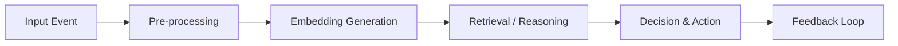

## Introduction

Autonomous agents—software entities that perceive, reason, and act without direct human supervision—are becoming the backbone of modern AI‑powered products. From conversational assistants that handle thousands of simultaneous chats to trading bots that react to market micro‑seconds, these agents must process **high‑velocity data**, **generate embeddings**, **make decisions**, and **persist outcomes** in real time.

Traditional monolithic architectures quickly hit scalability limits. The solution lies in **distributed streaming pipelines** that can ingest, transform, and route events at scale, combined with **real‑time vector processing** to perform similarity search, clustering, and retrieval on the fly.

This article walks through the architectural concepts, technical challenges, and practical implementation steps needed to scale autonomous agent workflows using modern streaming platforms (Kafka, Pulsar, Flink, Spark) and vector databases (Milvus, Pinecone, Vespa). By the end, you’ll have a blueprint you can adapt to your own projects.

---

## 1. Understanding Autonomous Agents and Their Workflows

### 1.1 What Is an Autonomous Agent?

An autonomous agent is a software component that:

1. **Perceives** input from sensors, APIs, or user interactions.
2. **Processes** the input using models (LLMs, reinforcement learning, rule engines).
3. **Acts** by producing output (messages, API calls, database writes).

Typical workflow stages:



### 1.2 Core Requirements

| Requirement | Why It Matters |
|-------------|----------------|
| **Low latency** | Agents must respond within milliseconds to seconds. |
| **High throughput** | A single service may handle tens of thousands of concurrent sessions. |
| **Statefulness** | Contextual memory (e.g., chat history) is essential for coherent behavior. |
| **Fault tolerance** | Downtime directly impacts user experience and revenue. |
| **Observability** | Debugging AI decisions needs end‑to‑end tracing. |

---

## 2. Challenges in Scaling Agent Workflows

1. **Burst traffic** – Sudden spikes (e.g., product launch) overwhelm synchronous APIs.
2. **Embedding bottlenecks** – Generating dense vectors for each request can be CPU/GPU intensive.
3. **State management** – Keeping per‑session context consistent across distributed nodes.
4. **Vector search latency** – Real‑time similarity lookups must finish within the overall response budget.
5. **Model versioning** – Rolling updates without breaking ongoing sessions.

Traditional request‑response stacks (REST + monolith) cannot satisfy these constraints at scale. A **stream‑first** architecture decouples ingestion, processing, and storage, enabling independent scaling.

---

## 3. Distributed Streaming Pipelines: Foundations

### 3.1 Message Brokers

| Broker | Strengths | Typical Use‑Case |
|--------|-----------|------------------|
| **Apache Kafka** | High throughput, durable log, strong ordering guarantees | Event sourcing, replayable streams |
| **Apache Pulsar** | Multi‑tenant, built‑in geo‑replication, tiered storage | Cloud‑native micro‑services |
| **NATS JetStream** | Lightweight, low latency, easy ops | Edge deployments, IoT |

All provide **topic partitions** that allow horizontal scaling: each partition can be consumed by a separate processing instance.

### 3.2 Stream Processing Engines

| Engine | Language | Stateful Processing | Exactly‑once Guarantees |
|--------|----------|---------------------|--------------------------|
| **Apache Flink** | Java/Scala/Python | ✅ (Keyed state, timers) | ✅ |
| **Spark Structured Streaming** | Scala/Python/SQL | ✅ (State stores) | ✅ (with checkpointing) |
| **Apache Beam** (runner‑agnostic) | Java/Python/Go | ✅ (via runners) | ✅ (depends on runner) |
| **Kafka Streams** | Java | ✅ (local state stores) | ✅ |

These engines consume from brokers, apply transformations (e.g., enrich with embeddings), and write results downstream (vector stores, databases, or other topics).

---

## 4. Real‑Time Vector Processing: Why It Matters

### 4.1 Vector Representations

Dense vectors (embeddings) capture semantic meaning of text, images, or sensor data. For agents, vectors are used to:

- Retrieve relevant documents or past interactions (RAG – Retrieval‑Augmented Generation).
- Perform similarity‑based routing (send a request to the most capable model).
- Detect anomalies in streaming sensor data.

### 4.2 Approximate Nearest Neighbor (ANN) Search

Exact nearest neighbor search is O(N) and impractical for millions of vectors. ANN algorithms (HNSW, IVF‑PQ, ScaNN) trade a tiny amount of accuracy for orders‑of‑magnitude speed.

Key metrics:

| Metric | Description |
|--------|-------------|
| **Recall@k** | Fraction of true nearest neighbors found among top‑k results |
| **Latency (ms)** | Time for a single query |
| **Throughput (qps)** | Queries per second the system can sustain |

Choosing the right index type and configuration is critical for meeting real‑time SLAs.

---

## 5. Integrating Streaming Pipelines with Vector Stores

### 5.1 High‑Level Architecture

```
┌───────────────┐   ┌─────────────┐   ┌─────────────────────┐
│   Producers   │──►│  Broker (K) │──►│ Stream Processor (F)│
└───────────────┘   └─────────────┘   └───────┬─────────────┘
                                             │
                                   ┌─────────▼─────────┐
                                   │ Embedding Service │
                                   └─────────┬─────────┘
                                             │
                                   ┌─────────▼─────────┐
                                   │ Vector DB (Milvus│
                                   │   / Pinecone)    │
                                   └─────────┬─────────┘
                                             │
                                   ┌─────────▼─────────┐
                                   │   Agent Executor │
                                   └───────────────────┘
```

1. **Producers** (frontend, IoT devices, API gateways) push raw events to a Kafka topic.
2. **Stream Processor** (Flink) enriches events, generates embeddings via a remote model service, and writes vectors to a vector DB.
3. **Agent Executor** (Ray, Dask, or custom service) reads the enriched event, performs retrieval against the vector DB, runs the reasoning model, and emits the final action.

### 5.2 Data Flow Example

| Step | Input | Transformation | Output |
|------|-------|----------------|--------|
| 1 | `{"session_id":"abc","message":"How do I reset my password?"}` | None | Kafka topic `raw_requests` |
| 2 | Consume → **Pre‑process** (tokenization, language detection) | `{"session_id":"abc","clean_text":"reset password"}` |
| 3 | **Embedding Service** (Sentence‑Transformers) | Dense vector `float[768]` | `{"session_id":"abc","vector":[...],"timestamp":...}` |
| 4 | Write vector to **Milvus** collection `session_context` (sharded) |
| 5 | **Agent Executor** queries Milvus for top‑k similar contexts, feeds to LLM, returns response. |
| 6 | Publish response to `agent_responses` topic for downstream consumption (UI, logging). |

---

## 6. Practical Implementation

Below is a minimal, end‑to‑end example using **Kafka**, **Flink (Python API)**, **Sentence‑Transformers**, and **Milvus**. The code is intentionally concise but functional.

### 6.1 Prerequisites

```bash
# Kafka & Zookeeper (Docker)
docker run -d --name zookeeper -p 2181:2181 confluentinc/cp-zookeeper:7.5.0
docker run -d --name kafka -p 9092:9092 \
  -e KAFKA_ZOOKEEPER_CONNECT=host.docker.internal:2181 \
  -e KAFKA_ADVERTISED_LISTENERS=PLAINTEXT://host.docker.internal:9092 \
  -e KAFKA_OFFSETS_TOPIC_REPLICATION_FACTOR=1 \
  confluentinc/cp-kafka:7.5.0

# Milvus (Docker)
docker run -d --name milvus-standalone -p 19530:19530 -p 19121:19121 milvusdb/milvus:2.4.0

# Python dependencies
pip install apache-flink sentence-transformers pymilvus kafka-python
```

### 6.2 Create Kafka Topics

```bash
kafka-topics --bootstrap-server localhost:9092 --create --topic raw_requests --partitions 6 --replication-factor 1
kafka-topics --bootstrap-server localhost:9092 --create --topic enriched_requests --partitions 6 --replication-factor 1
```

### 6.3 Flink Job (Python)

```python
# flink_job.py
from pyflink.datastream import StreamExecutionEnvironment, TimeCharacteristic
from pyflink.common.typeinfo import Types
from pyflink.datastream.connectors import FlinkKafkaConsumer, FlinkKafkaProducer
import json
from sentence_transformers import SentenceTransformer
from pymilvus import connections, Collection, utility, FieldSchema, CollectionSchema, DataType

# ---------- 1. Setup ----------
env = StreamExecutionEnvironment.get_execution_environment()
env.set_parallelism(4)
env.set_stream_time_characteristic(TimeCharacteristic.EventTime)

# ---------- 2. Kafka Source ----------
kafka_props = {
    'bootstrap.servers': 'localhost:9092',
    'group.id': 'flink-embedder',
    'auto.offset.reset': 'earliest'
}
raw_consumer = FlinkKafkaConsumer(
    topics='raw_requests',
    deserialization_schema=Types.STRING(),
    properties=kafka_props
)
raw_stream = env.add_source(raw_consumer).map(lambda x: json.loads(x), output_type=Types.MAP(Types.STRING(), Types.STRING()))

# ---------- 3. Embedding Service ----------
model = SentenceTransformer('all-MiniLM-L6-v2')  # small, fast

def embed(event):
    text = event.get('message', '')
    vector = model.encode(text).tolist()
    event['vector'] = vector
    return event

embedded_stream = raw_stream.map(embed, output_type=Types.MAP(Types.STRING(), Types.PICKLED_BYTE_ARRAY()))

# ---------- 4. Write to Milvus ----------
connections.connect(alias='default', host='localhost', port='19530')

if not utility.has_collection('session_vectors'):
    fields = [
        FieldSchema(name='id', dtype=DataType.INT64, is_primary=True, auto_id=True),
        FieldSchema(name='session_id', dtype=DataType.VARCHAR, max_length=64),
        FieldSchema(name='vector', dtype=DataType.FLOAT_VECTOR, dim=384)
    ]
    schema = CollectionSchema(fields, description='Session embeddings')
    Collection(name='session_vectors', schema=schema)

collection = Collection('session_vectors')

def upsert(event):
    ids = []  # Milvus auto‑generates IDs
    session_ids = [event['session_id']]
    vectors = [event['vector']]
    collection.insert([ids, session_ids, vectors])
    # Pass downstream unchanged
    return json.dumps(event)

milvus_stream = embedded_stream.map(upsert, output_type=Types.STRING())

# ---------- 5. Kafka Sink ----------
producer = FlinkKafkaProducer(
    topic='enriched_requests',
    serialization_schema=Types.STRING(),
    producer_config=kafka_props
)
milvus_stream.add_sink(producer)

env.execute('AgentEmbeddingPipeline')
```

**Explanation**:

- **Parallelism** of 4 ensures each partition is processed by a separate task slot.
- **Sentence‑Transformer** runs on CPU; for higher throughput, replace with a GPU‑accelerated model or a micro‑service behind a REST endpoint.
- **Milvus** collection uses a **HNSW** index (default) for low‑latency ANN queries.
- The same enriched event is forwarded to another Kafka topic for downstream agents.

### 6.4 Agent Executor (Ray)

```python
# executor.py
import ray
import json
from pymilvus import connections, Collection
from openai import OpenAI  # placeholder for any LLM API

ray.init(address='auto')  # Connect to Ray cluster

connections.connect(alias='default', host='localhost', port='19530')
vector_col = Collection('session_vectors')

openai_client = OpenAI(api_key='YOUR_API_KEY')

@ray.remote
def process_event(event_json):
    event = json.loads(event_json)
    query_vec = event['vector']
    # Retrieve top‑3 similar contexts
    results = vector_col.search(
        data=[query_vec],
        anns_field='vector',
        param={"metric_type": "IP", "params": {"ef": 64}},
        limit=3,
        expr=None,
        output_fields=['session_id']
    )
    context = " ".join([hit.entity.get('session_id') for hit in results[0]])
    prompt = f"User query: {event['message']}\nRelevant context: {context}\nAnswer concisely."
    response = openai_client.ChatCompletion.create(
        model='gpt-4o-mini',
        messages=[{'role': 'user', 'content': prompt}]
    )
    return {
        'session_id': event['session_id'],
        'answer': response.choices[0].message.content
    }

# Simple driver that consumes enriched_requests
from kafka import KafkaConsumer, KafkaProducer

consumer = KafkaConsumer('enriched_requests',
                         bootstrap_servers='localhost:9092',
                         auto_offset_reset='earliest',
                         group_id='executor')
producer = KafkaProducer(bootstrap_servers='localhost:9092')

for msg in consumer:
    future = process_event.remote(msg.value.decode())
    result = ray.get(future)
    producer.send('agent_responses', json.dumps(result).encode())
```

**Key points**:

- **Ray** provides a flexible pool of workers that can autoscale based on pending tasks.
- The executor pulls the enriched event, performs **real‑time ANN search**, builds a prompt, and calls an LLM.
- The final answer is published to `agent_responses`, ready for UI consumption.

### 6.5 Scaling Tips

| Component | Scaling Strategy |
|-----------|------------------|
| Kafka | Increase partitions, enable **log compaction** for state topics. |
| Flink | Use **Keyed Streams** to keep per‑session state local; add **TaskManager** nodes. |
| Embedding Service | Deploy as a **Kubernetes Deployment** with GPU nodes; use **batch inference** for bursts. |
| Milvus | Enable **sharding** (multiple query nodes) and **replicas** for high availability. |
| Ray | Configure **autoscaler** to spin up additional workers when queue length > threshold. |

---

## 7. Orchestration with Ray / Dask for Agent Execution

While the previous example uses a simple Ray remote function, production systems often need **workflow orchestration**:

- **Ray DAGs** (`ray.workflow`) allow you to define a directed acyclic graph where each node can be a model call, retrieval, or side‑effect.
- **Dask Distributed** offers similar task graphs with fine‑grained control over data locality.

Example of a Ray workflow that includes **state persistence** in Redis:

```python
import ray
import redis
from ray import workflow

redis_client = redis.StrictRedis(host='localhost', port=6379, db=0)

@workflow.step
def retrieve_context(session_id, query_vec):
    results = vector_col.search(
        data=[query_vec],
        anns_field='vector',
        param={"metric_type": "IP", "params": {"ef": 64}},
        limit=5
    )
    return [hit.id for hit in results[0]]

@workflow.step
def generate_answer(session_id, context_ids, user_msg):
    # Fetch raw context from Redis (cached)
    contexts = [redis_client.get(cid).decode() for cid in context_ids]
    prompt = f"User: {user_msg}\nContext: {' '.join(contexts)}"
    resp = openai_client.ChatCompletion.create(
        model='gpt-4o-mini', messages=[{'role':'user','content':prompt}]
    )
    return resp.choices[0].message.content

def run_agent(session_id, message, query_vec):
    ctx = retrieve_context.step(session_id, query_vec)
    answer = generate_answer.step(session_id, ctx, message)
    return answer.run()
```

Workflows survive worker failures and can be **re‑executed** from the last successful step, providing robustness for long‑running reasoning pipelines.

---

## 8. Fault Tolerance, Scaling, and Performance Optimizations

### 8.1 Backpressure Management

- **Kafka** provides consumer lag metrics; Flink automatically throttles sources when downstream operators cannot keep up.
- Use **watermarks** to handle out‑of‑order events while preserving event‑time semantics.

### 8.2 Vector Index Sharding

Milvus allows **partitioning** on a logical field (e.g., `session_id` prefix). Sharding reduces query scope, leading to sub‑millisecond latency even with billions of vectors.

```python
# Example: create partition per day
collection.create_partition(partition_name='2024-09-01')
collection.insert(..., partition_name='2024-09-01')
```

### 8.3 Model Caching

- **Embedding caching**: Store recent message embeddings in an in‑memory LRU cache (Redis, Memcached). Avoid recomputation for repeated queries.
- **LLM prompt caching**: If the same context‑plus‑question pair appears, reuse the previous response.

### 8.4 Monitoring & Alerting

| Metric | Tool | Threshold |
|--------|------|-----------|
| Kafka consumer lag | Prometheus + Grafana | > 10,000 msgs |
| Flink checkpoint duration | Flink UI / Prometheus | > 30 s |
| Milvus query latency | Milvus Dashboard | > 5 ms |
| Ray worker CPU utilization | Ray Dashboard | < 30 % (scale up) |
| Embedding service error rate | OpenTelemetry | > 1 % |

Instrument each component with **OpenTelemetry** traces that propagate a `trace_id` from the original request through Kafka, Flink, vector DB, and LLM call. This end‑to‑end visibility is essential for debugging AI reasoning errors.

---

## 9. Real‑World Use Cases

### 9.1 Customer‑Support Chatbots

- **Problem**: Millions of daily chats, each requiring context from prior interactions.
- **Solution**: Use Kafka to ingest chat messages, Flink to generate embeddings, Milvus to retrieve the most relevant past tickets, and a LLM to draft a response. Latency can be kept under **200 ms** per turn.

### 9.2 Autonomous Trading Bots

- **Problem**: Sub‑millisecond reaction to market microstructure data.
- **Solution**: Stream market ticks through Pulsar, compute price‑movement embeddings, store in a low‑latency vector index (e.g., **FAISS** on GPU), and trigger a reinforcement‑learning policy when a similarity threshold is crossed.

### 9.3 IoT Edge Analytics

- **Problem**: Edge devices generate high‑frequency sensor vectors (audio, video frames) that need immediate anomaly detection.
- **Solution**: Edge nodes run a lightweight Flink job, push embeddings to a central Milvus cluster, and return alerts in real time. The distributed pipeline enables **horizontal scaling** as the fleet grows.

---

## 10. Security and Data Governance

1. **Encryption in transit** – Enable TLS for Kafka, gRPC for Milvus, and HTTPS for model services.
2. **Access control** – Use Kafka ACLs, Milvus RBAC, and Ray’s role‑based permissions.
3. **PII redaction** – Apply a pre‑processing step that masks or hashes personally identifiable information before embedding generation.
4. **Audit logging** – Store a cryptographic hash of each request and response in an immutable log (e.g., AWS QLDB or Azure Confidential Ledger) for compliance.

---

## Conclusion

Scaling autonomous agent workflows is no longer a “nice‑to‑have” but a **necessity** for any AI‑first product that expects real‑world traffic. By **decoupling ingestion, enrichment, and decision making** through distributed streaming pipelines, and by **leveraging real‑time vector processing** for semantic retrieval, you can achieve:

- **Sub‑second end‑to‑end latency** even under heavy load.
- **Elastic scalability** across cloud, on‑prem, and edge environments.
- **Robust fault tolerance** via checkpointing, replayable logs, and workflow orchestration.
- **Observability** that spans from raw event to LLM answer.

The reference implementation above—Kafka + Flink + Sentence‑Transformers + Milvus + Ray—demonstrates a production‑grade stack that can be swapped for equivalents (Pulsar, Spark, Pinecone, Dask) depending on existing technology investments.

Start by **instrumenting your current agent pipeline**, identify the bottlenecks (embedding latency, vector search, state handling), and gradually replace monolithic components with the streaming‑first equivalents described. The payoff is a future‑proof architecture capable of handling the next generation of autonomous AI agents.

---

## Resources

- **Apache Flink Documentation** – Comprehensive guide to stateful stream processing: <https://nightlies.apache.org/flink/flink-docs-release-1.18/>
- **Milvus Vector Database** – Open‑source ANN search engine with GPU acceleration: <https://milvus.io/>
- **Ray Distributed Execution** – Scalable Python framework for AI workloads: <https://docs.ray.io/en/latest/>
- **Kafka Streams vs. Flink** – Comparative analysis for streaming pipelines: <https://www.confluent.io/blog/kafka-streams-vs-apache-flink/>
- **Real‑Time Retrieval‑Augmented Generation** – Research paper on RAG with streaming: <https://arxiv.org/abs/2305.07009>
- **OpenTelemetry for AI** – Best practices for tracing LLM pipelines: <https://opentelemetry.io/>