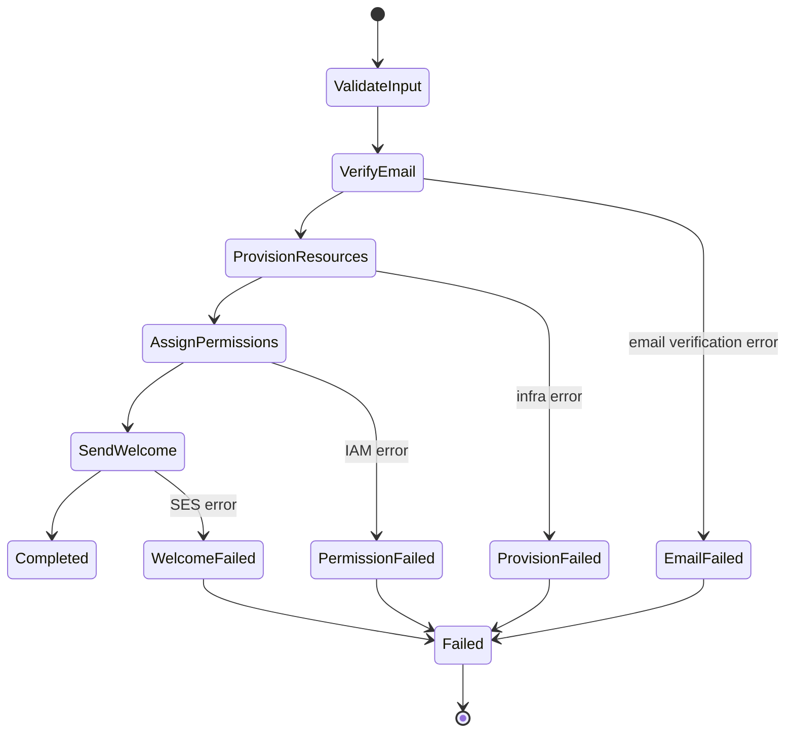

## Introduction

Serverless computing has reshaped the way developers think about **scalability**, **cost**, and **operational overhead**. By abstracting away servers, containers, and clusters, platforms such as AWS Lambda, Azure Functions, and Google Cloud Functions let you focus on *business logic* rather than infrastructure plumbing. Yet, as applications become more autonomous—think autonomous bots, intelligent workflow orchestrators, or self‑healing micro‑services—the need for **predictable, reproducible, and testable behavior** grows dramatically.

Enter **deterministic state machines**. A deterministic state machine (DSM) guarantees that, given the same sequence of inputs, it will always transition through the exact same series of states and produce the same outputs. This property is a powerful antidote to the nondeterminism that creeps into distributed, event‑driven systems, especially when you combine them with **agentic behavior**—behaviors that appear purposeful, adaptive, and often self‑directed.

In this article we will:

1. **Define** deterministic state machines and why determinism matters in serverless environments.  
2. **Explore** the concept of *agentic* behavior and how it maps onto state‑machine abstractions.  
3. **Show** concrete design patterns for building complex, deterministic workflows using serverless orchestration services (AWS Step Functions, Azure Durable Functions, Google Cloud Workflows).  
4. **Provide** end‑to‑end code examples that illustrate how to model, test, and debug deterministic agents at scale.  
5. **Discuss** operational considerations—idempotency, state persistence, versioning, and observability.  
6. **Summarize** best practices and give readers a checklist for production‑grade implementations.

By the end of this guide, you should have a clear roadmap for turning any sophisticated agentic requirement into a deterministic, serverless‑friendly state machine that is **easy to reason about, test, and evolve**.

---

## 1. Foundations of Deterministic State Machines

### 1.1 What Is a Deterministic State Machine?

A deterministic state machine (DSM) is a formal model consisting of:

| Component | Description |
|-----------|-------------|
| **States (S)** | A finite set of distinct conditions the system can be in (e.g., `Idle`, `FetchingData`, `Processing`, `Completed`). |
| **Inputs (I)** | External events or messages that trigger transitions (e.g., HTTP request, message queue event). |
| **Transition Function (δ)** | A pure function `δ: S × I → S` that maps a current state and an input to a *single* next state. |
| **Outputs (O)** | Optional side‑effects produced during a transition (e.g., API call, database write). |
| **Initial State (s₀)** | The state where the machine starts execution. |

Determinism means **for every (state, input) pair, the transition function yields exactly one next state**. No randomness, no race conditions, no hidden side‑effects.

> **Note:** Determinism does **not** forbid asynchronous operations. It merely requires that the *observable* state progression be reproducible given the same input sequence.

### 1.2 Why Determinism in Serverless?

1. **Stateless Execution Model** – Serverless functions are invoked independently, often in parallel. Deterministic state machines provide a *single source of truth* for the overall workflow, preventing divergent outcomes.
2. **Observability & Debugging** – With a deterministic transition map, you can replay a trace (e.g., an AWS X‑Ray segment) and guarantee that the same inputs will lead to the same output. This is essential for root‑cause analysis.
3. **Testing & CI/CD** – Unit tests can model the entire workflow by feeding a deterministic input sequence, ensuring repeatable pass/fail criteria.
4. **Idempotency Guarantees** – Deterministic machines naturally enforce idempotent state transitions, which aligns with the at‑least‑once delivery semantics of many serverless event sources.
5. **Cost Predictability** – Since each transition is well‑defined, you can estimate the number of function invocations and thus forecast the cost.

### 1.3 Formal Verification Benefits

Deterministic models can be fed into model‑checking tools (e.g., TLA+, Alloy) to verify properties like:

- **Safety** – “The system never reaches an invalid state.”
- **Liveness** – “Every request eventually reaches a `Completed` state.”
- **Dead‑lock Freedom** – “No state is a sink without outgoing transitions.”

These checks are especially valuable when you embed *agentic decision logic* that must respect business rules.

---

## 2. Agentic Behavior: From Autonomy to Determinism

### 2.1 Defining Agentic Behavior

In the context of software, *agentic* refers to components that:

- **Perceive** their environment (via events, sensors, or API calls).  
- **Reason** about goals (using rules, policies, or AI models).  
- **Act** to achieve those goals (invoking services, emitting events).  

Classic AI textbooks describe an *agent* as an entity that *chooses actions based on its internal state and external observations*. When you map this to a serverless architecture, each *agent* often corresponds to a **workflow** that orchestrates multiple functions.

### 2.2 Challenges of Agentic Systems in Serverless

| Challenge | Why It Matters | Typical Symptom |
|-----------|----------------|-----------------|
| **State Explosion** | Each decision point can lead to many possible outcomes. | Complex, hard‑to‑read workflow definitions. |
| **Nondeterministic AI Models** | Machine‑learning inference can be stochastic (e.g., dropout). | Different outputs for the same input across invocations. |
| **Eventual Consistency** | Distributed data stores may lag, causing divergent views. | Agents make decisions based on stale data. |
| **Version Drift** | Updating a function without synchronizing the workflow can create mismatched expectations. | Unexpected failures after deployment. |

### 2.3 Making Agentic Logic Deterministic

1. **Pure Input Normalization** – Convert all external data into a canonical, deterministic representation (e.g., sort JSON keys, round timestamps).  
2. **Deterministic ML Inference** – Freeze random seeds, disable stochastic layers, or use *deterministic inference* libraries (e.g., ONNX Runtime with deterministic flag).  
3. **Explicit State Versioning** – Store each state transition with a version identifier; reject stale events.  
4. **Event Sourcing** – Treat every input as an immutable event; reconstruct state by replaying events in order.  

By applying these constraints, the *agent* becomes a deterministic state machine that can still exhibit sophisticated, adaptive behavior.

---

## 3. Serverless Orchestration Services as DSM Engines

Several cloud providers ship *workflow orchestration* services that embody deterministic state machines under the hood. We’ll examine three major players and highlight their deterministic guarantees.

### 3.1 AWS Step Functions

- **Model**: JSON/YAML state machine definition (`Amazon States Language`).  
- **Determinism Guarantees**: Each `Task` state waits for the invoked Lambda (or other service) to complete before moving on; retries and catches are explicit.  
- **Key Features for Agents**:
  - **Choice State** – Branching based on deterministic conditions.  
  - **Map State** – Parallel iteration over a collection with guaranteed ordering if you set `maxConcurrency: 1`.  
  - **Callback Pattern** – Enables long‑running activities while preserving state.

#### Example: A Simple Autonomous Order Processor

```yaml
# order-processor.asl.yaml
Comment: "Deterministic order processing workflow"
StartAt: ValidateOrder
States:
  ValidateOrder:
    Type: Task
    Resource: arn:aws:lambda:us-east-1:123456789012:function:ValidateOrder
    Next: ChooseFulfillment
  ChooseFulfillment:
    Type: Choice
    Choices:
      - Variable: "$.order.type"
        StringEquals: "digital"
        Next: DeliverDigital
      - Variable: "$.order.type"
        StringEquals: "physical"
        Next: ReserveInventory
    Default: FailInvalid
  DeliverDigital:
    Type: Task
    Resource: arn:aws:lambda:us-east-1:123456789012:function:DeliverDigital
    End: true
  ReserveInventory:
    Type: Task
    Resource: arn:aws:lambda:us-east-1:123456789012:function:ReserveInventory
    Next: ShipPhysical
  ShipPhysical:
    Type: Task
    Resource: arn:aws:lambda:us-east-1:123456789012:function:ShipPhysical
    End: true
  FailInvalid:
    Type: Fail
    Error: "InvalidOrder"
    Cause: "Order type not recognized"
```

*Deterministic aspects*:

- Each state transition is defined explicitly.
- No hidden side‑effects; the only external influences are the Lambda inputs/outputs, which we make deterministic by normalizing payloads.

### 3.2 Azure Durable Functions

- **Model**: C# / JavaScript orchestrator functions written as *deterministic* code. The runtime records every awaited call as a **history event**, enabling replay.  
- **Determinism Guarantees**: The orchestrator is **single‑threaded** and cannot call non‑deterministic APIs directly (e.g., `DateTime.Now` is prohibited).  

#### Example: Agentic Chatbot Conversation Handler (JavaScript)

```javascript
// orchestrator.js
const df = require("durable-functions");

module.exports = df.orchestrator(function* (context) {
  const input = context.bindingData.input; // { userId, message }

  // Normalized deterministic input
  const normalized = {
    userId: input.userId,
    message: input.message.trim().toLowerCase()
  };

  // Call deterministic NLP inference (deterministic model)
  const intent = yield context.df.callActivity("ClassifyIntent", normalized);

  switch (intent) {
    case "order_status":
      return yield context.df.callActivity("FetchOrderStatus", normalized);
    case "cancel_order":
      return yield context.df.callActivity("CancelOrder", normalized);
    default:
      return "I'm sorry, I didn't understand that.";
  }
});
```

Key points:

- The orchestrator never uses non‑deterministic APIs.
- All side‑effects are delegated to **activity functions**, whose results are captured in the orchestration history, allowing deterministic replay.

### 3.3 Google Cloud Workflows

- **Model**: YAML/JSON DSL that composes Cloud Functions, Cloud Run, and other GCP services.  
- **Determinism Guarantees**: Each step’s output is stored in the workflow’s execution state; retries are declarative.  

#### Example: Incident Response Agent (YAML)

```yaml
# incident-response.yaml
main:
  params: [event]
  steps:
    - init:
        assign:
          - incidentId: ${event.incidentId}
          - severity: ${event.severity}
    - fetchDetails:
        call: http.get
        args:
          url: https://incident-api.mycompany.com/${incidentId}
        result: incident
    - decide:
        switch:
          - condition: ${severity == "high"}
            next: notifyOps
          - condition: ${severity == "low"}
            next: logOnly
    - notifyOps:
        call: http.post
        args:
          url: https://ops-alerts.mycompany.com
          body:
            incidentId: ${incidentId}
            severity: ${severity}
        result: notification
        next: end
    - logOnly:
        call: http.post
        args:
          url: https://log-service.mycompany.com
          body:
            incidentId: ${incidentId}
            severity: ${severity}
        next: end
    - end:
        return: "Handled"
```

Deterministic aspects:

- The `switch` statement enforces a single deterministic path.
- All external calls are wrapped; retries and back‑offs are defined, preventing hidden nondeterminism.

---

## 4. Designing Deterministic Agentic Workflows

Now that we understand the building blocks, let’s walk through a **design methodology** that scales from a simple proof‑of‑concept to a production‑grade, multi‑agent system.

### 4.1 Step‑by‑Step Design Process

1. **Define the Agent’s Goal**  
   - Write a one‑sentence mission statement (e.g., “Automatically reconcile inventory across warehouses after each order”).  

2. **Identify Observable Inputs**  
   - List all events that can affect the agent (order placed, inventory update, manual adjustment).  

3. **Model the State Space**  
   - Sketch a state diagram (paper or Mermaid).  
   - Ensure *finite* and *well‑named* states (e.g., `Idle → FetchOrder → Validate → Reserve → Confirm → Completed`).  

4. **Specify Deterministic Transitions**  
   - For each (state, input) pair, define a unique next state.  
   - Use pure functions for *decision logic* (e.g., `function decideNext(state, input) { … }`).  

5. **Select Orchestration Platform**  
   - Pick AWS Step Functions, Azure Durable Functions, or Google Cloud Workflows based on ecosystem, latency, and cost.  

6. **Implement Activities/Tasks**  
   - Keep each task **idempotent**.  
   - Avoid side‑effects that depend on mutable global state (e.g., random IDs).  

7. **Add Observability Hooks**  
   - Emit structured logs and metrics at each transition.  
   - Capture the *input, state, output* triple for replay.  

8. **Write Test Harness**  
   - Use a deterministic event generator to feed sequences into the state machine.  
   - Verify that the final state matches expectations.  

9. **Version & Deploy**  
   - Tag each workflow definition (e.g., `v1.2.0`).  
   - Use *blue‑green* deployment: route a small percentage of traffic to the new version and verify deterministic behavior before full cutover.  

10. **Monitor & Iterate**  
    - Set alerts on unexpected state transitions (e.g., entering a “Error” state more than 0.1% of the time).  

### 4.2 Practical Example: Multi‑Step Customer Onboarding Agent (AWS)

#### 4.2.1 Business Goal

> Automatically onboard a new SaaS customer: verify email, provision resources, assign permissions, and send a welcome email—*all* while guaranteeing that the same input (customer data) always results in the same outcome.

#### 4.2.2 State Diagram (Mermaid)



#### 4.2.3 Step Functions Definition (YAML)

```yaml
# onboarding-workflow.asl.yaml
Comment: "Deterministic onboarding workflow for SaaS customers"
StartAt: ValidateInput
States:
  ValidateInput:
    Type: Task
    Resource: arn:aws:lambda:us-east-1:123456789012:function:ValidateCustomer
    Next: VerifyEmail
  VerifyEmail:
    Type: Task
    Resource: arn:aws:lambda:us-east-1:123456789012:function:VerifyEmail
    Retry:
      - ErrorEquals: ["EmailService.Timeout"]
        IntervalSeconds: 2
        MaxAttempts: 3
    Catch:
      - ErrorEquals: ["EmailService.*"]
        Next: EmailFailed
    Next: ProvisionResources
  EmailFailed:
    Type: Fail
    Error: "EmailVerificationFailed"
    Cause: "Unable to verify customer email after retries"
  ProvisionResources:
    Type: Task
    Resource: arn:aws:lambda:us-east-1:123456789012:function:ProvisionInfrastructure
    Retry:
      - ErrorEquals: ["Infra.ServiceUnavailable"]
        IntervalSeconds: 3
        MaxAttempts: 2
    Catch:
      - ErrorEquals: ["Infra.*"]
        Next: ProvisionFailed
    Next: AssignPermissions
  ProvisionFailed:
    Type: Fail
    Error: "ProvisionFailed"
    Cause: "Infrastructure provisioning error"
  AssignPermissions:
    Type: Task
    Resource: arn:aws:lambda:us-east-1:123456789012:function:AssignIAMRoles
    Catch:
      - ErrorEquals: ["IAM.*"]
        Next: PermissionFailed
    Next: SendWelcome
  PermissionFailed:
    Type: Fail
    Error: "PermissionAssignmentFailed"
    Cause: "IAM role assignment error"
  SendWelcome:
    Type: Task
    Resource: arn:aws:lambda:us-east-1:123456789012:function:SendWelcomeEmail
    Catch:
      - ErrorEquals: ["SES.*"]
        Next: WelcomeFailed
    End: true
  WelcomeFailed:
    Type: Fail
    Error: "WelcomeEmailFailed"
    Cause: "SES delivery error"
```

#### 4.2.4 Deterministic Guarantees

- **Retry Policies** are *explicit*; after the maximum attempts, the workflow fails deterministically.
- **Idempotent Lambdas**: Each Lambda checks for an existing `customerId` record before creating resources, making repeated invocations safe.
- **No Time‑Dependent Logic**: `ValidateInput` strips timestamps and sorts fields, ensuring the same payload always maps to the same internal representation.

#### 4.2.5 Testing Harness (Node.js)

```javascript
// test/onboarding.test.js
const { SFNClient, StartExecutionCommand } = require("@aws-sdk/client-sfn");
const assert = require("assert");

const client = new SFNClient({ region: "us-east-1" });
const stateMachineArn = process.env.ONBOARDING_ARN;

async function runTest(payload, expectedFinalState) {
  const cmd = new StartExecutionCommand({
    stateMachineArn,
    input: JSON.stringify(payload),
    name: `test-${Date.now()}`
  });

  const { executionArn } = await client.send(cmd);
  // Simple polling (in real tests use SFN SDK waiters)
  let status = "RUNNING";
  let result;
  while (status === "RUNNING") {
    const { describeExecution } = await client.send(
      new DescribeExecutionCommand({ executionArn })
    );
    status = describeExecution.status;
    result = describeExecution.output;
    if (status === "FAILED") throw new Error(`Execution failed: ${describeExecution.cause}`);
    await new Promise(r => setTimeout(r, 500));
  }

  const output = JSON.parse(result);
  assert.strictEqual(output.state, expectedFinalState, "Final state mismatch");
}

// Deterministic payload (sorted keys, no timestamps)
const payload = {
  customer: {
    email: "alice@example.com",
    name: "Alice",
    plan: "pro"
  }
};

runTest(payload, "Completed")
  .then(() => console.log("Deterministic onboarding test passed"))
  .catch(err => console.error("Test failed:", err));
```

The test demonstrates **replayability**: the same JSON payload always leads to a `Completed` state (or a deterministic failure state if any step fails).

---

## 5. Operational Concerns

### 5.1 State Persistence & Event Sourcing

Even though the orchestration service keeps the current state, you often need **application‑level persistence** (e.g., a database record of the agent’s progress). A common pattern:

1. **Emit an Event** (`AgentStateChanged`) after each transition.  
2. **Store** the event in an immutable log (e.g., DynamoDB Streams, Azure Event Hubs, Pub/Sub).  
3. **Reconstruct** the agent’s state by replaying events.  

This provides *auditability* and a *single source of truth* even if the orchestration service is replaced.

### 5.2 Idempotency Strategies

- **Deterministic Keys**: Derive primary keys from input data (e.g., `hash(customer.email)`).  
- **Conditional Writes**: Use DynamoDB’s `ConditionExpression` or Cloud Firestore’s `precondition` to prevent duplicate writes.  
- **At‑Least‑Once vs Exactly‑Once**: Serverless event sources are typically at‑least‑once; your state machine must tolerate duplicate inputs without diverging.

### 5.3 Versioning and Migration

When you evolve the agent’s logic:

- **Semantic Versioning**: Tag each workflow definition (`v1.0.0`, `v1.1.0`).  
- **Compatibility Checks**: Ensure that older events can still be processed by newer versions (or provide a migration step).  
- **Canary Deployment**: Run a small fraction of traffic on the new version and compare the deterministic output against the baseline.

### 5.4 Observability

| Metric | Why It Matters |
|--------|-----------------|
| **Transition Count** | Detect loops or unexpected retries. |
| **State Duration** | Spot bottlenecks (e.g., `ProvisionResources` taking longer than SLA). |
| **Error Rate per State** | Identify flaky external services. |
| **Execution Cost** | Correlate cost with state transitions to optimize. |

Use **structured logging** (JSON) with fields: `executionId`, `state`, `inputHash`, `outputHash`, `timestamp`. Correlate logs across services using the same `executionId`.

### 5.5 Security Considerations

- **Least‑Privilege IAM**: Each Lambda or Cloud Function should have permissions scoped to only the resources it needs for its state.  
- **Input Validation**: Since the state machine drives business-critical actions, sanitize all external inputs before they reach any task.  
- **Secrets Management**: Store API keys in managed secret stores (AWS Secrets Manager, Azure Key Vault) and inject them via environment variables at runtime.

---

## 6. Advanced Topics

### 6.1 Embedding Probabilistic Decision Making

Sometimes agents need to *choose* among equally viable actions (e.g., load‑balancing across regions). To preserve determinism:

1. **Deterministic Random Seed**: Derive a seed from a hash of the current state and input.  
2. **Pseudo‑Random Generator**: Use a pure functional PRNG (e.g., Xorshift) seeded deterministically.  

```python
def deterministic_choice(state_hash, choices):
    # Simple xorshift PRNG seeded with state hash
    seed = int(state_hash, 16) & 0xffffffff
    seed ^= (seed << 13) & 0xffffffff
    seed ^= (seed >> 17)
    seed ^= (seed << 5) & 0xffffffff
    index = seed % len(choices)
    return choices[index]
```

Because the seed is derived from immutable data, the same input always yields the same choice.

### 6.2 Hierarchical State Machines (HSM)

Complex agents often benefit from **nested state machines**. For example, an e‑commerce order may have a *high‑level* state (`Processing`, `Shipped`, `Delivered`) and a *sub‑state* machine handling payment (`PaymentPending`, `PaymentAuthorized`, `PaymentFailed`).  

Both AWS Step Functions and Azure Durable Functions support **nested workflows**:

- In Step Functions, use **`Parallel`** states to launch sub‑workflows and **`Map`** for iteration.  
- In Durable Functions, **sub‑orchestrators** can be called with `callSubOrchestrator`.

Determinism is preserved as long as each sub‑workflow also adheres to deterministic principles.

### 6.3 Integrating LLMs While Maintaining Determinism

Large Language Models (LLMs) are inherently stochastic, but you can still incorporate them:

1. **Deterministic Prompt Engineering** – Include all variables in the prompt and sort them.  
2. **Temperature = 0** – Most providers expose a `temperature` parameter; setting it to `0` forces deterministic output.  
3. **Cache Responses** – Store the LLM response keyed by a hash of the prompt; reuse cached output for identical prompts.  

```javascript
// deterministic-llm.js
const crypto = require('crypto');
const cache = new Map();

async function queryLLM(prompt) {
  const key = crypto.createHash('sha256').update(prompt).digest('hex');
  if (cache.has(key)) return cache.get(key);
  
  const response = await fetch('https://api.openai.com/v1/completions', {
    method: 'POST',
    headers: { Authorization: `Bearer ${process.env.OPENAI_KEY}` },
    body: JSON.stringify({
      model: 'gpt-4',
      prompt,
      temperature: 0,
      max_tokens: 150
    })
  }).then(r => r.json());

  cache.set(key, response.choices[0].text.trim());
  return response.choices[0].text.trim();
}
```

By caching and using `temperature: 0`, the LLM becomes a deterministic oracle for the workflow.

---

## 7. Checklist for Production‑Ready Deterministic Agents

- [ ] **Goal Definition** – Clear, measurable objective.  
- [ ] **Finite State Model** – All states enumerated, no hidden states.  
- [ ] **Deterministic Transition Logic** – Pure functions, no side‑effects.  
- [ ] **Idempotent Tasks** – Safe to retry or replay.  
- [ ] **Explicit Retry/Back‑off Policies** – No implicit timeouts.  
- [ ] **Input Normalization** – Canonical representation of all external data.  
- [ ] **Versioned Workflow Definitions** – Semantic versioning, immutable deployments.  
- [ ] **Observability Instrumentation** – Structured logs, metrics per state.  
- [ ] **Automated Test Suite** – Deterministic end‑to‑end tests covering success and failure paths.  
- [ ] **Security Hardened** – Least‑privilege IAM, secret management, input validation.  
- [ ] **Fail‑Safe Paths** – Graceful degradation and clear failure states.  

Running through this checklist reduces the risk of nondeterministic bugs slipping into production.

---

## Conclusion

Designing deterministic state machines for complex, agentic behavior in serverless architectures is a **discipline** as much as it is a technical challenge. By grounding your system in a **formal DSM model**, you gain:

- **Predictability** – Same inputs → same outcomes, no surprises.  
- **Scalability** – Serverless platforms can spin up parallel executions without risking race conditions.  
- **Testability** – Full replayability and model‑checking become feasible.  
- **Operational Simplicity** – Clear state diagrams translate directly into orchestrator definitions, making debugging and monitoring straightforward.  

When you combine these principles with modern orchestration services—AWS Step Functions, Azure Durable Functions, Google Cloud Workflows—you get a **robust, production‑grade platform** for autonomous agents that can adapt, learn, and act while remaining fully deterministic.

The journey from a simple state diagram to a multi‑region, fault‑tolerant, agentic service involves careful attention to **input normalization**, **idempotent task design**, **observable state transitions**, and **rigorous testing**. By following the methodology and patterns outlined in this article, you’ll be equipped to build sophisticated serverless agents that behave exactly as intended—today, tomorrow, and as your business evolves.

---

## Resources

- **AWS Step Functions – Amazon States Language** – Official documentation on defining deterministic workflows.  
  [https://docs.aws.amazon.com/step-functions/latest/dg/concepts-amazon-states-language.html](https://docs.aws.amazon.com/step-functions/latest/dg/concepts-amazon-states-language.html)

- **Azure Durable Functions – Orchestrator Patterns** – Guidance on building deterministic orchestrations in Azure.  
  [https://learn.microsoft.com/azure/azure-functions/durable/durable-functions-orchestrations](https://learn.microsoft.com/azure/azure-functions/durable/durable-functions-orchestrations)

- **Google Cloud Workflows – Best Practices** – Tips for creating reliable, deterministic workflows on GCP.  
  [https://cloud.google.com/workflows/docs/best-practices](https://cloud.google.com/workflows/docs/best-practices)

- **“Designing Data‑Intensive Applications” by Martin Kleppmann** – Chapter on deterministic processing and event sourcing, a solid theoretical foundation.  
  [https://dataintensive.net/](https://dataintensive.net/)

- **TLA+ Model Checking** – Tool for formally verifying state‑machine properties such as safety and liveness.  
  [https://lamport.azurewebsites.net/tla/tla.html](https://lamport.azurewebsites.net/tla/tla.html)

- **OpenAI API – Deterministic Completion** – Documentation on using temperature=0 for deterministic LLM outputs.  
  [https://platform.openai.com/docs/guides/completion/temperature](https://platform.openai.com/docs/guides/completion/