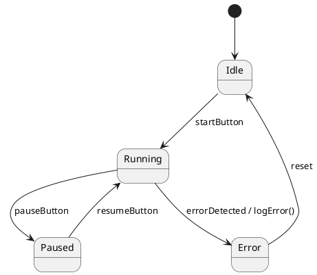

## Introduction

State machines are one of the most fundamental concepts in computer science and engineering. Whether you are building a graphical user interface, a network protocol, an embedded controller, or a complex business workflow, you are almost certainly dealing with a system that can be described as a collection of *states* and *transitions* between those states.  

In this article we will:

* Explain the theoretical foundations of state machines, from finite automata to modern extensions such as statecharts.
* Walk through a systematic design process, showing how to move from problem description to a concrete model.
* Provide practical code examples in multiple languages (Python, JavaScript, and C++) that illustrate common implementation patterns.
* Highlight real‑world domains where state machines shine, and discuss testing, debugging, and maintenance strategies.
* Point you to further reading and tools that can help you adopt state‑machine‑based design in your own projects.

By the end of this post you should be able to model, implement, and reason about stateful systems with confidence.

---

## Table of Contents
1. [What Is a State Machine?](#what-is-a-state-machine)  
2. [Formal Foundations](#formal-foundations)  
3. [Common Variants](#common-variants)  
   - 3.1 [Finite State Machines (FSM)](#finite-state-machines)  
   - 3.2 [Mealy vs. Moore Machines](#mealy-vs-moore)  
   - 3.3 [Hierarchical State Machines (Statecharts)](#statecharts)  
   - 3.4 [Extended State Machines (EFSM)](#efsm)  
4. [Designing a State Machine](#designing-a-state-machine)  
   - 4.1 [Gather Requirements]  
   - 4.2 [Identify States & Events]  
   - 4.3 [Define Transitions & Actions]  
   - 4.4 [Choose a Representation]  
5. [Modeling Techniques](#modeling-techniques)  
   - 5.1 [State Diagrams]  
   - 5.2 [Transition Tables]  
   - 5.3 [UML State Machine Diagrams]  
6. [Implementation Strategies](#implementation-strategies)  
   - 6.1 [Switch‑Case / Conditional Logic]  
   - 6.2 [Table‑Driven Approach]  
   - 6.3 [Object‑Oriented State Pattern]  
   - 6.4 [Functional & Reactive Approaches]  
7. [Practical Code Examples](#practical-code-examples)  
   - 7.1 [Python Example]  
   - 7.2 [JavaScript (XState) Example]  
   - 7.3 [C++ Embedded Example]  
8. [Real‑World Applications](#real-world-applications)  
   - 8.1 [User Interface Navigation]  
   - 8.2 [Network Protocols]  
   - 8.3 [Industrial Automation]  
   - 8.4 [Business Workflow Engines]  
9. [Testing & Validation](#testing-validation)  
10 [Common Pitfalls & Best Practices](#common-pitfalls)  
11 [Advanced Topics](#advanced-topics)  
12 [Conclusion](#conclusion)  
13 [Resources](#resources)  

---

## What Is a State Machine?

At its core, a **state machine** (also called a **finite state automaton**) is an abstract computational model consisting of:

| Component | Description |
|-----------|-------------|
| **States** | Distinct configurations that the system can be in. One state is designated as the *initial* state. |
| **Events (or inputs)** | External stimuli that cause the system to consider a transition. |
| **Transitions** | Directed edges that connect a *source* state to a *target* state, typically labeled with an event and optionally an *action* or *guard* condition. |
| **Actions** | Operations performed when a transition occurs (e.g., sending a message, updating a variable). |
| **Guards** | Boolean predicates that must be true for the transition to be taken. |

When an event arrives, the machine checks the current state, evaluates any guard conditions, and if a matching transition exists, it executes the associated action(s) and moves to the next state. If no transition matches, the event is ignored or triggers an error.

> **Note:** The term “finite” refers to the fact that the set of states is limited and enumerable. However, many practical extensions allow for an *unbounded* amount of data (e.g., variables) while keeping the state space conceptually finite.

---

## Formal Foundations

Mathematically, a deterministic finite automaton (DFA) can be defined as a 5‑tuple **M = (Q, Σ, δ, q₀, F)** where:

* **Q** – finite set of states.
* **Σ** – finite input alphabet (events).
* **δ : Q × Σ → Q** – transition function.
* **q₀ ∈ Q** – initial state.
* **F ⊆ Q** – set of accepting/final states (used mainly in language recognition).

A **non‑deterministic** finite automaton (NFA) relaxes the transition function to allow multiple possible next states, expressed as **δ : Q × Σ → 2^Q**.

In software engineering we rarely care about *accepting* states; instead we care about *behaviour* (actions, side effects). This shift gives rise to Mealy and Moore machines, which augment the DFA with output functions.

---

## Common Variants

### Finite State Machines (FSM)

The classic FSM, as described above, is sufficient for many control‑logic problems: traffic lights, vending machines, simple parsers, etc. Its simplicity makes it easy to reason about, test, and document.

### Mealy vs. Moore Machines

| Aspect | Mealy Machine | Moore Machine |
|--------|---------------|---------------|
| **Output** | Produced *during* a transition (depends on current state **and** input). | Produced *in* a state (depends only on the state). |
| **Formal definition** | M = (Q, Σ, Λ, δ, λ, q₀) where λ : Q × Σ → Λ | M = (Q, Σ, Λ, δ, λ, q₀) where λ : Q → Λ |
| **Typical use** | When output must react instantly to an input (e.g., protocol handshakes). | When output can be associated with a stable state (e.g., UI screens). |

Both models are equivalent in expressive power; you can convert one to the other by adding intermediate states.

### Hierarchical State Machines (Statecharts)

Proposed by David Harel in 1987, **statecharts** add three powerful concepts:

1. **Hierarchy** – states can contain substates, enabling *super‑state* abstraction and reducing diagram clutter.
2. **Orthogonality (parallelism)** – multiple regions can be active simultaneously, modeling concurrent activities.
3. **History** – a super‑state can remember the last active substate when re‑entered.

Statecharts are the foundation of modern visual modeling tools (UML state machines, SCXML) and many libraries (e.g., Qt’s `QStateMachine`).

### Extended Finite State Machines (EFSM)

EFSMs introduce **variables** and **guard expressions** that can depend on those variables. Transitions may also *update* variables. This bridges the gap between pure FSMs and full‑blown programming languages, allowing compact representation of protocols like TCP where sequence numbers matter.

---

## Designing a State Machine

A disciplined design process helps avoid the “spaghetti‑code” syndrome that often arises when stateful logic is scattered across callbacks.

### 1. Gather Requirements

* Identify the *behavioural* goals (what the system should do, not how).
* List *external* events (user actions, sensor readings, network packets).
* Determine *outputs* (UI changes, actuator commands, messages).

### 2. Identify States & Events

Create a **brainstorming matrix**:

| Event | Possible Resulting State(s) | Comments |
|-------|----------------------------|----------|
| Power‑On | `Idle` | System boots, awaiting input |
| StartButtonPressed | `Running` | Transition from `Idle` |
| ErrorDetected | `Error` | Can occur from any state |
| Reset | `Idle` | Returns to safe state |

### 3. Define Transitions & Actions

For each state–event pair, decide:

* **Guard** – e.g., `if temperature < 100`.
* **Action** – e.g., `log("Started")`, `activateMotor()`.
* **Target State** – where the machine ends up.

Document this in a **transition table** (see Section 5.2).

### 4. Choose a Representation

* **Simple switch‑case** – Quick for small machines, but hard to maintain.
* **Table‑driven** – Stores transitions in data structures; easy to serialize or generate.
* **State pattern (OO)** – Encapsulates behaviour per state; great for large, evolving systems.
* **Reactive libraries** – e.g., XState (JS), Akka FSM (Scala), Boost.Statechart (C++).

The choice depends on language, team familiarity, and system complexity.

---

## Modeling Techniques

### State Diagrams

A visual diagram shows states as circles, transitions as arrows labeled with `event [guard] / action`. Tools: draw.io, Lucidchart, PlantUML.



### Transition Tables

A tabular format is ideal for documentation and code generation:

| Current State | Event | Guard | Action | Next State |
|---------------|-------|-------|--------|------------|
| Idle | startButton | – | `log("Start")` | Running |
| Running | pauseButton | – | `stopTimer()` | Paused |
| Paused | resumeButton | – | `startTimer()` | Running |
| *any* | errorDetected | – | `handleError()` | Error |
| Error | reset | – | `clearError()` | Idle |

### UML State Machine Diagrams

UML adds **entry/exit actions**, **do‑activities**, and **composite states**. Most IDEs (e.g., Visual Studio, Enterprise Architect) can generate code skeletons from UML diagrams.

---

## Implementation Strategies

### 1. Switch‑Case / Conditional Logic

```c
switch (state) {
    case STATE_IDLE:
        if (event == EVENT_START) { /* action */ state = STATE_RUNNING; }
        break;
    /* … */
}
```

*Pros:* Minimal boilerplate.  
*Cons:* Scales poorly; hard to add orthogonal regions.

### 2. Table‑Driven Approach

Store transitions in a map keyed by `(state, event)`:

```python
transitions = {
    ("idle", "start"): ("running", start_action),
    ("running", "pause"): ("paused", pause_action),
    # …
}
```

The engine becomes a generic dispatcher:

```python
def dispatch(state, event, context):
    key = (state, event)
    if key not in transitions:
        raise ValueError("Invalid transition")
    next_state, action = transitions[key]
    action(context)
    return next_state
```

*Pros:* Data‑driven, easy to serialize (JSON/YAML).  
*Cons:* Guard logic needs extra handling.

### 3. Object‑Oriented State Pattern

Each state is a class implementing a common interface:

```java
interface State {
    State handle(Event e);
}
class Idle implements State {
    public State handle(Event e) {
        if (e == Event.START) { /* action */ return new Running(); }
        return this;
    }
}
```

*Pros:* Encapsulates state‑specific behaviour; supports polymorphism.  
*Cons:* May increase object allocation; careful to avoid memory leaks in embedded contexts.

### 4. Functional & Reactive Approaches

Libraries like **XState** (JS) or **Akka FSM** treat state machines as immutable data flows. Example with XState:

```javascript
import { createMachine, interpret } from "xstate";

const trafficLightMachine = createMachine({
  id: "trafficLight",
  initial: "green",
  states: {
    green: { after: { 5000: "yellow" } },
    yellow: { after: { 2000: "red" } },
    red: { after: { 5000: "green" } }
  }
});

const service = interpret(trafficLightMachine).onTransition(state =>
  console.log(state.value)
);
service.start();
```

*Pros:* Declarative, integrates with modern UI frameworks, built‑in visualization.  
*Cons:* Learning curve; may be overkill for trivial machines.

---

## Practical Code Examples

### 7.1 Python Example – A Simple Door Lock

```python
from enum import Enum, auto
from typing import Callable, Dict, Tuple

class State(Enum):
    LOCKED = auto()
    UNLOCKED = auto()

class Event(Enum):
    INSERT_COIN = auto()
    PUSH = auto()
    TIMEOUT = auto()

# Actions
def unlock(_): print("Door unlocked")
def lock(_):   print("Door locked")
def thank_you(_): print("Thank you!")

# Transition table: (state, event) -> (next_state, action)
TRANSITIONS: Dict[Tuple[State, Event], Tuple[State, Callable]] = {
    (State.LOCKED, Event.INSERT_COIN): (State.UNLOCKED, unlock),
    (State.UNLOCKED, Event.PUSH):       (State.LOCKED, lock),
    (State.UNLOCKED, Event.TIMEOUT):   (State.LOCKED, lock),
}

def dispatch(state: State, event: Event) -> State:
    key = (state, event)
    if key not in TRANSITIONS:
        print(f"Ignoring {event.name} in {state.name}")
        return state
    next_state, action = TRANSITIONS[key]
    action(None)               # perform side‑effect
    return next_state

# Demo
if __name__ == "__main__":
    current = State.LOCKED
    for ev in [Event.INSERT_COIN, Event.PUSH, Event.TIMEOUT]:
        current = dispatch(current, ev)
```

**Explanation**

* Uses a **table‑driven** approach, making the transition logic data‑centric.
* Adding a new state (e.g., `MAINTENANCE`) only requires updating the `TRANSITIONS` dict.
* Guard conditions can be added by storing a callable that returns a boolean before invoking the action.

### 7.2 JavaScript Example – XState for a Login Flow

```javascript
import { createMachine, interpret } from "xstate";

const loginMachine = createMachine({
  id: "login",
  initial: "idle",
  context: {
    attempts: 0,
    errorMsg: null,
  },
  states: {
    idle: {
      on: {
        SUBMIT: {
          target: "authenticating",
          actions: "resetAttempts"
        }
      }
    },
    authenticating: {
      invoke: {
        src: "authenticate",
        onDone: { target: "success" },
        onError: {
          target: "failure",
          actions: "incrementAttempts"
        }
      }
    },
    success: {
      type: "final",
      entry: "showDashboard"
    },
    failure: {
      after: {
        2000: "idle" // auto‑reset after 2 seconds
      },
      entry: "showError"
    }
  }
},
{
  actions: {
    resetAttempts: (ctx) => (ctx.attempts = 0),
    incrementAttempts: (ctx) => ctx.attempts++,
    showDashboard: () => console.log("Welcome!"),
    showError: (ctx) => console.log(`Login failed (${ctx.attempts} attempts)`)
  },
  services: {
    authenticate: (ctx, event) => {
      // Simulated async auth; replace with real API call
      return new Promise((resolve, reject) => {
        setTimeout(() => {
          event.username === "admin" && event.password === "pwd"
            ? resolve()
            : reject();
        }, 500);
      });
    }
  }
});

const loginService = interpret(loginMachine)
  .onTransition(state => console.log(state.value))
  .start();

// Simulate a user submitting wrong credentials
loginService.send({ type: "SUBMIT", username: "bob", password: "1234" });
```

**Key Takeaways**

* XState lets you **declare** states, transitions, and side‑effects in a single object.
* Asynchronous actions (`invoke`) are first‑class citizens, simplifying protocol handling.
* The visualizer built into XState can render the machine automatically, aiding documentation.

### 7.3 C++ Embedded Example – A Motor Controller

```cpp
#include <iostream>
#include <functional>
#include <unordered_map>

enum class State { OFF, STARTING, RUNNING, STOPPING };
enum class Event { PowerOn, StartCmd, StopCmd, Fault, PowerOff };

using Action = std::function<void()>;
using TransitionKey = std::pair<State, Event>;

struct Transition {
    State next;
    Action action;
};

struct PairHash {
    std::size_t operator()(const TransitionKey& k) const noexcept {
        return std::hash<int>()(static_cast<int>(k.first)) ^
               (std::hash<int>()(static_cast<int>(k.second)) << 1);
    }
};

class MotorController {
public:
    MotorController() : current(State::OFF) {
        // Populate transition table
        add(State::OFF, Event::PowerOn, State::STARTING, [](){ std::cout << "Powering up...\n"; });
        add(State::STARTING, Event::StartCmd, State::RUNNING, [](){ std::cout << "Motor running\n"; });
        add(State::RUNNING, Event::StopCmd, State::STOPPING, [](){ std::cout << "Stopping motor\n"; });
        add(State::STOPPING, Event::PowerOff, State::OFF, [](){ std::cout << "Motor off\n"; });
        add(State::RUNNING, Event::Fault, State::STOPPING, [](){ std::cout << "Fault! Stopping...\n"; });
    }

    void handle(Event ev) {
        TransitionKey key{current, ev};
        auto it = table.find(key);
        if (it != table.end()) {
            it->second.action();          // side‑effect
            current = it->second.next;    // state change
        } else {
            std::cout << "Ignored event " << static_cast<int>(ev)
                      << " in state " << static_cast<int>(current) << "\n";
        }
    }

private:
    void add(State s, Event e, State n, Action a) {
        table.emplace(TransitionKey{s, e}, Transition{n, a});
    }

    State current;
    std::unordered_map<TransitionKey, Transition, PairHash> table;
};

int main() {
    MotorController mc;
    mc.handle(Event::PowerOn);
    mc.handle(Event::StartCmd);
    mc.handle(Event::Fault);
    mc.handle(Event::PowerOff);
}
```

**Why this pattern works for embedded systems**

* **Deterministic memory usage:** The transition table is static; no dynamic allocation after initialization.
* **Clear separation of logic:** Actions are small lambdas, making it easy to replace with hardware‑specific calls.
* **Scalable:** Adding a new state or event is just another `add(...)` call.

---

## Real‑World Applications

### 8.1 User Interface Navigation

Modern front‑end frameworks (React, Vue) often use state machines to manage UI flow, especially for wizards, modal dialogs, or complex forms. XState’s integration with React Hooks (`useMachine`) provides type‑safe UI state that can be visualized and tested independently of the view layer.

### 8.2 Network Protocols

TCP, HTTP/2, and many custom binary protocols are defined as state machines. For instance, the TCP three‑way handshake can be expressed as:

```
CLOSED -> SYN_SENT -> ESTABLISHED -> FIN_WAIT_1 -> …
```

Implementations typically use **EFSMs** because sequence numbers, timers, and retransmission counters are part of the transition guards.

### 8.3 Industrial Automation

Programmable Logic Controllers (PLCs) use ladder logic or **IEC 61131‑3** state‑machine constructs to control conveyors, robotic arms, and safety interlocks. The deterministic nature of FSMs guarantees predictable response times—critical for safety‑critical equipment.

### 8.4 Business Workflow Engines

Platforms such as Camunda, Apache Airflow, or Azure Logic Apps model business processes as state machines (often persisted in a database). Each step (state) may involve human approval, external service calls, or timers. The engine guarantees *exact‑once* execution and provides audit trails.

---

## Testing & Validation

1. **Unit Tests per Transition**  
   Write a test for each `(state, event)` pair that verifies:
   * The correct guard evaluation.
   * The expected action side‑effects (mocked if needed).
   * The resulting state.

2. **Model‑Based Testing**  
   Generate test sequences automatically from the state diagram using tools like **GraphWalker** or **model‑checkers**. This uncovers hidden edge cases.

3. **State Coverage Metrics**  
   Aim for 100 % state and transition coverage, similar to code coverage. Tools such as **JaCoCo** (Java) or **coverage.py** (Python) can be extended with custom plugins to track state coverage.

4. **Simulation & Visualization**  
   Use XState’s visualizer, PlantUML, or **SCXML** interpreters to step through scenarios interactively.

5. **Runtime Assertions**  
   In production, embed assertions that verify the system never reaches an undefined state. For embedded C, `assert()` can be mapped to a safe‑shutdown routine.

---

## Common Pitfalls & Best Practices

| Pitfall | Why It Happens | Remedy |
|---------|----------------|--------|
| **Hard‑coding transitions in scattered `if` blocks** | Quick prototype mentality | Centralize logic in a table or state‑pattern class |
| **Missing guard conditions** | Assumes events are always valid | Explicitly test guards; default to a *reject* transition |
| **State explosion** | Over‑modeling every minor nuance | Use hierarchical states or combine similar states into a *super‑state* |
| **Coupling UI directly to logic** | UI code mutates variables directly | Keep the state machine pure; UI observes state changes only |
| **Neglecting error handling** | Transitions assumed to always succeed | Include *error* states and time‑outs; model them as first‑class states |
| **Undocumented transitions** | Team members can’t understand flow | Maintain up‑to‑date diagrams and transition tables; generate docs from source when possible |

**Best Practices Summary**

* **Start simple** – a minimal viable state machine is easier to evolve.
* **Prefer immutable data** – especially in concurrent environments.
* **Document alongside code** – diagrams, tables, and inline comments.
* **Leverage existing libraries** – they provide testing utilities and visualizers.
* **Treat the state machine as a contract** – external components should only interact via defined events.

---

## Advanced Topics

### Statecharts & SCXML

The **State Chart XML (SCXML)** standard (W3C) provides an XML representation of statecharts, enabling cross‑language portability. Many runtimes (Apache Commons SCXML, Qt) can load an SCXML file and execute it without custom code.

### Model Checking

Tools like **Spin** (Promela) or **UPPAAL** can exhaustively explore all reachable states of an EFSM, proving properties such as *deadlock‑freeness* or *liveness*. This is especially valuable in safety‑critical domains (avionics, medical devices).

### Reactive Extensions (Rx) & Stream‑Based State

Combining state machines with **ReactiveX** streams lets you treat events as observable sequences. For example, using **RxJS**:

```javascript
import { fromEvent, merge } from "rxjs";
import { scan, map } from "rxjs/operators";

const start$ = fromEvent(button, "click").pipe(map(() => "START"));
const stop$  = fromEvent(stopButton, "click").pipe(map(() => "STOP"));

const state$ = merge(start$, stop$).pipe(
  scan((state, event) => transition(state, event), "idle")
);
```

The `scan` operator acts as a reducer, effectively implementing a state machine in a functional style.

### Distributed State Machines

In microservice architectures, a **Saga** pattern can be modeled as a state machine where each step corresponds to a service call, and compensating actions handle failures. Tools like **Temporal.io** provide a workflow engine that internally uses state‑machine semantics to guarantee exactly‑once execution across distributed nodes.

---

## Conclusion

State machines are far more than an academic curiosity—they are a practical, proven methodology for taming complexity in any system where *behaviour* depends on *history*. By formalizing states, events, guards, and actions, you gain:

* **Predictability** – every possible situation is enumerated.
* **Testability** – transitions become natural unit‑test boundaries.
* **Maintainability** – changes are localized to the transition table or state classes.
* **Scalability** – hierarchical and extended models keep diagrams readable as systems grow.

Whether you are writing a simple vending‑machine simulator in Python, a UI wizard in React, or a safety‑critical motor controller in C++, the same principles apply. Choose the representation that matches your language and domain, keep the model well‑documented, and leverage existing tooling to visualize and verify your design.

Embracing state‑machine‑based design will make your software more robust, easier to reason about, and ready for future extensions.

---

## Resources

* **State Machines (Wikipedia)** – A solid overview of formal definitions and variants.  
  [https://en.wikipedia.org/wiki/Finite-state_machine](https://en.wikipedia.org/wiki/Finite-state_machine)

* **XState – State Machines & Statecharts for JavaScript & TypeScript** – Official docs, visualizer, and tutorials.  
  [https://xstate.js.org/](https://xstate.js.org/)

* **Boost.Statechart – C++ Library for Hierarchical State Machines** – Implementation details and examples for embedded or performance‑critical code.  
  [https://www.boost.org/doc/libs/release/libs/statechart/doc/index.html](https://www.boost.org/doc/libs/release/libs/statechart/doc/index.html)

* **SCXML – State Chart XML (W3C Recommendation)** – Standardized XML format for portable statechart definitions.  
  [https://www.w3.org/TR/scxml/](https://www.w3.org/TR/scxml/)

* **Camunda BPM Platform** – Business process engine built on state‑machine concepts, with a rich modeling UI.  
  [https://camunda.com/](https://camunda.com/)

Feel free to explore these resources, experiment with the code snippets, and start modeling your own systems as state machines today!