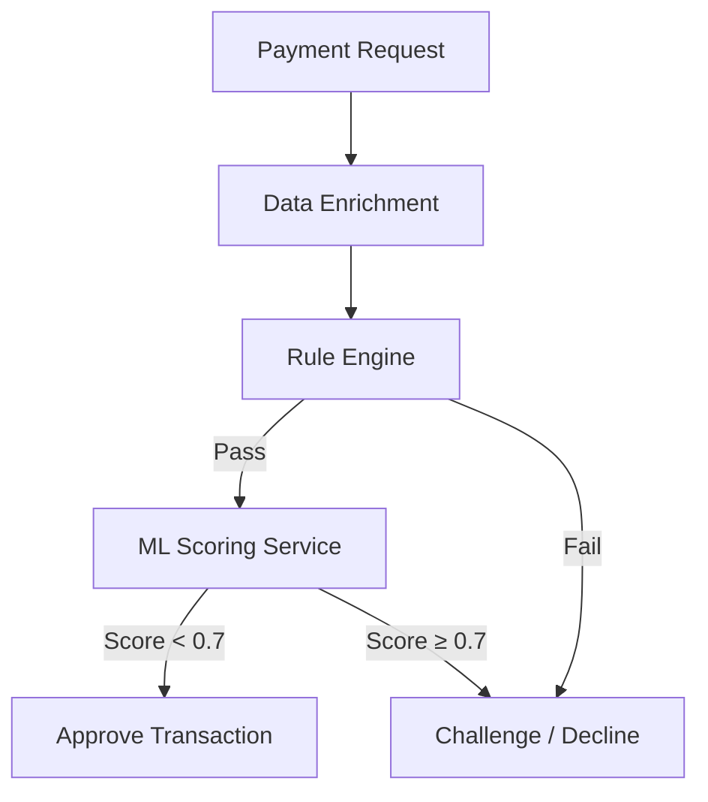

## Table of Contents
1. [Introduction](#introduction)  
2. [The Payments Landscape Today](#the-payments-landscape-today)  
3. [Core Threats and Attack Vectors](#core-threats-and-attack-vectors)  
4. [Regulatory & Compliance Frameworks](#regulatory--compliance-frameworks)  
5. [Technical Controls that Harden Payments](#technical-controls-that-harden-payments)  
   - 5.1 [Encryption & TLS](#encryption--tls)  
   - 5.2 [Tokenization](#tokenization)  
   - 5.3 [EMV Chip & Card‑Present Security](#emv-chip--cardpresent-security)  
   - 5.4 [Hardware Security Modules (HSM) & Secure Elements](#hardware-security-modules-hsm--secure-elements)  
   - 5.5 [3‑D Secure 2.0 & Authentication](#3d-secure-20--authentication)  
   - 5.6 [Multi‑Factor Authentication (MFA)](#multifactor-authentication-mfa)  
6. [Fraud Detection & Machine Learning](#fraud-detection--machine-learning)  
7. [Secure Development Lifecycle for Payments](#secure-development-lifecycle-for-payments)  
8. [Incident Response & Continuous Monitoring](#incident-response--continuous-monitoring)  
9. [Emerging Trends Shaping Payments Security](#emerging-trends-shaping-payments-security)  
10. [Practical Implementation Example: Tokenization & HMAC Verification in Python](#practical-implementation-example-tokenization--hmac-verification-in-python)  
11. [Payments Security Checklist for Enterprises](#payments-security-checklist-for-enterprises)  
12. [Conclusion](#conclusion)  
13. [Resources](#resources)  

---

## Introduction

Payments are the lifeblood of any commerce ecosystem, but they are also a prime target for cyber‑criminals. From the moment a consumer’s card number is entered on a website to the final settlement between acquiring and issuing banks, a complex chain of data flows, intermediaries, and technologies exists—each with its own security considerations.  

This article provides a **deep dive into payments security**, covering the threat landscape, regulatory obligations, technical safeguards, fraud‑detection strategies, and emerging trends. Whether you are a developer building a checkout, a risk‑manager designing a fraud‑prevention program, or an executive tasked with compliance, the guide offers actionable insights and real‑world examples you can apply today.

---

## The Payments Landscape Today

### 1. Payment Channels

| Channel | Typical Use‑Case | Key Characteristics |
|--------|-----------------|----------------------|
| **Card‑present (CP)** | In‑store POS terminals, NFC mobile wallets | EMV chip, contactless, physical security |
| **Card‑not‑present (CNP)** | E‑commerce, phone orders | Reliance on data encryption, 3‑D Secure, tokenization |
| **Bank transfers (ACH, SEPA, RTP)** | Direct debit/credit, B2B payments | Batch processing, often slower but lower fee |
| **Digital wallets (Apple Pay, Google Pay, PayPal)** | Mobile/web checkout, peer‑to‑peer | Device‑level tokenization, biometric auth |
| **Open Banking APIs** | EU PSD2, UK Open Banking | Consent‑driven, real‑time data sharing |
| **Cryptocurrency & Stablecoins** | Decentralized finance, cross‑border | Blockchain immutability, but new attack vectors |

### 2. Stakeholders

- **Cardholder** – The consumer who owns the payment instrument.
- **Merchant** – The entity accepting the payment (online or brick‑and‑mortar).
- **Acquirer** – The merchant’s bank that processes the transaction.
- **Issuer** – The cardholder’s bank that authorizes the payment.
- **Payment Processor / Gateway** – Technology provider bridging merchant and acquirer.
- **Card Networks (Visa, Mastercard, etc.)** – Set standards, route messages, enforce rules.

Understanding who does what is essential when designing security controls; each participant must protect its portion of the data flow while respecting the overall ecosystem.

---

## Core Threats and Attack Vectors

| Threat | Description | Typical Impact |
|--------|-------------|----------------|
| **Card‑Not‑Present (CNP) fraud** | Stolen card numbers used on e‑commerce sites. | Financial loss, chargebacks. |
| **Skimming & Shimming** | Physical devices read card data from POS terminals. | Card data breach, clone cards. |
| **Man‑in‑the‑Middle (MITM)** | Intercepted traffic between merchant and processor. | Data theft, transaction manipulation. |
| **Replay attacks** | Captured transaction messages replayed to charge a card again. | Duplicate charges. |
| **Account Takeover (ATO)** | Compromised merchant admin or consumer accounts used to initiate payments. | Unauthorized transfers, credential stuffing. |
| **Data Breach via insecure storage** | Storing PAN (Primary Account Number) in plaintext on servers. | PCI‑DSS violation, massive breach. |
| **API abuse in Open Banking** | Exploiting insufficient authentication on bank APIs. | Unauthorized fund transfers. |
| **Supply‑chain compromise** | Malicious code injected into third‑party SDKs or libraries. | Widespread credential harvesting. |
| **Social engineering** | Phishing attacks targeting merchants or consumers. | Credential theft, fraudulent payments. |

> **Note:** The prevalence of each threat varies by channel. Card‑present environments are most at risk from physical tampering, while CNP channels see the highest rates of credential‑based fraud.

---

## Regulatory & Compliance Frameworks

### 1. PCI DSS (Payment Card Industry Data Security Standard)

- **Scope:** All entities that store, process, or transmit cardholder data (CHD) or Sensitive Authentication Data (SAD).
- **Key Requirements:**  
  1. Install and maintain a firewall.  
  2. Use strong cryptography and secure protocols.  
  3. Protect stored CHD (encryption, tokenization).  
  4. Implement strong access control.  
  5. Regularly monitor and test networks.  
  6. Maintain an information‑security policy.
- **Levels:** Determined by annual transaction volume (Level 1: > 6 M transactions).

### 2. PSD2 & Strong Customer Authentication (SCA)

- **Region:** European Economic Area (EEA).  
- **Mandate:** Two out of three authentication elements – knowledge (password), possession (device), inherence (biometrics).  
- **Impact:** Forces merchants to adopt 3‑D Secure 2.0 or comparable SCA mechanisms for CNP payments.

### 3. GDPR (General Data Protection Regulation)

- **Relevance:** Cardholder data is personal data; breach notification, data minimization, and right‑to‑erasure obligations apply.

### 4. NACHA (U.S. ACH) and ISO 20022

- **Focus:** Secure handling of bank‑to‑bank transfers, mandatory file‑level encryption for certain participants.

### 5. Emerging Regulations

- **India’s RBI guidelines** on tokenization for card‑on‑file.  
- **Brazil’s PIX** instant payment system, which includes mandatory security tokens and QR‑code validation.

Compliance is not a checkbox; it drives the baseline security controls that every payment system must implement.

---

## Technical Controls that Harden Payments

### 5.1 Encryption & TLS

- **Transport Layer Security (TLS) 1.3** is now the de‑facto standard for all web‑based payment flows.  
- **Key points:**  
  - Enforce **TLS 1.2+** with forward secrecy (ECDHE).  
  - Disable weak cipher suites (e.g., RSA key exchange, 3DES).  
  - Use **HSTS** (HTTP Strict Transport Security) to prevent downgrade attacks.  
- **Implementation tip:** In NGINX, enforce TLS 1.3 with:

```nginx
ssl_protocols TLSv1.3;
ssl_prefer_server_ciphers on;
ssl_ciphers "TLS_AES_256_GCM_SHA384:TLS_CHACHA20_POLY1305_SHA256";
add_header Strict-Transport-Security "max-age=63072000; includeSubDomains; preload" always;
```

### 5.2 Tokenization

Tokenization replaces the PAN with a surrogate value (token) that cannot be used outside the tokenizing system.

- **Benefits:**  
  - Reduces PCI scope—tokens are not considered CHD.  
  - Enables card‑on‑file without storing sensitive data.  
  - Facilitates cross‑channel consistency (e.g., web → mobile).

- **Token formats:**  
  - **Format‑preserving tokens** (same length, Luhn‑valid).  
  - **Random tokens** (no relationship to original PAN).  

- **Lifecycle:**  
  1. **Token request** – Merchant sends PAN to token service (via secure API).  
  2. **Token issuance** – Service returns token + metadata (expiry, usage restrictions).  
  3. **Token usage** – Token is sent to acquirer; token service maps back to PAN for authorization.  
  4. **Token de‑provision** – When card is removed, token is revoked.

> **Real‑world example:** Visa Token Service, Mastercard Digital Enablement Service (MDES), and Apple Pay’s Device Account Number.

### 5.3 EMV Chip & Card‑Present Security

- **EMV (Europay, Mastercard, Visa)** chips generate a unique transaction cryptogram for each purchase, making cloned cards useless.  
- **Key components:**  
  - **CVM (Cardholder Verification Method)** – PIN, signature, or contactless CVM limit.  
  - **Dynamic Data Authentication (DDA)** – Public‑key cryptography validates chip authenticity.  
  - **Transaction Authorization Cryptogram (ARQC)** – Sent to issuer for validation.

- **Implementation checklist:**  
  - Use **PCI‑PA-DSS validated** POS software.  
  - Keep firmware up‑to‑date to mitigate “pre‑play” attacks.  
  - Enable **offline data authentication** where feasible.

### 5.4 Hardware Security Modules (HSM) & Secure Elements

- **HSMs** protect cryptographic keys used for PIN encryption, token generation, and transaction signing.  
- **Secure Element (SE)** in mobile devices stores payment credentials isolated from the OS.  

**Best practice:** Store master keys only in an HSM, use **key hierarchy** (master → KEK → session keys) and enforce **dual‑control** for key export.

### 5.5 3‑D Secure 2.0 & Authentication

- **3‑DS 2.0** introduces a frictionless flow for low‑risk transactions while still supporting challenge‑based authentication for higher risk.  
- **Key data points:**  
  - **Risk‑based decision engine** (device fingerprint, velocity checks).  
  - **Authentication Requestor (AR)** – Merchant’s ACS (Access Control Server).  
  - **Authentication Response (ARes)** – Indicates “Y” (authenticated), “N” (failed), or “U” (unavailable).  

- **Implementation tip:** Use the **EMVCo 3‑DS SDK** for JavaScript to embed the authentication UI in checkout pages.

### 5.6 Multi‑Factor Authentication (MFA)

- **MFA** is mandatory for administrative access to payment platforms and recommended for consumer logins.  
- **Factors:**  
  - **Something you know** – Password or PIN.  
  - **Something you have** – OTP via SMS, email, or authenticator app, or hardware token (YubiKey).  
  - **Something you are** – Biometric (fingerprint, facial recognition).  

- **Zero‑Trust principle:** Treat every request as untrusted; require MFA for each privileged action.

---

## Fraud Detection & Machine Learning

Modern fraud engines blend rule‑based logic with AI models to score each transaction in real time.

### 1. Data Sources

| Source | Typical Fields |
|--------|-----------------|
| **Device fingerprint** | OS, browser version, IP, geolocation, screen resolution |
| **Behavioral analytics** | Typing speed, mouse movement, checkout flow timing |
| **Historical transaction data** | Frequency, average amount, merchant category |
| **External data** | Dark web card‑number leaks, known fraud IP lists |

### 2. Model Types

- **Supervised classification** (e.g., Gradient Boosting, Random Forest) trained on labeled fraudulent vs. legitimate transactions.  
- **Unsupervised anomaly detection** (e.g., Autoencoders, Isolation Forest) to catch novel patterns.  
- **Hybrid approach** – Combine a fast rule engine for latency‑critical decisions, then feed flagged events to an offline ML model for deeper analysis.

### 3. Real‑time Scoring Pipeline (simplified)



### 4. Operational Tips

- **Feedback loop:** Continuously feed chargeback outcomes back into model training.  
- **Explainability:** Use SHAP values or LIME to understand why a model flagged a transaction, aiding fraud analysts.  
- **Latency budget:** Keep total decision time < 200 ms for a seamless checkout.

---

## Secure Development Lifecycle for Payments

A robust **Secure Development Lifecycle (SDL)** reduces vulnerabilities before they reach production.

### 1. Threat Modeling (STRIDE)

| Category | Example in Payments |
|----------|---------------------|
| **Spoofing** | Impersonating a merchant API endpoint. |
| **Tampering** | Modifying transaction amounts in transit. |
| **Repudiation** | Customer denies a legitimate purchase. |
| **Information Disclosure** | Logging PAN in debug output. |
| **Denial of Service** | Overloading the token service. |
| **Elevation of Privilege** | Exploiting an admin console to export keys. |

### 2. Secure Coding Practices

- **Never log raw PAN or CVV.** Use masked logs (`**** **** **** 1234`).  
- **Validate input** using whitelists (e.g., allowed currency codes).  
- **Use prepared statements** for any database interaction to prevent SQL injection.  
- **Implement rate limiting** on payment APIs (e.g., 5 requests/second per IP).  

### 3. Dependency Management

- **Software Bill of Materials (SBOM):** Maintain an automated SBOM (CycloneDX) for all third‑party libraries.  
- **Vulnerability scanning:** Integrate tools like **OWASP Dependency‑Check** or **GitHub Dependabot** into CI/CD.  

### 4. Static & Dynamic Testing

- **Static Application Security Testing (SAST):** Run on each PR.  
- **Dynamic Application Security Testing (DAST):** Schedule nightly scans against a staging environment.  
- **Interactive Application Security Testing (IAST):** Use agents in test suites for real‑time detection.

### 5. Penetration Testing

- Conduct **annual PCI‑DSS‑required pen tests**.  
- Include **API fuzzing** (e.g., using **Postman** or **Burp Suite**) for payment endpoints.  

---

## Incident Response & Continuous Monitoring

### 1. Preparation

- **Runbooks** for key scenarios: data breach, token compromise, HSM failure.  
- **Contact list** includes acquirer, card networks, legal, PR, and customers.  

### 2. Detection

- **Log aggregation** with SIEM (e.g., Splunk, Elastic).  
- **Anomaly alerts** for spikes in failed authorization or token requests.  

### 3. Containment

- **Isolate affected services** (e.g., disable token generation API).  
- **Rotate secrets** immediately—API keys, HSM master keys, TLS certificates.  

### 4. Eradication & Recovery

- **Patch vulnerable code** (e.g., fix a deserialization bug).  
- **Re‑issue compromised tokens** and notify affected cardholders.  

### 5. Post‑Incident Review

- Conduct a **Root Cause Analysis (RCA)** using the “5 Whys” method.  
- Update **threat models** and **security policies** based on lessons learned.

---

## Emerging Trends Shaping Payments Security

| Trend | Security Implications |
|-------|-----------------------|
| **Open Banking APIs** | Requires OAuth 2.0 with Mutual TLS; consent management becomes a new attack surface. |
| **Cryptocurrency & Stablecoins** | Smart contract bugs and private‑key theft; need for multi‑sig wallets and formal verification. |
| **Biometric Authentication** | Voice, facial, and fingerprint data must be stored as **inherently protected** (e.g., on‑device secure enclave). |
| **Zero‑Trust Network Architecture (ZTNA)** | Micro‑segmentation of payment services reduces lateral movement. |
| **Quantum‑Resistant Cryptography** | Preparations for post‑quantum algorithms for token services and HSMs. |
| **Buy‑Now‑Pay‑Later (BNPL) platforms** | New data sharing agreements; risk of credential stuffing across multiple fintech apps. |

Staying ahead means monitoring standards bodies (EMVCo, PCI SSC), participating in industry working groups, and regularly revisiting the security roadmap.

---

## Practical Implementation Example: Tokenization & HMAC Verification in Python

Below is a **self‑contained example** that demonstrates:

1. **Tokenizing a PAN** using a mock token service (AES‑GCM encryption).  
2. **Generating an HMAC** for request integrity (as required by many payment APIs).  
3. **Verifying the HMAC** on the receiving side.

```python
# -*- coding: utf-8 -*-
"""
payments_security_demo.py
Demo of PAN tokenization + HMAC request signing.
"""

import os
import base64
import json
import hmac
import hashlib
from Crypto.Cipher import AES

# -------------------------------------------------
# Configuration (in production these would be stored in a vault)
# -------------------------------------------------
AES_KEY = os.getenv("TOKEN_AES_KEY", os.urandom(32))   # 256‑bit key
HMAC_SECRET = os.getenv("HMAC_SECRET", os.urandom(32))

# -------------------------------------------------
# Helper: AES‑GCM encryption (tokenization)
# -------------------------------------------------
def tokenize_pan(pan: str) -> str:
    """Encrypt the PAN and return a URL‑safe base64 token."""
    # Pad to 16‑byte block (AES‑GCM works with any length, but we add a nonce)
    nonce = os.urandom(12)               # 96‑bit nonce recommended for GCM
    cipher = AES.new(AES_KEY, AES.MODE_GCM, nonce=nonce)
    ciphertext, tag = cipher.encrypt_and_digest(pan.encode())
    token_bytes = nonce + tag + ciphertext
    return base64.urlsafe_b64encode(token_bytes).decode()

def detokenize(token: str) -> str:
    """Reverse the tokenization (for illustration only)."""
    token_bytes = base64.urlsafe_b64decode(token.encode())
    nonce = token_bytes[:12]
    tag = token_bytes[12:28]
    ciphertext = token_bytes[28:]
    cipher = AES.new(AES_KEY, AES.MODE_GCM, nonce=nonce)
    pan = cipher.decrypt_and_verify(ciphertext, tag)
    return pan.decode()

# -------------------------------------------------
# Helper: HMAC signing
# -------------------------------------------------
def sign_payload(payload: dict) -> str:
    """
    Create a deterministic JSON string, then HMAC‑SHA256 it.
    Returns base64‑encoded signature.
    """
    # Ensure deterministic ordering
    json_str = json.dumps(payload, separators=(',', ':'), sort_keys=True)
    signature = hmac.new(HMAC_SECRET, json_str.encode(), hashlib.sha256).digest()
    return base64.b64encode(signature).decode()

def verify_signature(payload: dict, signature_b64: str) -> bool:
    expected = sign_payload(payload)
    # Constant‑time compare to mitigate timing attacks
    return hmac.compare_digest(expected, signature_b64)

# -------------------------------------------------
# Demo flow
# -------------------------------------------------
if __name__ == "__main__":
    # 1️⃣ Original PAN (never stored in plain text)
    raw_pan = "4111 1111 1111 1111"
    token = tokenize_pan(raw_pan)
    print(f"Token: {token}")

    # 2️⃣ Build request payload for a mock payment gateway
    request = {
        "merchant_id": "M123456",
        "amount": 1999,               # cents
        "currency": "USD",
        "payment_token": token,
        "timestamp": "2026-04-01T13:00:00Z"
    }

    # 3️⃣ Sign the payload
    signature = sign_payload(request)
    request["signature"] = signature
    print("\nSigned request JSON:")
    print(json.dumps(request, indent=2))

    # 4️⃣ On the receiver side, verify signature before processing
    received_sig = request.pop("signature")
    if verify_signature(request, received_sig):
        print("\n✅ Signature verified. Proceeding with token de‑tokenization...")
        pan = detokenize(request["payment_token"])
        print(f"Recovered PAN (for audit only): {pan}")
    else:
        print("\n❌ Invalid signature! Rejecting request.")
```

### What This Example Shows

- **Tokenization** removes the PAN from the merchant’s database, satisfying PCI‑DSS storage requirements.  
- **HMAC signing** protects the integrity of the API request, ensuring that a man‑in‑the‑middle cannot alter amount or token without detection.  
- **Detokenization** is only performed inside a highly‑controlled environment (e.g., a payment processor) and never exposed to the merchant’s front‑end.

In a production environment you would replace the mock AES‑GCM logic with a **PCI‑validated token service** and store keys in an **HSM** or cloud KMS (e.g., AWS CloudHSM, Azure Key Vault).

---

## Payments Security Checklist for Enterprises

| Area | Must‑Do | Recommended Enhancements |
|------|---------|--------------------------|
| **Governance** | Appoint a Payments Security Officer (PSO). | Conduct quarterly board‑level security briefings. |
| **Compliance** | Achieve PCI‑DSS Level appropriate to volume. | Pursue ISO 27001 certification for broader risk coverage. |
| **Network** | Enforce TLS 1.3 + HSTS on all public endpoints. | Implement micro‑segmentation (ZTA) for payment micro‑services. |
| **Data** | Tokenize all stored PANs; never log CVV. | Use format‑preserving encryption for legacy systems. |
| **Key Management** | Store master keys in an HSM; rotate every 12 months. | Adopt **Key Management Interoperability Protocol (KMIP)** for multi‑vendor environments. |
| **Authentication** | MFA for all admin and API access. | Deploy passwordless authentication (WebAuthn) for consumer logins. |
| **Fraud** | Deploy a real‑time rule engine + ML scoring. | Integrate device‑fingerprinting and behavioral biometrics. |
| **Development** | Integrate SAST/DAST into CI/CD. | Use **Software Composition Analysis (SCA)** to monitor open‑source risk. |
| **Incident Response** | Maintain a runbook; test tabletop drills bi‑annually. | Perform full‑scale breach simulation with third‑party red team. |
| **Monitoring** | Centralized logging with SIEM; alert on token anomalies. | Deploy User‑Entity Behavior Analytics (UEBA) for insider threat detection. |

Ticking off each line moves your organization closer to a **defense‑in‑depth** posture that not only meets compliance but also builds customer trust.

---

## Conclusion

Payments security is a moving target that blends **regulatory mandates**, **cryptographic engineering**, **real‑time fraud analytics**, and **cultural discipline**. By understanding the threat landscape, aligning with standards such as PCI‑DSS and PSD2, and implementing layered technical controls—encryption, tokenization, HSMs, 3‑DS, MFA—you can dramatically reduce the risk of data breaches and fraud.

Key takeaways:

1. **Shift the data**: Never store raw PANs; use tokenization and keep de‑tokenization tightly controlled.  
2. **Encrypt everything in motion**: TLS 1.3 with forward secrecy is non‑negotiable.  
3. **Automate security**: Integrate testing, monitoring, and ML‑driven fraud detection into every release pipeline.  
4. **Plan for incidents**: A well‑drilled response reduces financial loss and reputational damage.  
5. **Future‑proof**: Keep an eye on Open Banking, quantum‑resistant crypto, and biometric standards to stay ahead of emerging attack vectors.

By embedding these principles into your organization’s DNA, you not only protect revenue streams but also reinforce the trust that consumers place in digital commerce—a priceless asset in today’s economy.

---

## Resources

- **PCI Security Standards Council** – Official PCI‑DSS documentation and self‑assessment questionnaires.  
  [https://www.pcisecuritystandards.org](https://www.pcisecuritystandards.org)

- **EMVCo** – Specifications for chip, tokenization, and 3‑D Secure 2.0.  
  [https://www.emvco.com](https://www.emvco.com)

- **Open Banking Implementation Entity (UK)** – Guidance on secure API design, OAuth 2.0, and consent management.  
  [https://www.openbanking.org.uk](https://www.openbanking.org.uk)

- **OWASP Top Ten** – A baseline for secure application development, relevant to payment apps.  
  [https://owasp.org/www-project-top-ten/](https://owasp.org/www-project-top-ten/)

- **NIST Special Publication 800‑63B** – Digital identity guidelines (MFA, biometrics).  
  [https://csrc.nist.gov/publications/detail/sp/800-63b/final](https://csrc.nist.gov/publications/detail/sp/800-63b/final)

- **Google Cloud KMS Documentation** – Best practices for key management in payment services.  
  [https://cloud.google.com/kms/docs](https://cloud.google.com/kms/docs)

These resources provide deeper dives into each topic discussed and are essential reading for anyone tasked with safeguarding payment ecosystems