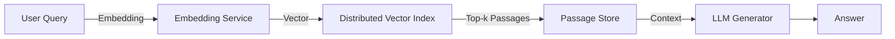

## Table of Contents
1. [Introduction](#introduction)  
2. [Fundamentals of Retrieval‑Augmented Generation (RAG)](#fundamentals-of-retrieval‑augmented-generation-rag)  
3. [Why Scaling RAG Is Hard](#why-scaling-rag-is-hard)  
4. [Distributed Vector Indexing](#distributed-vector-indexing)  
   - 4.1 [Sharding Strategies](#sharding-strategies)  
   - 4.2 [Replication & Consistency](#replication--consistency)  
   - 4.3 [Popular Open‑Source & Managed Solutions](#popular-open‑source--managed-solutions)  
5. [Serverless Compute Orchestration](#serverless-compute-orchestration)  
   - 5.1 [Function‑as‑a‑Service (FaaS)](#function‑as‑a‑service-faas)  
   - 5.2 [Orchestration Frameworks](#orchestration-frameworks)  
6. [Bridging Distributed Indexes and Serverless Compute](#bridging-distributed-indexes-and-serverless-compute)  
   - 6.1 [Query Routing & Load Balancing](#query-routing--load-balancing)  
   - 6.2 [Latency Optimizations](#latency-optimizations)  
   - 6.3 [Cost‑Effective Scaling](#cost‑effective-scaling)  
7. [Practical End‑to‑End Example](#practical-end‑to‑end-example)  
   - 7.1 [Architecture Overview](#architecture-overview)  
   - 7.2 [Code Walk‑through](#code-walk‑through)  
8. [Performance Tuning & Best Practices](#performance-tuning--best-practices)  
   - 8.1 [Quantization & Compression](#quantization--compression)  
   - 8.2 [Hybrid Search (Dense + Sparse)](#hybrid-search-dense--sparse)  
   - 8.3 [Batching & Asynchronous Pipelines](#batching--asynchronous-pipelines)  
9. [Observability, Monitoring, and Security](#observability-monitoring-and-security)  
10. [Real‑World Use Cases](#real‑world-use-cases)  
11. [Future Directions](#future-directions)  
12. [Conclusion](#conclusion)  
13. [Resources](#resources)  

---

## Introduction

Retrieval‑Augmented Generation (RAG) has emerged as a powerful paradigm for building **knowledge‑aware** language models. By coupling a large language model (LLM) with an external knowledge store, RAG can answer factual questions, ground hallucinations, and keep responses up‑to‑date without retraining the underlying model.  

While a single‑node prototype can be assembled in a few hours, production‑grade RAG systems must handle **millions of queries per day**, **terabytes of embeddings**, and **strict latency SLAs**. Achieving this scale requires two complementary technologies:

1. **Distributed Vector Indexing** – a fault‑tolerant, horizontally scalable similarity search layer that can store and retrieve high‑dimensional embeddings across many machines.  
2. **Serverless Compute Orchestration** – a flexible, event‑driven execution model that can spin up compute on demand, route requests, and compose complex pipelines without managing servers.

In this article we dive deep into how to combine these primitives to build a **robust, cost‑effective, and low‑latency RAG service**. We’ll explore architectural patterns, concrete code snippets, performance tricks, and real‑world case studies.

---

## Fundamentals of Retrieval‑Augmented Generation (RAG)

At its core, a RAG pipeline consists of three stages:

1. **Embedding Generation** – Convert user queries (and optionally documents) into dense vectors using an embedding model (e.g., OpenAI’s `text‑embedding‑ada‑002` or a locally hosted `sentence‑transformers` model).  
2. **Vector Retrieval** – Perform approximate nearest‑neighbor (ANN) search against a **vector index** to fetch the top‑k most relevant passages.  
3. **Augmented Generation** – Feed the retrieved passages (often concatenated with the original query) to a generative LLM that produces the final answer.



The **retrieval step** is the bottleneck when scaling: it must be both **fast** (sub‑100 ms latency) and **accurate** (high recall). This is why modern RAG systems invest heavily in distributed vector databases.

---

## Why Scaling RAG Is Hard

| Challenge | Why It Matters | Typical Symptoms |
|-----------|----------------|------------------|
| **High Dimensionality** | Embeddings are usually 384–1536 dimensions. | ANN search slows dramatically as dataset grows. |
| **Dynamic Knowledge** | New documents arrive continuously. | Index rebuilds become costly; stale results. |
| **Query Burstiness** | Traffic spikes (e.g., product launches). | Latency spikes, throttling, or OOM errors. |
| **Cost Constraints** | GPUs are expensive; you want to pay only for work done. | Over‑provisioned clusters waste money. |
| **Observability** | Need to debug why a particular answer was generated. | Missing logs, opaque latency graphs. |

A monolithic solution (single machine, single process) cannot address these simultaneously. The answer lies in **horizontal scaling** (sharding, replication) coupled with **elastic compute** (serverless functions, containers).

---

## Distributed Vector Indexing

### 4.1 Sharding Strategies

| Strategy | Description | Pros | Cons |
|----------|-------------|------|------|
| **Range Sharding** | Partition vectors based on a deterministic hash of their IDs. | Simple routing, deterministic. | May cause uneven load if ID distribution is skewed. |
| **Voronoi / K‑means Sharding** | Partition space into clusters using a centroid‑based algorithm; each shard stores vectors belonging to its region. | Improves locality; queries often hit a single shard. | Requires periodic re‑clustering as data evolves. |
| **Hybrid (Range + Load‑Aware)** | Combine deterministic hashing with runtime load balancing. | Balances predictability and even distribution. | Adds routing complexity. |

Most managed services (e.g., Pinecone, Weaviate Cloud) hide sharding details, but when building in‑house you must decide based on data growth patterns.

### 4.2 Replication & Consistency

* **Primary‑Replica Model** – Writes go to a leader; reads are served from any replica. Guarantees *read‑after‑write* consistency if the client reads from the leader or waits for replication.  
* **Eventual Consistency** – Faster writes, but a newly inserted vector may not be immediately searchable. Acceptable for non‑critical updates (e.g., logging).  
* **Quorum Reads/Writes** – Configurable `R` and `W` values (e.g., `R + W > N`) to balance latency vs. durability.

Choosing the right model depends on your SLAs. For **interactive chat**, you often need *read‑after‑write* for newly added knowledge (e.g., a support ticket that must be searchable immediately).

### 4.3 Popular Open‑Source & Managed Solutions

| Solution | Language | On‑Prem / Managed | Notable Features |
|----------|----------|-------------------|------------------|
| **FAISS** | C++ / Python | On‑Prem | GPU‑accelerated indexes, IVF, HNSW, PQ compression. |
| **Milvus** | Go / C++ | Managed (Zilliz Cloud) & On‑Prem | Distributed, supports both IVF and HNSW, automatic sharding. |
| **Vespa** | Java | Managed (Yahoo) & On‑Prem | Real‑time updates, hybrid dense‑sparse search, built‑in ranking. |
| **Pinecone** | Cloud‑native | Managed | Serverless scaling, automatic replication, vector‑metadata joins. |
| **Weaviate** | Go / Python | Managed & On‑Prem | Graph‑QL API, contextualized vectors via transformers. |

When you need **full control** over sharding and replication, Milvus or a self‑hosted FAISS cluster (wrapped by a service like `faiss‑grpc`) is a solid choice. For rapid prototyping, a managed service removes operational overhead.

---

## Serverless Compute Orchestration

### 5.1 Function‑as‑a‑Service (FaaS)

Serverless functions (AWS Lambda, Azure Functions, Google Cloud Functions) provide **pay‑per‑use** execution with automatic scaling to zero. For RAG, you can spin up separate functions for:

* **Embedding Generation** – Stateless, GPU‑optional.  
* **Query Routing** – Determines which vector shard(s) to hit.  
* **Result Fusion** – Merges results from multiple shards.  
* **LLM Invocation** – Calls the generative model (often via an external API).

Key considerations:

* **Cold Start** – Keep functions warm or use provisioned concurrency for latency‑sensitive paths.  
* **Resource Limits** – Memory (up to 10 GB on AWS) and execution time (15 min) may constrain large batch embeddings.  
* **Statelessness** – Persist intermediate state in external stores (e.g., DynamoDB, Redis).

### 5.2 Orchestration Frameworks

Complex RAG pipelines need **workflow orchestration** beyond simple function chaining. Popular options:

| Framework | Execution Model | Strengths |
|-----------|----------------|-----------|
| **AWS Step Functions** | State machine (JSON/YAML) | Visual debugging, retries, parallel branches. |
| **Azure Durable Functions** | Orchestrator functions (C# / Python) | Durable timers, sub‑orchestrations. |
| **Temporal.io** | Code‑first workflow definitions | Strong consistency, versioning, language‑agnostic SDKs. |
| **Argo Workflows** (Kubernetes) | Container‑based steps | Works well with on‑prem clusters, supports GPU pods. |

These orchestrators let you **model fan‑out/fan‑in** patterns: dispatch a query to multiple shards in parallel, then aggregate results before feeding them to the LLM.

---

## Bridging Distributed Indexes and Serverless Compute

### 6.1 Query Routing & Load Balancing

A lightweight **gateway** (e.g., Amazon API Gateway + Lambda authorizer) receives the user query and:

1. Generates the query embedding (or forwards to an embedding Lambda).  
2. Computes a **shard key** (hash or centroid assignment).  
3. Emits parallel invocations to the relevant vector shards (via Lambda, Cloud Run, or a gRPC endpoint).  

**Example: Hash‑Based Routing in Python**

```python
import hashlib
import json
import boto3

NUM_SHARDS = 8
lambda_client = boto3.client('lambda')

def shard_key(doc_id: str) -> int:
    """Deterministic hash → shard number."""
    h = hashlib.sha256(doc_id.encode()).hexdigest()
    return int(h, 16) % NUM_SHARDS

def invoke_shard(embedding, shard_id):
    payload = json.dumps({
        "embedding": embedding.tolist(),
        "top_k": 5
    })
    response = lambda_client.invoke(
        FunctionName=f'vector-search-shard-{shard_id}',
        InvocationType='RequestResponse',
        Payload=payload
    )
    return json.loads(response['Payload'].read())
```

The gateway can **parallelize** the calls using `asyncio.gather` or Step Functions’ `Parallel` state.

### 6.2 Latency Optimizations

* **Warm Pools** – Keep a small pool of pre‑warmed containers (e.g., AWS Lambda provisioned concurrency) for the most common shards.  
* **Edge Caching** – Store hot embeddings in a CDN‑backed key‑value store (e.g., CloudFront + Lambda@Edge) to avoid round‑trips to the index.  
* **Vector Compression** – Use Product Quantization (PQ) or Binary IVF to shrink index size, allowing more data to fit in memory and reducing network payload.  

### 6.3 Cost‑Effective Scaling

Serverless pricing is **request‑based** (`$0.20 per 1M requests` on AWS) plus compute time. To keep costs low:

* **Batch Queries** – If you can tolerate a few milliseconds of additional latency, batch multiple user queries into a single vector search call.  
* **Selective Replication** – Replicate only hot shards; cold shards can be read from a single replica.  
* **Spot Instances for Index Nodes** – When running your own vector cluster, use pre‑emptible VMs for background indexing jobs.

---

## Practical End‑to‑End Example

### 7.1 Architecture Overview

```
+-------------------+      +-------------------+      +-------------------+
|   API Gateway     | ---> |   Embedding Lambda| ---> |   Router Lambda   |
+-------------------+      +-------------------+      +-------------------+
                                 |                         |
                                 v                         v
                +--------------------------+   +--------------------------+
                |   Distributed Vector DB  |   |   Vector Shard Functions |
                +--------------------------+   +--------------------------+
                                 |                         |
                                 \_________________________/
                                          |
                                          v
                              +--------------------------+
                              |   Fusion & LLM Lambda    |
                              +--------------------------+
                                          |
                                          v
                                 +-------------------+
                                 |   HTTP Response   |
                                 +-------------------+
```

* **Embedding Lambda** – Uses `sentence‑transformers` to create a 768‑dim vector.  
* **Router Lambda** – Determines target shards (range hash) and invokes them in parallel.  
* **Shard Functions** – Each runs a local Milvus instance (or a FAISS gRPC server) and returns top‑k passages.  
* **Fusion & LLM Lambda** – Concatenates passages, calls OpenAI’s `gpt‑4o` (or a hosted LLM), and returns the answer.

### 7.2 Code Walk‑through

#### 1️⃣ Embedding Service (`embed_lambda.py`)

```python
import json
import os
from sentence_transformers import SentenceTransformer

MODEL_NAME = os.getenv("EMBED_MODEL", "all-MiniLM-L6-v2")
model = SentenceTransformer(MODEL_NAME)

def lambda_handler(event, context):
    body = json.loads(event["body"])
    query = body["query"]
    embedding = model.encode(query, normalize_embeddings=True)
    return {
        "statusCode": 200,
        "body": json.dumps({"embedding": embedding.tolist()})
    }
```

Deploy this as a **Python 3.11** Lambda with 1 GB memory (no GPU needed for small batches).

#### 2️⃣ Router + Parallel Search (`router_lambda.py`)

```python
import json, asyncio, aiohttp, os

NUM_SHARDS = int(os.getenv("NUM_SHARDS", "8"))
SEARCH_ENDPOINT = os.getenv("SEARCH_ENDPOINT")   # e.g., https://search.mycompany.com/shard

async def query_shard(session, shard_id, embedding, top_k=5):
    url = f"{SEARCH_ENDPOINT}/{shard_id}"
    payload = {"embedding": embedding, "top_k": top_k}
    async with session.post(url, json=payload) as resp:
        return await resp.json()

async def lambda_handler(event, context):
    body = json.loads(event["body"])
    embedding = body["embedding"]
    async with aiohttp.ClientSession() as session:
        tasks = [
            query_shard(session, shard_id, embedding)
            for shard_id in range(NUM_SHARDS)
        ]
        results = await asyncio.gather(*tasks)
    # Flatten and keep top‑k globally
    all_passages = sorted(
        [p for shard in results for p in shard["passages"]],
        key=lambda x: x["score"],
        reverse=True,
    )[:10]   # keep 10 best overall
    return {
        "statusCode": 200,
        "body": json.dumps({"passages": all_passages})
    }
```

> **Note:** This Lambda uses **asyncio** and **aiohttp** to issue parallel HTTP calls to each shard. In production you would add retries, timeout handling, and security (IAM roles or signed URLs).

#### 3️⃣ Vector Shard Service (`shard_server.py`)

```python
from fastapi import FastAPI, HTTPException
from pydantic import BaseModel
import numpy as np
import milvus

app = FastAPI()
client = milvus.MilvusClient(uri="milvus://localhost:19530")
COLLECTION = "rag_docs"

class SearchRequest(BaseModel):
    embedding: list[float]
    top_k: int = 5

@app.post("/search")
async def search(req: SearchRequest):
    vec = np.array(req.embedding, dtype=np.float32).reshape(1, -1)
    results = client.search(
        collection_name=COLLECTION,
        data=vec,
        limit=req.top_k,
        # optional: params={"nprobe": 10}
    )
    passages = [
        {"id": r.id, "text": r.entity.get("text"), "score": r.distance}
        for r in results[0]
    ]
    return {"passages": passages}
```

Run one instance per shard (Docker container with Milvus). The **router** points to each container’s `/search` endpoint.

#### 4️⃣ Fusion & Generation (`generate_lambda.py`)

```python
import json, os, openai
from typing import List

openai.api_key = os.getenv("OPENAI_API_KEY")

def build_prompt(passages: List[dict], query: str) -> str:
    context = "\n\n".join([p["text"] for p in passages])
    return f"""You are a helpful assistant. Use the following context to answer the question.

Context:
{context}

Question: {query}
Answer:"""

def lambda_handler(event, context):
    body = json.loads(event["body"])
    query = body["query"]
    passages = body["passages"][:5]   # limit for token budget
    prompt = build_prompt(passages, query)
    resp = openai.ChatCompletion.create(
        model="gpt-4o",
        messages=[{"role": "user", "content": prompt}],
        temperature=0.2,
        max_tokens=512,
    )
    answer = resp.choices[0].message.content.strip()
    return {
        "statusCode": 200,
        "body": json.dumps({"answer": answer})
    }
```

The **generation Lambda** is the final step; you can replace OpenAI with a self‑hosted LLM (e.g., LLaMA‑2 via vLLM) if you need full control.

#### 5️⃣ Orchestration with Step Functions (JSON snippet)

```json
{
  "StartAt": "Embed",
  "States": {
    "Embed": {
      "Type": "Task",
      "Resource": "arn:aws:lambda:us-east-1:123456789012:function:embed_lambda",
      "Next": "ParallelSearch"
    },
    "ParallelSearch": {
      "Type": "Parallel",
      "Branches": [
        { "StartAt": "Shard0", "States": { "Shard0": { "Type": "Task", "Resource": "arn:aws:lambda:...:shard0", "End": true } } },
        { "StartAt": "Shard1", "States": { "Shard1": { "Type": "Task", "Resource": "arn:aws:lambda:...:shard1", "End": true } } }
        // ... repeat for all shards
      ],
      "Next": "FuseAndGenerate"
    },
    "FuseAndGenerate": {
      "Type": "Task",
      "Resource": "arn:aws:lambda:...:generate_lambda",
      "End": true
    }
  }
}
```

Step Functions automatically **waits for all branches**, aggregates the outputs, and passes them to the generation step.

---

## Performance Tuning & Best Practices

### 8.1 Quantization & Compression

* **Product Quantization (PQ)** – Reduces 1536‑dim float vectors to ~8 bytes each with < 1 % recall loss. FAISS’s `IndexIVFPQ` is a go‑to.  
* **Binary IVF (BIVF)** – Stores vectors as binary codes; useful when memory is the primary bottleneck.  
* **OPQ (Optimized PQ)** – Applies a rotation matrix before quantization for higher accuracy.

```python
import faiss
d = 768
nlist = 1024
quantizer = faiss.IndexFlatL2(d)
index = faiss.IndexIVFPQ(quantizer, d, nlist, 16, 8)  # 16 sub‑vectors, 8 bits each
index.train(embeddings)        # embeddings = np.ndarray of shape (N, d)
index.add(embeddings)
```

### 8.2 Hybrid Search (Dense + Sparse)

Many knowledge bases contain **keyword‑rich** text. Combining dense ANN with BM25 (or Elasticsearch) yields better recall.

* **Two‑stage retrieval** – First dense ANN for coarse filtering, then BM25 on the top‑k passages.  
* **Unified index** – Vespa supports dense‑sparse hybrid natively; you can store both vector and inverted fields in the same document.

### 8.3 Batching & Asynchronous Pipelines

When traffic is moderate, **batching** queries together can dramatically improve GPU utilization for embedding generation.

```python
# Batch embedding using torch.nn.DataParallel
batch_queries = ["What is RAG?", "Explain vector search", ...]
embeds = model.encode(batch_queries, batch_size=32)
```

In the orchestration layer, use **async queues** (e.g., AWS SQS + Lambda) to decouple ingestion from indexing, allowing the vector store to ingest at its own pace.

---

## Observability, Monitoring, and Security

| Aspect | Tools & Techniques |
|--------|---------------------|
| **Latency Tracing** | OpenTelemetry (X‑Ray, Jaeger) – instrument each Lambda and shard. |
| **Metrics** | CloudWatch custom metrics (`search_latency_ms`, `embedding_qps`). |
| **Alerting** | Set thresholds on 95th‑percentile latency; auto‑scale shards via Kubernetes HPA or Milvus autoscaler. |
| **Logging** | Structured JSON logs with request IDs to correlate across services. |
| **Security** | IAM role‑based access, VPC‑isolated Milvus clusters, encryption‑at‑rest (KMS), TLS for gRPC. |
| **Audit** | Store passage metadata (source, version) in a separate PostgreSQL table; use it for compliance. |

Ensuring end‑to‑end observability is crucial for **debugging hallucinations**. By logging the exact passages fed into the LLM, you can later trace back why an answer was generated.

---

## Real‑World Use Cases

1. **Enterprise Knowledge Bases** – Companies like IBM and Microsoft embed internal documentation, policy PDFs, and ticket logs. Scaling to millions of pages requires distributed indexing; serverless orchestrations let them spin up extra compute during product launches or incident spikes.  
2. **Customer Support Chatbots** – A SaaS vendor serves 10 k concurrent users; using a hybrid dense‑sparse search ensures that both exact keyword matches (e.g., error codes) and semantic matches (e.g., “how to reset password”) are retrieved.  
3. **Legal & Regulatory Research** – Law firms index statutes, case law, and contract clauses. Legal queries often need **read‑after‑write** consistency when a new amendment is published; a primary‑replica vector store guarantees immediate discoverability.  
4. **Personalized Recommendations** – E‑commerce platforms blend product embeddings with user behavior vectors. Serverless functions compute a “user‑item similarity” on the fly, then query the distributed index for top‑k similar items, finally generating a natural‑language recommendation.

---

## Future Directions

* **GPU‑Accelerated Vector Stores** – Emerging projects (e.g., `torch‑search`) aim to keep the entire index on GPU memory, drastically reducing query latency.  
* **LLM‑Native Retrieval** – Models like **RAG‑Fusion** and **RETRO** integrate retrieval directly into the transformer architecture, potentially eliminating the external search step.  
* **Edge‑First RAG** – With the rise of on‑device LLMs, future RAG systems may push vector indexes to the edge (e.g., mobile devices) and orchestrate compute via WebAssembly functions.  
* **Self‑Supervised Index Updates** – Using the LLM’s own outputs to suggest new passages for indexing, creating a feedback loop that continuously enriches the knowledge base.

Staying ahead requires a **modular design**: decouple the vector store, embedding service, and generation engine so you can swap in emerging technologies without a full rewrite.

---

## Conclusion

Scaling Retrieval‑Augmented Generation is no longer a niche research problem—it’s a production imperative for any organization that wants to deliver **accurate, up‑to‑date, and context‑aware AI answers** at Internet scale. By:

* Distributing the vector index across shards with intelligent replication,  
* Leveraging serverless functions and orchestration frameworks for elastic compute, and  
* Applying performance tricks like quantization, hybrid search, and batching,

you can build a RAG system that handles **high QPS, low latency, and dynamic knowledge updates** while keeping operational costs under control.  

The example architecture and code snippets presented here serve as a blueprint you can adapt to your own stack—whether you prefer open‑source Milvus + AWS Lambda, a fully managed Pinecone + Azure Functions, or a custom on‑prem Kubernetes deployment with Temporal.io orchestration.  

Remember that **observability and security** are first‑class citizens; without them you’ll struggle to maintain trust and diagnose failures. As the ecosystem evolves with GPU‑resident indexes and LLM‑native retrieval, the principles outlined in this post—modularity, elasticity, and data‑centric design—will remain the foundation for any next‑generation RAG service.

Happy building, and may your embeddings stay dense and your latency stay low!

---

## Resources

- **FAISS – A library for efficient similarity search** – https://github.com/facebookresearch/faiss  
- **Milvus – Open‑source vector database** – https://milvus.io  
- **LangChain – Framework for building RAG pipelines** – https://python.langchain.com  
- **AWS Lambda – Serverless compute platform** – https://aws.amazon.com/lambda  
- **Temporal.io – Durable workflow orchestration** – https://temporal.io  

Feel free to explore these resources for deeper dives into each component of the stack.