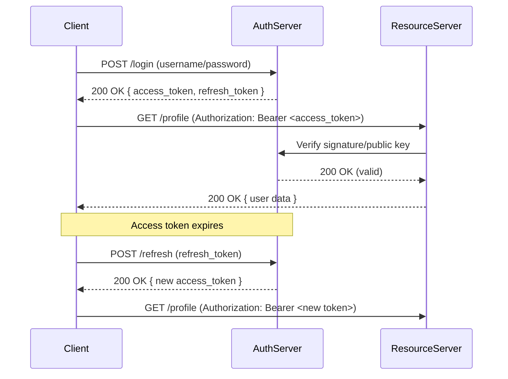

## Introduction

In the modern world of distributed systems, mobile apps, single‑page applications (SPAs), and microservices, the traditional session‑based authentication model—where a server stores a user’s login state in memory or a database and the client presents a session identifier cookie—has become increasingly cumbersome. Network latency, horizontal scaling, and the rise of stateless APIs have driven developers toward **token‑based authentication**. Tokens enable a client to prove its identity without requiring the server to keep per‑user state, making authentication more scalable, portable, and flexible.

This article provides an in‑depth exploration of token‑based authentication. We will cover the underlying concepts, compare the most common token formats (JSON Web Tokens, opaque tokens, API keys), walk through practical implementations in popular stacks, discuss security considerations, and examine real‑world use cases. By the end, you should be able to design, implement, and maintain a robust token‑based authentication system for a variety of applications.

---

## Table of Contents

1. [What Is Token‑Based Authentication?](#what-is-token-based-authentication)  
2. [Common Token Types](#common-token-types)  
   - 2.1 [JSON Web Tokens (JWT)](#json-web-tokens-jwt)  
   - 2.2 [Opaque Tokens (OAuth2 Access Tokens)](#opaque-tokens-oauth2-access-tokens)  
   - 2.3 [API Keys](#api-keys)  
3. [How Tokens Work: Lifecycle Overview](#how-tokens-work-lifecycle-overview)  
4. [Implementing Token Authentication in Popular Frameworks](#implementing-token-authentication-in-popular-frameworks)  
   - 4.1 [Node.js & Express](#nodejs--express)  
   - 4.2 [Python & Flask](#python--flask)  
   - 4.3 [Java & Spring Boot](#java--spring-boot)  
5. [Security Best Practices](#security-best-practices)  
6. [Common Pitfalls & How to Avoid Them](#common-pitfalls--how-to-avoid-them)  
7. [Token‑Based vs. Session‑Based Authentication](#token-based-vs-session-based-authentication)  
8. [Real‑World Use Cases](#real-world-use-cases)  
9. [Future Trends in Token Authentication](#future-trends-in-token-authentication)  
10. [Conclusion](#conclusion)  
11. [Resources](#resources)  

---

## What Is Token‑Based Authentication?

Token‑based authentication is a stateless mechanism where a **token**—a self‑contained string of data—represents the client’s authentication state. The typical flow looks like this:

1. **Login** – The client sends credentials (username/password, OAuth client secret, etc.) to an authentication server.
2. **Token Issuance** – The server validates the credentials and issues a signed token (e.g., a JWT) that encodes the user’s identity and optionally other claims (roles, scopes, expiration).
3. **Token Presentation** – The client includes the token in subsequent requests, usually via the `Authorization: Bearer <token>` HTTP header.
4. **Verification** – The resource server validates the token’s signature, checks its expiration and claims, and decides whether to grant access.

Because the token is **self‑contained**, the resource server does **not** need to query a database or a session store for each request. This statelessness simplifies horizontal scaling: any instance can handle any request without sharing session state.

### Key Terminology

| Term | Definition |
|------|------------|
| **Token** | A cryptographically signed (or encrypted) string that carries authentication data. |
| **Issuer (iss)** | The authority that created and signed the token. |
| **Subject (sub)** | The principal (usually a user ID) the token represents. |
| **Audience (aud)** | The intended recipient(s) of the token, often the API’s identifier. |
| **Claims** | Key‑value pairs inside the token that convey information such as roles, scopes, or custom data. |
| **Signature** | Cryptographic data that allows the receiver to verify the token’s integrity and authenticity. |
| **Expiration (exp)** | Timestamp after which the token must be considered invalid. |
| **Refresh Token** | A long‑lived token used to obtain new short‑lived access tokens without re‑authenticating. |

---

## Common Token Types

While the concept of “a token” is generic, the industry has converged on a few standard formats. Understanding the differences helps you pick the right tool for your scenario.

### JSON Web Tokens (JWT)

**JWT** is an open standard (RFC 7519) that defines a compact, URL‑safe representation of claims. A JWT consists of three base64url‑encoded parts:

```
<header>.<payload>.<signature>
```

* **Header** – Indicates the signing algorithm (`alg`) and token type (`typ`).
* **Payload** – Contains the claims (registered, public, and private).
* **Signature** – Produced by signing `header.payload` with a secret (HMAC) or private key (RSA/ECDSA).

#### Advantages

* **Self‑contained** – All necessary data travels with the token.
* **Stateless verification** – No database lookup required if the public key is known.
* **Interoperability** – Widely supported across languages and frameworks.

#### Drawbacks

* **Size** – Because the payload is embedded, JWTs can be larger than opaque tokens.
* **Revocation complexity** – Once issued, a JWT remains valid until it expires unless you maintain a revocation list or use short lifetimes.

### Opaque Tokens (OAuth2 Access Tokens)

OAuth 2.0 defines **access tokens** that can be either JWTs or **opaque strings** (random identifiers). In the opaque model, the token itself carries no meaning; the resource server must introspect it against the authorization server.

#### Workflow

1. Client receives an opaque token (`6a9b7c3d…`).
2. For each request, the resource server calls the **introspection endpoint** (`/introspect`) of the auth server.
3. The auth server returns token metadata (active/inactive, scopes, user ID).

#### Advantages

* **Easy revocation** – The auth server can instantly invalidate a token.
* **Smaller payload** – Ideal for low‑bandwidth scenarios.

#### Drawbacks

* **Extra network hop** – Each request incurs an introspection call unless caching is used.
* **Tighter coupling** – Resource servers depend on the auth server’s availability.

### API Keys

**API keys** are simple static tokens issued to a developer or an application rather than an end user. They are typically used for service‑to‑service communication or public APIs with limited access.

* **Static** – No expiration unless manually rotated.
* **Limited claims** – Usually just an identifier; additional metadata must be stored server‑side.

API keys are not a replacement for user authentication but can complement token‑based flows (e.g., a client presents an API key to obtain a JWT).

---

## How Tokens Work: Lifecycle Overview

Below is a step‑by‑step illustration of a typical JWT‑based authentication flow, including optional refresh token handling.



### Detailed Steps

| Phase | Action | Security Considerations |
|-------|--------|--------------------------|
| **Credential Submission** | HTTPS POST with credentials. | Enforce TLS, rate‑limit, and consider multi‑factor authentication. |
| **Token Creation** | Server builds payload (`sub`, `iat`, `exp`, `aud`, `scope`). Signs with secret or private key. | Use strong algorithms (HS256, RS256, ES256). Keep signing keys in a secure vault. |
| **Token Delivery** | Returns token in JSON body (or HTTP‑Only cookie). | Prefer `Authorization` header for APIs; use `SameSite=Strict` and `HttpOnly` for cookies. |
| **Token Storage (Client)** | Store in memory, `localStorage`, or secure cookie. | Avoid storing JWTs in `localStorage` for web apps vulnerable to XSS; prefer secure cookies. |
| **Token Presentation** | `Authorization: Bearer <token>` header on each request. | Validate token on every request; reject missing/invalid tokens. |
| **Token Verification** | Verify signature, check `exp`, `nbf`, `aud`, `iss`. | Use constant‑time comparison to mitigate timing attacks. |
| **Refresh Cycle** | Use refresh token to obtain new access token. | Store refresh token securely; rotate and revoke as needed. |
| **Revocation** | Maintain a blacklist, use short lifetimes, or rely on opaque tokens. | Implement token revocation endpoints; consider token introspection for opaque tokens. |

---

## Implementing Token Authentication in Popular Frameworks

Below are concrete examples for three widely used stacks. Each example shows how to issue a JWT, protect an endpoint, and optionally handle refresh tokens.

### Node.js & Express

**Prerequisites**

```bash
npm install express jsonwebtoken dotenv body-parser
```

**File: `server.js`**

```js
require('dotenv').config();
const express = require('express');
const jwt = require('jsonwebtoken');
const bodyParser = require('body-parser');

const app = express();
app.use(bodyParser.json());

const USERS = [
  { id: 1, username: 'alice', password: 'password123', role: 'admin' },
  { id: 2, username: 'bob', password: 'secret', role: 'user' },
];

// Helper to generate JWTs
function generateAccessToken(user) {
  const payload = {
    sub: user.id,
    name: user.username,
    role: user.role,
  };
  return jwt.sign(payload, process.env.ACCESS_TOKEN_SECRET, {
    expiresIn: '15m',
    audience: 'myapi',
    issuer: 'auth.mycompany.com',
  });
}

// Login endpoint
app.post('/login', (req, res) => {
  const { username, password } = req.body;
  const user = USERS.find(
    (u) => u.username === username && u.password === password
  );

  if (!user) return res.status(401).json({ error: 'Invalid credentials' });

  const accessToken = generateAccessToken(user);
  const refreshToken = jwt.sign(
    { sub: user.id },
    process.env.REFRESH_TOKEN_SECRET,
    { expiresIn: '7d' }
  );

  // In production, store refreshToken in DB or Redis for revocation
  res.json({ accessToken, refreshToken });
});

// Middleware to protect routes
function authenticateToken(req, res, next) {
  const authHeader = req.headers['authorization'];
  const token = authHeader && authHeader.split(' ')[1];
  if (!token) return res.sendStatus(401);

  jwt.verify(
    token,
    process.env.ACCESS_TOKEN_SECRET,
    { audience: 'myapi', issuer: 'auth.mycompany.com' },
    (err, payload) => {
      if (err) return res.sendStatus(403);
      req.user = payload; // Attach payload to request
      next();
    }
  );
}

// Protected route example
app.get('/profile', authenticateToken, (req, res) => {
  res.json({ message: `Hello ${req.user.name}`, role: req.user.role });
});

// Refresh endpoint
app.post('/refresh', (req, res) => {
  const { refreshToken } = req.body;
  if (!refreshToken) return res.sendStatus(401);

  jwt.verify(refreshToken, process.env.REFRESH_TOKEN_SECRET, (err, payload) => {
    if (err) return res.sendStatus(403);
    const user = USERS.find((u) => u.id === payload.sub);
    if (!user) return res.sendStatus(403);
    const newAccessToken = generateAccessToken(user);
    res.json({ accessToken: newAccessToken });
  });
});

app.listen(3000, () => console.log('Server running on :3000'));
```

**Key Points**

* **Separate secrets** for access and refresh tokens.
* **Short expiration** (15 minutes) for access tokens reduces exposure.
* **Refresh token** stored securely (e.g., HttpOnly cookie) in a real app.
* **Audience & Issuer checks** mitigate token substitution attacks.

### Python & Flask

**Prerequisites**

```bash
pip install Flask PyJWT python-dotenv
```

**File: `app.py`**

```python
import os
import datetime
from flask import Flask, request, jsonify
import jwt
from dotenv import load_dotenv

load_dotenv()
app = Flask(__name__)

USERS = {
    "alice": {"password": "password123", "id": 1, "role": "admin"},
    "bob": {"password": "secret", "id": 2, "role": "user"},
}

def create_access_token(user):
    payload = {
        "sub": user["id"],
        "name": user["username"],
        "role": user["role"],
        "iat": datetime.datetime.utcnow(),
        "exp": datetime.datetime.utcnow() + datetime.timedelta(minutes=15),
        "aud": "myapi",
        "iss": "auth.mycompany.com",
    }
    token = jwt.encode(payload, os.getenv("ACCESS_TOKEN_SECRET"), algorithm="HS256")
    return token

def create_refresh_token(user):
    payload = {
        "sub": user["id"],
        "iat": datetime.datetime.utcnow(),
        "exp": datetime.datetime.utcnow() + datetime.timedelta(days=7),
    }
    token = jwt.encode(payload, os.getenv("REFRESH_TOKEN_SECRET"), algorithm="HS256")
    return token

@app.route("/login", methods=["POST"])
def login():
    data = request.json
    username = data.get("username")
    password = data.get("password")
    user = USERS.get(username)

    if not user or user["password"] != password:
        return jsonify({"error": "Invalid credentials"}), 401

    user_info = {"id": user["id"], "username": username, "role": user["role"]}
    access_token = create_access_token(user_info)
    refresh_token = create_refresh_token(user_info)

    return jsonify({"access_token": access_token, "refresh_token": refresh_token})

def token_required(f):
    from functools import wraps

    @wraps(f)
    def decorated(*args, **kwargs):
        auth = request.headers.get("Authorization", None)
        if not auth or not auth.startswith("Bearer "):
            return jsonify({"error": "Token missing"}), 401
        token = auth.split()[1]

        try:
            payload = jwt.decode(
                token,
                os.getenv("ACCESS_TOKEN_SECRET"),
                algorithms=["HS256"],
                audience="myapi",
                issuer="auth.mycompany.com",
            )
            request.user = payload
        except jwt.ExpiredSignatureError:
            return jsonify({"error": "Token expired"}), 401
        except jwt.InvalidTokenError:
            return jsonify({"error": "Invalid token"}), 403

        return f(*args, **kwargs)

    return decorated

@app.route("/profile")
@token_required
def profile():
    user = request.user
    return jsonify({"message": f"Hello {user['name']}", "role": user["role"]})

@app.route("/refresh", methods=["POST"])
def refresh():
    data = request.json
    refresh_token = data.get("refresh_token")
    if not refresh_token:
        return jsonify({"error": "Refresh token required"}), 401

    try:
        payload = jwt.decode(
            refresh_token,
            os.getenv("REFRESH_TOKEN_SECRET"),
            algorithms=["HS256"],
        )
        # Look up user in DB (omitted for brevity)
        user = {"id": payload["sub"], "username": "alice", "role": "admin"}
        new_access = create_access_token(user)
        return jsonify({"access_token": new_access})
    except jwt.ExpiredSignatureError:
        return jsonify({"error": "Refresh token expired"}), 401
    except jwt.InvalidTokenError:
        return jsonify({"error": "Invalid refresh token"}), 403

if __name__ == "__main__":
    app.run(debug=True)
```

**Key Points**

* **`jwt.decode`** validates signature, expiration, audience, and issuer.
* Flask **decorator** (`token_required`) abstracts token verification.
* In production, replace the in‑memory `USERS` dict with a proper user store and store refresh tokens securely.

### Java & Spring Boot

Spring Security provides first‑class support for JWTs. Below is a minimal configuration.

**Dependencies (`pom.xml`)**

```xml
<dependency>
    <groupId>org.springframework.boot</groupId>
    <artifactId>spring-boot-starter-security</artifactId>
</dependency>
<dependency>
    <groupId>io.jsonwebtoken</groupId>
    <artifactId>jjwt-api</artifactId>
    <version>0.11.5</version>
</dependency>
<dependency>
    <groupId>io.jsonwebtoken</groupId>
    <artifactId>jjwt-impl</artifactId>
    <version>0.11.5</version>
    <scope>runtime</scope>
</dependency>
<dependency>
    <groupId>io.jsonwebtoken</groupId>
    <artifactId>jjwt-jackson</artifactId>
    <version>0.11.5</version>
    <scope>runtime</scope>
</dependency>
```

**`JwtUtil.java` – Token Generation & Validation**

```java
package com.example.demo.security;

import io.jsonwebtoken.*;
import io.jsonwebtoken.security.Keys;
import org.springframework.stereotype.Component;

import java.security.Key;
import java.util.Date;
import java.util.Map;

@Component
public class JwtUtil {
    private final Key accessKey = Keys.hmacShaKeyFor("VerySecretAccessKey1234567890".getBytes());
    private final Key refreshKey = Keys.hmacShaKeyFor("EvenMoreSecretRefreshKey0987654321".getBytes());

    public String generateAccessToken(Long userId, String username, String role) {
        return Jwts.builder()
                .setSubject(userId.toString())
                .claim("name", username)
                .claim("role", role)
                .setIssuedAt(new Date())
                .setExpiration(new Date(System.currentTimeMillis() + 15 * 60 * 1000)) // 15 min
                .setAudience("myapi")
                .setIssuer("auth.mycompany.com")
                .signWith(accessKey, SignatureAlgorithm.HS256)
                .compact();
    }

    public String generateRefreshToken(Long userId) {
        return Jwts.builder()
                .setSubject(userId.toString())
                .setIssuedAt(new Date())
                .setExpiration(new Date(System.currentTimeMillis() + 7L * 24 * 60 * 60 * 1000)) // 7 days
                .signWith(refreshKey, SignatureAlgorithm.HS256)
                .compact();
    }

    public Jws<Claims> validateAccessToken(String token) throws JwtException {
        return Jwts.parserBuilder()
                .setSigningKey(accessKey)
                .requireAudience("myapi")
                .requireIssuer("auth.mycompany.com")
                .build()
                .parseClaimsJws(token);
    }

    public Jws<Claims> validateRefreshToken(String token) throws JwtException {
        return Jwts.parserBuilder()
                .setSigningKey(refreshKey)
                .build()
                .parseClaimsJws(token);
    }
}
```

**`JwtAuthenticationFilter.java` – Spring Security Filter**

```java
package com.example.demo.security;

import io.jsonwebtoken.Claims;
import io.jsonwebtoken.Jws;
import jakarta.servlet.FilterChain;
import jakarta.servlet.ServletException;
import jakarta.servlet.http.HttpServletRequest;
import jakarta.servlet.http.HttpServletResponse;
import org.springframework.http.HttpHeaders;
import org.springframework.security.authentication.UsernamePasswordAuthenticationToken;
import org.springframework.security.core.context.SecurityContextHolder;
import org.springframework.web.filter.OncePerRequestFilter;

import java.io.IOException;
import java.util.Collections;

public class JwtAuthenticationFilter extends OncePerRequestFilter {

    private final JwtUtil jwtUtil;

    public JwtAuthenticationFilter(JwtUtil jwtUtil) {
        this.jwtUtil = jwtUtil;
    }

    @Override
    protected void doFilterInternal(HttpServletRequest request,
                                    HttpServletResponse response,
                                    FilterChain filterChain) throws ServletException, IOException {
        String header = request.getHeader(HttpHeaders.AUTHORIZATION);
        if (header != null && header.startsWith("Bearer ")) {
            String token = header.substring(7);
            try {
                Jws<Claims> claims = jwtUtil.validateAccessToken(token);
                String username = claims.getBody().get("name", String.class);
                String role = claims.getBody().get("role", String.class);

                UsernamePasswordAuthenticationToken auth = new UsernamePasswordAuthenticationToken(
                        username,
                        null,
                        Collections.singleton(() -> "ROLE_" + role.toUpperCase())
                );
                SecurityContextHolder.getContext().setAuthentication(auth);
            } catch (Exception e) {
                // Invalid token – let Spring handle as unauthenticated
                SecurityContextHolder.clearContext();
            }
        }
        filterChain.doFilter(request, response);
    }
}
```

**`SecurityConfig.java`**

```java
package com.example.demo.security;

import org.springframework.context.annotation.Bean;
import org.springframework.context.annotation.Configuration;
import org.springframework.security.config.Customizer;
import org.springframework.security.config.annotation.web.builders.HttpSecurity;
import org.springframework.security.web.SecurityFilterChain;

@Configuration
public class SecurityConfig {

    private final JwtUtil jwtUtil;

    public SecurityConfig(JwtUtil jwtUtil) {
        this.jwtUtil = jwtUtil;
    }

    @Bean
    public SecurityFilterChain filterChain(HttpSecurity http) throws Exception {
        JwtAuthenticationFilter jwtFilter = new JwtAuthenticationFilter(jwtUtil);

        http.csrf(csrf -> csrf.disable())
            .authorizeHttpRequests(auth -> auth
                .requestMatchers("/login", "/refresh").permitAll()
                .anyRequest().authenticated()
            )
            .addFilterBefore(jwtFilter, org.springframework.security.web.authentication.UsernamePasswordAuthenticationFilter.class)
            .httpBasic(Customizer.withDefaults());

        return http.build();
    }
}
```

**`AuthController.java` – Issue Tokens**

```java
package com.example.demo.controller;

import com.example.demo.security.JwtUtil;
import org.springframework.http.ResponseEntity;
import org.springframework.web.bind.annotation.*;

@RestController
public class AuthController {

    private final JwtUtil jwtUtil;

    public AuthController(JwtUtil jwtUtil) {
        this.jwtUtil = jwtUtil;
    }

    // Dummy user store for demo
    private record User(Long id, String username, String password, String role) {}
    private static final User DUMMY = new User(1L, "alice", "password123", "ADMIN");

    @PostMapping("/login")
    public ResponseEntity<?> login(@RequestBody AuthRequest req) {
        if (!DUMMY.username().equals(req.username()) ||
            !DUMMY.password().equals(req.password())) {
            return ResponseEntity.status(401).body("Invalid credentials");
        }

        String access = jwtUtil.generateAccessToken(DUMMY.id(), DUMMY.username(), DUMMY.role());
        String refresh = jwtUtil.generateRefreshToken(DUMMY.id());

        return ResponseEntity.ok(new Tokens(access, refresh));
    }

    @PostMapping("/refresh")
    public ResponseEntity<?> refresh(@RequestBody RefreshRequest req) {
        try {
            var claims = jwtUtil.validateRefreshToken(req.refreshToken());
            Long userId = Long.valueOf(claims.getBody().getSubject());
            // In real code, fetch user from DB
            String newAccess = jwtUtil.generateAccessToken(userId, DUMMY.username(), DUMMY.role());
            return ResponseEntity.ok(new AccessToken(newAccess));
        } catch (Exception e) {
            return ResponseEntity.status(401).body("Invalid refresh token");
        }
    }

    // DTO records
    public record AuthRequest(String username, String password) {}
    public record Tokens(String accessToken, String refreshToken) {}
    public record RefreshRequest(String refreshToken) {}
    public record AccessToken(String accessToken) {}
}
```

**Key Points**

* **Stateless filter** validates JWT on each request without hitting a DB.
* **Refresh token** endpoint uses a separate secret and longer TTL.
* **Roles** are extracted from claims and mapped to Spring authorities (`ROLE_ADMIN`).

---

## Security Best Practices

Implementing token authentication is straightforward, but securing it requires diligence. Below is a checklist you should embed into every production system.

### 1. Use Strong Cryptography

* **Algorithm** – Prefer asymmetric RSA/ECDSA (`RS256`, `ES256`) for public verification, or at least HMAC SHA‑256 (`HS256`) with a 256‑bit secret.
* **Key Management** – Store keys in a secret manager (AWS Secrets Manager, HashiCorp Vault) and rotate them periodically.
* **Avoid Deprecated Algorithms** – Do not use `none`, `HS256` with short secrets, or MD5‑based signatures.

### 2. Enforce Short Lifetimes

* **Access Tokens** – Typical TTL is 5‑15 minutes. Short lifetimes limit the window for token theft.
* **Refresh Tokens** – Longer TTL (days to weeks) but treat them as **bearer credentials**; store them securely (HttpOnly cookie, secure storage).

### 3. Secure Token Transmission & Storage

| Client Type | Recommended Storage | Rationale |
|-------------|---------------------|-----------|
| **Web SPA** | **HttpOnly, SameSite=Strict cookie** (or secure `sessionStorage` with CSP) | Prevents JavaScript access, mitigates XSS. |
| **Native Mobile** | Secure Enclave / Keychain (iOS) or Keystore (Android) | OS‑level protection against extraction. |
| **Server‑to‑Server** | In‑memory or environment variables; avoid persisting to logs. | Reduces surface area. |

Always enforce **HTTPS**; never transmit tokens over plain HTTP.

### 4. Validate All Claims

* **Expiration (`exp`)** – Reject expired tokens.
* **Not‑Before (`nbf`)** – Optional, but useful for delayed activation.
* **Audience (`aud`)** – Guarantees the token is intended for your API.
* **Issuer (`iss`)** – Confirms the token originated from a trusted auth server.
* **Subject (`sub`)** – Must map to a valid user or service account.

### 5. Implement Revocation Strategies

* **Blacklist / Denylist** – Store revoked token IDs (jti) in a fast cache (Redis) and check on each request.
* **Token Introspection** – For opaque tokens, introspect on each request or cache the result for a short window.
* **Refresh Token Rotation** – Issue a new refresh token each time one is used; invalidate the previous one to detect token theft.

### 6. Protect Against Replay & CSRF

* **Replay** – Include a unique identifier (`jti`) and enforce one‑time use for high‑value actions.
* **CSRF** – When using cookies, combine `SameSite=Strict` with CSRF tokens for state‑changing endpoints.

### 7. Monitoring & Auditing

* Log authentication events (login, token issuance, revocation) with minimal sensitive data.
* Set up alerts for abnormal patterns (e.g., many refresh attempts from a single IP).

### 8. Rate Limiting & Brute‑Force Defense

* Limit login attempts per IP/user.
* Apply exponential back‑off or CAPTCHA after repeated failures.

---

## Common Pitfalls & How to Avoid Them

| Pitfall | Why It’s Dangerous | Mitigation |
|---------|-------------------|------------|
| **Storing JWTs in `localStorage`** | Accessible to any script; XSS can exfiltrate the token, granting full account takeover. | Use HttpOnly cookies or secure storage mechanisms; implement CSP to reduce XSS risk. |
| **Using `none` algorithm** | Allows attackers to craft tokens without a signature. | Reject tokens with `alg=none`; enforce algorithm validation. |
| **Over‑large JWT payloads** | Increases request size, may exceed header limits; can expose sensitive data if not encrypted. | Keep payload minimal; store only IDs and roles. Use encrypted JWTs (`JWE`) if you must embed sensitive info. |
| **Long‑lived access tokens without revocation** | Compromise leads to indefinite access. | Use short TTL; combine with revocation list or introspection. |
| **Hard‑coding secrets in source code** | Secrets leak via repository or container images. | Load secrets from environment variables or secret manager at runtime. |
| **Skipping audience/issuer checks** | Allows token swapping between services. | Always verify `aud` and `iss` claims. |
| **Improper CORS configuration** | Allows malicious domains to read responses containing tokens. | Restrict `Access-Control-Allow-Origin` to known origins; avoid `*` when credentials are used. |

---

## Token‑Based vs. Session‑Based Authentication

| Aspect | Token‑Based | Session‑Based |
|--------|-------------|---------------|
| **Statefulness** | Stateless; server does not store session data. | Stateful; server stores session ID ↔ user data. |
| **Scalability** | Easy horizontal scaling; any node can validate a token. | Requires sticky sessions or shared session store (Redis, DB). |
| **Cross‑Domain** | Naturally works across domains (via Authorization header). | Cookies are domain‑bound; may need CORS and CSRF handling. |
| **Mobile & API** | Ideal for mobile apps and SPAs that consume REST/GraphQL APIs. | Less convenient for native apps; often requires additional mechanisms. |
| **Revocation** | Harder (requires blacklist or introspection) unless using opaque tokens. | Immediate revocation by deleting session entry. |
| **Performance** | No DB hit per request (JWT) → lower latency. | Database/cache lookup per request. |
| **Complexity** | Requires token issuance, signing, rotation, and verification logic. | Simpler to implement but adds session store management. |

In practice, many systems combine both: **short‑lived JWTs** for API access and **session cookies** for web UI, leveraging the strengths of each approach.

---

## Real‑World Use Cases

### 1. Single‑Page Applications (React, Angular, Vue)

SPAs load a static HTML page and communicate with a backend via XHR/fetch. Since they cannot rely on traditional server‑side sessions, they store a JWT (usually in an HttpOnly cookie) after login and attach it to every API request. This model enables **offline token refresh**, **role‑based UI rendering**, and **micro‑frontend** composition.

### 2. Mobile Apps (iOS/Android)

Native apps use JWTs or OAuth2 access tokens to call REST endpoints. Tokens are stored in the platform’s secure key store. Refresh tokens allow the app to stay logged in across app restarts without prompting the user repeatedly.

### 3. Service‑to‑Service Communication

Microservices often authenticate each other using **machine‑to‑machine tokens** (client credentials grant). An API gateway validates the token once and propagates the user context downstream, allowing fine‑grained **RBAC** within the service mesh.

### 4. Third‑Party API Access

Public APIs (e.g., Stripe, Twilio) issue **API keys** or **Bearer tokens** to developers. These tokens are used to identify the calling application and enforce **quota limits** and **usage analytics**.

### 5. Federated Identity (SSO)

Enterprise SSO solutions like **Okta**, **Azure AD**, and **Auth0** issue JWTs after users authenticate via SAML or OpenID Connect. Applications trust the issuer and extract user attributes from the token, eliminating the need for local password storage.

---

## Future Trends in Token Authentication

1. **Zero‑Trust Architectures** – Tokens will become a cornerstone of zero‑trust networks, with continuous verification of identity and device posture at every request.

2. **Decentralized Identifiers (DIDs)** – Emerging standards aim to replace centralized token issuers with cryptographically verifiable, user‑controlled identifiers, enabling **self‑sovereign identity**.

3. **Token Binding & Proof‑of‑Possession (PoP)** – Instead of bearer tokens, future protocols will bind tokens to a cryptographic key held by the client, mitigating token theft.

4. **Dynamic Scopes & Contextual Claims** – Tokens may carry real‑time risk scores, geolocation, or device health data, allowing adaptive authorization decisions.

5. **Standardized Revocation Lists (CRLs for JWT)** – The IETF is working on mechanisms like **OAuth 2.0 Token Revocation** and **JWT Revocation Lists**, making revocation less cumbersome.

Staying abreast of these developments ensures that your authentication strategy remains resilient, compliant, and future‑proof.

---

## Conclusion

Token‑based authentication has become the de‑facto standard for modern, distributed applications. Its stateless nature, cross‑domain compatibility, and support for granular claims make it ideal for SPAs, mobile apps, and microservice ecosystems. However, the flexibility of tokens also introduces security challenges—token leakage, revocation, and improper storage can undermine an entire system.

By selecting the right token type (JWT vs. opaque), enforcing strong cryptographic practices, keeping lifetimes short, and implementing robust revocation mechanisms, you can harness the power of tokens while maintaining a strong security posture. The practical code samples for Node.js, Flask, and Spring Boot illustrate that integrating token authentication is straightforward across major platforms.

Remember that authentication is just one piece of a broader security puzzle. Pair token‑based auth with HTTPS, CSP, rate limiting, comprehensive logging, and regular key rotation. As the ecosystem evolves toward zero‑trust and decentralized identity, tokens will continue to adapt, offering even richer capabilities for secure, scalable, and user‑friendly applications.

---

## Resources

* [JSON Web Token (JWT) Specification – RFC 7519](https://datatracker.ietf.org/doc/html/rfc7519)  
* [OAuth 2.0 Authorization Framework – RFC 6749](https://datatracker.ietf.org/doc/html/rfc6749)  
* [Auth0 Blog – Token Revocation Strategies](https://auth0.com/blog/token-revocation/)  
* [OWASP Cheat Sheet – JSON Web Token (JWT) Cheat Sheet](https://cheatsheetseries.owasp.org/cheatsheets/JSON_Web_Token_Cheat_Sheet.html)  
* [Spring Security Reference – OAuth 2.0 Resource Server](https://docs.spring.io/spring-security/reference/servlet/oauth2/resource-server/index.html)  
* [AWS Secrets Manager – Managing Secrets for Applications](https://aws.amazon.com/secrets-manager/)  

---