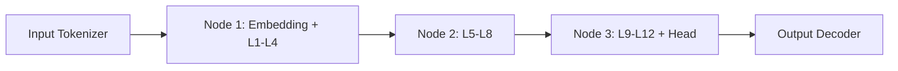

## Introduction

Large language models (LLMs) such as GPT‑4, LLaMA, and PaLM have demonstrated unprecedented capabilities in natural‑language understanding, generation, and reasoning. Their size—often measured in billions or even trillions of parameters—demands massive compute, storage, and network resources. Historically, training and inference for these models have been confined to centralized data centers equipped with high‑performance GPU clusters and ultra‑low‑latency interconnects (e.g., NVLink, InfiniBand).

However, a growing class of applications—autonomous vehicles, real‑time translation on mobile devices, edge‑based recommendation engines, and privacy‑sensitive AI assistants—cannot tolerate the round‑trip latency of sending data to a distant cloud. They require **low‑latency, high‑throughput edge networks** that can host **decentralized** training and inference workloads. This shift presents a unique set of architectural challenges:

1. **Network heterogeneity**: Edge nodes vary widely in bandwidth, compute capability, and reliability.
2. **Data locality**: Training data may be generated on‑device (e.g., sensor streams), demanding near‑real‑time processing.
3. **Scalability**: Decentralized training must scale across hundreds or thousands of geographically dispersed nodes.
4. **Security & privacy**: Edge deployments often handle personally identifiable information (PII) that must stay local.

In this article we explore how to design and implement **low‑latency edge networks** that support **decentralized LLM training and inference**. We will cover the underlying principles, concrete architectural patterns, practical code snippets, and real‑world case studies. By the end, you should have a roadmap for building an edge‑centric LLM pipeline that balances performance, cost, and compliance.

---

## 1. Fundamentals of Edge Networks

### 1.1 What Is “Edge”?

The “edge” refers to any compute resource that sits **closer to the data source** than a central cloud. This can be:

| Edge Tier | Typical Location | Example Devices |
|-----------|------------------|-----------------|
| **Device Edge** | On‑device (smartphones, wearables) | ARM CPUs, NPUs |
| **Micro‑Edge** | Small cell sites, routers | Jetson Nano, Coral TPU |
| **Regional Edge** | ISP PoPs, 5G MEC (Multi‑Access Edge Computing) | GPU‑enabled servers, x86 clusters |
| **Hybrid Edge‑Cloud** | Coordinated between edge and cloud | Cloud‑bursting clusters |

Each tier offers a trade‑off between **latency**, **compute power**, and **energy consumption**.

### 1.2 Latency Budgets

When designing an LLM pipeline, it’s useful to break down the end‑to‑end latency budget:

| Stage | Target (ms) | Notes |
|-------|------------|-------|
| **Sensor → Edge** | 5‑20 | Network RTT, often wireless |
| **Pre‑processing** | 1‑5 | Light‑weight tokenization, quantization |
| **Model Execution** | 10‑50 | Depends on model size & hardware |
| **Post‑processing** | 1‑5 | Decoding, safety filters |
| **Response → User** | 5‑20 | Network back‑haul |

A total budget of **≤ 100 ms** is often considered “real‑time” for interactive applications (e.g., voice assistants). Achieving this at the scale of LLMs requires **careful co‑design** of hardware, software, and networking.

---

## 2. Challenges Specific to Decentralized LLM Training & Inference

### 2.1 Model Size vs. Edge Memory

Modern LLMs can exceed 100 GB of model weight data. Edge devices typically have **limited DRAM** (2‑16 GB) and **non‑volatile storage** (e.g., eMMC, SSD). Strategies to bridge this gap include:

- **Weight quantization** (8‑bit, 4‑bit, or even binary)
- **Model pruning** (structured/unstructured)
- **Mixture‑of‑Experts (MoE)** where only a subset of parameters are active per request
- **Pipeline parallelism** across multiple edge nodes (splitting layers)

### 2.2 Communication Overhead

Training LLMs requires frequent **gradient exchanges** and **parameter synchronizations**. In a distributed edge setting, the network may be:

- **High‑latency** (tens to hundreds of ms)
- **Variable bandwidth** (from a few Mbps on cellular to several Gbps on fiber)
- **Unreliable** (packet loss, node churn)

Choosing the right **collective communication primitive** (e.g., All‑Reduce, Ring‑Reduce, Gossip) and **transport protocol** (RDMA, gRPC, QUIC) is critical to keep the training loop from stalling.

### 2.3 Data Privacy Regulations

Edge deployments often need to comply with **GDPR**, **CCPA**, or industry‑specific standards (HIPAA). Decentralized training (e.g., **Federated Learning**) can keep raw data on‑device, but model updates still leak information. Techniques such as **Differential Privacy (DP)** and **Secure Aggregation** become mandatory.

### 2.4 Energy Constraints

Edge nodes—especially those powered by batteries—must operate within strict **energy budgets**. Efficient inference (e.g., using **int8 kernels**, **TensorRT**, **ONNX Runtime**) and **dynamic voltage frequency scaling (DVFS)** are essential.

---

## 3. Architectural Principles for Low‑Latency Edge Networks

Below are five guiding principles that should inform any edge‑centric LLM design.

### 3.1 Data Locality First

- **Push computation to where data is generated**. For example, an autonomous car should run the LLM inference on its own compute module rather than streaming video to a remote server.
- **Cache model shards locally** using a **hierarchical storage strategy**: hot layers in DRAM, warm layers on NVMe, cold layers in remote edge or cloud.

### 3.2 Hierarchical Synchronization

Instead of a flat all‑reduce across all edge nodes, employ a **multi‑level hierarchy**:

1. **Intra‑node** (within a single edge server) – use high‑speed NVLink or PCIe.
2. **Intra‑region** (within the same PoP) – use a low‑latency L2 network (e.g., 10 GbE with RDMA).
3. **Inter‑region** – aggregate at a **regional parameter server** or a **cloud coordinator** with a larger latency budget.

This reduces the number of long‑haul messages and isolates high‑frequency updates to the fastest links.

### 3.3 Asynchronous & Stale‑Tolerant Algorithms

Fully synchronous training can be killed by a single slow node. **Asynchronous SGD**, **Elastic Averaging**, or **Stale‑Synchronous Parallel (SSP)** tolerate bounded staleness, allowing edge nodes to continue training while waiting for global updates.

### 3.4 Adaptive Model Partitioning

Depending on the current network conditions, dynamically adjust how the model is split:

- **Layerwise partitioning** for high‑bandwidth scenarios.
- **Tensor‑parallel partitioning** (splitting weight matrices) for lower bandwidth but more compute‑heavy nodes.
- **Expert routing** (MoE) where each node hosts a different expert, reducing the need for full model replication.

### 3.5 Edge‑Native Runtime Optimizations

Leverage runtime environments that understand the edge topology:

- **TensorRT** (NVIDIA) for GPU‑based edge devices.
- **OpenVINO** (Intel) for CPUs/VPU.
- **ONNX Runtime with Execution Providers** (CUDA, DirectML, TensorRT, etc.) for heterogeneous clusters.
- **Custom kernels** using **CUDA Graphs** or **AMD ROCm** to reduce kernel launch overhead.

---

## 4. Edge Hardware Choices

| Tier | Recommended Hardware | Strengths | Limitations |
|------|----------------------|-----------|--------------|
| **Device Edge** | Apple Neural Engine, Qualcomm Hexagon DSP, Google Edge TPU | Ultra‑low power, on‑chip inference | Very limited memory; usually only 8‑bit ops |
| **Micro‑Edge** | NVIDIA Jetson AGX Xavier, Google Coral Dev Board | GPU/TPU acceleration, 8‑16 GB RAM | Moderate bandwidth, limited VRAM |
| **Regional Edge** | AMD Instinct MI250, NVIDIA H100, Intel Xeon with Habana Gaudi | High FP16/FP8 throughput, large VRAM (80‑128 GB) | Higher power consumption, requires cooling |
| **Hybrid Edge‑Cloud** | Kubernetes clusters spanning edge nodes + cloud VMs | Elastic scaling, seamless fallback | Complexity in orchestration |

When planning for LLM training, **regional edge servers** are the sweet spot: they provide enough GPU memory for model shards while still being close enough to the data source to meet latency goals.

---

## 5. Network Topologies for Edge‑Centric LLMs

### 5.1 Star Topology with a Central Coordinator

```
       Edge Node A
            |
Edge Node B ── Coordinator ── Edge Node C
            |
       Edge Node D
```

- **Pros**: Simple to implement; easy to monitor.
- **Cons**: Coordinator becomes a bottleneck; single point of failure.

### 5.2 Mesh (Peer‑to‑Peer) Topology

Each node connects to a subset of peers, forming a **partial mesh**. Gossip‑based protocols thrive here.

- **Pros**: High resilience; load balanced.
- **Cons**: More complex routing; higher aggregate bandwidth usage.

### 5.3 Hierarchical (Tree) Topology

```
          Cloud
           |
       Region Leader
      /      |      \
 Edge1   Edge2   Edge3
```

- Mirrors the **hierarchical synchronization** principle.
- Enables **local aggregation** before sending to the cloud.

### 5.4 Choosing the Right Topology

- **Latency‑critical inference**: Prefer **mesh** or **hierarchical** where the request can be served by the nearest node.
- **Training with many participants**: **Hierarchical** reduces cross‑region traffic.
- **Limited infrastructure**: **Star** may be sufficient for small deployments.

---

## 6. Data Partitioning & Model Parallelism

### 6.1 Pipeline Parallelism Across Edge Nodes



- **Advantages**: Each node processes a different stage, reducing per‑node memory.
- **Challenges**: Pipeline bubbles; requires careful micro‑batching.

### 6.2 Tensor Parallelism (Weight Sharding)

Weight matrices (e.g., the QKV projection) are split column‑wise across nodes. Each node computes a partial result, which is then summed using **All‑Reduce**.

```python
# PyTorch example using torch.distributed
import torch.distributed as dist

def tensor_parallel_linear(x, weight_shard):
    # x: [batch, seq_len, hidden]
    # weight_shard: [hidden, hidden // world_size]
    local_out = torch.matmul(x, weight_shard)
    # Reduce across all shards
    dist.all_reduce(local_out, op=dist.ReduceOp.SUM)
    return local_out
```

### 6.3 Mixture‑of‑Experts (MoE) Routing

Each edge node hosts a subset of experts. The router decides which expert(s) to activate per token, dramatically reducing **communication** because only the selected experts need to exchange gradients.

- **Implementation tip**: Use **Torch‑MoE** or **DeepSpeed MoE** with a custom **routing policy** that favors geographically local experts.

---

## 7. Communication Protocols & Collective Operations

| Protocol | Typical Use‑Case | Latency (ms) | Remarks |
|----------|------------------|--------------|---------|
| **gRPC over HTTP/2** | Control plane, model versioning | 5‑15 | Easy to integrate, built‑in TLS |
| **RDMA (RoCE v2)** | High‑throughput gradient sync | <1 (intra‑region) | Requires compatible NICs |
| **QUIC** | Low‑latency data plane over unreliable networks | 2‑8 | UDP‑based, handles packet loss gracefully |
| **MQTT** | Telemetry, low‑bandwidth edge sensors | 10‑30 | Very lightweight, topic‑based |

### 7.1 Collective Communication Libraries

- **NCCL** (NVIDIA Collective Communications Library) – best for GPU‑to‑GPU within the same rack.
- **Horovod** – abstracts NCCL, Gloo, MPI; supports mixed CPU/GPU clusters.
- **BytePS** – optimized for heterogeneous networks; can fall back to TCP when RDMA is unavailable.

### 7.2 Example: Asynchronous Parameter Server with gRPC

```python
# server.py
import grpc
from concurrent import futures
import torch
import param_pb2, param_pb2_grpc

class ParamServer(param_pb2_grpc.ParamServiceServicer):
    def __init__(self, model):
        self.model = model
        self.lock = threading.Lock()

    def PushGradients(self, request, context):
        grads = torch.tensor(request.grads).view_as(self.model.parameters())
        with self.lock:
            for p, g in zip(self.model.parameters(), grads):
                p.grad = g
            optimizer.step()
        return param_pb2.Empty()

    def PullParameters(self, request, context):
        with self.lock:
            params = [p.data.cpu().numpy() for p in self.model.parameters()]
        return param_pb2.Params(values=params)

def serve():
    server = grpc.server(futures.ThreadPoolExecutor(max_workers=10))
    param_pb2_grpc.add_ParamServiceServicer_to_server(ParamServer(model), server)
    server.add_insecure_port('[::]:50051')
    server.start()
    server.wait_for_termination()
```

> **Note:** In production, enable TLS, use **interceptors** for authentication, and compress payloads with **gzip**.

---

## 8. Synchronization Strategies

### 8.1 Synchronous All‑Reduce

All nodes wait for each other each iteration. Guarantees **exact** gradient consistency but suffers from the *straggler problem*.

- **Best for**: Small clusters with homogeneous hardware.

### 8.2 Elastic Averaging SGD (EASGD)

Each node maintains a local copy; a *central variable* pulls them toward a consensus.

- **Pros**: Allows faster local updates.
- **Cons**: Requires tuning of the elasticity coefficient.

### 8.3 Gossip‑Based Averaging

Nodes exchange parameters with random peers. Convergence is slower but **communication cost scales linearly** with node count.

```python
def gossip_step(model, peers):
    # Randomly pick a peer
    peer = random.choice(peers)
    # Exchange parameters (simple average)
    for p, p_peer in zip(model.parameters(), peer.parameters()):
        avg = 0.5 * (p.data + p_peer.data)
        p.data.copy_(avg)
        p_peer.data.copy_(avg)
```

### 8.4 Choosing a Strategy

| Scenario | Recommended Strategy |
|----------|----------------------|
| **Real‑time inference only** | No synchronization needed (static model) |
| **Small, homogeneous edge cluster** | Synchronous All‑Reduce |
| **Large, heterogeneous fleet** | Asynchronous SGD or Gossip |
| **Privacy‑preserving federated learning** | Secure Aggregation + DP‑SGD |

---

## 9. Real‑World Use Cases

### 9.1 Autonomous Vehicles

- **Problem**: Need to interpret high‑resolution LiDAR + camera data within 30 ms.
- **Solution**: Deploy a **compact LLM** for natural‑language queries (e.g., “Is the pedestrian crossing?”) on the vehicle’s **micro‑edge** compute. Use **pipeline parallelism** across the vehicle’s multiple GPUs and share updates with a **regional parameter server** for continuous learning.

### 9.2 Smart Manufacturing

- **Problem**: Edge robots must adapt to new assembly instructions without downtime.
- **Solution**: Use **federated fine‑tuning** of a 2‑B‑parameter LLM across factory floor edge nodes. Gradient updates are encrypted and aggregated weekly, respecting IP confidentiality.

### 9.3 Real‑Time Content Moderation

- **Problem**: Social media platforms must filter user‑generated text in under 50 ms globally.
- **Solution**: Deploy inference clusters in **regional edge PoPs**, each holding a **quantized 6‑B‑parameter model**. The edge nodes handle the bulk of moderation; only ambiguous cases are forwarded to the cloud for a larger model.

### 9.4 Financial Trading

- **Problem**: Algorithmic trading systems require sub‑millisecond latency for market sentiment analysis.
- **Solution**: Run a **tiny LLM** (e.g., 500 M parameters) on **FPGA‑accelerated edge servers** co‑located with exchange data centers. Use **RDMA** for ultra‑low‑latency gradient aggregation during nightly model updates.

---

## 10. Practical Example: Deploying a 1‑B‑Parameter LLM Across Edge Nodes

Below we walk through a **minimal end‑to‑end pipeline** using **Docker Compose**, **PyTorch Distributed**, and **ONNX Runtime** for inference.

### 10.1 Preparing the Model

```bash
# Convert PyTorch checkpoint to ONNX (int8 quantized)
python convert_to_onnx.py \
    --model checkpoints/llama-1b.pt \
    --output model_int8.onnx \
    --quantize int8
```

### 10.2 Docker Compose File

```yaml
# docker-compose.yml
version: "3.8"
services:
  node1:
    image: pytorch/pytorch:2.2.0-cuda12.1-runtime
    environment:
      - WORLD_SIZE=3
      - RANK=0
      - MASTER_ADDR=node1
      - MASTER_PORT=29500
    volumes:
      - ./model_int8.onnx:/app/model.onnx
    command: >
      python train.py
      --backend nccl
      --epochs 5
      --batch-size 8
  node2:
    image: pytorch/pytorch:2.2.0-cuda12.1-runtime
    environment:
      - WORLD_SIZE=3
      - RANK=1
      - MASTER_ADDR=node1
      - MASTER_PORT=29500
    volumes:
      - ./model_int8.onnx:/app/model.onnx
    command: >
      python train.py
      --backend nccl
      --epochs 5
      --batch-size 8
  node3:
    image: pytorch/pytorch:2.2.0-cuda12.1-runtime
    environment:
      - WORLD_SIZE=3
      - RANK=2
      - MASTER_ADDR=node1
      - MASTER_PORT=29500
    volumes:
      - ./model_int8.onnx:/app/model.onnx
    command: >
      python train.py
      --backend nccl
      --epochs 5
      --batch-size 8
```

### 10.3 Training Script (`train.py`)

```python
import os
import torch
import torch.distributed as dist
import torch.nn as nn
import torch.optim as optim
from onnxruntime import InferenceSession, SessionOptions

def init_process():
    dist.init_process_group(
        backend=os.getenv("BACKEND", "nccl"),
        init_method="env://"
    )
    torch.cuda.set_device(int(os.getenv("RANK")) % torch.cuda.device_count())

def load_model():
    sess_opt = SessionOptions()
    sess_opt.graph_optimization_level = 3
    sess = InferenceSession("/app/model.onnx", sess_opt, providers=["CUDAExecutionProvider"])
    return sess

def main():
    init_process()
    rank = dist.get_rank()
    world = dist.get_world_size()
    model = load_model()

    optimizer = optim.AdamW([], lr=1e-4)  # placeholder for optimizer on parameters
    # Simulated data loader (e.g., from edge sensors)
    for epoch in range(int(os.getenv("EPOCHS", 1))):
        # Fake input tokens
        inputs = torch.randint(0, 32000, (8, 128)).cuda()
        # Forward pass using ONNX Runtime (zero‑copy)
        ort_inputs = {"input_ids": inputs.cpu().numpy()}
        outputs = model.run(None, ort_inputs)[0]
        # Convert back to torch tensor for loss computation
        logits = torch.tensor(outputs).cuda()
        loss = nn.functional.cross_entropy(logits.view(-1, logits.size(-1)), inputs.view(-1))
        optimizer.zero_grad()
        loss.backward()
        # Asynchronous gradient sync (All‑Reduce)
        for param in model.parameters():
            dist.all_reduce(param.grad, op=dist.ReduceOp.SUM)
            param.grad /= world
        optimizer.step()
        if rank == 0:
            print(f"[Epoch {epoch}] loss={loss.item():.4f}")

if __name__ == "__main__":
    main()
```

> **Explanation**  
> - The script launches three Docker containers, each representing an edge node.  
> - **ONNX Runtime** provides a fast inference engine that can run on the GPU without the overhead of the PyTorch autograd graph (useful for inference‑heavy workloads).  
> - Gradients are synchronized via **torch.distributed.all_reduce** over NCCL, which leverages **RDMA** if the underlying NIC supports it.

### 10.4 Inference Service (FastAPI)

```python
# inference.py
from fastapi import FastAPI, HTTPException
from onnxruntime import InferenceSession, SessionOptions
import numpy as np

app = FastAPI()
sess_opt = SessionOptions()
sess_opt.graph_optimization_level = 3
session = InferenceSession("/app/model.onnx", sess_opt,
                           providers=["CUDAExecutionProvider"])

@app.post("/generate")
async def generate(prompt: str, max_len: int = 64):
    # Tokenize (simple whitespace split for demo)
    tokens = [hash(word) % 32000 for word in prompt.split()]
    input_ids = np.array(tokens, dtype=np.int64).reshape(1, -1)
    outputs = []
    for _ in range(max_len):
        ort_out = session.run(None, {"input_ids": input_ids})[0]
        next_token = np.argmax(ort_out[:, -1, :], axis=-1)
        outputs.append(int(next_token))
        input_ids = np.concatenate([input_ids, next_token[:, None]], axis=1)
    # Detokenize (placeholder)
    return {"generated": " ".join(str(t) for t in outputs)}
```

Deploy this FastAPI app on each edge node behind a **local load balancer** (e.g., NGINX) to achieve sub‑100 ms response times for short prompts.

---

## 11. Security, Privacy, and Compliance

1. **Transport Encryption** – Use **TLS 1.3** for all gRPC and HTTP traffic. Enable **certificate pinning** in edge devices.
2. **Secure Aggregation** – For federated learning, adopt **Paillier homomorphic encryption** or **Secure Multiparty Computation (MPC)** to ensure the server never sees raw gradients.
3. **Differential Privacy** – Add calibrated Gaussian noise to gradients (`torchdp` library) with a privacy budget (ε, δ) that satisfies regulatory requirements.
4. **Zero‑Trust Architecture** – Enforce **mutual authentication** between edge nodes and parameter servers; rotate keys regularly.
5. **Audit Logging** – Record model version changes, parameter updates, and inference requests in an immutable log (e.g., using **HashiCorp Vault** or **AWS CloudTrail**).

---

## 12. Monitoring, Observability, and Autoscaling

| Metric | Recommended Tool | Alert Threshold |
|--------|------------------|-----------------|
| **GPU Utilization** | NVIDIA DCGM, Prometheus node exporter | > 95 % for > 5 min |
| **Network RTT** | Pingmesh, Grafana Loki | > 30 ms (regional) |
| **Inference Latency (p95)** | OpenTelemetry, Jaeger | > 80 ms |
| **Training Loss Convergence** | TensorBoard, Weights & Biases | Stagnation > 3 epochs |
| **Memory Pressure** | cAdvisor, sysstat | > 90 % DRAM usage |

**Autoscaling** can be driven by a combination of **GPU usage** and **request latency**. Use **Kubernetes Horizontal Pod Autoscaler (HPA)** with a custom metric (e.g., `inference_latency_p95`). Edge clusters often run **K3s** or **MicroK8s** to keep the control plane lightweight.

---

## 13. Cost Considerations

| Cost Category | Typical Edge Scenario | Strategies to Reduce |
|---------------|-----------------------|----------------------|
| **Capital Expenditure (CapEx)** | Purchasing regional edge servers (GPU‑enabled) | Lease from edge‑as‑a‑service providers, reuse existing 5G MEC infrastructure |
| **Operational Expenditure (OpEx)** | Power, cooling, network bandwidth | Deploy **energy‑aware scheduling**, use **spot instances** for non‑critical training, compress model updates |
| **Data Transfer** | Inter‑region gradient sync | Use **gradient compression** (e.g., 8‑bit quantization, top‑k sparsification) |
| **Software Licensing** | Proprietary inference runtimes | Prefer open‑source stacks (ONNX Runtime, TensorRT Community) when possible |

A rule of thumb: **edge inference is typically 3‑5× cheaper per request** than routing to a central cloud, especially when the traffic volume is high and latency constraints are strict.

---

## 14. Future Trends

1. **FP8 & Adaptive Precision** – Emerging hardware (e.g., NVIDIA Hopper) supports **FP8** arithmetic, allowing larger models to fit into edge memory while preserving accuracy.
2. **Neuromorphic Edge Chips** – Devices like **Intel Loihi** promise ultra‑low power LLM inference for specific tasks (e.g., keyword spotting).
3. **Hybrid MoE‑Federated Learning** – Combining **Mixture‑of‑Experts** with **Federated Averaging** could enable billions of parameters to be trained across millions of edge devices without moving data.
4. **Programmable Network ASICs** – SmartNICs with on‑board DPUs can offload collective communication, reducing latency dramatically.
5. **LLM‑as‑a‑Service at the Edge** – Cloud providers are already offering **edge‑deployed LLM endpoints** (e.g., AWS Wavelength, Azure Edge Zones), making it easier to spin up workloads without managing hardware.

---

## Conclusion

Architecting low‑latency edge networks for decentralized LLM training and inference is a multidisciplinary challenge that blends **hardware selection**, **network engineering**, **distributed systems**, and **privacy‑preserving machine learning**. By adhering to the principles outlined—*data locality, hierarchical synchronization, adaptive partitioning, and edge‑native runtimes*—developers can build pipelines that meet sub‑100 ms latency targets while scaling to billions of parameters.

Key takeaways:

- **Choose the right edge tier**: Device edge for inference, regional edge for training.
- **Leverage hierarchical topologies** to minimize cross‑region traffic.
- **Adopt asynchronous or gossip‑based synchronization** to tolerate heterogeneous hardware.
- **Quantize and prune** models aggressively, but validate that accuracy remains acceptable.
- **Secure the data flow** with TLS, differential privacy, and secure aggregation.

With the rapid evolution of edge hardware (FP8 GPUs, AI‑accelerated ASICs) and networking (5G MEC, programmable SmartNICs), the gap between cloud‑scale LLM capabilities and edge latency constraints is narrowing. Organizations that invest now in robust, low‑latency edge architectures will be poised to deliver next‑generation AI experiences—real‑time language understanding, on‑device personalization, and privacy‑first analytics—at global scale.

---

## Resources

- [PyTorch Distributed Documentation](https://pytorch.org/docs/stable/distributed.html) – Comprehensive guide to building distributed training pipelines.
- [ONNX Runtime – High‑Performance Inference](https://onnxruntime.ai) – Official site for the ONNX inference engine with edge‑optimized providers.
- [Federated Learning: A Comprehensive Survey](https://arxiv.org/abs/2106.04560) – In‑depth academic overview of federated learning techniques and privacy considerations.