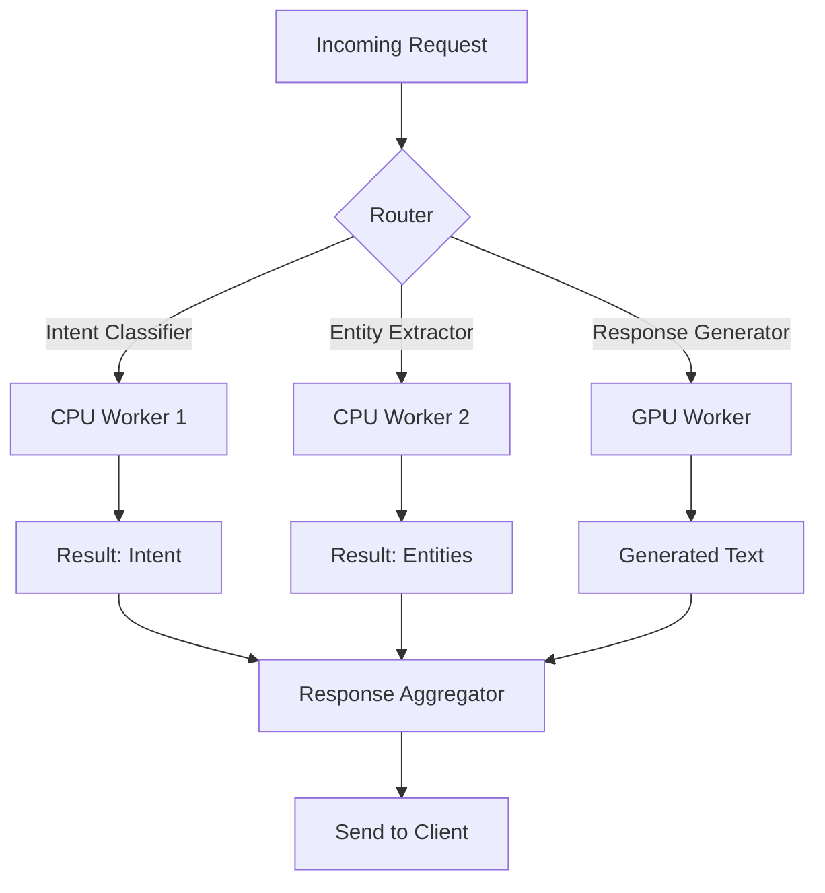

## Table of Contents
1. [Introduction](#introduction)  
2. [Why Move Beyond Giant LLMs?](#why-move-beyond-giant-llms)  
3. [Principles of Real‑Time Local Intelligence](#principles-of-real-time-local-intelligence)  
4. [Small Language Model (SLM) Basics](#small-language-model-slm-basics)  
5. [Architecting SLM Clusters](#architecting-slm-clusters)  
   - 5.1 [Hardware Considerations](#hardware-considerations)  
   - 5.2 [Model Selection & Quantization](#model-selection--quantization)  
   - 5.3 [Communication Patterns](#communication-patterns)  
6. [Orchestration & Scheduling](#orchestration--scheduling)  
7. [Data Flow & Inference Pipeline](#data-flow--inference-pipeline)  
8. [Practical Example: Real‑Time Chatbot Using an SLM Cluster](#practical-example-real-time-chatbot-using-an-slm-cluster)  
9. [Edge Cases: Privacy, Latency, and Scaling](#edge-cases-privacy-latency-and-scaling)  
10. [Monitoring, Logging, & Feedback Loops](#monitoring-logging--feedback-loops)  
11. [Best Practices & Common Pitfalls](#best-practices--common-pitfalls)  
12 [Future Directions](#future-directions)  
13 [Conclusion](#conclusion)  
14 [Resources](#resources)  

---

## Introduction

Large language models (LLMs) such as GPT‑4, Claude, and Gemini have become the de‑facto standard for natural‑language understanding and generation. Their impressive capabilities, however, come with a cost: massive computational footprints, high latency when accessed over the internet, and opaque data handling that can conflict with privacy regulations.  

In many production environments—industrial control systems, autonomous vehicles, retail point‑of‑sale devices, or on‑device assistants—the need for **real‑time, locally executed** intelligence outweighs the desire for the absolute best possible generation quality. A new architectural paradigm is emerging: **clusters of small, highly‑optimized language models (SLMs) that operate at the edge, cooperatively delivering responsive, privacy‑preserving AI**.  

This article dives deep into that paradigm. We’ll explore the motivations behind moving away from monolithic LLMs, outline the core principles of real‑time local intelligence, and walk through a concrete, production‑ready design for an SLM cluster. Code snippets, hardware recommendations, and real‑world case studies will illustrate how you can build, deploy, and maintain such systems today.

> **Note:** While the term “small language model” can be ambiguous, in this context we refer to models with **≤ 1 B parameters**, often quantized to 8‑bit or lower, that can run on commodity CPUs/GPUs or specialized accelerators with sub‑second latency.

---

## Why Move Beyond Giant LLMs?

| **Aspect** | **Giant LLMs (e.g., GPT‑4)** | **Small Model Clusters** |
|------------|-------------------------------|--------------------------|
| **Latency** | 100 ms–seconds over network; unpredictable spikes | < 20 ms on‑device, deterministic |
| **Cost** | Pay‑per‑token, high cloud compute bills | One‑time hardware investment; negligible per‑inference cost |
| **Privacy** | Data leaves the premises; compliance challenges | Data never leaves the device; full GDPR/CCPA alignment |
| **Scalability** | Limited by API rate limits; shared resources | Horizontal scaling by adding nodes; no external throttling |
| **Control** | Model updates controlled by provider; opaque versioning | Full version control, reproducibility, and custom fine‑tuning |
| **Energy** | Cloud data‑center consumption (kWh per inference) | Edge‑optimized, often < 1 W per inference |

### Real‑World Drivers

1. **Regulatory Constraints** – Healthcare and finance sectors often cannot transmit patient or client data to third‑party APIs without explicit consent.
2. **Mission‑Critical Timing** – Robotic manipulators require sub‑50 ms reaction times; any network latency can be catastrophic.
3. **Cost Predictability** – Enterprises with millions of daily interactions need a predictable OPEX model, not a variable token‑based cost.
4. **Sustainability Goals** – Edge inference reduces the carbon footprint associated with massive data‑center workloads.

These pressures have prompted teams to explore **distributed inference** where multiple lightweight models specialize in sub‑tasks (e.g., intent classification, slot filling, response generation) and collaborate in real time.

---

## Principles of Real‑Time Local Intelligence

1. **Deterministic Latency** – Guarantees on maximum inference time are essential. This often means **bounded compute** (fixed‑size tensors, quantized ops) and **predictable scheduling**.
2. **Modular Decomposition** – Break the overall NLP pipeline into **independent micro‑services** (e.g., tokenization, classification, generation). Each can be scaled or swapped without affecting the whole.
3. **Model Heterogeneity** – Not all tasks require the same model size. Use **tiny classifiers** where possible, reserving larger models only for generative steps.
4. **Fault Tolerance** – Edge devices can lose connectivity or power. The system must **gracefully degrade** (e.g., fallback to rule‑based responses) and recover automatically.
5. **Data Locality** – Keep data on the device as long as possible. When external data is required, use **secure, encrypted channels** and retain minimal metadata.

These principles guide the architectural decisions presented later.

---

## Small Language Model (SLM) Basics

### Parameter Ranges & Example Models

| **Parameter Size** | **Typical Use‑Case** | **Example Open‑Source Model** |
|--------------------|----------------------|------------------------------|
| 50 M – 150 M | Intent detection, keyword extraction | DistilBERT, MobileBERT |
| 300 M – 600 M | Named‑entity recognition, short‑form generation | Falcon‑7B‑Instruct (quantized) |
| 800 M – 1 B | Context‑aware response generation, summarization | LLaMA‑2‑7B (8‑bit) |

### Quantization & Compression Techniques

- **8‑bit integer (INT8)** – Most common; 4× reduction, negligible quality loss for many tasks.
- **4‑bit (NF4, GPTQ)** – Aggressive compression; requires specialized kernels (e.g., `bitsandbytes`).
- **Sparse Pruning** – Removes up to 70 % of weights; works well when combined with quantization.
- **Weight Sharing** – Reduces storage by clustering similar weight values.

> **Pro tip:** Use **static quantization** for inference‑only workloads. Dynamic quantization can simplify the pipeline but may introduce jitter in latency.

### Inference Frameworks

| **Framework** | **Strengths** | **Supported Quantization** |
|---------------|---------------|----------------------------|
| 🤗 **Transformers** + `accelerate` | Easy API, large model zoo | INT8, 4‑bit via `bitsandbytes` |
| **vLLM** | High‑throughput serving, GPU‑only | INT8, FP16 |
| **ONNX Runtime** | Cross‑platform, CPU‑optimized | INT8, QNNPACK, TensorRT |
| **TensorRT‑LLM** | Low‑latency GPU inference | INT8, FP8 |

Choosing the right runtime is a key part of the cluster design.

---

## Architecting SLM Clusters

### 5.1 Hardware Considerations

| **Device Class** | **Typical Specs** | **Best‑Fit Tasks** |
|------------------|-------------------|--------------------|
| **CPU‑Only Edge Box** | 4‑core ARM Cortex‑A78, 8 GB RAM, 2 W | Tokenization, lightweight classifiers |
| **GPU‑Enabled Edge** | NVIDIA Jetson AGX Orin (32 GB VRAM, 8 TFLOPs) | 300 M‑600 M model generation |
| **FPGA/ASIC Accelerator** | Intel Habana Gaudi Lite, 1 W | Fixed‑point inference, ultra‑low latency |
| **Micro‑controller** | ESP‑32, 520 KB RAM | Keyword spotting, rule‑based fallback |

A **heterogeneous cluster** often combines these classes: a central hub (GPU box) for generation, surrounded by multiple CPU nodes performing preprocessing and classification.

#### Network Topology

- **Ring or Mesh** – Low‑latency, fault‑tolerant connections between nodes.
- **gRPC over Unix Domain Sockets** – For on‑device communication; avoids TCP overhead.
- **Shared Memory Queues** – When nodes run on the same physical device (e.g., multiple processes on a Jetson).

### 5.2 Model Selection & Quantization

1. **Task‑Driven Sizing** – Map each pipeline stage to the smallest model that meets quality SLAs.
2. **Quantization Pipeline**  
   ```bash
   # Example using Hugging Face & bitsandbytes
   pip install transformers bitsandbytes
   python - <<'PY'
   from transformers import AutoModelForCausalLM, AutoTokenizer
   import bitsandbytes as bnb

   model_name = "meta-llama/Llama-2-7b-hf"
   tokenizer = AutoTokenizer.from_pretrained(model_name)

   # Load in 4‑bit using GPTQ
   model = AutoModelForCausalLM.from_pretrained(
       model_name,
       device_map="auto",
       load_in_4bit=True,
       quantization_config=bnb.nn.quantization.QuantizationConfig(
           bits=4, 
           fp32_emu=False,
           quant_type="nf4"
       )
   )
   model.save_pretrained("./llama2-7b-4bit")
   tokenizer.save_pretrained("./llama2-7b-4bit")
   PY
   ```
3. **Benchmarking** – Use `torch.cuda.Event` or `time.perf_counter` to verify that the model meets the < 20 ms target on target hardware.

### 5.3 Communication Patterns

| **Pattern** | **When to Use** | **Implementation** |
|-------------|-----------------|--------------------|
| **Request‑Reply** | Simple unary calls (e.g., classification) | gRPC unary RPC |
| **Streaming** | Long generation where tokens are emitted progressively | gRPC server‑streaming or WebSockets |
| **Pub/Sub** | Broadcast events (e.g., new user utterance) to multiple workers | ZeroMQ or Redis Pub/Sub |
| **Pipeline Parallelism** | Split a single large model across devices (rare for SLMs) | DeepSpeed or Megatron-LM (if needed) |

A **central orchestrator** (often a lightweight process on the GPU node) routes requests to the appropriate worker based on a routing table derived from model capabilities and current load.

---

## Orchestration & Scheduling

### Stateless vs. Stateful Workers

- **Stateless** – Most classifiers; can be scaled horizontally without sharing state.
- **Stateful** – Generation workers that maintain a cache of KV‑cache for ongoing conversations. Must implement **session affinity**.

### Scheduler Design



- **Priority Queues** – Critical latency‑sensitive tasks get higher priority.
- **Back‑Pressure** – If GPU worker queue length exceeds threshold, the orchestrator can **fallback to a rule‑based responder** to keep latency bounded.
- **Health Checks** – Periodic heartbeats; unhealthy nodes are removed from the routing table.

### Containerization

- Use **Docker** or **Podman** for each worker.
- **K3s (lightweight Kubernetes)** can manage the cluster on devices with enough resources.
- **OCI Runtime Spec** ensures reproducibility across hardware platforms.

---

## Data Flow & Inference Pipeline

1. **Audio → Text** (optional) – Edge speech recognizer (e.g., Vosk) produces the utterance.
2. **Pre‑Processing** – Tokenizer normalizes text, strips punctuation, extracts language metadata.
3. **Intent Classification** – Small BERT‑style model returns a high‑level intent (e.g., `order_status`).
4. **Slot Extraction** – Conditional CRF or tiny transformer extracts entities (order ID, dates).
5. **Contextual Retrieval** – If needed, a vector store (e.g., `FAISS` on‑device) fetches relevant knowledge.
6. **Response Generation** – 300 M–600 M model generates a concise answer, streamed token‑by‑token.
7. **Post‑Processing** – Enforce content policies, perform profanity filtering, and format for UI.

All stages run **asynchronously**, allowing the generation step to start as soon as intent and slots are ready, reducing overall latency.

---

## Practical Example: Real‑Time Chatbot Using an SLM Cluster

Below is a minimal, end‑to‑end Python prototype that demonstrates the core ideas. It uses **FastAPI** for the HTTP front‑end, **gRPC** for inter‑worker communication, and **ONNX Runtime** for CPU inference.

### 1️⃣ Project Layout

```
chatbot/
├─ orchestrator/
│   └─ main.py
├─ workers/
│   ├─ intent_classifier/
│   │   └─ worker.py
│   ├─ slot_extractor/
│   │   └─ worker.py
│   └─ generator/
│       └─ worker.py
├─ models/
│   ├─ intent_int8.onnx
│   ├─ slots_int8.onnx
│   └─ generator_int4.onnx
└─ client/
    └─ ui.py
```

### 2️⃣ gRPC Service Definition (`proto/chat.proto`)

```proto
syntax = "proto3";

package chat;

// Generic request carrying raw text
message TextRequest {
  string session_id = 1;
  string text       = 2;
}

// Intent classification response
message IntentResponse {
  string intent = 1;
  float confidence = 2;
}

// Slot extraction response
message SlotsResponse {
  map<string, string> slots = 1;
}

// Generation stream (token by token)
message Token {
  string text = 1;
  bool   is_end = 2;
}

service IntentService {
  rpc Classify (TextRequest) returns (IntentResponse);
}

service SlotService {
  rpc Extract (TextRequest) returns (SlotsResponse);
}

service GenerationService {
  rpc Generate (TextRequest) returns (stream Token);
}
```

Compile with `python -m grpc_tools.protoc -Iproto --python_out=. --grpc_python_out=. proto/chat.proto`.

### 3️⃣ Worker Example – Intent Classifier (`workers/intent_classifier/worker.py`)

```python
import grpc
import chat_pb2
import chat_pb2_grpc
import onnxruntime as ort
from concurrent import futures

class IntentServicer(chat_pb2_grpc.IntentServiceServicer):
    def __init__(self, model_path: str):
        self.session = ort.InferenceSession(model_path, providers=["CPUExecutionProvider"])

    def Classify(self, request, context):
        # Tokenize (very simple split for demo)
        tokens = request.text.lower().split()
        input_ids = [self._token_to_id(t) for t in tokens]
        ort_inputs = {"input_ids": [input_ids]}
        logits = self.session.run(None, ort_inputs)[0][0]  # shape: (num_intents,)
        intent_id = int(logits.argmax())
        confidence = float(logits.max())
        intent = self._id_to_intent(intent_id)
        return chat_pb2.IntentResponse(intent=intent, confidence=confidence)

    # Dummy vocab mapping
    _vocab = {"order": 1, "status": 2, "help": 3}
    _id2intent = {0: "unknown", 1: "order_status", 2: "help_request"}

    def _token_to_id(self, token):
        return self._vocab.get(token, 0)

    def _id_to_intent(self, idx):
        return self._id2intent.get(idx, "unknown")

def serve():
    server = grpc.server(futures.ThreadPoolExecutor(max_workers=4))
    chat_pb2_grpc.add_IntentServiceServicer_to_server(
        IntentServicer("./models/intent_int8.onnx"), server)
    server.add_insecure_port("[::]:50051")
    server.start()
    server.wait_for_termination()

if __name__ == "__main__":
    serve()
```

The same pattern applies to the **slot extractor** (returning a map of entity names to values) and the **generator** (streaming tokens).

### 4️⃣ Orchestrator (`orchestrator/main.py`)

```python
import asyncio
import uuid
import grpc
import chat_pb2
import chat_pb2_grpc
from fastapi import FastAPI, HTTPException
from pydantic import BaseModel

app = FastAPI()
INTENT_ADDR = "localhost:50051"
SLOT_ADDR   = "localhost:50052"
GEN_ADDR    = "localhost:50053"

class Query(BaseModel):
    text: str

async def classify_intent(text: str):
    async with grpc.aio.insecure_channel(INTENT_ADDR) as channel:
        stub = chat_pb2_grpc.IntentServiceStub(channel)
        resp = await stub.Classify(chat_pb2.TextRequest(session_id=str(uuid.uuid4()), text=text))
        return resp.intent, resp.confidence

async def extract_slots(text: str):
    async with grpc.aio.insecure_channel(SLOT_ADDR) as channel:
        stub = chat_pb2_grpc.SlotServiceStub(channel)
        resp = await stub.Extract(chat_pb2.TextRequest(session_id=str(uuid.uuid4()), text=text))
        return dict(resp.slots)

async def generate_response(text: str):
    async with grpc.aio.insecure_channel(GEN_ADDR) as channel:
        stub = chat_pb2_grpc.GenerationServiceStub(channel)
        async for token in stub.Generate(chat_pb2.TextRequest(session_id=str(uuid.uuid4()), text=text)):
            yield token.text
            if token.is_end:
                break

@app.post("/chat")
async def chat_endpoint(payload: Query):
    intent, confidence = await classify_intent(payload.text)
    if confidence < 0.6:
        return {"error": "Low confidence, fallback to rule‑based system"}

    slots = await extract_slots(payload.text)

    # Build prompt for generator
    prompt = f"Intent: {intent}\nSlots: {slots}\nUser: {payload.text}\nAssistant:"
    response = ""
    async for piece in generate_response(prompt):
        response += piece
    return {"response": response}
```

**Key takeaways from the example:**

- **Micro‑service isolation** (each worker runs in its own process, can be containerized).
- **Async orchestrator** maintains low latency by overlapping I/O.
- **Streaming generation** allows the client to start rendering text before the full answer is ready.

### 5️⃣ Deploying on Edge Hardware

```bash
# On the GPU node (e.g., Jetson)
docker run -d --gpus all -p 50053:50053 \
  -v $(pwd)/models:/app/models \
  myorg/generator-worker:latest

# On CPU nodes
docker run -d -p 50051:50051 myorg/intent-worker:latest
docker run -d -p 50052:50052 myorg/slot-worker:latest
```

Monitoring can be added with **Prometheus** exporters inside each container, exposing request latency and GPU memory usage.

---

## Edge Cases: Privacy, Latency, and Scaling

### Privacy‑First Design

- **On‑Device Encryption** – Encrypt model files at rest using `AES‑256` and decrypt only in memory.
- **Differential Privacy** – When collecting usage metrics, add Laplace noise to counts before sending to a central server.
- **Zero‑Knowledge Proofs** – For high‑security environments, use zk‑SNARKs to prove that a model inference complied with policy without revealing the data.

### Latency Guarantees

- **Worst‑Case Execution Time (WCET)** analysis on each worker. Use static analysis tools (e.g., `pyinstrument` + profiling) to certify that each stage stays under its budget.
- **Cache Warm‑up** – Keep the KV‑cache for the last N conversations in GPU memory; reuse it when the same session ID returns.
- **Load Shedding** – When the request rate spikes, the orchestrator can drop low‑priority queries and immediately respond with a “please try again” message.

### Scaling Strategies

| **Scale Dimension** | **Technique** |
|---------------------|---------------|
| **Horizontal** | Add more CPU workers for classification; use a simple round‑robin load balancer. |
| **Vertical**   | Upgrade to a higher‑tier GPU (e.g., Jetson Orin → NVIDIA AGX Xavier) for faster generation. |
| **Hybrid Cloud‑Edge** | Offload occasional heavy‑weight generation to the cloud during low‑traffic periods, with fallback to a lightweight on‑device model. |
| **Model Ensembles** | Run multiple small generators in parallel and select the best output via a scoring model. |

---

## Monitoring, Logging, & Feedback Loops

1. **Metrics Collection** – Expose Prometheus endpoints for:
   - `request_latency_seconds`
   - `cpu_utilization_percent`
   - `gpu_memory_bytes_used`
   - `error_rate`
2. **Structured Logging** – Use JSON logs with fields: `timestamp`, `session_id`, `stage`, `latency_ms`, `status`.
3. **Feedback Loop** – Capture user satisfaction (thumbs up/down) and feed it into a **re‑training pipeline**:
   - Store the raw conversation, model outputs, and feedback.
   - Periodically fine‑tune the generator on the *positive* examples using **LoRA** adapters to avoid full retraining.
4. **Alerting** – Set thresholds (e.g., 95th‑percentile latency > 30 ms) and trigger alerts via PagerDuty or Slack.

---

## Best Practices & Common Pitfalls

| **Best Practice** | **Why It Matters** |
|-------------------|--------------------|
| **Pin model versions** | Guarantees reproducibility across deployments. |
| **Quantize once, test twice** | Quantization can introduce subtle accuracy drops; validate on a held‑out set. |
| **Separate data plane from control plane** | Prevents inference traffic from being throttled by orchestration logic. |
| **Graceful degradation** | Guarantees service continuity when a node fails. |
| **Document hardware‑model matrix** | Simplifies scaling decisions and capacity planning. |

### Pitfalls to Avoid

- **Over‑quantizing** – Going below 4‑bit without proper kernel support can cause NaNs.
- **Monolithic pipelines** – Packing all stages into a single large model defeats the latency advantage.
- **Neglecting warm‑up** – First inference on a newly loaded model can be 5‑10× slower; always keep a warm‑up request in the system.
- **Ignoring token‑level streaming latency** – Users perceive latency at the first token; delay here nullifies speed gains elsewhere.

---

## Future Directions

1. **Neurosymbolic Hybrids** – Combine small LMs with rule‑based symbolic engines for deterministic reasoning (e.g., arithmetic, calendar calculations).
2. **Dynamic Model Routing** – Use a meta‑controller that decides **at runtime** which subset of models to invoke based on input complexity.
3. **Edge‑Optimized Training** – Techniques like **Tiny‑LLM** and **Sparse‑Mixture‑of‑Experts** that allow continual learning directly on the device.
4. **Standardized Benchmarks** for edge LLMs (e.g., **EVAL‑EDGE**) that measure latency, power, and privacy compliance together.
5. **Hardware‑Software Co‑Design** – ASICs tailored for 4‑bit transformer kernels could push inference below 1 ms per token, opening new real‑time applications (e.g., AR/VR dialogue).

---

## Conclusion

The era of monolithic, cloud‑only LLMs is giving way to a more nuanced ecosystem where **small language model clusters** deliver **real‑time, privacy‑preserving, and cost‑effective** intelligence at the edge. By carefully selecting model sizes, applying aggressive quantization, and orchestrating a heterogeneous hardware pool with robust communication patterns, you can build systems that meet stringent latency SLAs while retaining enough linguistic capability for most commercial use‑cases.

The architecture outlined in this article—modular workers, an async orchestrator, and a feedback‑driven improvement loop—provides a production‑ready blueprint. Whether you’re implementing a voice assistant on a smart appliance, an on‑premise support chatbot, or an autonomous robot that must react instantly, the principles and code examples here should accelerate your journey from concept to deployment.

Remember: **success lies not just in the models themselves, but in the engineering discipline that binds them together**. Embrace deterministic design, monitor relentlessly, and iterate with real user feedback. The future of AI is local, real‑time, and responsibly built—small models are leading the charge.

---

## Resources

- **Hugging Face Transformers** – Comprehensive library for model loading, quantization, and inference.  
  [https://github.com/huggingface/transformers](https://github.com/huggingface/transformers)

- **Bitsandbytes** – Efficient 4‑bit and 8‑bit quantization tools for PyTorch.  
  [https://github.com/TimDettmers/bitsandbytes](https://github.com/TimDettmers/bitsandbytes)

- **ONNX Runtime** – Cross‑platform inference engine with extensive CPU/GPU acceleration.  
  [https://onnxruntime.ai/](https://onnxruntime.ai/)

- **FastAPI** – High‑performance web framework used for the orchestrator example.  
  [https://fastapi.tiangolo.com/](https://fastapi.tiangolo.com/)

- **Vosk Speech Recognition** – Offline speech‑to‑text engine suitable for edge devices.  
  [https://alphacephei.com/vosk/](https://alphacephei.com/vosk/)

- **Prometheus Monitoring** – Open‑source metrics collection and alerting system.  
  [https://prometheus.io/](https://prometheus.io/)

- **LoRA (Low‑Rank Adaptation)** – Efficient fine‑tuning method for large language models.  
  [https://arxiv.org/abs/2106.09685](https://arxiv.org/abs/2106.09685)

- **The Little Book of Model Quantization** – Practical guide covering INT8, 4‑bit, and beyond.  
  [https://github.com/ModelCompression/QuantizationBook](https://github.com/ModelCompression/QuantizationBook)

These resources provide deeper dives into the libraries, algorithms, and operational practices essential for building robust SLM clusters. Happy coding!