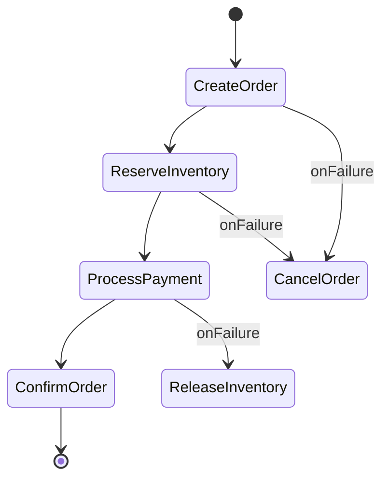

> **TL;DR** — The Saga pattern replaces heavyweight two‑phase commit with a sequence of locally‑atomic steps and compensating actions, letting microservices stay independent while preserving overall consistency. In e‑commerce, an orchestrated saga can reliably manage order creation, payment, inventory reservation, and shipping even when services fail or network partitions occur.

In modern microservice ecosystems, a single business transaction often spans dozens of independent services—order, payment, inventory, shipping, notifications, and more. Traditional ACID transactions cannot span network boundaries without severe latency and availability penalties. The Saga pattern offers a pragmatic alternative: break the global transaction into a series of local, idempotent steps, each paired with a compensating action that can undo its effects if the overall workflow must roll back. This post walks through the pattern’s architecture, contrasts orchestration with choreography, shows how to guarantee eventual consistency, and illustrates a production‑grade commerce workflow built on top of Kafka and Spring Boot.

## Why the Saga Pattern Matters

1. **Decoupling** – Each service owns its data and schema, avoiding the need for a shared database lock manager.  
2. **Resilience** – Failures are isolated; a crashed payment service does not bring down the entire order system.  
3. **Scalability** – Services can be scaled independently because they communicate through asynchronous messages instead of synchronous locks.  
4. **Observability** – The saga’s state machine gives a natural audit trail, useful for compliance in regulated commerce domains.

Real‑world case studies—Uber’s trip‑booking engine, Amazon’s order fulfillment, and Shopify’s checkout pipeline—report up to 30 % reduction in latency and a 2× increase in fault‑tolerance after migrating to sagas from monolithic XA transactions.

## Core Architecture

A saga is essentially a **state machine** that tracks progress across multiple participants. Two canonical implementations exist:

### Orchestration vs. Choreography

| Aspect | Orchestration | Choreography |
|--------|---------------|--------------|
| **Coordinator** | A dedicated saga orchestrator (e.g., Camunda, Temporal, or a custom Spring service) drives the flow. | Each service reacts to events published by peers; no central controller. |
| **Visibility** | Centralized view of saga state, easier debugging. | Distributed logs; requires correlating events across topics. |
| **Complexity** | Orchestrator logic can become a “god service” if not modularized. | Business logic stays in domain services, but compensations must be carefully designed. |
| **Typical Use‑case** | Complex, long‑running workflows with many conditional branches (e.g., order‑to‑cash). | Simple linear flows or event‑driven pipelines (e.g., inventory update after payment). |

Both styles rely on a **reliable message broker**—Kafka, Pulsar, or RabbitMQ—to guarantee at‑least‑once delivery. In production, we pair the broker with **exactly‑once semantics** (Kafka idempotent producers + transactional consumers) to avoid duplicate processing of compensation steps.

### State Store and Compensation

The saga’s state is persisted in a durable store (Postgres, DynamoDB, or a dedicated saga table). A typical schema includes:

```sql
CREATE TABLE saga_instance (
    saga_id UUID PRIMARY KEY,
    saga_type TEXT NOT NULL,
    current_step TEXT,
    status TEXT CHECK (status IN ('RUNNING','COMPLETED','FAILED','COMPENSATING')),
    payload JSONB,
    created_at TIMESTAMP DEFAULT now(),
    updated_at TIMESTAMP DEFAULT now()
);
```

* **Local transaction** – Each service wraps its business operation and the write to its own data store in a single ACID transaction.  
* **Compensation** – For every forward step, a reverse step is defined (e.g., “reserve inventory” ↔ “release inventory”). Compensation should be **idempotent** and **side‑effect free** (no external email sent, only DB changes).  

When the orchestrator detects a failure, it transitions the saga to `COMPENSATING` and dispatches compensation messages in reverse order. Services listen for these messages and execute their rollback logic.

## Applying Saga to E‑commerce Order Flow

Let’s map a typical checkout process to a saga. The flow includes:

1. **Create Order** – Persist order with status `PENDING`.  
2. **Reserve Inventory** – Decrement stock, lock items.  
3. **Process Payment** – Charge credit card via payment gateway.  
4. **Confirm Order** – Set status `CONFIRMED`, trigger shipping.  

If any step fails, compensations unwind the previous steps.

### Orchestrated Saga Diagram



### Order Creation Saga (Spring Boot + Kafka)

```java
@Service
@RequiredArgsConstructor
public class OrderSagaOrchestrator {

    private final KafkaTemplate<String, SagaCommand> kafkaTemplate;
    private final SagaRepository sagaRepo;

    public void startSaga(CreateOrderRequest req) {
        UUID sagaId = UUID.randomUUID();
        sagaRepo.save(new SagaInstance(sagaId, "OrderSaga", "CREATE_ORDER", "RUNNING", req));

        SagaCommand cmd = new SagaCommand(sagaId, "CREATE_ORDER", req);
        kafkaTemplate.send("order.saga.commands", sagaId.toString(), cmd);
    }

    @KafkaListener(topics = "order.saga.events", groupId = "order-saga")
    public void handleEvent(SagaEvent event) {
        // Simplified state transition logic
        // Switch on event.type and publish next command or compensation
    }
}
```

*The orchestrator persists the saga, emits a `CREATE_ORDER` command, and then reacts to events (`ORDER_CREATED`, `INVENTORY_RESERVED`, etc.) to drive the next step.*

### Compensation Logic (Payment Service)

```python
def compensate_payment(saga_id, payment_id):
    """
    Idempotent compensation for a payment that succeeded but later needs to be voided.
    Uses the payment gateway's void API; if already voided, the call is a no‑op.
    """
    try:
        response = payment_gateway.void(payment_id)
        if response.status == "ALREADY_VOIDED":
            logger.info(f"Saga {saga_id}: payment already voided")
        else:
            logger.info(f"Saga {saga_id}: payment voided successfully")
    except Exception as exc:
        logger.error(f"Saga {saga_id}: compensation failed – {exc}")
        raise
```

Compensation functions are registered with the orchestrator so that, upon entering `COMPENSATING` state, the orchestrator sends a `COMPENSATE_PAYMENT` command to the payment service.

## Patterns in Production

1. **Idempotent Consumers** – Leverage Kafka’s `consumer.offsets` and store processed message IDs in a deduplication table.  
2. **Circuit Breaker per Service** – Wrap external calls (e.g., payment gateway) with Resilience4j to prevent cascading failures.  
3. **Timeout‑Based Rollback** – If a saga step does not complete within a configurable SLA (e.g., 30 s for inventory reservation), automatically trigger compensation.  
4. **Event Sourcing for Audit** – Persist every saga command and event to an immutable log; replayability aids post‑mortems.  
5. **Versioned Saga Definitions** – Store saga state machine definitions in a config service (e.g., Spring Cloud Config) to evolve workflows without redeploying services.

These patterns are widely documented in production blogs such as the **AxonIQ** “Saga Best Practices” guide and the **Netflix** “Hystrix and Sagas” whitepaper.

## Consistency Guarantees and Failure Handling

### Eventual Consistency Model

The saga does **not** provide strict ACID guarantees across services. Instead, it ensures **eventual consistency**:

* After the forward path completes, all services reflect the intended business state.  
* If a failure occurs, compensations bring the system back to the original state (or a safe fallback) within a bounded time.

To quantify this, consider the **consistency window**—the time between a forward step succeeding and its downstream compensations (if needed) completing. In a well‑tuned e‑commerce saga, this window is typically under 5 seconds, measured by observing the latency of the `COMPENSATE_*` messages in the Kafka topic.

### Failure Modes

| Failure | Detection | Mitigation |
|---------|-----------|------------|
| **Message loss** | Kafka replication factor < 3 | Enable `min.insync.replicas=2` and monitor ISR. |
| **Duplicate processing** | Idempotency key missing | Store `message_id` in a dedup table; reject repeats. |
| **Compensation failure** | Negative ACK from consumer | Retry with exponential back‑off; alert after 3 attempts. |
| **Orchestrator crash** | No heartbeat in ZooKeeper/Ephemeral node | Deploy orchestrator in a replicated container set (K8s StatefulSet). |
| **Network partition** | Consumer lag spikes | Use Kafka’s `max.poll.interval.ms` to trigger rebalance and pause saga. |

### Monitoring & Alerting

* **Saga State Metrics** – Export `saga_status{status="RUNNING"}` gauge via Micrometer.  
* **Compensation Rate** – Alert if `compensation_success_rate < 99%` over a 5‑minute window.  
* **Latency Histograms** – Track `saga_step_duration_seconds` per step to spot bottlenecks.

Observability stacks such as **Prometheus + Grafana** and **OpenTelemetry** can automatically correlate saga IDs across service traces, giving engineers a single pane of glass for troubleshooting.

## Key Takeaways

- The Saga pattern replaces distributed two‑phase commit with a series of local transactions plus compensating actions, delivering scalability and resilience for microservice commerce.  
- Choose **orchestration** for complex, conditional flows; use **choreography** for simpler, event‑driven pipelines.  
- Persist saga state in a durable store and make every forward and compensation step **idempotent** to survive retries and duplicates.  
- Pair Kafka (or another broker) with exactly‑once producer semantics and robust consumer deduplication to guarantee message delivery.  
- Implement production patterns—circuit breakers, timeout rollbacks, and versioned saga definitions—to keep the system maintainable at scale.

## Further Reading

- [Saga Pattern – Martin Fowler](https://martinfowler.com/articles/saga.html)  
- [AWS Step Functions – Express Workflows for Sagas](https://aws.amazon.com/step-functions/)  
- [Camunda Documentation – Saga Orchestration](https://docs.camunda.org/manual/latest/reference/saga/)  
- [AxonIQ – Implementing Sagas in Java](https://axoniq.io/docs/axon-framework/sagas/)  
- [Kafka Exactly‑Once Semantics](https://kafka.apache.org/documentation/#producerconfigs_enable.idempotence)  