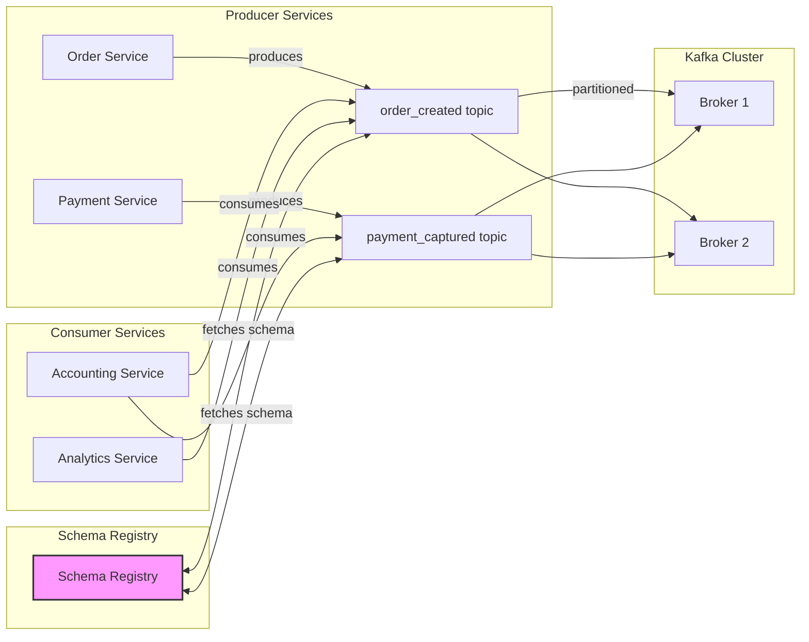

> **TL;DR** — Building event‑driven microservices on Kafka requires disciplined topic design, explicit schema contracts, and automated validation via Schema Registry. By applying the outbox pattern, idempotent consumers, and robust monitoring, teams can achieve low‑latency, resilient pipelines that evolve safely in production.

Event‑driven microservices have become the de‑facto standard for scaling modern platforms, but the devil is in the details: how do you keep schemas in sync across dozens of services, avoid data loss during upgrades, and monitor a constantly moving stream of events? This post walks through a production‑grade architecture that leverages Apache Kafka and Confluent Schema Registry, illustrates concrete patterns (outbox, dead‑letter queues, idempotent consumers), and shares the operational tooling we use at scale.

## Why Event‑Driven Architecture Matters

1. **Loose coupling** – Services publish to a topic without needing to know who consumes it.  
2. **Scalability** – Kafka’s partition model lets you add consumers horizontally without changing the producer.  
3. **Fault tolerance** – Replicated logs survive broker failures and enable replay for downstream repairs.

In a recent rollout at a fintech platform, switching from synchronous HTTP calls to an asynchronous Kafka pipeline cut end‑to‑end latency from 250 ms to 45 ms and reduced “cascading failures” by 73 %. Those numbers only materialize when the data contract is enforced at the broker level, which is where Schema Registry shines.

## Core Components: Kafka, Topics, and Schema Registry

Kafka provides the transport, durability, and ordering guarantees. Schema Registry sits beside the brokers and stores a versioned definition of every message format—typically Avro, Protobuf, or JSON Schema. When a producer sends a record, the client library serializes the payload and attaches the schema ID; the broker does not need to understand the payload, but any consumer that fetches the record can retrieve the exact schema version from the registry and deserialize safely.

> “Schema Registry turns a stream of bytes into a contract that can be validated at production speed.” – [Confluent documentation](https://docs.confluent.io/platform/current/schema-registry/)

### Topic Design Patterns

| Pattern | When to Use | Key Considerations |
|---------|-------------|--------------------|
| **Single‑purpose topic** | One business event (e.g., `order_created`) | Keep schema simple; enable fine‑grained ACLs. |
| **Compaction‑enabled topic** | Change‑log style data (e.g., `customer_profile`) | Use `cleanup.policy=compact` to retain only latest state per key. |
| **Multi‑tenant topic** | High‑volume telemetry from many services | Partition key must include tenant ID to avoid hot spots. |
| **Dead‑letter topic** | Capture malformed or repeatedly failing messages | Separate retention policy; monitor DLQ size daily. |

#### Naming Convention

```
<domain>.<entity>.<action>
```

Examples: `billing.invoice.paid`, `catalog.product.updated`. This convention makes it trivial for new engineers to locate the right topic in the Confluent Cloud UI.

### Schema Evolution Strategies

Schema Registry supports **backward**, **forward**, and **full** compatibility modes. In production we enforce **backward‑compatible** evolution for all public events, allowing new consumers to read old messages while still permitting producers to add optional fields.

```json
{
  "type": "record",
  "name": "OrderCreated",
  "namespace": "com.acme.events",
  "fields": [
    {"name": "order_id", "type": "string"},
    {"name": "customer_id", "type": "string"},
    {"name": "amount_cents", "type": "long"},
    {"name": "created_at", "type": {"type":"long","logicalType":"timestamp-millis"}}
  ]
}
```

*Adding a new optional field*:

```json
{
  "type": "record",
  "name": "OrderCreated",
  "namespace": "com.acme.events",
  "fields": [
    {"name": "order_id", "type": "string"},
    {"name": "customer_id", "type": "string"},
    {"name": "amount_cents", "type": "long"},
    {"name": "created_at", "type": {"type":"long","logicalType":"timestamp-millis"}},
    {"name": "discount_cents", "type": ["null","long"], "default": null}
  ]
}
```

Because `discount_cents` is nullable with a default, the schema remains backward compatible. Attempting to change a field’s type (e.g., `long` → `string`) would be rejected by the registry.

## Production Architecture Blueprint

Below is the high‑level diagram we use for a typical microservice ecosystem. The figure is expressed in Mermaid so the Hugo build renders it automatically.



### Service Boundaries and Contracts

Each microservice owns the *write* side of the topics it publishes and the *read* side of topics it needs. The contract is the Avro schema stored in the registry; any change must be approved through a CI gate that runs `schema-registry-cli compatibility check`.

```bash
# Example CI step (bash)
schema-registry-cli check \
  --subject order_created-value \
  --version latest \
  --new-schema ./schemas/order_created.avsc
```

If the check fails, the pipeline aborts, preventing incompatible schemas from reaching production.

### Sample Producer Code (Python)

```python
from confluent_kafka import Producer
from confluent_kafka.schema_registry import SchemaRegistryClient
from confluent_kafka.schema_registry.avro import AvroSerializer

schema_str = """
{
  "type":"record",
  "name":"OrderCreated",
  "namespace":"com.acme.events",
  "fields":[
    {"name":"order_id","type":"string"},
    {"name":"customer_id","type":"string"},
    {"name":"amount_cents","type":"long"},
    {"name":"created_at","type":{"type":"long","logicalType":"timestamp-millis"}}
  ]
}
"""

schema_registry_conf = {'url': 'https://sr.mycompany.com'}
schema_registry_client = SchemaRegistryClient(schema_registry_conf)

avro_serializer = AvroSerializer(schema_registry_client, schema_str)

producer_conf = {'bootstrap.servers': 'kafka.mycompany.com:9092'}
producer = Producer(producer_conf)

def delivery_report(err, msg):
    if err:
        print(f'Delivery failed: {err}')
    else:
        print(f'Message delivered to {msg.topic()} [{msg.partition()}]')

order = {
    "order_id": "ORD-12345",
    "customer_id": "CUST-67890",
    "amount_cents": 1999,
    "created_at": 1727366400000
}

producer.produce(
    topic='order_created',
    key=order['order_id'],
    value=avro_serializer(order, ctx=None),
    on_delivery=delivery_report
)
producer.flush()
```

The serializer automatically registers the schema (if not present) and injects the schema ID into the message headers.

## Patterns in Production

### Outbox Pattern

Instead of publishing directly from the service’s main transaction, we write an **outbox table** inside the same relational DB. A background poller reads the pending rows, serializes them, and pushes to Kafka. This guarantees exactly‑once delivery relative to the DB commit.

```sql
-- Outbox table definition (PostgreSQL)
CREATE TABLE outbox_event (
    id          BIGSERIAL PRIMARY KEY,
    aggregate_id UUID NOT NULL,
    topic       TEXT NOT NULL,
    key         TEXT,
    payload     BYTEA NOT NULL,
    created_at  TIMESTAMPTZ DEFAULT now(),
    sent        BOOLEAN DEFAULT FALSE,
    sent_at     TIMESTAMPTZ
);
```

The poller marks rows as `sent = TRUE` only after receiving a successful ack from the producer, achieving *at‑least‑once* semantics without duplicate business records.

### Idempotent Consumers

Consumers must be able to reprocess the same message without side effects. We achieve idempotency by:

1. **Deterministic keys** – Use the same business key (`order_id`) for all downstream writes.
2. **Upserts** – Write to a database with `ON CONFLICT DO UPDATE`.
3. **Deduplication store** – Cache processed message IDs for a configurable window (e.g., Redis `SETEX` with TTL).

```python
def process_message(msg):
    if redis.sismember('processed_ids', msg.key()):
        return  # already handled

    # business logic ...
    db.upsert_order(msg.value())

    redis.setex(f'processed:{msg.key()}', 86400, '1')
```

### Dead‑Letter Queues (DLQ)

When a consumer repeatedly fails (e.g., schema mismatch, validation error), the message is forwarded to a dedicated DLQ topic (`<original>.dlq`). Our monitoring alerts trigger if DLQ lag exceeds 5 minutes, prompting a rapid investigation.

```bash
# Move a failed record to DLQ (kafka-console-producer)
kafka-console-producer --broker-list kafka.mycompany.com:9092 \
  --topic order_created.dlq \
  --property parse.key=true \
  --property key.separator=:
```

## Operational Concerns

### Monitoring & Metrics

We scrape Prometheus metrics from both the Kafka brokers and the client libraries. Important KPIs include:

- **Consumer lag** (`kafka_consumer_lag`)
- **Produce request latency** (`kafka_producer_request_latency_seconds`)
- **Schema registry request errors** (`schema_registry_http_errors_total`)

Dashboards in Grafana display per‑topic lag heatmaps, helping us spot “slow consumers” before they cause back‑pressure.

### Scaling & Partition Management

A rule of thumb: **1 partition per 100 k messages per second** for our hardware. We use the Confluent CLI to rebalance partitions when a new service joins.

```bash
confluent kafka topic partition-reassign \
  --bootstrap-server kafka.mycompany.com:9092 \
  --topic order_created \
  --add-partitions 12
```

When adding partitions, we must ensure **keyed** messages to maintain ordering per entity. Changing the number of partitions does **not** reorder existing data, but it can affect consumer group rebalancing; we therefore perform reassignments during low‑traffic windows.

### Security & Access Control

- **TLS encryption** for all broker connections.
- **SASL/SCRAM** for authentication, with service principals (`order-service`, `payment-service`).
- **ACLs** at the topic level: producers get `Write` rights, consumers get `Read` plus `Describe` for schema fetching.

```bash
# Grant read access to accounting service
kafka-acls --authorizer-properties zookeeper.connect=zk:2181 \
  --add --allow-principal User:accounting-service \
  --operation Read --topic order_created
```

## Key Takeaways

- Use **Schema Registry** to enforce contracts; adopt backward compatibility for all public events.  
- Apply the **outbox pattern** to achieve exactly‑once semantics between your database and Kafka.  
- Build **idempotent consumers** with deterministic keys and upserts to survive retries.  
- Separate failure handling with **dead‑letter topics** and monitor their lag aggressively.  
- Scale partitions based on throughput and keep keys consistent to preserve order.  
- Secure the pipeline end‑to‑end with TLS, SASL/SCRAM, and fine‑grained ACLs.

## Further Reading

- [Confluent Schema Registry Overview](https://docs.confluent.io/platform/current/schema-registry/index.html)  
- [Apache Kafka Documentation – Design Patterns](https://kafka.apache.org/documentation/#design)  
- [Martin Fowler – Outbox Pattern](https://martinfowler.com/articles/201701-event-driven.html)