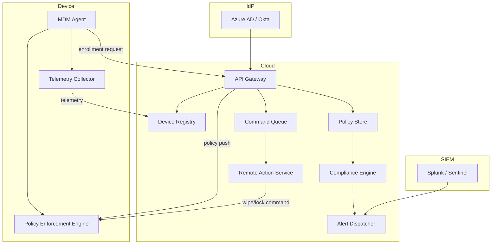

> **TL;DR** — Successful enterprise MDM hinges on a modular, zero‑trust architecture, hardened enrollment pipelines, and a staged rollout backed by observability. Follow the patterns below to move from proof‑of‑concept to a production‑grade, globally‑distributed fleet.

Enterprises that manage hundreds or thousands of smartphones, tablets, and rugged devices cannot rely on ad‑hoc scripts or point‑and‑click consoles. A disciplined Mobile Device Management (MDM) strategy must treat every endpoint as a first‑class citizen in the corporate network, with clear ownership, immutable policies, and auditable change control. This post walks through the essential building blocks, security hardening techniques, and deployment playbooks that let you run MDM at scale on platforms such as Microsoft Intune, Google Android Enterprise, and Apple Business Manager.

## Architecture Overview

A production‑grade MDM platform sits at the intersection of three layers:

1. **Device‑side agents** – lightweight daemons or system extensions that enforce policies, report telemetry, and execute remote commands.
2. **Management Service** – a cloud‑native API gateway that stores device inventory, policy definitions, and user‑device bindings.
3. **Integration Hub** – connectors to identity providers (IdP), SIEMs, DLP, and endpoint protection tools.

The diagram below (rendered with Mermaid) captures the data flow for a typical enterprise deployment:



### Core Components

| Component | Primary Responsibility | Typical Vendor |
|-----------|------------------------|----------------|
| **Enrollment Service** | Authenticates device, binds it to a user, and provisions initial configuration. | Microsoft Intune Enrollment, Android Enterprise Zero‑Touch |
| **Policy Engine** | Evaluates compliance rules (e.g., password strength, OS version) and triggers remediation. | Apple MDM Protocol, VMware Workspace ONE |
| **Command Queue** | Guarantees at‑least‑once delivery of remote actions (lock, wipe, app install). | Google Cloud Pub/Sub, Azure Service Bus |
| **Telemetry Pipeline** | Streams device health metrics to a time‑series store for analytics. | Elastic Stack, Prometheus + Grafana |
| **Identity Bridge** | Syncs user groups and attributes from the corporate IdP. | SCIM connectors, SAML assertions |

Each component should be stateless where possible, allowing horizontal scaling behind a load balancer. Persisted state (device inventory, policy versions) lives in a relational store (PostgreSQL) or a purpose‑built NoSQL service (Cosmos DB) with multi‑region replication for latency‑sensitive fleets.

## Security Hardening

MDM is a privileged control plane; a breach can give an attacker the ability to wipe, exfiltrate, or spy on every managed device. Applying a zero‑trust mindset from enrollment onward is non‑negotiable.

### Zero‑Trust Enrollment

1. **Certificate‑Based Authentication** – Devices present a manufacturer‑issued TPM or Secure Enclave attestation certificate during the first handshake. Verify the certificate chain against the vendor’s root CA.
2. **One‑Time Tokens** – Generate a short‑lived enrollment token per device (e.g., JWT with 5‑minute TTL) that the agent must exchange for a persistent device identity.
3. **Device Identity Binding** – Store the device’s hardware UUID (IMEI, serial number) alongside the MDM identity; reject any subsequent enrollment that presents a mismatched UUID.

```yaml
# Example enrollment token payload (JWT)
iss: "mdm.example.com"
sub: "enrollment-token"
aud: "device-agent"
exp: 1735689600   # Unix epoch, 5‑minute TTL
jti: "a1b2c3d4e5f6"
device_uuid: "123e4567-e89b-12d3-a456-426614174000"
```

### Credential Management

* **Separate Secrets Stores** – Keep MDM service accounts, API keys, and TLS certificates in a dedicated secrets manager (e.g., HashiCorp Vault, Azure Key Vault). Rotate them on a 30‑day cadence.
* **Least‑Privilege API Scopes** – The MDM API gateway should expose granular scopes (`device:read`, `policy:write`) and enforce them via OAuth 2.0 introspection.
* **Audit Logging** – Every policy change, remote command, or enrollment event must be logged with immutable timestamps. Forward logs to a tamper‑evident storage such as AWS CloudTrail or GCP Cloud Logging.

### Runtime Hardening

* **Read‑Only Filesystem for Agents** – Deploy the MDM daemon in a container or sandbox with the filesystem mounted as read‑only, except for a dedicated `/var/lib/mdm` state directory.
* **Network Segmentation** – Place the management service in a private subnet; only allow inbound traffic from the device‑side VPN or a dedicated mTLS gateway.
* **Intrusion Detection** – Enable host‑based IDS (e.g., Falco) on the management nodes to flag abnormal command patterns such as mass wipe requests.

## Production‑Ready Deployment Strategies

Transitioning from a pilot to a global rollout requires repeatable processes that survive network partitions, version upgrades, and unexpected spikes.

### Staged Rollout Pattern

1. **Pilot Group (5‑10 % of fleet)** – Choose a cross‑functional sample (sales, support) that uses a variety of device models. Enable full telemetry and enforce strict compliance.
2. **Canary Release (10‑25 %)** – Expand to a low‑risk department (e.g., HR). Introduce new policy versions while monitoring error rates (< 0.5 % device‑side failures).
3. **Full‑Scale Deployment** – Once the canary passes defined Service Level Objectives (SLOs), push the policy to the remaining devices using the same command queue.

Automate each stage with a CI/CD pipeline (GitHub Actions, Azure Pipelines) that:

* Runs integration tests against a simulated device farm (e.g., Android Emulator Farm, iOS Simulators).
* Generates a signed policy bundle (`policy.zip`) and uploads it to the artifact repository.
* Triggers a deployment job that calls the MDM API’s `POST /policies/{id}/activate` endpoint.

```bash
# Example CI step to activate a policy version
curl -X POST "https://mdm.example.com/api/v1/policies/42/activate" \
     -H "Authorization: Bearer $MDM_DEPLOY_TOKEN" \
     -H "Content-Type: application/json" \
     -d '{"version":"2026.05"}'
```

### Monitoring & Observability

| Metric | Recommended Threshold | Alert Destination |
|--------|-----------------------|-------------------|
| Enrollment Failure Rate | < 0.2 % per hour | PagerDuty |
| Policy Violation Spike | > 5 % increase over 24 h | Slack #mdm-ops |
| Command Queue Latency | < 30 seconds 99th‑percentile | Opsgenie |
| TLS Certificate Expiry | > 30 days remaining | Email admin |

Leverage OpenTelemetry to instrument both the device agents and the management service. Export traces to a distributed tracing backend (Jaeger, AWS X-Ray) to pinpoint latency bottlenecks during large‑scale policy pushes.

### Backup & Disaster Recovery

* **Database Replication** – Enable multi‑region read replicas for the device registry. Perform point‑in‑time recovery (PITR) backups daily.
* **Configuration Export** – Serialize policy definitions and enrollment token templates to version‑controlled JSON stored in a secure bucket (e.g., GCS with Object Versioning).
* **Failover Drill** – Quarterly, simulate a region outage by disabling the primary API gateway and confirming that traffic automatically routes to the secondary endpoint without violating SLOs.

## Patterns in Production

Real‑world enterprises converge on a handful of repeatable patterns that keep MDM services resilient and compliant.

### Immutable Policy Bundles

Treat every policy version as an immutable artifact. Store its SHA‑256 hash alongside the version metadata; any attempt to modify a deployed bundle without a new version triggers an audit alert. This mirrors the way container images are handled in Kubernetes and eliminates “policy drift”.

### Idempotent Command Execution

Design remote actions to be safe when re‑executed. For example, a “wipe device” command should be idempotent: if the device already reports a wiped state, the command returns a “noop” status rather than attempting a second wipe, which could corrupt storage.

### Multi‑Tenant Segregation

Large organizations often host multiple business units with distinct compliance regimes (e.g., finance vs. R&D). Deploy separate policy namespaces and use the IdP’s group claims to route devices to the appropriate tenant context. This isolates accidental policy leaks between units.

### Edge‑First Telemetry Aggregation

Collect telemetry locally on the device (e.g., via a small SQLite DB) and batch‑upload during low‑bandwidth windows. This reduces the risk of network congestion during peak hours and preserves battery life.

## Key Takeaways

- **Modular architecture** – Separate device agents, API gateway, and integration hub; keep each stateless for horizontal scaling.
- **Zero‑trust enrollment** – Use hardware attestation, short‑lived tokens, and strict UUID binding to prevent rogue devices.
- **Layered security** – Protect credentials, enforce least‑privilege scopes, and log every control‑plane action.
- **Staged rollout** – Pilot → Canary → Full deployment, driven by automated CI/CD pipelines and clear SLOs.
- **Observability matters** – Export metrics, logs, and traces to a unified stack; set tight alert thresholds for enrollment failures and command latency.
- **Production patterns** – Immutable policy bundles, idempotent commands, tenant segregation, and edge‑first telemetry keep large fleets healthy.

## Further Reading

- [Microsoft Intune documentation](https://learn.microsoft.com/en-us/mem/intune/)
- [Google Android Enterprise Overview](https://developers.google.com/android/enterprise)
- [Apple Business Manager](https://support.apple.com/en-us/HT210060)