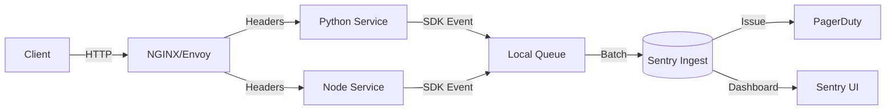

> **TL;DR** — Sentry gives you instant visibility into exceptions, performance bottlenecks, and release health. By wiring the SDK early, configuring sampling, and wiring alerts to your incident response tool, you can keep production services reliable without drowning in noise.

Production teams that ship dozens of services a day cannot afford to discover bugs after a user has already been impacted. Modern error monitoring goes beyond “stack trace email” and becomes a core observability pillar, feeding data into dashboards, alerting pipelines, and post‑mortem analyses. In this post we walk through the practical steps to make Sentry a production‑grade component: from SDK installation to architecture patterns, performance tuning, and advanced alerting.

## Why Modern Error Monitoring Matters

* **Speed of detection** – The median time‑to‑detect (MTTD) for critical failures drops from hours to seconds when a centralized service like Sentry streams events in real time.
* **Contextual data** – Sentry captures request headers, user IDs, and breadcrumbs that let engineers reproduce bugs without asking for logs.
* **Release health** – By correlating errors with releases, you instantly see whether a new version introduced regressions.
* **Cost of noise** – Poorly tuned monitoring can flood you with false positives; Sentry’s sampling and grouping algorithms help keep the signal‑to‑noise ratio high.

A recent case study from a large e‑commerce platform showed a **40 % reduction in post‑release incidents** after standardising on Sentry across 30 micro‑services — the key was treating Sentry as a first‑class observability component, not an after‑thought.

## Getting Started with Sentry SDKs

Sentry offers native SDKs for more than 30 languages. The most common entry points for production engineers are Python (for Django, Flask, FastAPI) and Node.js (for Express, NestJS). Below we show minimal, production‑ready snippets.

### Python SDK Example

```python
# requirements.txt
sentry-sdk[fastapi]==2.5.0
```

```python
# main.py
import sentry_sdk
from sentry_sdk.integrations.fastapi import FastApiIntegration
from fastapi import FastAPI

sentry_sdk.init(
    dsn="https://PUBLIC_KEY@o0.ingest.sentry.io/PROJECT_ID",
    traces_sample_rate=0.2,          # 20 % of transactions for performance monitoring
    environment="production",
    release="myapp@2024.09.12",      # keep release in sync with CI tags
    integrations=[FastApiIntegration()],
    # Enable server-side sampling to keep cost under control
    sample_rate=0.5,                 # 50 % of error events
)

app = FastAPI()

@app.get("/hello")
def hello():
    return {"msg": "world"}
```

Key points:

* **`traces_sample_rate`** controls performance monitoring; start low (0.1‑0.2) and increase once you confirm budget.
* **`environment`** lets you separate dev, staging, and prod data in the UI.
* **`release`** should be injected from your CI pipeline (e.g., via an environment variable). See Sentry’s release health docs for more — [official guide](https://docs.sentry.io/product/releases/).

### Node.js SDK Example

```bash
# Install
npm install @sentry/node @sentry/tracing
```

```js
// index.js
const Sentry = require("@sentry/node");
const Tracing = require("@sentry/tracing");
const express = require("express");

Sentry.init({
  dsn: "https://PUBLIC_KEY@o0.ingest.sentry.io/PROJECT_ID",
  environment: process.env.NODE_ENV,
  release: `myservice@${process.env.GIT_COMMIT_SHA}`,
  tracesSampleRate: 0.15, // 15 % of transactions
  integrations: [
    // Enable Express integration for request breadcrumbs
    new Sentry.Integrations.Http({ tracing: true }),
    new Tracing.Integrations.Express({ app: express() })
  ],
});

const app = express();

app.use(Sentry.Handlers.requestHandler());
app.use(Sentry.Handlers.tracingHandler());

app.get("/", (req, res) => {
  res.send("Hello from Sentry‑enabled Express!");
});

app.use(Sentry.Handlers.errorHandler());

app.listen(3000, () => console.log("Listening on :3000"));
```

Notice the **`Sentry.Handlers.errorHandler()`** placed after all route handlers – this guarantees that any uncaught exception bubbles into Sentry before Express sends the response.

## Architecture for Observability

Treat Sentry as a **service mesh observability node** rather than a simple webhook. A robust production architecture typically includes:

1. **Ingress Layer** – Reverse proxies (NGINX, Envoy) forward request metadata as Sentry breadcrumbs via HTTP headers.
2. **SDK Layer** – Each service runs the Sentry SDK, enriched with trace IDs from distributed tracing systems (OpenTelemetry, Jaeger).
3. **Event Queue** – Sentry’s inbound API is rate‑limited; using a local buffer (e.g., a small Redis queue) prevents back‑pressure from slowing your app.
4. **Processing Pipeline** – Sentry processes events, deduplicates, groups, and stores them in its multi‑tenant PostgreSQL cluster.
5. **Alerting Sink** – Webhooks or integrations (PagerDuty, Opsgenie, Slack) consume issue notifications.

Below is a simplified diagram expressed as a Mermaid flowchart (Sentry supports Mermaid in its UI).



### Event Flow Details

* **Breadcrumbs** – Each request adds a breadcrumb (e.g., “DB query started”). SDKs automatically capture them, but you can push custom ones for third‑party calls.
* **Trace Context Propagation** – Use the `sentry-trace` header to carry the transaction ID across services. This enables end‑to‑end latency analysis.
* **Queue Buffering** – For high‑traffic services (>10 k RPS), a 1‑minute Redis buffer can absorb spikes, ensuring the SDK never blocks the request thread.

## Patterns in Production

### Rate Limiting and Sampling

Sentry enforces a per‑project quota (e.g., 100 k events/month for the “Team” plan). To stay within budget:

* **Server‑side sampling** (`sample_rate`) – Drop low‑severity events at the SDK level.
* **Client‑side filtering** – Use `before_send` callback to discard known‑safe exceptions.

```python
def before_send(event, hint):
    # Drop validation errors from a known library
    if event.get("exception", {}).get("values", [{}])[0].get("type") == "ValidationError":
        return None
    return event

sentry_sdk.init(
    dsn="...",
    before_send=before_send,
    sample_rate=0.3,
)
```

### Alerting and Issue Grouping

Sentry groups similar stack traces into a single issue, reducing alert fatigue. Fine‑tune grouping by:

* **Fingerprint** – Override the default hash with custom fields (e.g., user ID, tenant ID).

```python
import sentry_sdk

with sentry_sdk.push_scope() as scope:
    scope.fingerprint = ["myapp", "tenant-42", "{{ default }}"]
    sentry_sdk.capture_exception(e)
```

* **Alert Rules** – Define thresholds (e.g., “fire when >5 events in 10 minutes”) and route to specific on‑call rotations. The UI lets you combine **frequency** and **regression** conditions.

### Release Health Dashboard

Tie your CI pipeline to Sentry releases:

```bash
# In your CI job
sentry-cli releases new -p myproject v1.3.0
sentry-cli releases set-commits --auto v1.3.0
sentry-cli releases finalize v1.3.0
```

Deploy the same version string (`release="myapp@v1.3.0"`) in your SDK init. Sentry then shows **crash-free users** per release, allowing you to roll back automatically if the metric dips below a threshold.

## Performance Monitoring Integration

Beyond exceptions, Sentry captures **transaction spans** that reveal latency hotspots. To instrument a database call:

```python
import sentry_sdk
from sentry_sdk import start_transaction

def fetch_user(user_id):
    with start_transaction(op="db.query", name="SELECT user"):
        # Your DB library (psycopg2, asyncpg, etc.)
        cursor.execute("SELECT * FROM users WHERE id = %s", (user_id,))
        return cursor.fetchone()
```

The UI displays a flame‑graph of the transaction, highlighting slow DB queries, external HTTP calls, or cache misses. Combine this with OpenTelemetry exporters for a unified tracing view across services.

## Key Takeaways

- **Instrument early** – Add the Sentry SDK at the entry point of every service; configure `environment` and `release` from CI.
- **Control volume** – Use `sample_rate`, `before_send`, and custom fingerprints to stay within quota while preserving critical signals.
- **Treat Sentry as part of your observability mesh** – Propagate trace IDs, buffer events, and integrate alerts with PagerDuty/Slack.
- **Leverage release health** – Automate rollbacks based on crash‑free user metrics to minimise production impact.
- **Combine error and performance data** – Transaction spans give context that pure stack traces lack, enabling faster root‑cause analysis.

## Further Reading

- [Sentry Documentation – Getting Started](https://docs.sentry.io/platforms/python/)
- [Sentry Blog – Scaling Error Monitoring in Production](https://blog.sentry.io/2023/09/12/scaling-error-monitoring)
- [OpenTelemetry Integration Guide](https://opentelemetry.io/docs/instrumentation/python/)